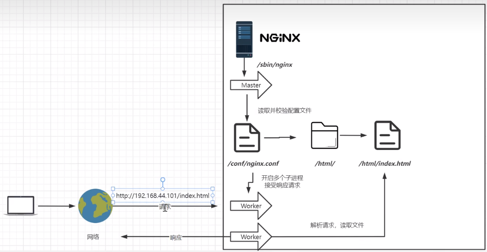

## 安装

参考文献：[CSDN 解读](https://blog.csdn.net/qq_40036754/article/details/102463099?ops_request_misc=%257B%2522request%255Fid%2522%253A%2522169404814116800185814545%2522%252C%2522scm%2522%253A%252220140713.130102334..%2522%257D&request_id=169404814116800185814545&biz_id=0&utm_medium=distribute.pc_search_result.none-task-blog-2~all~top_positive~default-1-102463099-null-null.142^v93^chatsearchT3_1&utm_term=nginx&spm=1018.2226.3001.4187)

 

安装环境：centos7

需要安装的依赖：pcre、zlib、openssl

所有依赖安装完毕后，才可以安装 nginx

 

## 基础知识

 

### nginx 架构

