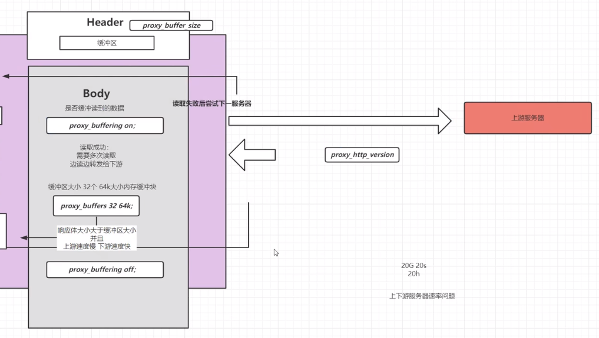

## 扩容

<br>

### 扩容方式

单机垂直扩容：增加硬件资源

水平扩容：集群化

颗粒度拆分：分布式

数据异构化：多级缓存机制，如客户端缓存与 CDN 缓存

服务异步化：拆分请求或者使用消息中间件

<br>

### 会话保持

#### ip_hash

nginx 采用负载均衡模式时，可以借助 ip_hash 来进行会话保持

下方代码表示每次 nginx 接收客户端请求时，都会将客户端 IP 进行 `hash` 计算后得出的结果与 server 进行匹配，匹配到哪一个后端服务器，那就让该客户端一直连接到该服务器上

```conf
upstream name{
    ip_hash;
    server xxx;
    server xxx;
}
```

<br>

#### 其他保持法

$request_url 根据请求的 url 转换成 hash 后转发到固定的后端服务器上

```conf
upstream name{
    hash &request_url;
    server xxx;
    server xxx;
}
```

$cookie_jsessionid 或者客户端拿到服务器下发的 cookie 后返回给服务器

```conf
upstream name{
    hash $cookie_jseesionid;
    server xxx;
    server xxx;
}
```

<br>

`sticky` 模块保持

sticky 实现上游集群服务器会话保持（专业术语牢牢记住哈）的流程：

1. 客户端首次请求 nginx，不带 cookie，nginx 轮询方式随机分配一个后端服务器
2. 后端服务器处理请求，返回给 nginx
3. nginx 封装与后端服务器对应的 cookie 字段返回给客户端（使用 sticky 插件）
4. 客户端接收并保存 cookie 字段，下次请求直接携带

```conf
upstream name{
    sticky name=ck expires=6h;
    server xxx;
    server xxx;
}
```

<br>

### keepalive

#### 长链接的使用条件

客服端的请求头中的 connection 为 close，则客户端要求不使用长连接。  
客户端的请求头中的 connection 为 keep-alive，则客户端要求使用长连接。  
客户端的请求头中没有 connection 这个头，如果是 http1.0 协议默认为 close，如果是 http1.1 协议默认为 keep-alive。

<br>

#### 开启 keepalive

开启 keepalive 之前，需要确保的两件事情

- client 到 nginx 的连接是长连接
- nginx 到 server 的连接是长连接

<br>

keepalive 提供了检测存活与否的机制

```conf
http {
server {
    #开启keepalive探活，探测策略走系统默认
    listen 127.0.0.1:3306 so_keepalive=on;
    }
}
```

<br>

#### 与上游保持长链接

`keepalive_requests` 为连续处理请求次数上限，只要超过了该上限，长链接自动被关闭

`send_timeout` 用来设置数据发送的超时时间，如果你发送的文件很大，可能传到一半就会因为超时无响应而被强制关闭长链接从而断开传输

```conf
send_timeout 60;

upstream  BACKEND {
    server 127.0.0.1:8000;
    server 127.0.0.1:8001;
    server 127.0.0.1:8002;
    keepalive 300; //空闲连接数
    keepalive_timeout  120s;//与上游空闲时间
    keepalive_requests 100;//与上游请求处理最大次数
}
```

> TIPS:访问内部静态资源不需要使用长链接！避免无效的 TCP 握手时间与内存损耗

<br>

### upstream 工作原理

`proxy_pass` 向上游服务器请求数据共有 6 个阶段

- 初始化
- 与上游服务器建立连接
- 向上游服务器发送请求
- 处理响应头
- 处理响应体
- 结束

<br>

#### 响应体

**set_header** 设置 header

**proxy_connect_timeout** 与上游服务器连接超时时间、快速失败

**proxy_send_timeout** 定义 nginx 向后端服务发送请求的间隔时间(不是耗时)。默认 60 秒，超过这个时间会关闭连接

**proxy_read_timeout** 后端服务给 nginx 响应的时间，规定时间内后端服务没有给 nginx 响应，连接会被关闭，nginx 返回 504 Gateway Time-out。默认 60 秒

<br>

#### 缓冲区关键配置项

**proxy_requset_buffering** 是否完全读到请求体之后再向上游服务器发送请求

**proxy_buffering** 是否缓冲上游服务器数据

**proxy_buffers 32 64k;** 缓冲区大小 32 个 64k 大小内存缓冲块

**proxy_buffer_size** header 缓冲区大小

**proxy_temp_file_write_size 8k**  
当启用从代理服务器到临时文件的响应的缓冲时，一次限制写入临时文件的数据的大小。 默认情况下，大小由 proxy_buffer_size 和 proxy_buffers 指令设置的两个缓冲区限制。 临时文件的最大大小由 proxy_max_temp_file_size 指令设置。

**proxy_max_temp_file_size 1024m;** 临时文件最大值

<br>

组合示例

```
proxy_requset_buffering on;
proxy_buffering on;

proxy_buffer_size 64k;

proxy_buffers 32 128k;
proxy_busy_buffers_size 8k;
proxy_max_temp_file_size 1024m;
```

<br>

#### 缓冲区原理



<br>

### Gzip

> 作用域 `http, server, location`

**gzip on** 开关，默认关闭

**gzip_buffers 32 4k|16 8k** 缓冲区大小

**gzip_comp_level** 1；
压缩等级 1-9，数字越大压缩比越高

**gzip_http_version** 1.1; 使用 gzip 的最小版本

**gzip_min_length** 设置将被 gzip 压缩的响应的最小长度。 长度仅由“Content-Length”响应报头字段确定。

**gzip_proxied** 多选  
off 为不做限制  
作为反向代理时，针对上游服务器返回的头信息进行压缩

<br>

**gzip_vary on**; 增加一个 header，适配老的浏览器 `Vary: Accept-Encoding`

**gzip_types** 哪些 mime 类型的文件进行压缩

**gzip_disable** 禁止某些浏览器使用 gzip

<br>

### SSI 合并服务器端文件

当使用 nginx 作为 Web 服务器时，您可以使用 SSI（Server Side Includes）来合并服务器端文件。SSI 是一种在服务器端执行的标记语言，它允许您在 HTML 或其他文档中插入动态内容。

启用 SSI 方式

```conf
http {
    # 其他配置...

    ssi on;
    ssi_types text/shtml;

    # 其他配置...
}
```

当客户端请求包含 SSI 指令的文件时，nginx 将在服务器端执行 SSI，并将结果发送给客户端。合并后的内容将包含在最终的响应中

<br>

### rsync

rsync 是一个远程数据同步工具，可通过 LAN/WAN 快速同步多台主机之间的文件。

rsync 使用所谓的 rsync 算法 进行数据同步，这种算法只传送两个文件的不同部分，而不是每次都整份传送，因此速度相当快。

Rsync 有三种模式：

- 本地模式（类似于 cp 命令）
- 远程模式（类似于 scp 命令）
- 守护进程（socket 进程：是 rsync 的重要功能）

<br>

### 多级缓存

#### 强制缓存与协商缓存

强制缓存：直接从本机读取，不请求服务器  
（**cache-control**）

协商缓存：发送请求 header 中携带 Last-Modified，服务器可能会返回 304 Not Modified  
（**last-modified**与**etag**）

<br>

#### 浏览器缓存原则

- 多级集群负载时 last-modified 必须保持一致
- 还有一些场景下我们希望禁用浏览器缓存。比如轮训 api 上报数据数据
- 浏览器缓存很难彻底禁用，大家的做法是加版本号，随机数等方法。
- 只缓存 200 响应头的数据，像 3XX 这类跳转的页面不需要缓存。
- 对于 js，css 这类可以缓存很久的数据，可以通过加版本号的方式更新内容
- 不需要强一致性的数据，可以缓存几秒
- 异步加载的接口数据，可以使用 ETag 来校验。
- 在服务器添加 Server 头，有利于排查错误
- 分为手机 APP 和 Client 以及是否遵循 http 协议
- 在没有联网的状态下可以展示数据
- 流量消耗过多
- 提前下发 避免秒杀时同时下发数据造成流量短时间暴增
- 兜底数据 在服务器崩溃和网络不可用的时候展示
- 临时缓存 退出即清理
- 固定缓存 展示框架这种，可能很长时间不会更新，可用随客户端下发
- **首页**有的时候可以看做是框架 应该禁用缓存，以保证加载的资源都是最新的
- 父子连接 页面跳转时有一部分内容不需要重新加载，可用从父菜单带过来
- 预加载 某些逻辑可用判定用户接下来的操作，那么可用异步加载那些资源
- 漂亮的加载过程 异步加载 先展示框架，然后异步加载内容，避免主线程阻塞

<br>

> TIPS:看不下去了，内容太多了，边学边睡觉，救命，要死掉了呜呜呜呜
