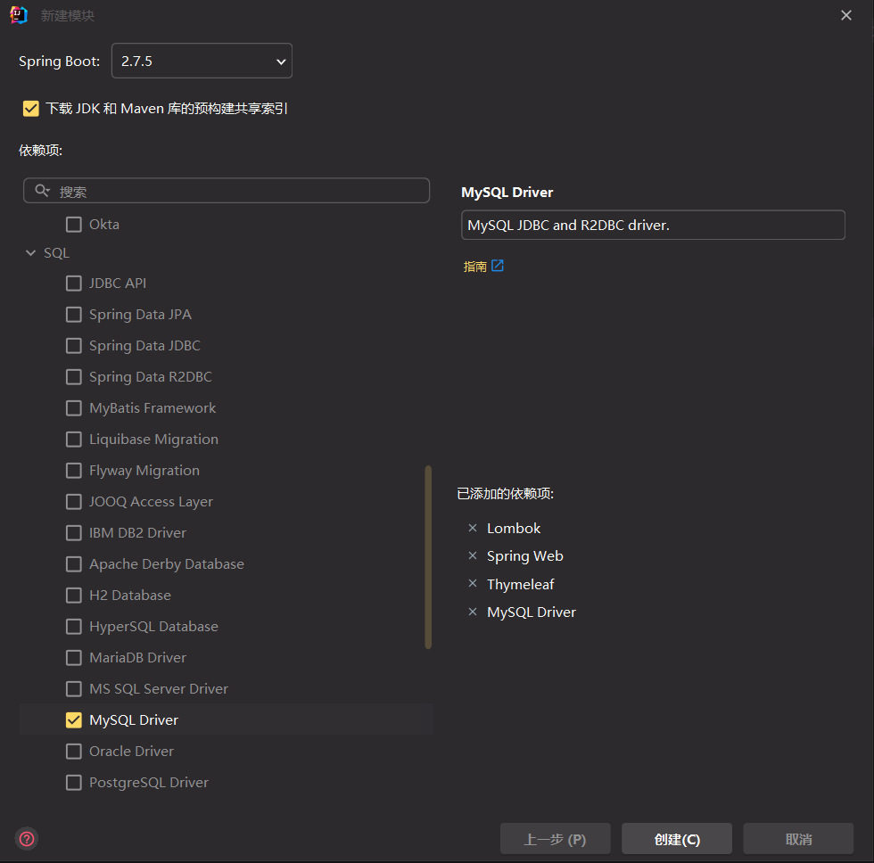
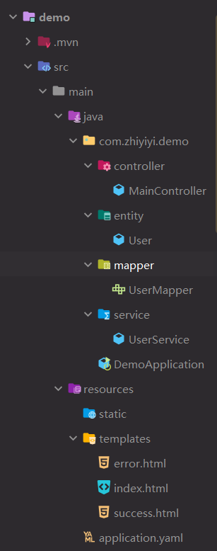

### 初始配置

新建一个空项目，名字随便取

新建模块，使用 spring initalizr  
添加下图模块  


<br>

构建完成后我们仍然需要在 `pom.xml` 中引入我们的 `mybatis-plus` 依赖

```xml
<dependency>
    <groupId>com.baomidou</groupId>
    <artifactId>mybatis-plus-boot-starter</artifactId>
    <version>3.4.2</version>
</dependency>
```

<br>

修改主配置文件内容，分别设置服务器端口、thymeleaf 设置以及数据源链接设置

```yaml
server:
  port: 10086

spring:
  thymeleaf:
    encoding: UTF-8
    cache: false

  datasource:
    driver-class-name: com.mysql.cj.jdbc.Driver
    username: root
    password: 123456
    url: jdbc:mysql://localhost:3306/springboot?serverTimezone=UTC&useUnicode=true&characterEncoding=utf-8&useSSL=true
```

<br>

### 完整项目结构

分为了四个主要层次：controller、entity、service、mapper



<br>

### 模块编写

实体类 User.java

没啥可说的，使用 lombok 的@Data 注解快速 setter

TableName 用来设置数据报名称，如果不设则默认使用类名作为数据表名称  
TableId 用来设置 id（也就是我们经常指定来当做主键的玩意）

```java
package com.zhiyiyi.demo.entity;

import com.baomidou.mybatisplus.annotation.IdType;
import com.baomidou.mybatisplus.annotation.TableId;
import com.baomidou.mybatisplus.annotation.TableName;
import lombok.Data;

@Data
@TableName(value = "login")
public class User {
    @TableId(value = "id", type = IdType.AUTO)
    private Integer id;
    private String username;
    private String password;
}
```

<br>

编写映射接口 `UserMapper.java`

因为使用了 mybatis-plus，所以按照标准格式套进去 OK 了

```java
package com.zhiyiyi.demo.mapper;

import com.baomidou.mybatisplus.core.mapper.BaseMapper;
import com.zhiyiyi.demo.entity.User;

public interface UserMapper extends BaseMapper<User> {
}

```

<br>

编写服务接口 `UserService.java`

这里很重要，因为我们需要处理 controller 送来的数据，所以类内使用@Resource 导入外部 mapper

在 checkUser 这个方法里，我们使用 selectByMap 检测指定映射表是否存在于数据表里面；如果存在就进入 `success.html` 页面，反之进入 `error.html` 页面

```java
package com.zhiyiyi.demo.service;

import com.zhiyiyi.demo.entity.User;
import com.zhiyiyi.demo.mapper.UserMapper;
import org.springframework.stereotype.Service;

import javax.annotation.Resource;
import java.util.HashMap;
import java.util.List;
import java.util.Map;

@Service
public class UserService {
    @Resource
    private UserMapper mapper;

    public String checkUser(String name, String pwd) {
        Map<String, Object> objectMap = new HashMap<>();
        objectMap.put("username", name);
        objectMap.put("password", pwd);
        List<User> users = mapper.selectByMap(objectMap);
        System.out.println(users);
        if (!users.isEmpty()) return "success";
        else return "error";
    }
}
```

<br>

最后别忘了在主入口文件类顶部添加注解 `@MapperScan(value = "com.zhiyiyi.demo.mapper")` 以便扫描 mapper 文件夹下的映射文件并注入到 bean  
（这样就不需要为每一个 mapper 添加@Mapper 注解了）

<br>

### 主控制器

MainController.java 控制所以请求的控制器

具体请求的职责我已经写在注释里面了，自己看去！

```java
package com.zhiyiyi.demo.controller;

import com.zhiyiyi.demo.service.UserService;
import org.springframework.stereotype.Controller;
import org.springframework.web.bind.annotation.GetMapping;
import org.springframework.web.bind.annotation.PostMapping;

import javax.annotation.Resource;

@Controller
public class MainController {

    // 请导入userservice供我们查询数据报使用
    @Resource
    private UserService service;

    // 主页html
    @GetMapping({"/", "/index"})
    public String getIndex() {
        return "index";
    }

    // 开始登录
    @PostMapping("/login")
    public String toLogin(String username, String password) {
        return service.checkUser(username, password);
    }

    // 登陆失败后点击按钮重定向到主页面
    @GetMapping("/reindex")
    public String returnIndex(){
        return "redirect:index";
    }
}

```

### 网页绘制

把所有网页都放在 templates 文件夹下，springboot 会自动找到他并识别其为一个 thymeleaf 模板！

```html
<!-- index.html -->
<!DOCTYPE html>
<html
	xmlns:th="http://www.thymeleaf.org/"
	lang="ch"
>
	<head>
		<meta charset="UTF-8" />
		<title>Title</title>
	</head>
	<body>
		<form
			action="/login"
			method="post"
		>
			账户：<input
				type="text"
				placeholder="请输入用户名"
				name="username"
			/>
			密码：<input
				type="password"
				placeholder="******"
				name="password"
			/>
			<input
				type="submit"
				value="登陆！"
			/>
		</form>
	</body>
</html>

<!-- error.html -->
<!DOCTYPE html>
<html
	xmlns:th="http://www.thymeleaf.org/"
	lang="ch"
>
	<head>
		<meta charset="UTF-8" />
		<title>Title</title>
	</head>
	<body>
		<h2>登陆失败，请重新登陆！</h2>
		<form
			action="/reindex"
			method="get"
		>
			<input
				type="submit"
				value="返回登陆"
			/>
		</form>
	</body>
</html>

<!-- 登陆成功后页面 -->
<!DOCTYPE html>
<html
	xmlns:th="http://www.thymeleaf.org/"
	lang="ch"
>
	<head>
		<meta charset="UTF-8" />
		<title>Title</title>
	</head>
	<body>
		<h2>欢迎使用管理系统！</h2>
	</body>
</html>
```

<br>
