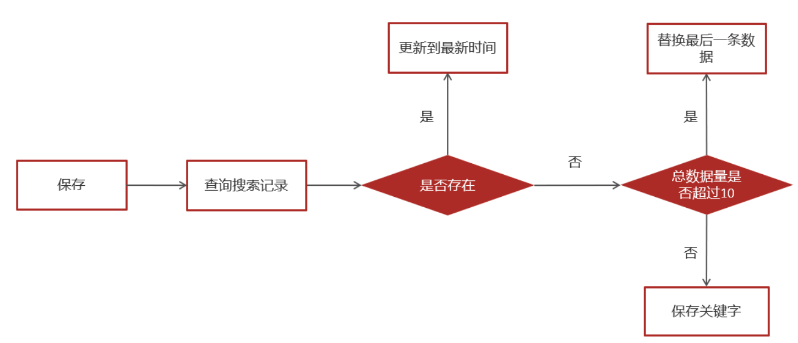

## APP 搜索功能揭秘

<br>

### 文章自动审核与 ES 索引构建

#### 查询并插入 ES 索引

> 实现搜索功能的完整流程是：从 ES 中获取文章索引信息而不是从数据库

首先从数据库内找到所有符合条件的文章，将他们都插入 ES 作为索引

```java
@SpringBootTest
@RunWith(SpringRunner.class)
public class ApArticleTest {

    @Autowired
    private ApArticleMapper apArticleMapper;

    @Autowired
    private RestHighLevelClient restHighLevelClient;


    /**
     * 注意：数据量的导入，如果数据量过大，需要分页导入
     * @throws Exception
     */
    @Test
    public void init() throws Exception {

        //1.查询所有符合条件的文章数据
        List<SearchArticleVo> searchArticleVos = apArticleMapper.loadArticleList();

        //2.批量导入到es索引库

        BulkRequest bulkRequest = new BulkRequest("app_info_article");

        for (SearchArticleVo searchArticleVo : searchArticleVos) {

            IndexRequest indexRequest = new IndexRequest().id(searchArticleVo.getId().toString())
                    .source(JSON.toJSONString(searchArticleVo), XContentType.JSON);

            //批量添加数据
            bulkRequest.add(indexRequest);

        }
        restHighLevelClient.bulk(bulkRequest, RequestOptions.DEFAULT);

    }

}
```

<br>

#### 文章搜索实现

略去实体类、服务接口的创建，我们直接来看服务实现类，我们需要实现文章搜索功能 search

```java
@Service
@Slf4j
public class ArticleSearchServiceImpl implements ArticleSearchService {

    @Autowired
    private RestHighLevelClient restHighLevelClient;

    /**
     * es文章分页检索
     *
     * @param dto
     * @return
     */
    @Override
    public ResponseResult search(UserSearchDto dto) throws IOException {

        //1.检查参数
        if(dto == null || StringUtils.isBlank(dto.getSearchWords())){
            return ResponseResult.errorResult(AppHttpCodeEnum.PARAM_INVALID);
        }

        //2.设置查询条件
        // 注意这里索引和我们插入到ES中的索引要一致哦！
        SearchRequest searchRequest = new SearchRequest("app_info_article");
        SearchSourceBuilder searchSourceBuilder = new SearchSourceBuilder();

        //布尔查询
        BoolQueryBuilder boolQueryBuilder = QueryBuilders.boolQuery();

        //关键字的分词之后查询
        QueryStringQueryBuilder queryStringQueryBuilder = QueryBuilders.queryStringQuery(dto.getSearchWords()).field("title").field("content").defaultOperator(Operator.OR);
        boolQueryBuilder.must(queryStringQueryBuilder);

        //查询小于mindate的数据
        RangeQueryBuilder rangeQueryBuilder = QueryBuilders.rangeQuery("publishTime").lt(dto.getMinBehotTime().getTime());
        boolQueryBuilder.filter(rangeQueryBuilder);

        //分页查询
        searchSourceBuilder.from(0);
        searchSourceBuilder.size(dto.getPageSize());

        //按照发布时间倒序查询
        searchSourceBuilder.sort("publishTime", SortOrder.DESC);

        //设置高亮  title
        HighlightBuilder highlightBuilder = new HighlightBuilder();
        highlightBuilder.field("title");
        highlightBuilder.preTags("<font style='color: red; font-size: inherit;'>");
        highlightBuilder.postTags("</font>");
        searchSourceBuilder.highlighter(highlightBuilder);


        searchSourceBuilder.query(boolQueryBuilder);
        searchRequest.source(searchSourceBuilder);
        SearchResponse searchResponse = restHighLevelClient.search(searchRequest, RequestOptions.DEFAULT);


        //3.结果封装返回

        List<Map> list = new ArrayList<>();

        SearchHit[] hits = searchResponse.getHits().getHits();
        for (SearchHit hit : hits) {
            String json = hit.getSourceAsString();
            Map map = JSON.parseObject(json, Map.class);
            //处理高亮
            if(hit.getHighlightFields() != null && hit.getHighlightFields().size() > 0){
                Text[] titles = hit.getHighlightFields().get("title").getFragments();
                String title = StringUtils.join(titles);
                //高亮标题
                map.put("h_title",title);
            }else {
                //原始标题
                map.put("h_title",map.get("title"));
            }
            list.add(map);
        }

        return ResponseResult.okResult(list);

    }
}
```

<br>

#### 自动审核构建索引

先来看看文章上传至 MinIO 的服务实现类
上传文章前需要把文章通过 freemaker 变成 html 格式的，这样子才可以直接在网页上显示，便于用户浏览

利用 kafka 推送当前文章的关键信息到消费者，由消费者构建对应的 es 索引

```java
@Service
@Slf4j
@Transactional
public class ArticleFreemarkerServiceImpl implements ArticleFreemarkerService {

    @Autowired
    private ApArticleContentMapper apArticleContentMapper;

    @Autowired
    private Configuration configuration;

    @Autowired
    private FileStorageService fileStorageService;

    @Autowired
    private ApArticleService apArticleService;

    /**
     * 生成静态文件上传到minIO中
     * @param apArticle
     * @param content
     */
    @Async
    @Override
    public void buildArticleToMinIO(ApArticle apArticle, String content) {
        //已知文章的id
        //4.1 获取文章内容
        if(StringUtils.isNotBlank(content)){
            //4.2 文章内容通过freemarker生成html文件
            Template template = null;
            StringWriter out = new StringWriter();
            try {
                template = configuration.getTemplate("article.ftl");
                //数据模型
                Map<String,Object> contentDataModel = new HashMap<>();
                contentDataModel.put("content", JSONArray.parseArray(content));
                //合成
                template.process(contentDataModel,out);
            } catch (Exception e) {
                e.printStackTrace();
            }


            //4.3 把html文件上传到minio中
            InputStream in = new ByteArrayInputStream(out.toString().getBytes());
            String path = fileStorageService.uploadHtmlFile("", apArticle.getId() + ".html", in);


            //4.4 修改ap_article表，保存static_url字段
            apArticleService.update(Wrappers.<ApArticle>lambdaUpdate().eq(ApArticle::getId,apArticle.getId())
                    .set(ApArticle::getStaticUrl,path));

            //发送消息，创建索引
            createArticleESIndex(apArticle,content,path);

        }
    }

    @Autowired
    private KafkaTemplate<String,String> kafkaTemplate;

    /**
     * 送消息，创建索引
     * @param apArticle
     * @param content
     * @param path
     */
    private void createArticleESIndex(ApArticle apArticle, String content, String path) {
        SearchArticleVo vo = new SearchArticleVo();
        BeanUtils.copyProperties(apArticle,vo);
        vo.setContent(content);
        vo.setStaticUrl(path);

        kafkaTemplate.send(ArticleConstants.ARTICLE_ES_SYNC_TOPIC, JSON.toJSONString(vo));
    }

}
```

<br>

异步文章监听器，用于接收生产者传来的文章索引信息

使用 `JSON.parseObject` 转换成对应的实体对象后，便可以将其作为索引插进去了

```java
@Component
@Slf4j
public class SyncArticleListener {

    @Autowired
    private RestHighLevelClient restHighLevelClient;

    @KafkaListener(topics = ArticleConstants.ARTICLE_ES_SYNC_TOPIC)
    public void onMessage(String message){
        if(StringUtils.isNotBlank(message)){

            log.info("SyncArticleListener,message={}",message);

            SearchArticleVo searchArticleVo = JSON.parseObject(message, SearchArticleVo.class);
            IndexRequest indexRequest = new IndexRequest("app_info_article");
            indexRequest.id(searchArticleVo.getId().toString());
            indexRequest.source(message, XContentType.JSON);
            try {
                restHighLevelClient.index(indexRequest, RequestOptions.DEFAULT);
            } catch (IOException e) {
                e.printStackTrace();
                log.error("sync es error={}",e);
            }
        }

    }
}
```

<br>

### APP 搜索记录实现

#### MongoDB 集成

对于每个用户都需要存储一个搜索记录，体量很大，此时再用关系型数据库就不太合适了，转用 NoSQL

顾名思义，MongoDB 依然需要我们添加对应的 maven 依赖、创建实体类、编写链接配置文件

处理完后来看下面的测试代码，详细介绍了如何操纵 MongoDB

```java
@SpringBootTest(classes = MongoApplication.class)
@RunWith(SpringRunner.class)
public class MongoTest {


    @Autowired
    private MongoTemplate mongoTemplate;

    //保存
    @Test
    public void saveTest(){
        /*for (int i = 0; i < 10; i++) {
            ApAssociateWords apAssociateWords = new ApAssociateWords();
            apAssociateWords.setAssociateWords("黑马头条");
            apAssociateWords.setCreatedTime(new Date());
            mongoTemplate.save(apAssociateWords);
        }*/
        ApAssociateWords apAssociateWords = new ApAssociateWords();
        apAssociateWords.setAssociateWords("黑马直播");
        apAssociateWords.setCreatedTime(new Date());
        mongoTemplate.save(apAssociateWords);

    }

    //查询一个
    @Test
    public void saveFindOne(){
        ApAssociateWords apAssociateWords = mongoTemplate.findById("60bd973eb0c1d430a71a7928", ApAssociateWords.class);
        System.out.println(apAssociateWords);
    }

    //条件查询
    @Test
    public void testQuery(){
        Query query = Query.query(Criteria.where("associateWords").is("黑马头条"))
                .with(Sort.by(Sort.Direction.DESC,"createdTime"));
        List<ApAssociateWords> apAssociateWordsList = mongoTemplate.find(query, ApAssociateWords.class);
        System.out.println(apAssociateWordsList);
    }

    @Test
    public void testDel(){
        mongoTemplate.remove(Query.query(Criteria.where("associateWords").is("黑马头条")),ApAssociateWords.class);
    }
}
```

<br>

#### 保存搜素记录



来看看保存关键字的服务实现类

```java
@Service
@Slf4j
public class ApUserSearchServiceImpl implements ApUserSearchService {

    @Autowired
    private MongoTemplate mongoTemplate;
    /**
     * 保存用户搜索历史记录
     * @param keyword
     * @param userId
     */
    @Override
    @Async
    public void insert(String keyword, Integer userId) {
        //1.查询当前用户的搜索关键词
        Query query = Query.query(Criteria.where("userId").is(userId).and("keyword").is(keyword));
        ApUserSearch apUserSearch = mongoTemplate.findOne(query, ApUserSearch.class);

        //2.存在 更新创建时间
        if(apUserSearch != null){
            apUserSearch.setCreatedTime(new Date());
            mongoTemplate.save(apUserSearch);
            return;
        }

        //3.不存在，判断当前历史记录总数量是否超过10
        apUserSearch = new ApUserSearch();
        apUserSearch.setUserId(userId);
        apUserSearch.setKeyword(keyword);
        apUserSearch.setCreatedTime(new Date());

        Query query1 = Query.query(Criteria.where("userId").is(userId));
        query1.with(Sort.by(Sort.Direction.DESC,"createdTime"));
        List<ApUserSearch> apUserSearchList = mongoTemplate.find(query1, ApUserSearch.class);

        if(apUserSearchList == null || apUserSearchList.size() < 10){
            mongoTemplate.save(apUserSearch);
        }else {
            ApUserSearch lastUserSearch = apUserSearchList.get(apUserSearchList.size() - 1);
            mongoTemplate.findAndReplace(Query.query(Criteria.where("id").is(lastUserSearch.getId())),apUserSearch);
        }
    }
}
```

<br>

#### 加载搜索记录列表

加载记录很简单，找到对应用户，然后安装时间倒序获取用户搜索记录的最新的 10 条即可

```java
 /**
     * 查询搜索历史
     *
     * @return
     */
@Override
public ResponseResult findUserSearch() {
    //获取当前用户
    ApUser user = AppThreadLocalUtil.getUser();
    if(user == null){
        return ResponseResult.errorResult(AppHttpCodeEnum.NEED_LOGIN);
    }

    //根据用户查询数据，按照时间倒序
    List<ApUserSearch> apUserSearches = mongoTemplate.find(Query.query(Criteria.where("userId").is(user.getId())).with(Sort.by(Sort.Direction.DESC, "createdTime")), ApUserSearch.class);
    return ResponseResult.okResult(apUserSearches);
}
```

<br>

#### 删除搜索记录

很显然，用户的小秘密也不希望一致挂在手机里，免得后续暴露了不好处理~

```java
/**
     * 删除历史记录
     *
     * @param dto
     * @return
     */
@Override
public ResponseResult delUserSearch(HistorySearchDto dto) {
    //1.检查参数
    if(dto.getId() == null){
        return ResponseResult.errorResult(AppHttpCodeEnum.PARAM_INVALID);
    }

    //2.判断是否登录
    ApUser user = AppThreadLocalUtil.getUser();
    if(user == null){
        return ResponseResult.errorResult(AppHttpCodeEnum.NEED_LOGIN);
    }

    //3.删除
    mongoTemplate.remove(Query.query(Criteria.where("userId").is(user.getId()).and("id").is(dto.getId())),ApUserSearch.class);
    return ResponseResult.okResult(AppHttpCodeEnum.SUCCESS);
}
```

<br>

### APP 关键词联想

> 关键词联想即我们输入一个关键词，搜索栏自动根据前缀获取相应的热搜词

关键词可以从第三方数据收集网站拿到，或者自己统计用户搜索数据提取

当然还有更进阶的，直接统计当前用户的搜索历史，然后关联到联想词内，就类似百度搜索总会能预判你的预判一样

关键词联想的基本实现方法就是：模糊查询+正则+limit 分页获取数据

```java
@Service
public class ApAssociateWordsServiceImpl implements ApAssociateWordsService {

    @Autowired
    MongoTemplate mongoTemplate;

    /**
     * 联想词
     * @param userSearchDto
     * @return
     */
    @Override
    public ResponseResult findAssociate(UserSearchDto userSearchDto) {
        //1 参数检查
        if(userSearchDto == null || StringUtils.isBlank(userSearchDto.getSearchWords())){
            return ResponseResult.errorResult(AppHttpCodeEnum.PARAM_INVALID);
        }
        //分页检查
        if (userSearchDto.getPageSize() > 20) {
            userSearchDto.setPageSize(20);
        }

        //3 执行查询 模糊查询
        Query query = Query.query(Criteria.where("associateWords").regex(".*?\\" + userSearchDto.getSearchWords() + ".*"));
        query.limit(userSearchDto.getPageSize());
        List<ApAssociateWords> wordsList = mongoTemplate.find(query, ApAssociateWords.class);

        return ResponseResult.okResult(wordsList);
    }
}
```

<br>

### 用户行为管理

> 所谓用户行为，即用户关注、点赞、收藏、举报这些小部分内容，而我们将会手机这些数据并结合推荐算法，将用户乐于关注的内容精准推送（营造信息茧房）

我们需要针对用户行为进行捕获，包括但不仅限于上方所述的几种内容，甚至你还需要记录视频观看时长、点击某个 icon 的次数来为用户画像

点赞、阅读量、喜欢不喜欢，包括其他行为数据都通过 redis 统一管理

<br>

### Jackson 数据序列化反序列化

前后端数据类型统一往往是一键令人头秃的事情

为此我们规定

1. 后端响应前端的数据，包含 id 或者特殊标识的，俊转换为 string
2. 前端返给后端的 DTO 中包含 id 或者特殊标识的，把 integer 类型转换为 long

我们需要定义一个 jacksonFilter 过滤响应以及请求，即可达到转换数据类型的结果

<br>
