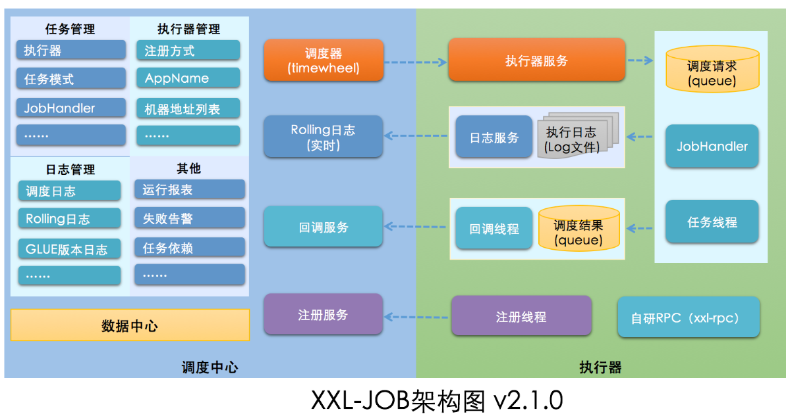

## xxl-job 任务调度

<br>

### 什么是 xxl-job？

> 为便于各位快速上手理解 xxl-job 冗杂的配置，现在做简要介绍



<br>

### 分布式任务调度

为什么要执行任务调度？  
因为当任务以集群的方式执行时往往会发生同一个任务执行多次的问题（你可不希望看见限时优惠券重复发放了 100 次吧？）

分布式调度框架有很多种，目前选择开箱即用且轻量级的框架 `xxl-job` 作为实战

`xxl-job` 必须至少需要 8 张任务调度表，他们存储于同一个 mysql 数据库内

- xxl_job_group：执行器信息表，维护任务执行器信息；
- xxl_job_info：调度扩展信息表： 用于保存 XXL-JOB 调度任务的扩展信息，如任务分组、任务名、机器地址、执行器、执行入参和报警邮件等等；

- xxl_job_lock：任务调度锁表；

- xxl_job_log：调度日志表： 用于保存 XXL-JOB 任务调度的历史信息，如调度结果、执行结果、调度入参、调度机器和执行器等等；
- xxl_job_log_report：调度日志报表：用户存储 XXL-JOB 任务调度日志的报表，调度中心报表功能页面会用到；
- xxl_job_logglue：任务 GLUE 日志：用于保存 GLUE 更新历史，用于支持 GLUE 的版本回溯功能；
- xxl_job_registry：执行器注册表，维护在线的执行器和调度中心机器地址信息；
- xxl_job_user：系统用户表；

> 这些数据表只是为了支持 xxl-job 运行的，后面我们不会对其进行 CRUD，别怕。。。

<br>

### 快速上手

> 参考文献 https://blog.csdn.net/weixin_44713306/article/details/127751024

xxl-job 日常使用中我们只需要用到两个内容：

1. 调度中心：统一管理任务调度平台上的调度任务，负责触发调度执行，并且提供任务管理平台
2. 执行器：接收调度中心的调度并且执行，可以直接执行也可以集成到项目中

<br>

#### 调度中心

下载 xxl-job 官方源码包，使用 IDEA 打开该项目  
项目内有三个模块：

1. xxl-job-admin 调度中心，使用可视化 web 界面管理
2. xxl-job-core 框架核心（暂时没用不用管）
3. xxl-job-executor-samples 执行器，官方给出了两个执行器案例

<br>

查看 xxl-job-admin 下的 application.properties  
下面提取了部分配置，这些是需要留意或者修改的内容

```
### web
server.port=10086
server.servlet.context-path=/xxl-job-admin

### xxl-job, datasource
spring.datasource.url=jdbc:mysql://127.0.0.1:3306/xxl_job?useUnicode=true&characterEncoding=UTF-8&autoReconnect=true&serverTimezone=Asia/Shanghai
spring.datasource.username=root
spring.datasource.password=123456
spring.datasource.driver-class-name=com.mysql.cj.jdbc.Driver

### xxl-job, email
spring.mail.host=smtp.qq.com
spring.mail.port=25
spring.mail.username=1187303661@qq.com
spring.mail.from=1187303661@qq.com
spring.mail.password=ap313188
spring.mail.properties.mail.smtp.auth=true
spring.mail.properties.mail.smtp.starttls.enable=true
spring.mail.properties.mail.smtp.starttls.required=true
spring.mail.properties.mail.smtp.socketFactory.class=javax.net.ssl.SSLSocketFactory
```

> 运行 xxl-job-admin，打开网址：http://localhost:10086/xxl-job-admin

<br>

#### BEAN 模式

先看官方给出的示例执行器配置文件，打开 xxl-job-executor-sample-springboot 下的 application.properties

一般需要人为修改的关键配置项如下，其他的配置项可保持默认：

1. server.port 当前 springboot 服务器运行端口，不是执行器运行端口！
2. xxl.job.admin.addresses 设置调度中心地址
3. xxl.job.executor.appname 当前执行器的名字（可以多个执行器共用一个名称，此时就可实现分片模式）
4. xxl.job.executor.port 执行器端口

```
# web port
server.port=10085
# no web
#spring.main.web-environment=false

# log config
logging.config=classpath:logback.xml


### xxl-job admin address list, such as "http://address" or "http://address01,http://address02"
xxl.job.admin.addresses=http://127.0.0.1:10086/xxl-job-admin

### xxl-job, access token
xxl.job.accessToken=default_token

### xxl-job executor appname
xxl.job.executor.appname=xxl-job-executor-sample
### xxl-job executor registry-address: default use address to registry , otherwise use ip:port if address is null
xxl.job.executor.address=
### xxl-job executor server-info
xxl.job.executor.ip=
xxl.job.executor.port=9999
### xxl-job executor log-path
xxl.job.executor.logpath=/data/applogs/xxl-job/jobhandler
### xxl-job executor log-retention-days
xxl.job.executor.logretentiondays=30
```

<br>

官方默认给了我们一个任务测试类 SampleXxlJob.java，我们需要对第一个默认 BEAN 任务修改一下

代码清单：`com.xxl.job.executor.service.jobhandler.SampleXxlJob`

```java
@Component
public class SampleXxlJob {
    private static final Logger logger = LoggerFactory.getLogger(SampleXxlJob.class);

    /**
     * 1、简单任务示例（Bean模式）
     */
    @XxlJob("demoJobHandler")
    public void demoJobHandler() throws Exception {
        System.out.println("hello world xxl");
    }
}
```

修改完毕，运行此 springboot 项目（此时执行器已经开始运行）

<br>
