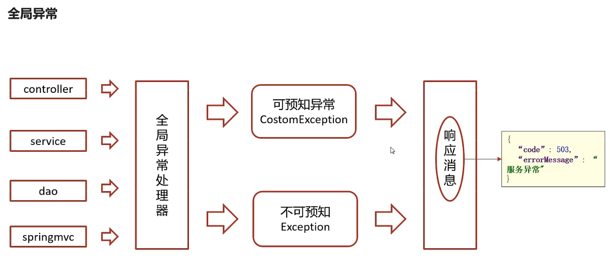
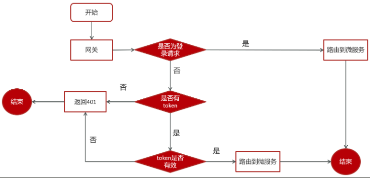
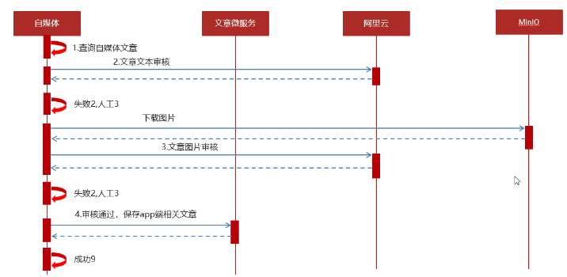
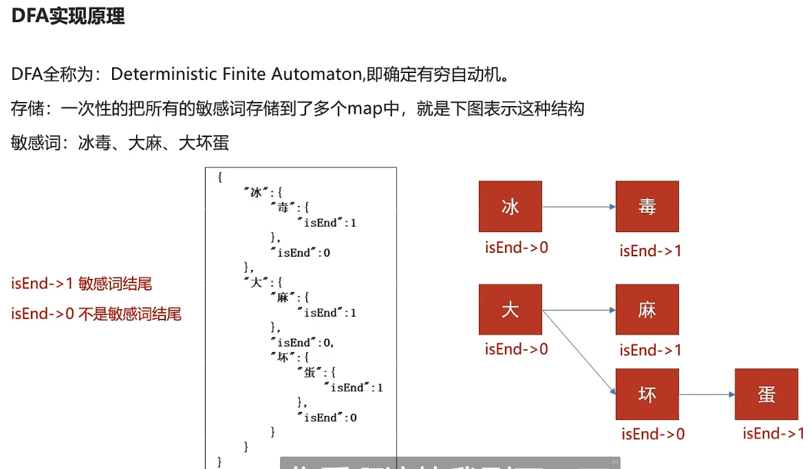
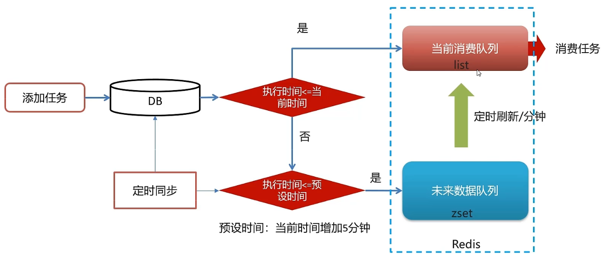
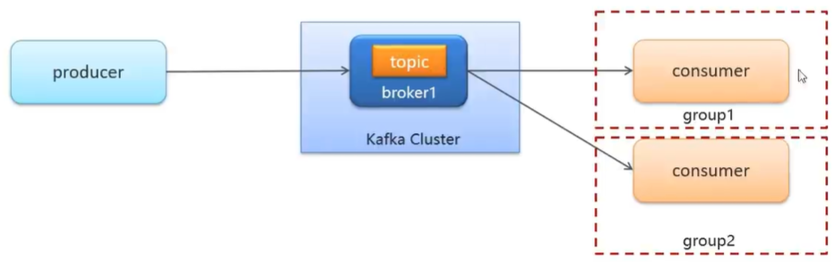
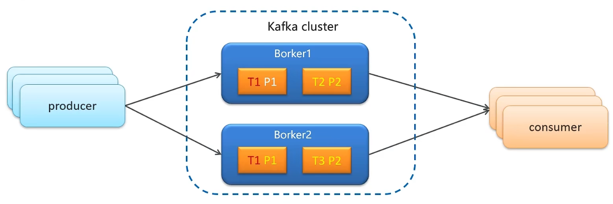
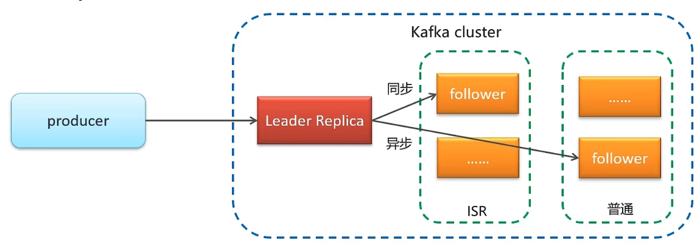

## 环境搭设

<br>

### 技术栈

开发中所用所有框架及其对应含义

- Spring-Cloud-Gateway : 微服务之前架设的网关服务，实现服务注册中的 API 请求路由，以及控制流速控制和熔断处理都是常用的架构手段，而这些功能 Gateway 天然支持
- 运用 Spring Boot 快速开发框架，构建项目工程；并结合 Spring Cloud 全家桶技术，实现后端个人中心、自媒体、管理中心等微服务。
- 运用 Spring Cloud Alibaba Nacos 作为项目中的注册中心和配置中心
- 运用 mybatis-plus 作为持久层提升开发效率
- 运用 Kafka 完成内部系统消息通知；与客户端系统消息通知；以及实时数据计算
- 运用 Redis 缓存技术，实现热数据的计算，提升系统性能指标
- 使用 Mysql 存储用户数据，以保证上层数据查询的高性能
- 使用 Mongo 存储用户热数据，以保证用户热数据高扩展和高性能指标
- 使用 FastDFS 作为静态资源存储器，在其上实现热静态资源缓存、淘汰等功能
- 运用 Hbase 技术，存储系统中的冷数据，保证系统数据的可靠性
- 运用 ES 搜索技术，对冷数据、文章数据建立索引，以保证冷数据、文章查询性能
- 运用 AI 技术，来完成系统自动化功能，以提升效率及节省成本。比如实名认证自动化
- PMD&P3C : 静态代码扫描工具，在项目中扫描项目代码，检查异常点、优化点、代码规范等，为开发团队提供规范统一，提升项目代码质量

<br>

### 异常抛出规定



一般的，企业开发需要规定两种形式下的异常应当如何处理

`可预知异常`：即后端接口无法访问或者前端传参错误等等人为错误，直接返回给前端明确的错误信息  
`不可预知异常`：后端系统异常，JVM 异常等，仅需统一返回给前端“系统异常”即可，无需知晓太多细节

最好配置一个单独的分离项目来存储对应的异常响应模板

<br>

#### 异常处理类

对于不可控异常，直接返回 `AppHttpCodeEnum.SERVER_ERROR`  
这是一段固定返回值的枚举值

对于可控异常，调用 `CustomException` 异常类内的方法 `getAppHttpCodeEnum` ，获取自定义的异常类返回值

```java
package com.heima.common.exception;


import com.heima.model.common.dtos.ResponseResult;
import com.heima.model.common.enums.AppHttpCodeEnum;
import lombok.extern.slf4j.Slf4j;
import org.springframework.web.bind.annotation.ControllerAdvice;
import org.springframework.web.bind.annotation.ExceptionHandler;
import org.springframework.web.bind.annotation.ResponseBody;

@ControllerAdvice  //控制器增强类
@Slf4j
public class ExceptionCatch {

    /**
     * 处理不可控异常
     * @param e
     * @return
     */
    @ExceptionHandler(Exception.class)
    @ResponseBody
    public ResponseResult exception(Exception e){
        e.printStackTrace();
        log.error("catch exception:{}",e.getMessage());

        return ResponseResult.errorResult(AppHttpCodeEnum.SERVER_ERROR);
    }

    /**
     * 处理可控异常  自定义异常
     * @param e
     * @return
     */
    @ExceptionHandler(CustomException.class)
    @ResponseBody
    public ResponseResult exception(CustomException e){
        log.error("catch exception:{}",e);
        return ResponseResult.errorResult(e.getAppHttpCodeEnum());
    }
}
```

<br>

#### 可控异常类

异常代码及其对应返回值的常量表

```java
public enum AppHttpCodeEnum {

    // 成功段0
    SUCCESS(200,"操作成功"),
    // 登录段1~50
    NEED_LOGIN(1,"需要登录后操作"),
    LOGIN_PASSWORD_ERROR(2,"密码错误"),

    ...

    int code;
    String errorMessage;

    AppHttpCodeEnum(int code, String errorMessage){
        this.code = code;
        this.errorMessage = errorMessage;
    }

    public int getCode() {
        return code;
    }

    public String getErrorMessage() {
        return errorMessage;
    }
}
```

可控异常类，他提供了一个构造函数，将异常常量存入到当前异常对象内，供后续调用

```java
public class CustomException extends RuntimeException {

    private AppHttpCodeEnum appHttpCodeEnum;

    public CustomException(AppHttpCodeEnum appHttpCodeEnum){
        this.appHttpCodeEnum = appHttpCodeEnum;
    }

    public AppHttpCodeEnum getAppHttpCodeEnum() {
        return appHttpCodeEnum;
    }
}
```

<br>

### 登录原理

下面展示了一个标准的登录流程

1. 使用手机号+密码登录，二者只要其中一个为空就返回
2. 根据用户手机号使用 lambdaQuery 从数据库调取用户数据
3. 如果用户不存在，直接返回
4. 若用户存在，获取数据库中用户的 salt，并与前端传来的 password 进行合并后执行 md5 加密，将加密结果与数据库中用户的密码值比对，如果一致，证明登录成功

最后返回 JWT 的时候特意清空了 salt 和 password，有效保证了用户个人信息的安全

而且数据库内用户的 password 保存的是加盐后 md5 加密数据，无法逆向，可以保证用户安全

```java
@Service
public class ApUserServiceImpl extends ServiceImpl<ApUserMapper, ApUser> implements ApUserService {

    @Override
    public ResponseResult login(LoginDto dto) {

        //1.正常登录（手机号+密码登录）
        if (!StringUtils.isBlank(dto.getPhone()) && !StringUtils.isBlank(dto.getPassword())) {
            //1.1查询用户
            ApUser apUser = getOne(Wrappers.<ApUser>lambdaQuery().eq(ApUser::getPhone, dto.getPhone()));
            if (apUser == null) {
                return ResponseResult.errorResult(AppHttpCodeEnum.DATA_NOT_EXIST,"用户不存在");
            }

            //1.2 比对密码
            String salt = apUser.getSalt();
            String pswd = dto.getPassword();
            pswd = DigestUtils.md5DigestAsHex((pswd + salt).getBytes());
            if (!pswd.equals(apUser.getPassword())) {
                return ResponseResult.errorResult(AppHttpCodeEnum.LOGIN_PASSWORD_ERROR);
            }
            //1.3 返回数据  jwt
            Map<String, Object> map = new HashMap<>();
            map.put("token", AppJwtUtil.getToken(apUser.getId().longValue()));
            apUser.setSalt("");
            apUser.setPassword("");
            map.put("user", apUser);
            return ResponseResult.okResult(map);
        } else {
            //2.游客  同样返回token  id = 0
            Map<String, Object> map = new HashMap<>();
            map.put("token", AppJwtUtil.getToken(0l));
            return ResponseResult.okResult(map);
        }
    }
}
```

<br>

### 配置 Swagger

任意项目添加依赖

```xml
<dependency>
    <groupId>io.springfox</groupId>
    <artifactId>springfox-swagger2</artifactId>
</dependency>
<dependency>
    <groupId>io.springfox</groupId>
    <artifactId>springfox-swagger-ui</artifactId>
</dependency>
```

创建配置文件 `com.zhiller.common.swagger.SwaggerConfiguration.java`

```java
@Configuration
@EnableSwagger2
public class SwaggerConfiguration {

   @Bean // 声明为Spring Bean，用于配置Swagger的Docket对象
    public Docket buildDocket() {
        return new Docket(DocumentationType.SWAGGER_2)
                .apiInfo(buildApiInfo())
                .select()
                // 要扫描的API(Controller)基础包
                .apis(RequestHandlerSelectors.basePackage("com.zhiller"))
                .paths(PathSelectors.any())
                .build();
    }

    private ApiInfo buildApiInfo() {
        Contact contact = new Contact("zhiller", "", ""); // 创建联系人对象，参数为联系人信息
        return new ApiInfoBuilder()
                .title("平台管理API文档") // 设置API文档标题
                .description("xxx后台api") // 设置API文档描述
                .contact(contact) // 设置联系人信息
                .version("1.0.0") // 设置API版本号
                .build(); // 构建ApiInfo对象
}
}
```

在以下 resource 路径下新增 spring 配置文件

`resources/META-INF/spring.factories`

```java
org.springframework.boot.autoconfigure.EnableAutoConfiguration=\
  com.zhiller.common.swagger.SwaggerConfiguration
```

最最最重要的！！！

在对应的 springboot 启动类头部添加注解  
`@EnableSwagger2`  
如果不加的你就没法访问 swagger 界面

> 一切准备完毕，启动 springboot 后进入网址：http://localhost:8080/swagger-ui.html 即可

<br>

#### Swagger 常用注释

在 Java 类中添加 Swagger 的注解即可生成 Swagger 接口文档，常用 Swagger 注解如下：

@Api：修饰整个类，描述 Controller 的作用

@ApiOperation：描述一个类的一个方法，或者说一个接口

@ApiParam：单个参数的描述信息

@ApiModel：用对象来接收参数

@ApiModelProperty：用对象接收参数时，描述对象的一个字段

@ApiResponse：HTTP 响应其中 1 个描述

@ApiResponses：HTTP 响应整体描述

@ApiIgnore：使用该注解忽略这个 API

@ApiError ：发生错误返回的信息

@ApiImplicitParam：一个请求参数

@ApiImplicitParams：多个请求参数的描述信息

@ApiImplicitParam 属性：

| 属性         | 取值   | 作用                                          |
| ------------ | ------ | --------------------------------------------- |
| paramType    |        | 查询参数类型                                  |
|              | path   | 以地址的形式提交数据                          |
|              | query  | 直接跟参数完成自动映射赋值                    |
|              | body   | 以流的形式提交 仅支持 POST                    |
|              | header | 参数在 request headers 里边提交               |
|              | form   | 以 form 表单的形式提交 仅支持 POST            |
| dataType     |        | 参数的数据类型 只作为标志说明，并没有实际验证 |
|              | Long   |                                               |
|              | String |                                               |
| name         |        | 接收参数名                                    |
| value        |        | 接收参数的意义描述                            |
| required     |        | 参数是否必填                                  |
|              | true   | 必填                                          |
|              | false  | 非必填                                        |
| defaultValue |        | 默认值                                        |

<br>

#### Swagger 注释案例分析

为一个 controller 添加 api 注解

```java
@RestController
@RequestMapping("/api/v1/login")
@Api(value = "app端用户登录", tags = "ap_user", description = "app端用户登录API")
public class ApUserLoginController {

    @Autowired
    private ApUserService apUserService;

    @PostMapping("/login_auth")
    public ResponseResult login(@RequestBody LoginDto dto) {
        return apUserService.login(dto);
    }
}
```

<br>

### 登陆校验与网关



思路分析：

1. 用户进入网关开始登陆，网关过滤器进行判断，如果是登录，则路由到后台管理微服务进行登录
2. 用户登录成功，后台管理微服务签发 JWT TOKEN 信息返回给用户
3. 用户再次进入网关开始访问，网关过滤器接收用户携带的 TOKEN
4. 网关过滤器解析 TOKEN ，判断是否有权限，如果有，则放行，如果没有则返回未认证错误

<br>

这是 JWT 工具类，大多数情况下你可以直接照搬去用

```java
public class AppJwtUtil {

    // TOKEN的有效期一天（S）
    private static final int TOKEN_TIME_OUT = 3_600;
    // 加密KEY
    private static final String TOKEN_ENCRY_KEY = "MDk4ZjZiY2Q0NjIxZDM3M2NhZGU0ZTgzMjYyN2I0ZjY";
    // 最小刷新间隔(S)
    private static final int REFRESH_TIME = 300;

    // 生产ID
    public static String getToken(Long id) {
        Map<String, Object> claimMaps = new HashMap<>();
        claimMaps.put("id", id);
        long currentTime = System.currentTimeMillis();
        return Jwts.builder()
                .setId(UUID.randomUUID().toString())
                .setIssuedAt(new Date(currentTime))  //签发时间
                .setSubject("system")  //说明
                .setIssuer("heima") //签发者信息
                .setAudience("app")  //接收用户
                .compressWith(CompressionCodecs.GZIP)  //数据压缩方式
                .signWith(SignatureAlgorithm.HS512, generalKey()) //加密方式
                .setExpiration(new Date(currentTime + TOKEN_TIME_OUT * 1000))  //过期时间戳
                .addClaims(claimMaps) //cla信息
                .compact();
    }

    /**
     * 获取token中的claims信息
     *
     * @param token
     * @return
     */
    private static Jws<Claims> getJws(String token) {
        return Jwts.parser()
                .setSigningKey(generalKey())
                .parseClaimsJws(token);
    }

    /**
     * 获取payload body信息
     *
     * @param token
     * @return
     */
    public static Claims getClaimsBody(String token) {
        try {
            return getJws(token).getBody();
        } catch (ExpiredJwtException e) {
            return null;
        }
    }

    /**
     * 获取hearder body信息
     *
     * @param token
     * @return
     */
    public static JwsHeader getHeaderBody(String token) {
        return getJws(token).getHeader();
    }

    /**
     * 是否过期
     *
     * @param claims
     * @return -1：有效，0：有效，1：过期，2：过期
     */
    public static int verifyToken(Claims claims) {
        if (claims == null) {
            return 1;
        }
        try {
            claims.getExpiration()
                    .before(new Date());
            // 需要自动刷新TOKEN
            if ((claims.getExpiration().getTime() - System.currentTimeMillis()) > REFRESH_TIME * 1000) {
                return -1;
            } else {
                return 0;
            }
        } catch (ExpiredJwtException ex) {
            return 1;
        } catch (Exception e) {
            return 2;
        }
    }

    /**
     * 由字符串生成加密key
     *
     * @return
     */
    public static SecretKey generalKey() {
        byte[] encodedKey = Base64.getEncoder().encode(TOKEN_ENCRY_KEY.getBytes());
        SecretKey key = new SecretKeySpec(encodedKey, 0, encodedKey.length, "AES");
        return key;
    }

    // 这个main方法是用来测试token校验的，不用管
    public static void main(String[] args) {
       /* Map map = new HashMap();
        map.put("id","11");*/
        System.out.println(AppJwtUtil.getToken(1102L));
        Jws<Claims> jws = AppJwtUtil.getJws("eyJhbGciOiJIUzUxMiIsInppcCI6IkdaSVAifQ.H4sIAAAAAAAAADWLQQqEMAwA_5KzhURNt_qb1KZYQSi0wi6Lf9942NsMw3zh6AVW2DYmDGl2WabkZgreCaM6VXzhFBfJMcMARTqsxIG9Z888QLui3e3Tup5Pb81013KKmVzJTGo11nf9n8v4nMUaEY73DzTabjmDAAAA.4SuqQ42IGqCgBai6qd4RaVpVxTlZIWC826QA9kLvt9d-yVUw82gU47HDaSfOzgAcloZedYNNpUcd18Ne8vvjQA");
        Claims claims = jws.getBody();
        System.out.println(claims.get("id"));

    }
}
```

然后是对应的全局过滤器，过滤器的编写思路就按照开头所写的登录校验规则来搞

```java
@Component
@Slf4j
public class AuthorizeFilter implements Ordered, GlobalFilter {
    @Override
    public Mono<Void> filter(ServerWebExchange exchange, GatewayFilterChain chain) {
        //1.获取request和response对象
        ServerHttpRequest request = exchange.getRequest();
        ServerHttpResponse response = exchange.getResponse();

        //2.判断是否是登录
        if(request.getURI().getPath().contains("/login")){
            //放行
            return chain.filter(exchange);
        }


        //3.获取token
        String token = request.getHeaders().getFirst("token");

        //4.判断token是否存在
        if(StringUtils.isBlank(token)){
            response.setStatusCode(HttpStatus.UNAUTHORIZED);
            return response.setComplete();
        }

        //5.判断token是否有效
        try {
            Claims claimsBody = AppJwtUtil.getClaimsBody(token);
            //是否是过期
            int result = AppJwtUtil.verifyToken(claimsBody);
            if(result == 1 || result  == 2){
                response.setStatusCode(HttpStatus.UNAUTHORIZED);
                return response.setComplete();
            }
        }catch (Exception e){
            e.printStackTrace();
            response.setStatusCode(HttpStatus.UNAUTHORIZED);
            return response.setComplete();
        }

        //6.放行
        return chain.filter(exchange);
    }

    /**
     * 优先级设置  值越小  优先级越高
     * @return
     */
    @Override
    public int getOrder() {
        return 0;
    }
}
```

<br>

### 前端处理

前端页面通过 `nginx` 来进行配置，功能如下

- 通过 nginx 的反向代理功能访问后台的网关资源
- 通过 nginx 的静态服务器功能访问前端静态页面

这是 nginx 的自定义配置文件 conf

```javascript
upstream  heima-app-gateway{
    server localhost:51601; // 配置上游服务器，指定主机和端口号
}

server {
	listen 8801; // 监听的端口号
	location / {
        root D:/workspace/app-web/; // 设置根目录和默认文件
        index index.html;
    }

    location ~/app/(.*) {
        proxy_pass http://heima-app-gateway/$1; // 反向代理到上游服务器
        proxy_set_header HOST $host; // 保持源请求头的值不变
        proxy_pass_request_body on; // 开启获取请求体
        proxy_pass_request_headers on; // 开启获取请求头
        proxy_set_header X-Real-IP $remote_addr; // 记录真实发出请求的客户端IP
        proxy_set_header X-Forwarded-For $proxy_add_x_forwarded_for; // 记录代理信息
    }
}
```

<br>

## App 端与 freemaker

<br>

### 下拉刷新

下拉刷新实现思路

1. 在默认频道展示 10 条文章信息
2. 可以切换频道查看不同种类文章
3. 当用户下拉可以加载最新的文章（分页）本页文章列表中发布时间为最大的时间为依据
4. 当用户上拉可以加载更多的文章信息（按照发布时间）本页文章列表中发布时间最小的时间为依据
5. 如果是当前频道的首页，前端传递默认参数

<br>

接口定义

|          | **加载首页**         | **加载更多**             | **加载最新**            |
| -------- | -------------------- | ------------------------ | ----------------------- |
| 接口路径 | /api/v1/article/load | /api/v1/article/loadmore | /api/v1/article/loadnew |
| 请求方式 | POST                 | POST                     | POST                    |
| 参数     | ArticleHomeDto       | ArticleHomeDto           | ArticleHomeDto          |
| 响应结果 | ResponseResult       | ResponseResult           | ResponseResult          |

<br>

### FreeMaker

> 一款和 thymeleaf 相类似的模板引擎

前后端分离的大趋势下，这种开发模式已经无人使用，不解析

<br>

### MinIO

MinIO 基于 Apache License v2.0 开源协议的对象存储服务，可以做为云存储的解决方案

该对象存储中三个重要的概念

- `bucket` – 类比于文件系统的目录
- `Object` – 类比文件系统的文件
- `Keys` – 类比文件名

<br>

#### 独立模块

将其独自在一个模块内使用 `@Configuration` 注解来进行自动装配，这样子后续同一主包下的所有模块多可以直接使用 `@AutoWired` 来实现注入

首先我们需要定义配置项的 entity 类  
`ConfigurationProperties` 用来直接从 `application.yaml` 中拿出对应配置信息

```java
@Data
@ConfigurationProperties(prefix = "minio")  // 文件上传 配置前缀file.oss
public class MinIOConfigProperties implements Serializable {

    private String accessKey;
    private String secretKey;
    private String bucket;
    private String endpoint;
    private String readPath;
}
```

任意新建一个主配置类，完成 minio 对象的自动装配流程

MinioClient 是对象存储服务的客户端，用于执行各种命令来将信息传递给服务端

```java
@Data
@Configuration
@EnableConfigurationProperties({MinIOConfigProperties.class})
//当引入FileStorageService接口时
@ConditionalOnClass(FileStorageService.class)
public class MinIOConfig {

   @Autowired
   private MinIOConfigProperties minIOConfigProperties;

    @Bean
    public MinioClient buildMinioClient(){
        return MinioClient
                .builder()
                .credentials(minIOConfigProperties.getAccessKey(), minIOConfigProperties.getSecretKey())
                .endpoint(minIOConfigProperties.getEndpoint())
                .build();
    }
}
```

> 别忘了在 spring.factories 里面设置需要自动装配的类文件所在位置，如果你不设置，那么其余模块就会看不到你定义的这个方法

```
org.springframework.boot.autoconfigure.EnableAutoConfiguration=\
  com.heima.file.service.impl.MinIOFileStorageService
```

<br>

#### bucket 增删

定义一个专门管理 MinIO 数据增删改查的服务实现类 `MinIOFileStorageService`

在使用之前，需要定义两个 minio 对象：

1. MinioClient：客户端，用来提交 CRUD 操作
2. MinIOConfigProperties：minio 配置信息，用于获取 bucket 等等信息

<br>

下方代码实现了简要的图片文件上传以及删除功能，其实不难发现，对应的操作主要分为一下三个流程：

- 从 MinIOFileStorageService 获取信息
- 定义 XXXObjectArgs，即欲被增加、删除的对象
- 使用 MinioClient 来提交这个 XXXObjectArgs 对象

```java
@Slf4j
@EnableConfigurationProperties(MinIOConfigProperties.class)
@Import(MinIOConfig.class)
public class MinIOFileStorageService implements FileStorageService {

    @Autowired
    private MinioClient minioClient;

    @Autowired
    private MinIOConfigProperties minIOConfigProperties;

    private final static String separator = "/";

    // 构建文件路径方法
    public String builderFilePath(String dirPath,String filename) {
        StringBuilder stringBuilder = new StringBuilder(50);
        if(!StringUtils.isEmpty(dirPath)){
            stringBuilder.append(dirPath).append(separator);
        }
        SimpleDateFormat sdf = new SimpleDateFormat("yyyy/MM/dd");
        String todayStr = sdf.format(new Date());
        stringBuilder.append(todayStr).append(separator);
        stringBuilder.append(filename);
        return stringBuilder.toString();
    }

    // 上传图片
    @Override
    public String uploadImgFile(String prefix, String filename,InputStream inputStream) {
        String filePath = builderFilePath(prefix, filename);
        try {
            PutObjectArgs putObjectArgs = PutObjectArgs.builder()
                    .object(filePath)
                    .contentType("image/jpg")
                    .bucket(minIOConfigProperties.getBucket()).stream(inputStream,inputStream.available(),-1)
                    .build();
            minioClient.putObject(putObjectArgs);
            StringBuilder urlPath = new StringBuilder(minIOConfigProperties.getReadPath());
            urlPath.append(separator+minIOConfigProperties.getBucket());
            urlPath.append(separator);
            urlPath.append(filePath);
            return urlPath.toString();
        }catch (Exception ex){
            log.error("minio put file error.",ex);
            throw new RuntimeException("上传文件失败");
        }
    }

    // 删除文件
    @Override
    public void delete(String pathUrl) {
        String key = pathUrl.replace(minIOConfigProperties.getEndpoint()+"/","");
        int index = key.indexOf(separator);
        String bucket = key.substring(0,index);
        String filePath = key.substring(index+1);
        // 删除Objects
        RemoveObjectArgs removeObjectArgs = RemoveObjectArgs.builder().bucket(bucket).object(filePath).build();
        try {
            minioClient.removeObject(removeObjectArgs);
        } catch (Exception e) {
            log.error("minio remove file error.  pathUrl:{}",pathUrl);
            e.printStackTrace();
        }
    }

    // 下载文件
    @Override
    public byte[] downLoadFile(String pathUrl)  {
        String key = pathUrl.replace(minIOConfigProperties.getEndpoint()+"/","");
        int index = key.indexOf(separator);
        String bucket = key.substring(0,index);
        String filePath = key.substring(index+1);
        InputStream inputStream = null;
        try {
            inputStream = minioClient.getObject(GetObjectArgs.builder().bucket(minIOConfigProperties.getBucket()).object(filePath).build());
        } catch (Exception e) {
            log.error("minio down file error.  pathUrl:{}",pathUrl);
            e.printStackTrace();
        }

        ByteArrayOutputStream byteArrayOutputStream = new ByteArrayOutputStream();
        byte[] buff = new byte[100];
        int rc = 0;
        while (true) {
            try {
                if (!((rc = inputStream.read(buff, 0, 100)) > 0)) break;
            } catch (IOException e) {
                e.printStackTrace();
            }
            byteArrayOutputStream.write(buff, 0, rc);
        }
        return byteArrayOutputStream.toByteArray();
    }
}
```

<br>

## 自媒体处理

<br>

### 文章发布

#### 文章表分析

存储发布的文章至少需要三张数据表

1. `wm_news` 文章主表，用于保存文章标题等正文内容
2. `wm_material` 素材表，用于存储素材的格式以及素材是否被收藏等属性
3. `wm_news_material` 引用表，存储文章对应引用那些素材的一对一关系

为什么需要引用表？  
因为当我们将图片上传到素材库，并且在任意一个文章内引用了素材库中的图片。倘若此时删去素材库中图片，便会导致文章图片显示错误，所以设置一个引用表来保证图片不会被用户误删

<br>

前端传递过来的发布文章的 json 格式数据

我们需要对应的新增一个 DTO 类（也就是实体类），一一对应该 json 的字段

```json
{
	"title": "黑马头条项目背景",
	"type": "1", //这个 0 是无图  1 是单图  3 是多图  -1 是自动

	"labels": "黑马头条",

	// 发布时间，实现定时发布
	"publishTime": "2020-03-14T11:35:49.000Z",
	"channelId": 1,
	"images": [
		"http://192.168.200.130/group1/M00/00/00/wKjIgl5swbGATaSAAAEPfZfx6Iw790.png"
	],
	"status": 1,

	// 文章内容安装插入的先后顺序依次显示，比如下面这个正文内容就是先一段文本，然后一张图片
	"content": [
		{
			"type": "text",
			"value": "随着智能手机的普及，人们更加习惯于通过手机来看新闻。由于生活节奏的加快，很多人只能利用碎片时间来获取信息，因此，对于移动资讯客户端的需求也越来越高。黑马头条项目正是在这样背景下开发出来。黑马头条项目采用当下火热的微服务+大数据技术架构实现。本项目主要着手于获取最新最热新闻资讯，通过大数据分析用户喜好精确推送咨询新闻"
		},
		{
			"type": "image",
			"value": "http://192.168.200.130/group1/M00/00/00/wKjIgl5swbGATaSAAAEPfZfx6Iw790.png"
		}
	]
}
```

<br>

### 文章审核



文章审核完整流程

> 1 自媒体端发布文章后，开始审核文章
>
> 2 审核的主要是审核文章的内容（文本内容和图片）
>
> 3 借助第三方提供的接口审核文本
>
> 4 借助第三方提供的接口审核图片，由于图片存储到 minIO 中，需要先下载才能审核
>
> 5 如果审核失败，则需要修改自媒体文章的状态，status:2 审核失败 status:3 转到人工审核
>
> 6 如果审核成功，则需要在文章微服务中创建 app 端需要的文章

<br>

#### 阿里云接口

我们需要借助阿里云提供的服务接口，来实现自动审核文本与图片

注册响应服务并获取 key

使用阿里提供的 SDK，导入到项目 maven，并在 nacos 配置文件内添加对应阿里提供的接口 sdk 和 secret 等内容

<br>

#### 文章保存

文章随着时间流逝不断增加，故需要使用数据库分片的方法来处理这些文章内容

为避免文章 ID 冲突，需要使用 `snowflow` 算法来避免冲突

`snowflow` 的核心思想是：使用 41bit 作为毫秒数，10bit 作为机器的 ID（5 个 bit 是数据中心，5 个 bit 的机器 ID），12bit 作为毫秒内的流水号（意味着每个节点在每毫秒可以产生 4096 个 ID），最后还有一个符号位，永远是 0

<br>

#### feign 服务降级

服务降级是一种在分布式系统中应对故障和异常情况的策略

服务降级的目的是通过舍弃某些非核心或可选功能，保证系统的核心功能仍然可用，或者提供一种有限但可接受的替代方案。

定义完服务降级接口及其对应实现类后，记得在配置文件内添加 feign 对我的 hystrix 熔断降级的支持

```yaml
feign:
  # 开启feign对hystrix熔断降级的支持
  hystrix:
    enabled: true
  # 修改调用超时时间
  client:
    config:
      default:
        connectTimeout: 2000
        readTimeout: 2000
```

> 如果要使用异步线程调用，那么首先需要在为任意一个 bena 中的方法设置 `@Async` 注解  
> 需要调用该异步线程方法的，可以天极爱注解 `@EnableAsync`

<br>

#### 自管理敏感词

DFA 算法（确定有穷自动机）数据模型来进行敏感词管理



检索的时候就遍历字符串中的每个字符，然后依次判断是否符合检索表中的值，且 `isEnd==1` 时，确定为敏感词，然后执行过滤

<br>

#### 图片识别敏感词

> 为了避免额外开销，故使用 google 提供的免费的 tess4j 依赖来实现 OCR 识别

可以将 `tess4j` 识别流程封装为一个工具类，便于后续直接调用

`tess4j` 识别前需要准备一个中文字库

```java
@Getter
@Setter
@Component
@ConfigurationProperties(prefix = "tess4j")
public class Tess4jClient {

    private String dataPath;
    private String language;

    public String doOCR(BufferedImage image) throws TesseractException {
        //创建Tesseract对象
        ITesseract tesseract = new Tesseract();
        //设置字体库路径
        tesseract.setDatapath(dataPath);
        //中文识别
        tesseract.setLanguage(language);
        //执行ocr识别
        String result = tesseract.doOCR(image);
        //替换回车和tal键  使结果为一行
        result = result.replaceAll("\\r|\\n", "-").replaceAll(" ", "");
        return result;
    }

}
```

<br>

#### 静态文件生成

先声明一个接口 `buildArticleToMinIO` ，用于将静态化处理后的文章保存到云端 `MinIO` 服务器

```java
@Service
@Slf4j
@Transactional
public class ArticleFreemarkerServiceImpl implements ArticleFreemarkerService {

    @Autowired
    private ApArticleContentMapper apArticleContentMapper;

    @Autowired
    private Configuration configuration;

    @Autowired
    private FileStorageService fileStorageService;

    @Autowired
    private ApArticleService apArticleService;

    /**
     * 生成静态文件上传到minIO中
     * @param apArticle
     * @param content
     */
    @Async
    @Override
    public void buildArticleToMinIO(ApArticle apArticle, String content) {
        //已知文章的id
        //4.1 获取文章内容
        if(StringUtils.isNotBlank(content)){
            //4.2 文章内容通过freemarker生成html文件
            Template template = null;
            StringWriter out = new StringWriter();
            try {
                template = configuration.getTemplate("article.ftl");
                //数据模型
                Map<String,Object> contentDataModel = new HashMap<>();
                contentDataModel.put("content", JSONArray.parseArray(content));
                //合成
                template.process(contentDataModel,out);
            } catch (Exception e) {
                e.printStackTrace();
            }

            //4.3 把html文件上传到minio中
            InputStream in = new ByteArrayInputStream(out.toString().getBytes());
            String path = fileStorageService.uploadHtmlFile("", apArticle.getId() + ".html", in);


            //4.4 修改ap_article表，保存static_url字段
            apArticleService.update(Wrappers.<ApArticle>lambdaUpdate().eq(ApArticle::getId,apArticle.getId())
                    .set(ApArticle::getStaticUrl,path));
        }
    }

}
```

<br>

### 延迟任务

#### 延迟任务对比

JDK 提供了 `DelayQueue` 实现延时队列

其内部采用优先队列 `PriorityQueue` 存储元素，同时元素必须实现 Delayed 接口；在创建元素时可以指定多久才可以从队列中获取当前元素，只有在延迟期满时才能从队列中提取元素

这是一个使用延时队列的例子

```java
public class DelayedTask  implements Delayed{

    // 任务的执行时间
    private int executeTime = 0;

    public DelayedTask(int delay){
        Calendar calendar = Calendar.getInstance();
        calendar.add(Calendar.SECOND,delay);
        this.executeTime = (int)(calendar.getTimeInMillis() /1000 );
    }

    /**
     * 元素在队列中的剩余时间
     * @param unit
     * @return
     */
    @Override
    public long getDelay(TimeUnit unit) {
        Calendar calendar = Calendar.getInstance();
        return executeTime - (calendar.getTimeInMillis()/1000);
    }

    /**
     * 元素排序
     * @param o
     * @return
     */
    @Override
    public int compareTo(Delayed o) {
        long val = this.getDelay(TimeUnit.NANOSECONDS) - o.getDelay(TimeUnit.NANOSECONDS);
        return val == 0 ? 0 : ( val < 0 ? -1: 1 );
    }


    public static void main(String[] args) {
        DelayQueue<DelayedTask> queue = new DelayQueue<DelayedTask>();

        queue.add(new DelayedTask(5));
        queue.add(new DelayedTask(10));
        queue.add(new DelayedTask(15));

        System.out.println(System.currentTimeMillis()/1000+" start consume ");
        while(queue.size() != 0){
            DelayedTask delayedTask = queue.poll();
            if(delayedTask !=null ){
                System.out.println(System.currentTimeMillis()/1000+" cosume task");
            }
            //每隔一秒消费一次
            try {
                Thread.sleep(1000);
            } catch (InterruptedException e) {
                e.printStackTrace();
            }
        }
    }
}
```

<br>

#### Redis 实现延迟任务



剩下的内容就是创建数据库对应的实体类、设置 service 等等内容

service 实现类编写逻辑就按照上图所示内容来实现

<br>

#### Redis 数据定时刷新

<br>

## 微服务

<br>

### Kafka

#### 入门案例

kafka 依赖于 zookeeper，故使用 docker 运行 kafka 前必须要先执行 zookeeper 镜像

这是 docker 运行 kafka 的代码，对应参数介绍如下

1. docker run: 运行一个新的 Docker 容器。
2. -d: 在后台（守护模式）运行容器。
3. --name kafka: 指定容器的名称为"kafka"。
4. --env KAFKA_ADVERTISED_HOST_NAME=192.168.200.130: 设置 Kafka 广告主机名为"192.168.200.130"，用于通信和连接。
5. --env KAFKA_ZOOKEEPER_CONNECT=192.168.200.130:2181: 设置 Kafka 连接到的 Zookeeper 的地址和端口。
6. --env KAFKA_ADVERTISED_LISTENERS=PLAINTEXT://192.168.200.130:9092: 设置 Kafka 广告侦听器的地址和端口。
7. --env KAFKA_LISTENERS=PLAINTEXT://0.0.0.0:9092: 设置 Kafka 监听器的地址和端口。
8. --env KAFKA_HEAP_OPTS="-Xmx256M -Xms256M": 设置 Kafka 堆内存的大小为 256MB。
9. --net=host: 使用宿主机的网络命名空间，容器将与主机共享网络栈。

```bash
docker run -d --name kafka \
--env KAFKA_ADVERTISED_HOST_NAME=192.168.113.146 \
--env KAFKA_ZOOKEEPER_CONNECT=192.168.113.146:2181 \
--env KAFKA_ADVERTISED_LISTENERS=PLAINTEXT://192.168.113.146:9092 \
--env KAFKA_LISTENERS=PLAINTEXT://0.0.0.0:9092 \
--env KAFKA_HEAP_OPTS="-Xmx256M -Xms256M" \
--net=host wurstmeister/kafka:2.12-2.3.1
```

<br>



上图展示了一个最基本的 kafka 生产消费者模型  
目前存在两种对应模式：

1. 一个生产者对应一个消费者（即多个消费者位于同一组内，生产者发送的消息只能有一个消费者收到，其他的无法接收）
2. 一个生产者对应多个消费者（如上图，每个组内有一个消费者，生产者发布的消息将会被每个组内的消费者接收）

<br>

#### 分区机制



> 分区还可以存在副本（replication），增加服务容错率

Kafka 将数据划分为多个分区，每个分区都是有序且不可变的消息日志；多分区可快速实现并发

分区结构：

1. 每个主题（topic）可以被划分为多个分区。（如上图，topic1 被分为了两个分区分别位于不同的 broker 内）
2. 每个分区在存储层面上是一个有序的、不可变的消息队列。
3. 每个分区都有一个唯一的标识符（称为分区 ID）。

分区的消息写入：

1. 生产者（Producer）将消息发送到主题（topic）而不是特定的分区，Kafka 根据配置的分区策略将消息写入适当的分区。
2. 分区策略可以根据消息的键（key）或轮询（round-robin）等算法进行选择。

分区的消息消费：

1. 消费者（Consumer）可以独立地从每个分区中读取消息，以实现并行处理和高吞吐量。
2. 消费者组（Consumer Group）是多个消费者的集合，它们协调以消费主题的所有分区。
3. 每个分区只能由消费者组中的一个消费者进行消费，这确保了每个消息只被一个消费者处理。

<br>

#### 高可用集群

`集群`  
一个 kafka 服务器内置多个 broker（服务进程），其中的一个挂了后另外的 broker 可以迅速接管

<br>

`备份机制`



kafka 备份副本有两种形式  
领导者副本（Leader Replica）  
追随者副本（Follower Replica）

ISR（in-sync replica）需要同步复制保存的 follower  
其他的为普通 follower，主要是异步复制

leader 挂了后选新 leader 的办法：

1. 优先从 ISR 中 follower 选
2. 如果 ISR 里面全挂了，就只能从普通 follower 里面选了
3. 如果都挂了，那就只能等待 ISR 中 follower 复活或者瞎选一个 follower

<br>

#### 生产者
