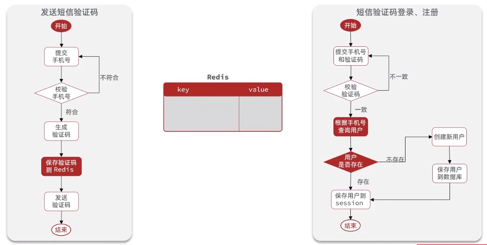
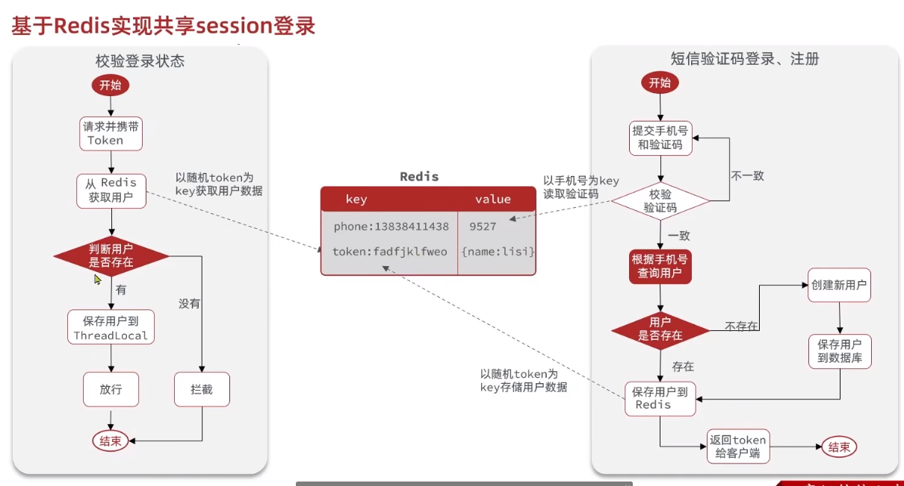
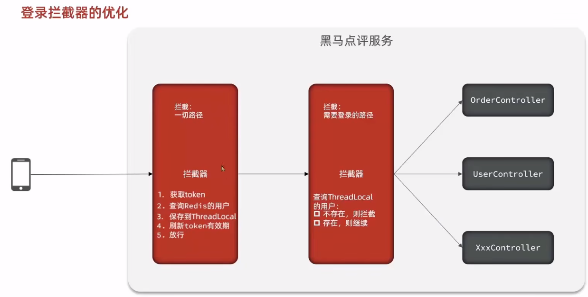

## 短信登录业务





<br>

## 设计逻辑

### 为什么用 token

当用户注册完毕后，自动生成一个随机 token 并将其交付给客户端；  
客户端对该随机 token 进行校验，校验通过就放行；

前端使用 axios 的拦截器，在每次 POST 或者 GET 请求前都附加一个 token 的 header，这样子后端就能每次都收到 token 来校验当前用户的登录状态了；

不应该使用用户手机号作为校验 token，这样会导致信息泄露的风险

<br>

### 发送验证码

使用 StringRedisTemplate 类，向 redis 插入新数据

插入以手机号为 key，验证码为 value 的数据

为避免业务冲突，需要在插入手机号的前面加上前缀，比如说：`login:code:`

除此之外，还需要为该验证码提供寿命，比如 60s，否则用户一个劲的发送验证码会造成极大消耗

<br>

### DTO 复制

一般的，我们直接从数据库中读取的 User 数据信息特别多，而我们并不愿意总是交换冗余的信息，故可以采用 DTO 复制的方式解决

定义 UserDTO 实体，里面仅保留少数必要字段（如用户名和手机号）  
使用 BeanUtil 的 copyBean 功能，将从数据库中获取的 User 中对应的数据段映射到 UserDTO 里面去

此刻就得到了拥有少部分信息的 UserDTO 对象，将其发送给客户，以减小流量开支与信息泄露的风险

<br>

### 用户保活

login 登录的 controller 明确设置了 token 保存的寿命为 30min

但实际上我们需要实现的效果是，用户登陆后（或者可以证明用户活跃的操作）更新一下 token 的有效期，如果用户能频繁登录，那么寿命就一直重置，从而实现长期保活

<br>

### 拦截器优化



为了使拦截操作更加人性化，故设置两重拦截器

`RefreshTokenInterceptor`  
首先拦截所有路径：  
如果获取到的 token 可以查询到用户，就更新该用户的 token，表示用户一直在活跃；  
如果查不到，证明用户没登录，而这些路径实际上也不需要用户登录就可以查看，所以直接不管，放行；

`LoginInterceptor`  
之后拦截需要登录后才可以访问的路径：  
在这里就要检测如果 token 查不到用户，就阻止访问，跳转登录界面；  
如果查到了，更新 token 的同时放行；

<br>

### 如何实现拦截

要通过`WebMvcConfiguration`设置拦截器，您可以按照以下步骤进行操作：

1. 创建一个实现`HandlerInterceptor`接口的拦截器类，该接口定义了在请求处理过程中要执行的方法，例如在请求之前、请求之后或请求完成后执行的逻辑。以下是一个简单的示例：

```java
import javax.servlet.http.HttpServletRequest;
import javax.servlet.http.HttpServletResponse;
import org.springframework.web.servlet.HandlerInterceptor;
import org.springframework.web.servlet.ModelAndView;

public class MyInterceptor implements HandlerInterceptor {

    @Override
    public boolean preHandle(HttpServletRequest request, HttpServletResponse response, Object handler)
            throws Exception {
        // 在请求之前执行的逻辑
        return true; // 返回true表示继续处理请求，返回false表示中断请求处理
    }

    @Override
    public void postHandle(HttpServletRequest request, HttpServletResponse response, Object handler,
            ModelAndView modelAndView) throws Exception {
        // 在请求处理完成后执行的逻辑
    }

    @Override
    public void afterCompletion(HttpServletRequest request, HttpServletResponse response, Object handler,
            Exception ex) throws Exception {
        // 在请求完成后（包括视图渲染完成）执行的逻辑
    }
}
```

2. 创建一个继承自`WebMvcConfigurationSupport`的配置类，并覆盖`addInterceptors`方法。在这个方法中，您可以添加您的拦截器。以下是一个示例：

```java
import org.springframework.context.annotation.Configuration;
import org.springframework.web.servlet.config.annotation.InterceptorRegistry;
import org.springframework.web.servlet.config.annotation.WebMvcConfigurationSupport;

@Configuration
public class MyWebMvcConfig extends WebMvcConfigurationSupport {

    @Override
    protected void addInterceptors(InterceptorRegistry registry) {
        registry.addInterceptor(new MyInterceptor())
                .addPathPatterns("/**"); // 设置拦截的路径，这里使用了通配符"/**"来匹配所有路径
    }
}
```

3. 确保将上述配置类添加到您的 Spring Boot 应用程序的组件扫描路径中，或者通过`@Import`注解导入配置类。例如，在主应用程序类上添加`@Import`注解：

```java
@SpringBootApplication
@Import(MyWebMvcConfig.class)
public class YourApplication {
    public static void main(String[] args) {
        SpringApplication.run(YourApplication.class, args);
    }
}
```

通过上述步骤，您已将拦截器添加到了 Spring MVC 的配置中。

<br>
