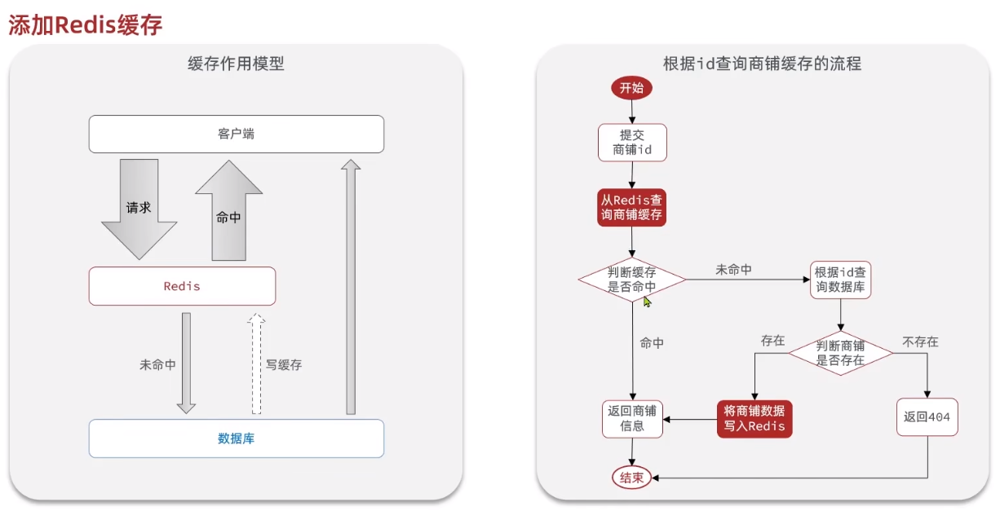
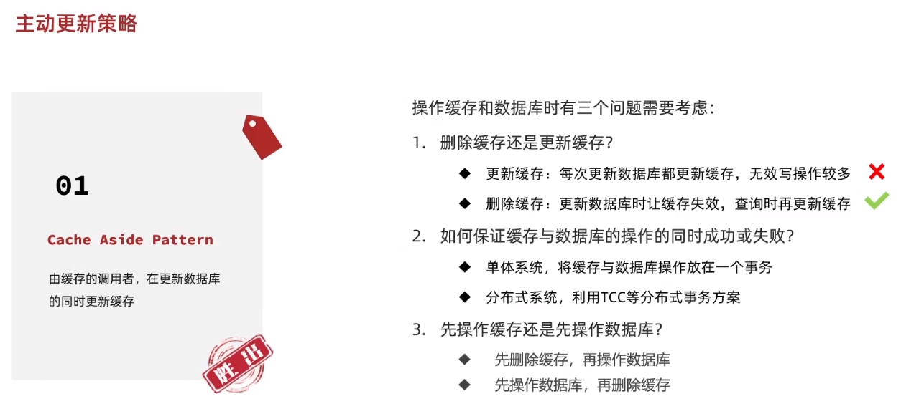

## 缓存思路



<br>

## 设计逻辑

### 简要实现 Redis 缓存

> 此文章基于 GPT 实现

要简单实现 Redis 缓存功能，您可以使用 `Spring Boot` 和 `Spring Data Redis` 来实现。以下是一个基本的示例：

1. 添加 Maven 依赖：
   在您的项目的`pom.xml`文件中，添加以下依赖以使用 Spring Data Redis 和 Redis 客户端：

```xml
<dependency>
    <groupId>org.springframework.boot</groupId>
    <artifactId>spring-boot-starter-data-redis</artifactId>
</dependency>
```

2. 配置 Redis 连接：
   在`application.properties`或`application.yml`文件中，配置 Redis 连接参数，例如：

```properties
spring.redis.host=127.0.0.1
spring.redis.port=6379
```

3. 创建缓存管理器：
   在您的配置类中，创建一个`RedisCacheManager`实例来管理缓存。以下是一个示例：

```java
import org.springframework.cache.CacheManager;
import org.springframework.cache.annotation.EnableCaching;
import org.springframework.cache.support.SimpleCacheManager;
import org.springframework.context.annotation.Bean;
import org.springframework.context.annotation.Configuration;
import org.springframework.data.redis.cache.RedisCacheConfiguration;
import org.springframework.data.redis.cache.RedisCacheManager;
import org.springframework.data.redis.connection.RedisConnectionFactory;
import org.springframework.data.redis.serializer.RedisSerializationContext;

@Configuration
@EnableCaching
public class RedisCacheConfig {

    @Bean
    public CacheManager cacheManager(RedisConnectionFactory redisConnectionFactory) {
        RedisCacheConfiguration cacheConfiguration = RedisCacheConfiguration.defaultCacheConfig()
                .serializeValuesWith(RedisSerializationContext.SerializationPair.fromSerializer(
                        RedisSerializer.json())); // 根据需要选择适当的序列化器

        RedisCacheManager cacheManager = RedisCacheManager.builder(redisConnectionFactory)
                .cacheDefaults(cacheConfiguration)
                .build();

        return cacheManager;
    }
}
```

4. 在需要进行缓存的方法上添加缓存注解：
   在您的 Service 类或其他需要缓存的方法上，使用 Spring 的缓存注解来指定缓存的行为。以下是一个示例：

```java
import org.springframework.cache.annotation.Cacheable;
import org.springframework.stereotype.Service;

@Service
public class MyService {

    @Cacheable("myCache") // 指定缓存名称
    public String getCachedData(String key) {
        // 从数据库或其他数据源获取数据的逻辑
        return "Cached data for key: " + key;
    }
}
```

在上述示例中，`@Cacheable`注解指定了缓存名称为"myCache"，并且方法的返回值将被缓存起来。下次调用该方法时，如果使用相同的参数，将直接从缓存中获取结果，而不会执行方法体内的逻辑。

请确保在需要使用缓存的 Spring Bean 上添加`@Service`或其他适当的注解，以便 Spring 能够正确扫描和创建 Bean。

当调用被`@Cacheable`注解修饰的方法时，Spring 会自动将结果缓存到 Redis 中，并在下次调用时直接从缓存中读取结果，从而提高性能和响应速度。

<br>

### 缓存更新策略

缓存更新是 redis 为了节约内存而设计出来的一个东西，主要是因为内存数据宝贵，当我们向 redis 插入太多数据，此时就可能会导致缓存中的数据过多，所以 redis 会对部分数据进行更新，或者把他叫为淘汰更合适。

**内存淘汰**  
redis 自动进行，当 redis 内存达到咱们设定的 max-memery 的时候，会自动触发淘汰机制，淘汰掉一些不重要的数据(可以自己设置策略方式)

**超时剔除**  
当我们给 redis 设置了过期时间 ttl 之后，redis 会将超时的数据进行删除，方便咱们继续使用缓存

**主动更新**  
我们可以手动调用方法把缓存删掉，通常用于解决缓存和数据库不一致问题

<br>

### 主动更新策略


<br>

目前绝多数公司后端使用的是主动更新策略（由缓存的调用者，在更新数据库的同时更新缓存）

下图展示了主动更新策略的模式以及对应需要注意的关键点



<br>

### 缓存更新最佳实践

低一致性要求：直接使用 redis 自带的内存淘汰机制

高一致性要求：主动更新，以超时作为剔除数据的备选方案

读操作：

- 缓存命中直接返回
- 缓存未命中就查数据库，写入缓存，设置超时时间

写操作：

- 写数据库，后删缓存
- 保证数据库与缓存操作的原子性

<br>

对于单体操作，我们仅需使用 SQL 语句进行简单的 update 就可以了

如果要加入注入 TCC 这种带分布式的框架的话，需要传入 MQ，实现多集群同步一致性，代码会更加复杂

<br>

### 缓存穿透

> 缓存穿透指：客户端请求的数据在缓存和数据库都不存在，那么请求就会一直打到数据库上，造成危害

解决缓存穿透的两种方式：

1. 缓存空对象：  
   优点：一旦穿透，立即让数据库返回一个带 TTL（生命周期）的空对象给 redis，那么下次还请求的话就直接返回空对象，而不是继续打在数据库上了  
   缺点：如果在空对象的 TTL 内，数据库突然插入了一个符合条件的数据，那么客户端依然只会访问到空对象而不是新数据

2. 布隆过滤：布隆过滤器（Bloom Filter）是一种基于概率的数据结构，用于快速判断一个元素是否存在于集合中。它可以高效地检测某个元素是否可能存在于集合中，但无法确定元素是否一定存在；  
   当过滤器判断客户端请求的数据不存在时，直接拒绝掉，不让请求下行

<br>

布隆过滤器属于一种算法实现，较为复杂，并且存在误判的可能性

布隆过滤器经常会用到的三大场景

- 缓存击穿预防：在缓存层之前使用布隆过滤器，可以快速判断请求的数据是否存在于缓存中，从而避免无效的数据库查询。
- 防止缓存穿透：在缓存层之后使用布隆过滤器，可以快速判断请求的数据是否属于无效的数据，从而避免对数据库进行无效查询。
- URL 去重：在网络爬虫等场景中，可以使用布隆过滤器来判断 URL 是否已经被访问过，避免重复爬取。

<br>

> 所以针对小型简单的项目，一般都会选择使用缓存空对象的方法来解决缓存穿透的问题

<br>

### 缓存雪崩

缓存雪崩是指在同一时段大量的缓存 key 同时失效或者 Redis 服务宕机，导致大量请求到达数据库，带来巨大压力。

解决方案：

- 给不同的 Key 的 TTL 添加随机值
- 利用 Redis 集群提高服务的可用性
- 给缓存业务添加降级限流策略
- 给业务添加多级缓存

<br>

### 缓存击穿

> 注意注意！！！缓存击穿不等于缓存穿透

缓存击穿问题也叫热点 Key 问题，就是一个被高并发访问并且缓存重建业务较复杂的 key 突然失效了，无数的请求访问会在瞬间给数据库带来巨大的冲击。

<br>

两种解决方式：互斥锁与逻辑过期


<br>

互斥锁：  
线程 1 先到，获得锁，开始获取资源；  
若此时线程 2 进入争抢锁，必定失败，故进入休眠期，等待锁释放；

逻辑过期：  
把过期时间设置在 value 内，线程 1 发现过期，获取锁并开启新线程 2 来更新缓存数据，而线程 1 自己先用旧的过期数据；  
此时线程 3 争抢锁失败，直接用过期的数据；  
线程 2 重建完毕，线程 1 释放锁；  
线程 4 获得锁，因为缓存已经更新，故此时可以拿到最新的数据；

<br>

互斥锁需要线程等待，且可能触发死锁，但是实现简单性能高；

逻辑过期实现复杂但是无需等待；

<br>

### 互斥锁解决缓存击穿

基本原理：线程先去获取互斥锁，如果拿到了，就查询数据库；如果拿不到，就休眠后等到锁释放，抢占他，再查询数据库；

利用 redis 的 SETNX 方法表示锁获取与否；  
如果锁没被获取，则 SETNX 可以插入，返回 1；  
如果锁正在用，则 SETNX 无法插入，返回 0；

<br>
