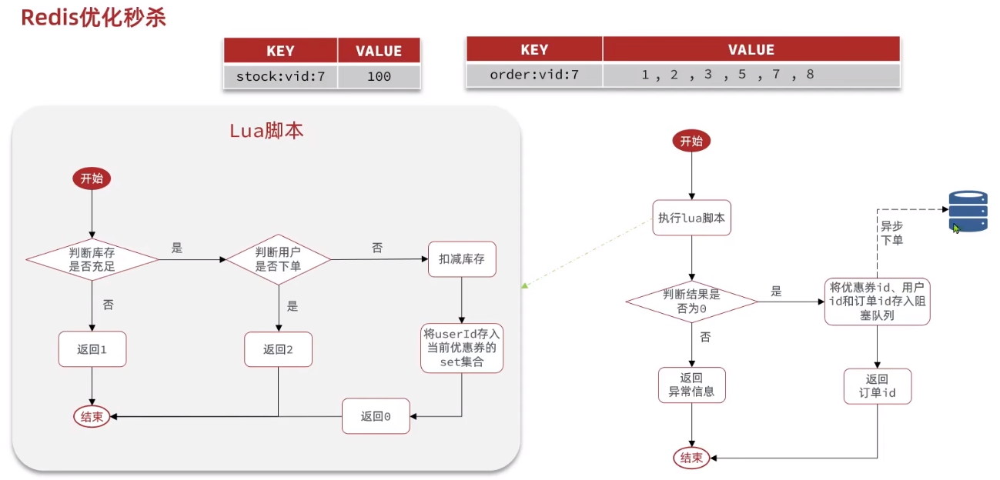

## 设计逻辑

### 全局唯一 ID

用户抢购优惠券时，会生成一个订单，但我们必须保证订单 ID 的生成并不具有很明显的规律，否则会泄露商品出售量信息；

ID 的组成部分：

- 符号位：1bit，永远为 0
- 时间戳：31bit，以秒为单位，可以使用 69 年
- 序列号：32bit，秒内的计数器，支持每秒产生 2^32 个不同 ID

<br>

故借助 redis 实现全局唯一 ID

```java
@Component
public class RedisIdWorker {
    /**
     * 开始时间戳
     */
    private static final long BEGIN_TIMESTAMP = 1640995200L;
    /**
     * 序列号的位数
     */
    private static final int COUNT_BITS = 32;

    private StringRedisTemplate stringRedisTemplate;

    public RedisIdWorker(StringRedisTemplate stringRedisTemplate) {
        this.stringRedisTemplate = stringRedisTemplate;
    }

    public long nextId(String keyPrefix) {
        // 1.生成时间戳
        LocalDateTime now = LocalDateTime.now();
        long nowSecond = now.toEpochSecond(ZoneOffset.UTC);
        long timestamp = nowSecond - BEGIN_TIMESTAMP;

        // 2.生成序列号
        // 2.1.获取当前日期，精确到天
        String date = now.format(DateTimeFormatter.ofPattern("yyyy:MM:dd"));
        // 2.2.自增长
        long count = stringRedisTemplate.opsForValue().increment("icr:" + keyPrefix + ":" + date);

        // 3.拼接并返回
        return timestamp << COUNT_BITS | count;
    }
}
```

### CountDownLatch

CountDownLatch 是 Java 编程语言中的一种同步辅助工具。它允许一个或多个线程等待一组操作完成，然后再继续执行。CountDownLatch 通过一个计数器来实现，计数器的初始值可以设定为一个正整数，表示需要等待的操作数量。

CountDownLatch 的主要方法是`countDown()`和`await()`。当一个线程完成了一个操作，可以调用`countDown()`方法将计数器减 1。而其他线程可以调用`await()`方法来等待计数器的值达到零，一旦计数器为零，所有等待的线程将被释放，可以继续执行。

下面是一个简单的示例，说明了 CountDownLatch 的使用方式：

```java
import java.util.concurrent.CountDownLatch;

public class CountDownLatchExample {
    public static void main(String[] args) throws InterruptedException {
        // 创建一个计数器，初始值为3
        CountDownLatch latch = new CountDownLatch(3);

        // 创建三个线程进行操作
        Worker worker1 = new Worker(latch, "Worker 1");
        Worker worker2 = new Worker(latch, "Worker 2");
        Worker worker3 = new Worker(latch, "Worker 3");

        // 启动三个线程
        worker1.start();
        worker2.start();
        worker3.start();

        // 等待所有操作完成
        latch.await();

        // 所有操作完成后执行其他操作
        System.out.println("All workers have completed their tasks.");
    }
}

class Worker extends Thread {
    private final CountDownLatch latch;

    public Worker(CountDownLatch latch, String name) {
        super(name);
        this.latch = latch;
    }

    public void run() {
        System.out.println(getName() + " is performing task.");
        // 模拟任务执行时间
        try {
            Thread.sleep(1000);
        } catch (InterruptedException e) {
            e.printStackTrace();
        }
        System.out.println(getName() + " has completed task.");
        latch.countDown(); // 计数器减1
    }
}
```

在上面的示例中，创建了一个初始值为 3 的 CountDownLatch 对象。然后创建了三个 Worker 线程，每个线程执行一个任务，并在任务完成后调用`countDown()`方法减少计数器的值。最后，主线程调用`await()`方法等待所有操作完成。

<br>

### 特价券

对于普通券，不需要任何限制，随时随地都可以领取而且没有数量限制；

而特价券需要添加两个限制：活动时间段和券数量

用户点击抢购领券时，需要检测活动是否结束，以及库存量是否足够；

<br>

### 库存超售问题

解决逻辑：
设置一个版本号 version=1 存到数据库；  
线程 1 操作后获取锁，令 version++；  
线程 2 发现 version=2，无法获取锁，只能作罢；

<br>

## 分布式锁

### 分布式锁满足的条件

可见性：多个线程都能看到相同的结果，注意：这个地方说的可见性并不是并发编程中指的内存可见性，只是说多个进程之间都能感知到变化的意思

互斥：互斥是分布式锁的最基本的条件，使得程序串行执行

高可用：程序不易崩溃，时时刻刻都保证较高的可用性

高性能：由于加锁本身就让性能降低，所有对于分布式锁本身需要他就较高的加锁性能和释放锁性能

安全性：安全也是程序中必不可少的一环

<br>

### 分布式锁误删

误删原因：  
线程 1 持有锁，因为阻塞等原因释放了锁，此时锁被等待的线程 2 获取；  
而此时线程 1 走到了删除锁的流程，就会把线程 2 正在用的锁删掉了，这就是误删锁；

解决办法：在线程 1 删除锁之前要检测一下这个锁是不是自己持有的

业务代码核心逻辑：在存入锁时，放入自己线程的标识，在删除锁时，判断当前这把锁的标识是不是自己存入的，如果是，则进行删除，如果不是，则不进行删除。

<br>

### Redission

Redisson 是一个基于 Redis 的分布式 Java 对象和服务库。

Redisson 提供了以下主要功能：

1. 分布式对象：Redisson 允许您在分布式环境中创建和操作各种 Java 对象，如分布式集合（Set、List、Queue 等）、分布式映射（Map）、分布式锁、分布式信号量等。这些对象的操作是线程安全的，并且可以跨多个 JVM 和服务器进行共享和访问。
2. 分布式锁：Redisson 实现了基于 Redis 的分布式锁，允许多个 JVM 或服务器之间协调并发访问共享资源。它提供了公平锁和非公平锁，还支持可重入锁和红锁（RedLock）算法来提高锁的可用性和可靠性。
3. 分布式集合：Redisson 提供了许多分布式集合的实现，如分布式 Set、SortedSet、List 和 Queue 等。这些集合可以在多个 JVM 和服务器之间进行共享和操作，并提供了丰富的集合操作方法和功能。
4. 分布式消息队列：Redisson 支持分布式消息队列的实现，可以实现基于发布/订阅模式的消息传递，以及支持点对点模式的消息处理。它提供了可靠的消息传递保证，并支持延迟队列和优先级队列等特性。
5. 分布式锁监控：Redisson 提供了对分布式锁的监控功能，可以实时查看锁的状态、持有锁的客户端信息以及锁的过期时间等。这对于监控和诊断分布式系统中的锁竞争问题非常有帮助。

<br>

### 抢锁逻辑

方法 `tryAcquire` 进行抢锁，抢锁逻辑如下

1、先判断当前这把锁是否存在，如果不存在，插入一把锁，返回 null

2、判断当前这把锁是否是属于当前线程，如果是，则返回 null

所以如果返回是 null，则代表着当前这哥们已经抢锁完毕，或者可重入完毕，但是如果以上两个条件都不满足，则进入到第三个条件，返回的是锁的失效时间

<br>

###

### RMultiLock

Redission 的 RMultiLock（Redission MultiLock）是一种多锁的实现机制。它允许在一个事务或操作中同时获取和释放多个锁，以确保多个资源的操作是原子性的。

RMultiLock 中，通过将多个锁的键（key）以及对应的值（value）传递给 RMultiLock 对象的构造函数来创建一个多锁对象。  
然后，可以使用 lock()方法来尝试获取所有锁，如果成功获取到所有锁，则可以进行后续的操作。在操作完成后，可以使用 unlock()方法来释放所有锁。

<br>

redis 使用 multilock 时，它推广多锁机制；

当客户端加锁时，必须调用 lock 获取所有 master 的锁，才可以调用；  
当只要有一个 master 无法获取到锁，那么客户端就永远无法加锁；

redission 会把这些锁丢到一个集合内部，然后循环尝试获取锁，直到得到所有的锁

<br>

## 秒杀优化

### 优化步骤



> 主要优化流程是：检测库存以及订单首先执行，通过这一道坎后把用户信息以及订单存入拥塞队列，队列在按照顺序快速处理订单，实现异步下单功能

首先直接用一个 LUA 脚本实现（因为 LUA 脚本可以实现原子性）：
检测到没库存了或者用户已经下过单了，就不做后续处理；  
否则商品减少一个，并且把用户 userid 存入 set 集合中（因为 set 的 value 不允许重复，所以可以避免用户多次下单）；

紧接着，判断 LUA 脚本返回值是否为 0；  
如果为 0，表示成功下单，将用户的相关信息存入阻塞队列，等待后续办法订单 ID 处理

TIPS：通俗来讲，就是先把简单的需求快速处理并给用户一个结果（买上了或者买不上），至于创建订单这些耗时且占用线程的处理事件我们移到后台执行，执行完毕异步返回给前端让其更新一下数据即可（实际上用户并不会关心订单号这些玩意，他只会关心买不买得上）

<br>
