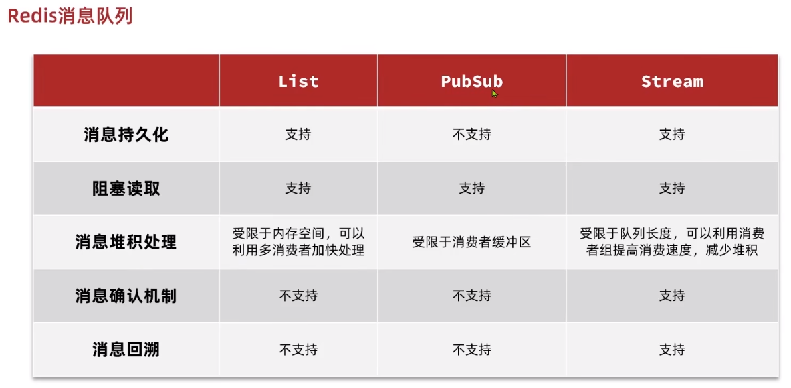

## 消息队列

<br>

### 定义

什么是消息队列：字面意思就是存放消息的队列。最简单的消息队列模型包括 3 个角色：

- 消息队列：存储和管理消息，也被称为消息代理（Message Broker）
- 生产者：发送消息到消息队列
- 消费者：从消息队列获取消息并处理消息

将消息队列应用到我们的秒杀项目中就变成了：我们下单之后，利用 redis 去进行校验下单条件，再通过队列把消息发送出去，然后再启动一个线程去消费这个消息，完成解耦，同时也加快我们的响应速度。

<br>

### List 消息队列

Redis 的 list 数据结构是一个双向链表，很容易模拟出队列效果。

list 常用的方法为 LPOP 何 RPOP，但是当 list 没有任何元素时，会弹出 null  
可以使用阻塞弹出的方法，如 BRPOP 和 BLPOP，当发现 list 无元素可以弹出时，执行阻塞，直到有新的元素插入后才弹出

<br>

基于 List 的消息队列有哪些优缺点？

优点：

- 利用 Redis 存储，不受限于 JVM 内存上限
- 基于 Redis 的持久化机制，数据安全性有保证
- 可以满足消息有序性

缺点：

- 无法避免消息丢失
- 只支持单消费者

<br>

### 发布订阅消息队列

`PubSub（发布订阅）` 是 Redis2.0 版本引入的消息传递模型。  
消费者可以订阅一个或多个 channel，生产者向对应 channel 发送消息后，所有订阅者都能收到相关消息。

常见发布订阅方法

```
SUBSCRIBE channel [channel] ：订阅一个或多个频道
PUBLISH channel msg ：向一个频道发送消息
PSUBSCRIBE pattern[pattern] ：订阅与pattern格式匹配的所有频道
```

<br>

基于 PubSub 的消息队列有哪些优缺点？

优点：

- 采用发布订阅模型，支持多生产、多消费

缺点：

- 不支持数据持久化
- 无法避免消息丢失
- 消息堆积有上限，超出时数据丢失

<br>

### stream 消息队列

> Stream 是 Redis 5.0 版本引入的一种数据结构，它提供了一个高性能、持久化的日志数据流。Stream 主要用于处理消息队列、事件驱动的系统、日志记录和实时数据处理等应用场景。

Stream 数据结构由一系列有序的消息组成，每个消息都有一个唯一的 ID。消息可以包含多个字段和对应的值，类似于键值对。Stream 中的消息按照发布的顺序进行排序，新的消息追加到 Stream 的尾部。

以下是 Stream 的一些重要特性和常用命令：

1. 消息的唯一 ID：每个消息都有一个唯一的 ID，可以是自动生成的 ID 或者手动指定。ID 用于标识消息在 Stream 中的位置。
2. 消息的字段和值：每个消息可以包含多个字段和对应的值，类似于键值对。这使得消息可以携带更丰富的信息。
3. 持久化存储：Stream 的数据可以持久化到硬盘上，确保即使在 Redis 重启后数据也不会丢失。
4. 消息消费：可以按照消费者组的方式对 Stream 进行消费。消费者组可以有多个消费者，每个消费者可以独立地消费 Stream 中的消息，并且消费进度会被自动跟踪。
5. 消息确认和未确认：消费者可以确认已经处理完的消息，这样 Redis 会从 Stream 中删除该消息。如果消费者在处理消息时发生错误，可以将消息标记为未确认状态，以便稍后重新处理。
6. 消息阻塞：消费者可以使用阻塞操作等待新的消息到达 Stream，这样可以实现实时的消息处理。

以下是一些常用的 Stream 命令：

- `XADD`：向 Stream 中添加一条消息。
- `XLEN`：获取 Stream 中消息的数量。
- `XRANGE`：按范围获取 Stream 中的消息。
- `XREAD`：从 Stream 中读取消息。
- `XGROUP`：创建和管理消费者组。
- `XACK`：确认消费者已处理完的消息。
- `XCLAIM`：将未确认的消息重新分配给其他消费者。
- `XDEL`：删除 Stream 中的消息。

<br>

从消费者组读取消息：

```java
XREADGROUP GROUP group consumer [COUNT count] [BLOCK milliseconds] [NOACK] STREAMS key [key ...] ID [ID ...]
```

- group：消费组名称
- consumer：消费者名称，如果消费者不存在，会自动创建一个消费者
- count：本次查询的最大数量
- BLOCK milliseconds：当没有消息时最长等待时间
- NOACK：无需手动 ACK，获取到消息后自动确认
- STREAMS key：指定队列名称
- ID：获取消息的起始 ID：

<br>

Redis 拥有三个基本数据结构，可以构成完整的消息队列



<br>

## 推送

<br>

### Feed

Feed 流，直译为投喂。为用户持续的提供“沉浸式”的体验，通过无限下拉刷新获取新的信息。

Feed 流的两种形式：
`Timeline`：不做内容筛选，简单的按照内容发布时间排序，常用于好友或关注。例如朋友圈  
`智能排序`：利用智能算法屏蔽掉违规的、用户不感兴趣的内容。推送用户感兴趣信息来吸引用户

<br>

Timeline 的三种形式

1. 拉模式：信息存在 A 处，当 B 需要读取时从 A 拉取
2. 推模式：信息从 A 直接发到 B 处
3. 推拉结合模式：对于普通粉丝，用拉模式，等他们上线再拉取博主信息；对于铁粉，推模式，博主信息直接实施推送

<br>

### 关注邮箱推送

用户关注列表通常会有一些自动推送，如何实现他们呢？

需要执行查询主页：

1、每次查询完成后，我们要分析出查询出数据的最小时间戳，这个值会作为下一次查询的条件
2、我们需要找到与上一次查询相同的查询个数作为偏移量，下次查询时，跳过这些查询过的数据，拿到我们需要的数据

综上：我们的请求参数中就需要携带 lastId：上一次查询的最小时间戳 和偏移量这两个参数。

<br>

## 地理位置 GEO

<br>

### GEO 基本

GEO 就是 Geolocation 的简写形式，代表地理坐标。Redis 在 3.2 版本中加入了对 GEO 的支持，允许存储地理坐标信息，帮助我们根据经纬度来检索数据。常见的命令有：

- GEOADD：添加一个地理空间信息，包含：经度（longitude）、纬度（latitude）、值（member）
- GEODIST：计算指定的两个点之间的距离并返回
- GEOHASH：将指定 member 的坐标转为 hash 字符串形式并返回
- GEOPOS：返回指定 member 的坐标
- GEORADIUS：指定圆心、半径，找到该圆内包含的所有 member，并按照与圆心之间的距离排序后返回。6.以后已废弃
- GEOSEARCH：在指定范围内搜索 member，并按照与指定点之间的距离排序后返回。范围可以是圆形或矩形。6.2.新功能
- GEOSEARCHSTORE：与 GEOSEARCH 功能一致，不过可以把结果存储到一个指定的 key。 6.2.新功能

<br>

## 用户签到

<br>

### 签到原理

我们按月来统计用户签到信息，签到记录为 1，未签到则记录为 0.

把每一个 bit 位对应当月的每一天，形成了映射关系。用 0 和 1 标示业务状态，这种思路就称为位图（BitMap）

可以借助 redis 中的 bitmap 来实现此操作

<br>

BitMap 的操作命令有：

- SETBIT：向指定位置（offset）存入一个 0 或 1
- GETBIT ：获取指定位置（offset）的 bit 值
- BITCOUNT ：统计 BitMap 中值为 1 的 bit 位的数量
- BITFIELD ：操作（查询、修改、自增）BitMap 中 bit 数组中的指定位置（offset）的值
- BITFIELD_RO ：获取 BitMap 中 bit 数组，并以十进制形式返回
- BITOP ：将多个 BitMap 的结果做位运算（与 、或、异或）
- BITPOS ：查找 bit 数组中指定范围内第一个 0 或 1 出现的位置

<br>

### 功能实现

可以把年和月作为 bitMap 的 key，然后保存到一个 bitMap 中，每次签到就到对应的位上把数字从 0 变成 1，只要对应是 1，就表明说明这一天已经签到了，反之则没有签到。

计算当月签到总天数：获得当前这个月的最后一次签到数据，定义一个计数器，然后不停的向前统计，直到获得第一个非 0 的数字即可，每得到一个非 0 的数字计数器+1，直到遍历完所有的数据，就可以获得当前月的签到总天数了

计算当月连续签到天数：从最后一次签到开始向前统计，直到遇到第一次未签到为止，计算总的签到次数，就是连续签到天数。

<br>

### bitmap 解决缓存穿透

定义一个 bitmap，存入所有商品的 id

具体存储方式使用取模运算：`id % bitmap.size` 算出当前商品 id 应该落到哪一位上；  
当用户访问 id 时，直接执行反运算，看是否能落到 bitmap 上面，如果可以就直接放行；如果不行就组织继续访问以免发送缓存穿透

<br>

## UV 统计

两种主流的统计访客量的方式

- UV：全称 Unique Visitor，也叫独立访客量，是指通过互联网访问、浏览这个网页的自然人。1 天内同一个用户多次访问该网站，只记录 1 次。
- PV：全称 Page View，也叫页面访问量或点击量，用户每访问网站的一个页面，记录 1 次 PV，用户多次打开页面，则记录多次 PV。往往用来衡量网站的流量。

<br>

Hyperloglog(HLL)是从 Loglog 算法派生的概率算法，用于确定非常大的集合的基数，而不需要存储其所有值。  
他的误差对于 UV 统计来说可以直接忽略掉

特别是对于 Hyperloglog 来说，它不会记录重复添加的数据  
也就是说，原来有数据 a，然后你又使用 PFADD 添加了一个 a 进去，是没有任何作用的，他不会记录这个数值

<br>
