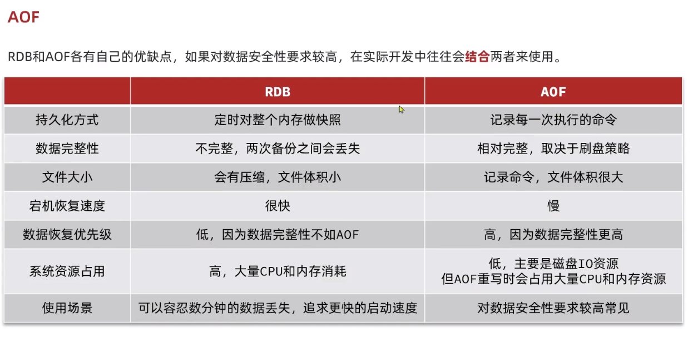
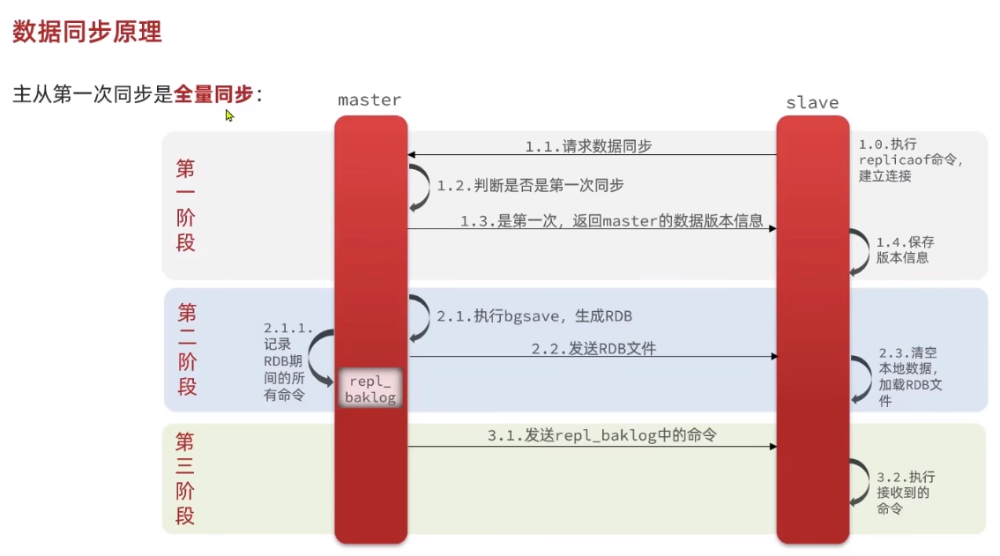
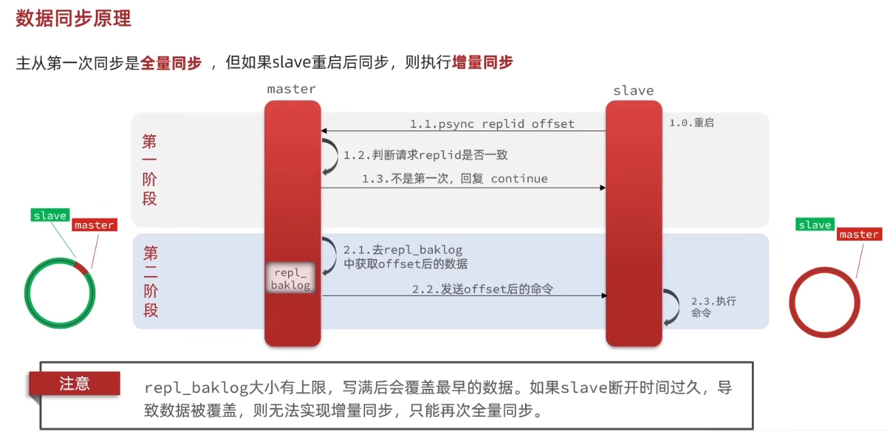
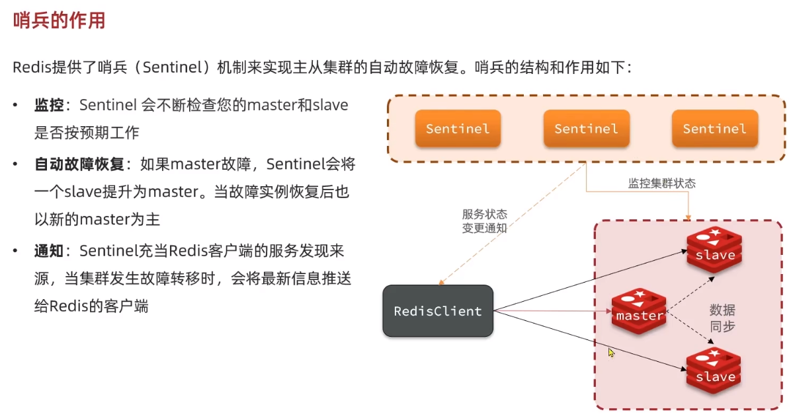
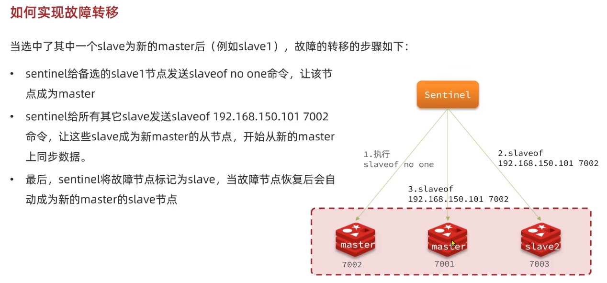

## Redis 持久化

<br>

### RDB 持久化

> RDB 全称 Redis Database Backup file（Redis 数据备份文件），也被叫做 Redis 数据快照。简单来说就是把内存中的所有数据都记录到磁盘中。当 Redis 实例故障重启后，从磁盘读取快照文件，恢复数据。快照文件称为 RDB 文件，默认是保存在当前运行目录。

<br>

如何触发 RDB

- 执行 save 命令：redis 下直接运行 save，会阻塞 redis
- 执行 bgsave 命令：执行后会开启独立进程完成 RDB，主进程可以持续处理用户请求，不受影响。
- Redis 停机时：停机立刻触发一次 save
- 触发 RDB 条件时：看下文解释

<br>

#### 触发 RDB 条件

Redis 内部有触发 `RDB` 的机制，可以在 `redis.conf` 文件中找到，格式如下：

```properties
# 900秒内，如果至少有1个key被修改，则执行bgsave ， 如果是save "" 则表示禁用RDB
save 900 1
save 300 10
save 60 10000
```

RDB 的其它配置也可以在 `redis.conf` 文件中设置：

```properties
# 是否压缩 ,建议不开启，压缩也会消耗cpu，磁盘的话不值钱
rdbcompression yes

# RDB文件名称
dbfilename dump.rdb

# 文件保存的路径目录
dir ./
```

<br>

#### RDB 原理

bgsave 开始时会 fork 主进程得到子进程，子进程共享主进程的内存数据。完成 fork 后读取内存数据并写入 RDB 文件。

fork 采用的是 copy-on-write 技术：

- 当主进程执行读操作时，访问共享内存；
- 当主进程执行写操作时，则会拷贝一份数据，执行写操作。

<br>

### AOF 持久化

> AOF 全称为 Append Only File（追加文件）。Redis 处理的每一个写命令都会记录在 AOF 文件，可以看做是命令日志文件。

还记得 redis 除了主线程之外还多出来的三个后台子线程吗？  
没错，就包含这个 AOF 刷盘线程！

<br>

#### 配置 AOF

AOF 默认是关闭的，需要修改 redis.conf 配置文件来开启 AOF：

```properties
# 是否开启AOF功能，默认是no
appendonly yes
# AOF文件的名称
appendfilename "appendonly.aof"
```

AOF 的命令记录的频率也可以通过 redis.conf 文件来配：  
下面表示了三种 AOF 刷盘频率

```properties
# 表示每执行一次写命令，立即记录到AOF文件（最消耗性能，但最可靠）
appendfsync always
# 写命令执行完先放入AOF缓冲区，然后表示每隔1秒将缓冲区数据写到AOF文件，是默认方案（最佳方案，可能损失1s数据）
appendfsync everysec
# 写命令执行完先放入AOF缓冲区，由操作系统决定何时将缓冲区内容写回磁盘（最不推荐，容易丢失大量数据）
appendfsync no
```

<br>

#### AOF 重写

AOF 文件比 RDB 大得多，他会记录对同一个 key 的多次读写操作；可以借助重写指令来将这些读写操作合并为一条指令  
重写指令：`BGREWRITEAOF`

或者直接在 `redis.conf` 配置文件设置达到一定阈值后自动开启刷盘

```properties
# AOF文件比上次文件 增长超过多少百分比则触发重写
auto-aof-rewrite-percentage 100
# AOF文件体积最小多大以上才触发重写
auto-aof-rewrite-min-size 64mb
```

<br>

#### AOF && RDB 对比



<br>

## Redis 主从

<br>

### 主从架构原理

Redis 主从架构是一种在 Redis 数据库中实现高可用性和数据复制的架构模式。  
主从架构包括一个主节点（master）和一个或多个从节点（slaves）。主节点负责处理写操作和读操作，并将数据复制到从节点。从节点只负责读操作，并通过复制来保持与主节点数据的同步。

Redis 主从架构的主要工作原理：

1. 数据复制：当主节点接收到写操作时，它将先更新自身的数据，然后将更新的命令发送给所有从节点。从节点接收到命令后，会执行相同的写操作，从而保持与主节点数据的一致性。
2. 数据同步：初始阶段，主节点会将整个数据集发送给从节点进行初始化。之后，主节点会将所有写操作的命令发送给从节点，从节点按照相同的顺序执行这些命令，以确保数据的同步。
3. 读操作负载均衡：当客户端发送读操作请求时，可以选择从主节点或从节点读取数据。这样可以分担主节点的负载，提高系统的读取性能。
4. 故障转移：如果主节点发生故障，可以从从节点中选取一个作为新的主节点。选举新的主节点的方式可以是手动配置或自动选举，取决于配置和需求。

<br>

### 集群搭设

> redis5.0 之前的从设备叫做 slave，而后续版本就改叫 replica

redis 服务器是通过 redis.conf 来配置的

对于基础的测试集群，我们可以搭设 `1 个 master` + `2 个 slaves` 的架构

在任意文件夹下新建三个空文件夹，并把原版 redis.conf 文件一一拷贝到这三个文件夹内

对于每个文件，需要执行修改的配置项：

```
# 三个redis服务器的端口必须不一致
port 7001

# 工作目录应该使用当前文件夹，请自行修改
dir ./

# 需要将ip绑定到一个虚拟机上面，也就是说三个conf文件下面的配置必须都是一样的
replica-announce-ip xxx.xxx.xxx.xxx
```

<br>

使用配置文件运行三个 redis-server  
`redis-server /xx/xxx/redis.conf`

随机进入一个 redis-server

输入以下任意一个指令，把目标 redis-server 当成自己的 master，被执行此代码的变成 slave  
`SLAVEOF [ip] [port]`  
`REPLICAOF [ip] [port]`

<br>

假设我们已经完成了所有主从的配置，此时 7001 为 master，而 7002、7003 为 slave

在 7001 内随意 set 一个值，在来到 7002 里面就可以获取到对应值了  
这就是所谓的主从架构

<br>

### 数据同步原理

#### 全量同步



slave 第一次请求 master，使用全量同步

master 如何判断 slave 是第一次执行同步？  
这是两个主要判据：

- **Replication Id**：简称 replid，是数据集的标记，id 一致则说明是同一数据集。每一个 master 都有唯一的 replid，slave 则会继承 master 节点的 replid
- **offset**：偏移量，随着记录在 repl_baklog 中的数据增多而逐渐增大。slave 完成同步时也会记录当前同步的 offset。如果 slave 的 offset 小于 master 的 offset，说明 slave 数据落后于 master，需要更新。

<br>

因为 slave 原本也是一个 master，有自己的 replid 和 offset，当第一次变成 slave，与 master 建立连接时，发送的 replid 和 offset 是自己的 replid 和 offset。

master 判断发现 slave 发送来的 replid 与自己的不一致，说明这是一个全新的 slave，就知道要做全量同步了。

master 会将自己的 replid 和 offset 都发送给这个 slave，slave 保存这些信息。以后 slave 的 replid 就与 master 一致了。

> TIPS: master 判断一个节点是否是第一次同步的依据，就是看 replid 是否一致

<br>

#### 增量同步



slave 重启后同步，使用增量同步

所谓增量同步，就是只更新 slave 与 master 存在差异的部分数据

<br>

#### repl_backlog 原理

全量同步会使用到 repl_backlog 文件

这个文件是一个固定大小的数组，只不过数组是环形，也就是说角标到达数组末尾后，会再次从 0 开始读写，这样数组头部的数据就会被覆盖。

repl_baklog 中会记录 Redis 处理过的命令日志及 offset，包括 master 当前的 offset，和 slave 已经拷贝到的 offset  
slave 与 master 的 offset 之间的差异，就是 slave 需要增量拷贝的数据了。  
随着不断有数据写入，master 的 offset 逐渐变大，slave 也不断的拷贝，追赶 master 的 offset

<br>

#### 优化同步

主从同步可以保证主从数据的一致性，非常重要。

可以从以下几个方面来优化 Redis 主从就集群：

- 在 master 中配置 repl-diskless-sync yes 启用无磁盘复制，避免全量同步时的磁盘 IO。
- Redis 单节点上的内存占用不要太大，减少 RDB 导致的过多磁盘 IO
- 适当提高 repl_baklog 的大小，发现 slave 宕机时尽快实现故障恢复，尽可能避免全量同步
- 限制一个 master 上的 slave 节点数量，如果实在是太多 slave，则可以采用主-从-从链式结构，减少 master 压力

<br>

## Redis 哨兵

<br>

### 哨兵原理

#### 集群架构



`Redis 哨兵（Redis Sentinel）`是一种用于监控和管理 Redis 主从架构的自动故障检测和故障恢复系统。  
它的主要目的是提供高可用性，当 Redis 主节点发生故障时，哨兵可以自动选举新的主节点，并将从节点升级为新的主节点。

以下是 Redis 哨兵的工作原理：

1. 监控：每个 Redis 哨兵进程都会定期向所有 Redis 实例（包括主节点和从节点）发送 PING 命令来检测它们的可用性。如果一个实例在一定时间内没有响应，哨兵会将其标记为不可用。
2. 故障检测：当哨兵检测到主节点不可用时，它会通过投票的方式从剩余的可用从节点中选举一个新的主节点。哨兵使用 Raft 算法或类似的算法来实现选举过程，确保只有一个从节点被升级为主节点。
3. 故障转移：一旦新的主节点选举出来，哨兵会通知其他哨兵和 Redis 客户端关于主节点的变更。客户端可以更新配置以连接到新的主节点，并继续进行操作。同时，哨兵还会协调从节点对新的主节点进行同步，以保持数据的一致性。
4. 配置发布：Redis 哨兵还可以用于发布配置更新。当有新的 Redis 实例加入或离开主从集群时，哨兵可以通知其他哨兵和客户端进行相应的配置更新。

<br>

#### 监控原理

`Sentinel` 基于心跳机制监测服务状态，每隔 1 秒向集群的每个实例发送 ping 命令：

- 主观下线：如果某 sentinel 节点发现某实例未在规定时间响应，则认为该实例**主观下线**。
- 客观下线：若超过指定数量（quorum）的 sentinel 都认为该实例主观下线，则该实例**客观下线**。quorum 值最好超过 Sentinel 实例数量的一半。

<br>

#### 集群故障恢复原理

一旦发现 master 故障，sentinel 需要在 salve 中选择一个作为新的 master，选择依据是这样的：

- 首先会判断 slave 节点与 master 节点断开时间长短，如果超过指定值（down-after-milliseconds \* 10）则会排除该 slave 节点
- 然后判断 slave 节点的 slave-priority 值，越小优先级越高，如果是 0 则永不参与选举
- 如果 slave-prority 一样，则判断 slave 节点的 offset 值，越大说明数据越新，优先级越高
- 最后是判断 slave 节点的运行 id 大小，越小优先级越高。

当选出一个新的 master 后，该如何实现切换呢？

- sentinel 给备选的 slave1 节点发送 slaveof no one 命令，让该节点成为 master
- sentinel 给所有其它 slave 发送 slaveof 192.168.150.101 7002 命令，让这些 slave 成为新 master 的从节点，开始从新的 master 上同步数据。
- 最后，sentinel 将故障节点标记为 slave，当故障节点恢复后会自动成为新的 master 的 slave 节点



<br>

### 搭设哨兵集群
