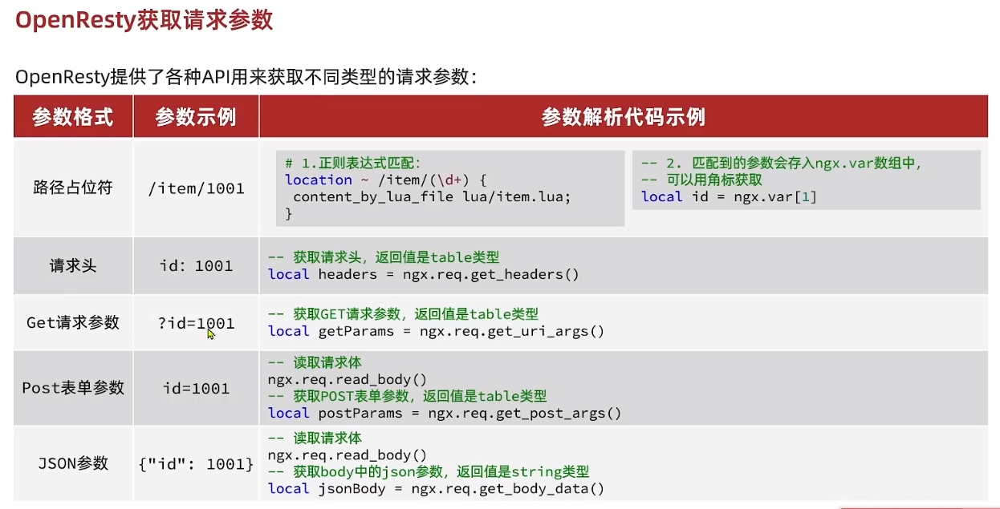
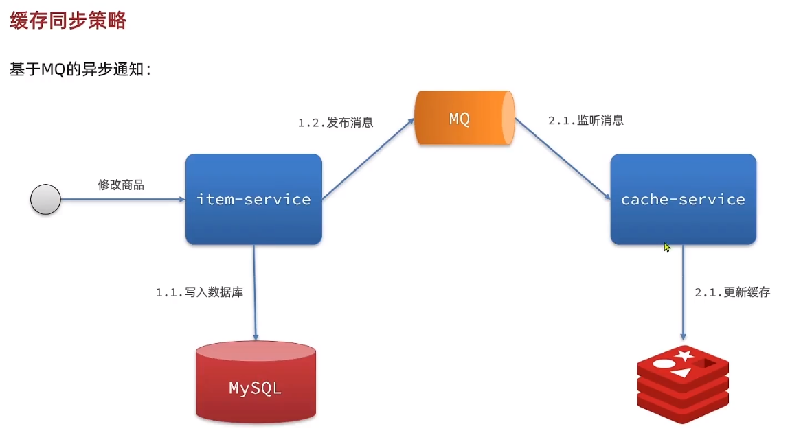
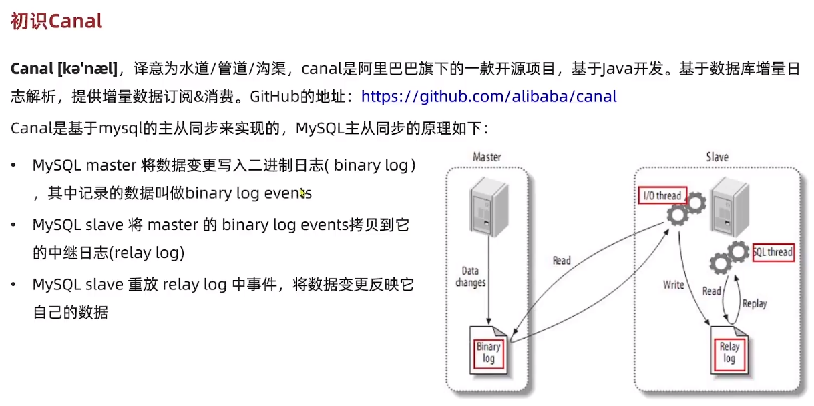

## 多级缓存含义

多级缓存就是充分利用请求处理的每个环节，分别添加缓存，减轻 Tomcat 压力，提升服务性能：

- 浏览器访问静态资源时，优先读取浏览器本地缓存
- 访问非静态资源（ajax 查询数据）时，访问服务端
- 请求到达 Nginx 后，优先读取 Nginx 本地缓存
- 如果 Nginx 本地缓存未命中，则去直接查询 Redis（不经过 Tomcat）
- 如果 Redis 查询未命中，则查询 Tomcat
- 请求进入 Tomcat 后，优先查询 JVM 进程缓存
- 如果 JVM 进程缓存未命中，则查询数据库

<br>

在多级缓存架构中，Nginx 内部需要编写本地缓存查询、Redis 查询、Tomcat 查询的业务逻辑，因此这样的 nginx 服务不再是一个**反向代理服务器**，而是一个编写**业务的 Web 服务器了**。

既然 nginx 用作 web 服务器了，那么必然需要另外一个 nginx 当做反向代理服务器

<br>

## JVM 进程缓存

<br>

### Caffeine

**Caffeine**是一个基于 Java8 开发的，提供了近乎最佳命中率的高性能的本地缓存库。

目前缓存有两种形式：

- 分布式缓存，如 redis
- 进程本地缓存，如 HashMap、GuavaCache

<br>

如何使用 caffeine 的缓存功能呢？请看如下示例代码

```java
@Test
void testBasicOps() {
    // 构建cache对象
    Cache<String, String> cache = Caffeine.newBuilder().build();

    // 存数据
    cache.put("gf", "迪丽热巴");

    // 取数据
    String gf = cache.getIfPresent("gf");
    System.out.println("gf = " + gf);

    // 取数据，包含两个参数：
    // 参数一：缓存的key
    // 参数二：Lambda表达式，表达式参数就是缓存的key，方法体是查询数据库的逻辑
    // 优先根据key查询JVM缓存，如果未命中，则执行参数二的Lambda表达式
    String defaultGF = cache.get("defaultGF", key -> {
        // 根据key去数据库查询数据
        return "柳岩";
    });
    System.out.println("defaultGF = " + defaultGF);
}
```

<br>

Caffeine 提供了三种缓存清除策略：

- **基于容量**：设置缓存的数量上限

  ```java
  // 创建缓存对象
  Cache<String, String> cache = Caffeine.newBuilder()
      .maximumSize(1) // 设置缓存大小上限为 1
      .build();
  ```

- **基于时间**：设置缓存的有效时间

  ```java
  // 创建缓存对象
  Cache<String, String> cache = Caffeine.newBuilder()
      // 设置缓存有效期为 10 秒，从最后一次写入开始计时
      .expireAfterWrite(Duration.ofSeconds(10))
      .build();

  ```

- **基于引用**：设置缓存为软引用或弱引用，利用 GC 来回收缓存数据。性能较差，不建议使用。

<br>

### 进程缓存的实现

首先，我们需要定义两个 Caffeine 的缓存对象，分别保存商品、库存的缓存数据。

在 item-service 的`com.heima.item.config`包下定义`CaffeineConfig`类：

```java
package com.heima.item.config;

import com.github.benmanes.caffeine.cache.Cache;
import com.github.benmanes.caffeine.cache.Caffeine;
import com.heima.item.pojo.Item;
import com.heima.item.pojo.ItemStock;
import org.springframework.context.annotation.Bean;
import org.springframework.context.annotation.Configuration;

@Configuration
public class CaffeineConfig {

    @Bean
    public Cache<Long, Item> itemCache(){
        return Caffeine.newBuilder()
                .initialCapacity(100)
                .maximumSize(10_000)
                .build();
    }

    @Bean
    public Cache<Long, ItemStock> stockCache(){
        return Caffeine.newBuilder()
                .initialCapacity(100)
                .maximumSize(10_000)
                .build();
    }
}
```

然后，修改 item-service 中的`com.heima.item.web`包下的 ItemController 类，添加缓存逻辑：

```java
@RestController
@RequestMapping("item")
public class ItemController {

    @Autowired
    private IItemService itemService;
    @Autowired
    private IItemStockService stockService;

    @Autowired
    private Cache<Long, Item> itemCache;
    @Autowired
    private Cache<Long, ItemStock> stockCache;

    // ...其它略

    @GetMapping("/{id}")
    public Item findById(@PathVariable("id") Long id) {
        return itemCache.get(id, key -> itemService.query()
                .ne("status", 3).eq("id", key)
                .one()
        );
    }

    @GetMapping("/stock/{id}")
    public ItemStock findStockById(@PathVariable("id") Long id) {
        return stockCache.get(id, key -> stockService.getById(key));
    }
}
```

<br>

## Lua 语法

<br>

### Helloworld

ubuntu 下默认不自带 lua 环境，自己下载一个：`sudo apt install lua5.4`

新建一个 lua 文件 `touch l.lua`

vim 进入该文件并写下第一行代码 `print("fuck lua")`

退出并保存文件，然后执行 lua 脚本 `lua l.lua`

<br>

### 变量与基本数据类型

#### 变量与局部变量

Lua 声明变量的时候无需指定数据类型，而是用 local 来声明变量为局部变量：

```lua
-- 声明字符串，可以用单引号或双引号，
local str = 'hello'
-- 字符串拼接可以使用 ..
local str2 = 'hello' .. 'world'
-- 声明数字
local num = 21
-- 声明布尔类型
local flag = true
```

Lua 中的 table 类型既可以作为数组，又可以作为 Java 中的 map 来使用。数组就是特殊的 table，key 是数组角标而已：

```lua
-- 声明数组 ，key为角标的 table
local arr = {'java', 'python', 'lua'}
-- 声明table，类似java的map
local map =  {name='Jack', age=21}
```

Lua 中的数组角标是从 1 开始，访问的时候与 Java 中类似：

```lua
-- 访问数组，lua数组的角标从1开始
print(arr[1])
```

Lua 中的 table 可以用 key 来访问：

```lua
-- 访问table
print(map['name'])
print(map.name)
```

<br>

#### 循环

对于 table，我们可以利用 for 循环来遍历。不过数组和普通 table 遍历略有差异。

遍历数组：

```lua
-- 声明数组 key为索引的 table
local arr = {'java', 'python', 'lua'}
-- 遍历数组
for index,value in ipairs(arr) do
    print(index, value)
end
```

遍历普通 table

```lua
-- 声明map，也就是table
local map = {name='Jack', age=21}
-- 遍历table
for key,value in pairs(map) do
   print(key, value)
end
```

<br>

#### 函数

定义函数的语法：

```lua
function 函数名( argument1, argument2..., argumentn)
    -- 函数体
    return 返回值
end
```

例如，定义一个函数，用来打印数组：

```lua
function printArr(arr)
    for index, value in ipairs(arr) do
        print(value)
    end
end
```

#### 条件控制

类似 Java 的条件控制，例如 if、else 语法：

```lua
if(布尔表达式)
then
   --[ 布尔表达式为 true 时执行该语句块 --]
else
   --[ 布尔表达式为 false 时执行该语句块 --]
end

```

<br>

## 实现多级缓存

<br>

### 安装 OpenResty

这一部分大家可以上网查找，在这里就不多费墨水赘述了

<br>

### OpenResty 参数



上图展示了 openresty 提供的 API，我们可以根据这些 API 来获取后端每次请求的参数，并交付 lua 脚本来处理这些数据（可以据此伪造假数据）

首先在 `nginx.conf` 中的 server 代码块中添加我们需要执行反向代理的 URL

`location ~/api/item/(\d+)`最后的`(\d+)`实际上是一个正则匹配  
表示匹配一个或多个数字

```nginx
...

http {
    ...

    server {
        listen       8081;
        server_name  localhost;

        location ~/api/item/(\d+){
            default_type application/json;
            content_by_lua_file lua/item.lua;
        }

        location / {
            root   html;
            index  index.html index.htm;
        }
        error_page   500 502 503 504  /50x.html;
        location = /50x.html {
            root   html;
        }
    }
}
```

所以，我们在 item.lua 脚本李使用此方法取出 URL 中的参数

```lua
-- 获取到的URL参数
local id = ngx.var[1];

-- 欲返回给后端的数据
ngx.say();
```

<br>

### 封装 HTTP 请求

为便于后续快速开发与代码复用，故编写一个 lua 的 HTTP 请求脚本

```lua
-- 封装函数，发送http请求，并解析响应
local function read_http(path, params)
    local resp = ngx.location.capture(path,{
        method = ngx.HTTP_GET,
        args = params,
    })
    if not resp then
        -- 记录错误信息，返回404
        ngx.log(ngx.ERR, "http请求查询失败, path: ", path , ", args: ", args)
        ngx.exit(404)
    end
    return resp.body
end
-- 将方法导出
local _M = {
    read_http = read_http
}
return _M
```

<br>

在对应的 item.lua 文件下可以写

```lua
-- 导入common函数库
local common = require('common')
local read_http = common.read_http
-- 导入cjson库
local cjson = require('cjson')

-- 获取路径参数
local id = ngx.var[1]
-- 根据id查询商品
local itemJSON = read_http("/item/".. id, nil)
-- 根据id查询商品库存
local itemStockJSON = read_http("/item/stock/".. id, nil)

-- JSON转化为lua的table
local item = cjson.decode(itemJSON)
local stock = cjson.decode(stockJSON)

-- 组合数据
item.stock = stock.stock
item.sold = stock.sold

-- 把item序列化为json 返回结果
ngx.say(cjson.encode(item))
```

<br>

### 负载均衡

而默认的负载均衡规则是轮询模式，当我们查询/item/10001 时：

- 第一次会访问 8081 端口的 tomcat 服务，在该服务内部就形成了 JVM 进程缓存
- 第二次会访问 8082 端口的 tomcat 服务，该服务内部没有 JVM 缓存（因为 JVM 缓存无法共享），会查询数据库

<br>

#### hash 取余法

nginx 根据请求路径做 hash 运算，把得到的数值对 tomcat 服务的数量取余，余数是几，就访问第几个服务，实现负载均衡。

例如：

- 我们的请求路径是 /item/10001
- tomcat 总数为 2 台（8081、8082）
- 对请求路径/item/1001 做 hash 运算求余的结果为 1
- 则访问第一个 tomcat 服务，也就是 8081

只要 id 不变，每次 hash 运算结果也不会变，那就可以保证同一个商品，一直访问同一个 tomcat 服务，确保 JVM 缓存生效。

<br>

#### 实现

修改`/usr/local/openresty/nginx/conf/nginx.conf`文件，实现基于 ID 做负载均衡。

首先，定义 tomcat 集群，并设置基于路径做负载均衡：

```nginx
upstream tomcat-cluster {
    hash $request_uri;
    server 192.168.150.1:8081;
    server 192.168.150.1:8082;
}
```

然后，修改对 tomcat 服务的反向代理，目标指向 tomcat 集群：

```nginx
location /item {
    proxy_pass http://tomcat-cluster;
}
```

重新加载 OpenResty

```sh
nginx -s reload
```

<br>

### redis 缓存预热

Redis 缓存会面临冷启动问题：

**冷启动**：服务刚刚启动时，Redis 中并没有缓存，如果所有商品数据都在第一次查询时添加缓存，可能会给数据库带来较大压力。

**缓存预热**：在实际开发中，我们可以利用大数据统计用户访问的热点数据，在项目启动时将这些热点数据提前查询并保存到 Redis 中。

<br>

缓存预热需要在项目启动时完成，并且必须是拿到 `RedisTemplate` 之后。

这里利用 `InitializingBean` 接口来实现，因为 InitializingBean 可以在对象被 Spring 创建并且成员变量全部注入后执行。

<br>

### 查询 redis 缓存

我们需要让服务器首先查询 redis 数据库，如果实在找不到再 http 访问

故先编写 redis 缓存模块代码

下方代码包含了如何导入 redis、将 redis 放入连接池，以及使用 redis 读取数据的三个主要模块  
代码清单：`common.lua`

```lua
-- 导入redis
local redis = require('resty.redis')
-- 初始化redis
local red = redis:new()
red:set_timeouts(1000, 1000, 1000)

-- 关闭redis连接的工具方法，其实是放入连接池
local function close_redis(red)
    local pool_max_idle_time = 10000 -- 连接的空闲时间，单位是毫秒
    local pool_size = 100 --连接池大小
    local ok, err = red:set_keepalive(pool_max_idle_time, pool_size)
    if not ok then
        ngx.log(ngx.ERR, "放入redis连接池失败: ", err)
    end
end

-- 查询redis的方法 ip和port是redis地址，key是查询的key
local function read_redis(ip, port, key)
    -- 获取一个连接
    local ok, err = red:connect(ip, port)
    if not ok then
        ngx.log(ngx.ERR, "连接redis失败 : ", err)
        return nil
    end
    -- 查询redis
    local resp, err = red:get(key)
    -- 查询失败处理
    if not resp then
        ngx.log(ngx.ERR, "查询Redis失败: ", err, ", key = " , key)
    end
    --得到的数据为空处理
    if resp == ngx.null then
        resp = nil
        ngx.log(ngx.ERR, "查询Redis数据为空, key = ", key)
    end
    close_redis(red)
    return resp
end

-- 封装函数，发送http请求，并解析响应
local function read_http(path, params)
    local resp = ngx.location.capture(path,{
        method = ngx.HTTP_GET,
        args = params,
    })
    if not resp then
        -- 记录错误信息，返回404
        ngx.log(ngx.ERR, "http查询失败, path: ", path , ", args: ", args)
        ngx.exit(404)
    end
    return resp.body
end
-- 将方法导出
local _M = {
    read_http = read_http,
    read_redis = read_redis
}
return _M
```

<br>

因为我们在 nginx.conf 中设置的反向代理指向的 lua 代码是 item.lua

所以我们需要在该文件内调用我们的 redis 模块，来实现 redis 数据读取

故在 item.lua 内添加如下代码

```lua
-- 导入common函数库
local common = require('common')
local read_http = common.read_http
local read_redis = common.read_redis

-- 封装查询函数
function read_data(key, path, params)
    -- 查询本地缓存
    local val = read_redis("127.0.0.1", 6379, key)
    -- 判断查询结果
    if not val then
        ngx.log(ngx.ERR, "redis查询失败，尝试查询http， key: ", key)
        -- redis查询失败，去查询http
        val = read_http(path, params)
    end
    -- 返回数据
    return val
end
```

最终别忘了把 http 请求的方法从原来的 `read_http` 改为 `read_data`

```lua
-- 查询商品信息
local itemJSON = read_data("item:id:" .. id,  "/item/" .. id, nil)
-- 查询库存信息
local stockJSON = read_data("item:stock:id:" .. id, "/item/stock/" .. id, nil)
```

<br>

### Nginx 本地缓存

OpenResty 为 Nginx 提供了**shard dict**的功能，可以在 nginx 的多个 worker 之间共享数据，实现缓存功能。

共享词典的功能需要我们手动在 nginx.conf 里面开启

```nginx
 # 共享字典，也就是本地缓存，名称叫做：item_cache，大小150m
 lua_shared_dict item_cache 150m;
```

<br>

之后就可以直接操纵本地共享缓存了

下面是共享词典中几个关键的 API

```lua
-- 获取本地缓存对象
local item_cache = ngx.shared.item_cache
-- 存储, 指定key、value、过期时间，单位s，默认为0代表永不过期
item_cache:set('key', 'value', 1000)
-- 读取
local val = item_cache:get('key')
```

<br>

## 缓存同步

<br>

### 缓存同步方式



缓存数据同步的常见方式有三种：

**设置有效期**：给缓存设置有效期，到期后自动删除。再次查询时更新

- 优势：简单、方便
- 缺点：时效性差，缓存过期之前可能不一致
- 场景：更新频率较低，时效性要求低的业务

**同步双写**：在修改数据库的同时，直接修改缓存

- 优势：时效性强，缓存与数据库强一致
- 缺点：有代码侵入，耦合度高；
- 场景：对一致性、时效性要求较高的缓存数据

**异步通知：**修改数据库时发送事件通知，相关服务监听到通知后修改缓存数据

- 优势：低耦合，可以同时通知多个缓存服务
- 缺点：时效性一般，可能存在中间不一致状态
- 场景：时效性要求一般，有多个服务需要同步

<br>

### Canal

Canal 基于数据库增量日志解析，提供增量数据订阅&消费。  
Canal 是基于 mysql 的主从同步来实现的

下图展示了对应 mysql 主从同步的基本原理图



<br>

简而言之，Canal 的功能就是：

把自己伪装成 MySQL 的一个 slave 节点，从而监听 master 的 binary log 变化。再把得到的变化信息通知给 Canal 的客户端，进而完成对其它数据库的同步。

<br>
