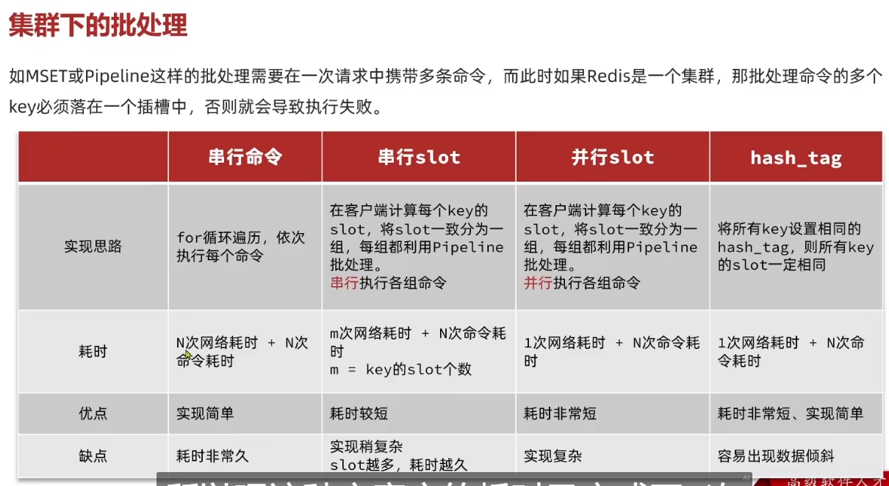

## Redis 键值设计

<br>

### 优雅 Key

Redis 的 Key 虽然可以自定义，但最好遵循下面的几个最佳实践约定：

- 遵循基本格式：`[业务名称]:[数据名]:[id]`
- 长度不超过 44 字节
- 不包含特殊字符

更节省内存： key 是 string 类型，底层编码包含 int、embstr 和 raw 三种。embstr 在小于 44 字节使用，采用连续内存空间，内存占用更小。当字节数大于 44 字节时，会转为 raw 模式存储，在 raw 模式下，内存空间不是连续的，而是采用一个指针指向了另外一段内存空间，在这段空间里存储 SDS 内容，这样空间不连续，访问的时候性能也就会收到影响，还有可能产生内存碎片

<br>

### 请不要使用 BigKey

下面是几个 bigkey 可能存在的场景

- Key 本身的数据量过大：一个 String 类型的 Key，它的值为 5 MB
- Key 中的成员数过多：一个 ZSET 类型的 Key，它的成员数量为 10,000 个
- Key 中成员的数据量过大：一个 Hash 类型的 Key，它的成员数量虽然只有 1,000 个但这些成员的 Value（值）总大小为 100 MB

<br>

#### 检索 bigkey

使用 redis 自带指令检索：`redis-cli -a 密码 --bigkeys`

使用工具：Redis-Rdb-Tools 分析 RDB 快照文件，全面分析内存使用情况

<br>

#### 删除 bigkey

bigkey 本身体积就极大，再去删除的话必定占用线程资源，需要考虑清楚在做

Redis 在 4.0 后提供了异步删除的命令：unlink

<br>

### 合适的数据类型

存储一个对象的最佳方式是使用 Hash  
（但是对应的实现比较复杂）

且 `hash` 的 `entry` 数量超过 500 时，会使用哈希表而不是 ZipList，内存占用较多  
虽然可以使用 `hash-max-ziplist-entries` 配置 entry 上限，但是如果 entry 过多就会导致 BigKey 问题

<br>

解决 entry 过多的问题：

拆分为小的 hash，将 id / 100 作为 key， 将 id % 100 作为 field，这样每 100 个元素为一个 Hash

<br>

## 批处理优化

<br>

### Pipeline

对于批量插入数据的方法（如 MSET），可以直接批量插入

假如数据类型比较复杂，那么推荐改用 pipeline 实现

```java
@Test
void testPipeline() {
    // 创建管道
    Pipeline pipeline = jedis.pipelined();
    long b = System.currentTimeMillis();
    for (int i = 1; i <= 100000; i++) {
        // 放入命令到管道
        pipeline.set("test:key_" + i, "value_" + i);
        if (i % 1000 == 0) {
            // 每放入1000条命令，批量执行
            pipeline.sync();
        }
    }
    long e = System.currentTimeMillis();
    System.out.println("time: " + (e - b));
}
```

<br>

### 集群下的批处理



Spring 集群环境下批处理代码

```java
   @Test
    void testMSetInCluster() {
        Map<String, String> map = new HashMap<>(3);
        map.put("name", "Rose");
        map.put("age", "21");
        map.put("sex", "Female");
        stringRedisTemplate.opsForValue().multiSet(map);


        List<String> strings = stringRedisTemplate.opsForValue().multiGet(Arrays.asList("name", "age", "sex"));
        strings.forEach(System.out::println);

    }
```

代码对应底层原理：

在 RedisAdvancedClusterAsyncCommandsImpl 类中

首先根据 slotHash 算出来一个 partitioned 的 map，map 中的 key 就是 slot，而他的 value 就是对应的对应相同 slot 的 key 对应的数据

<br>

## 服务端优化
