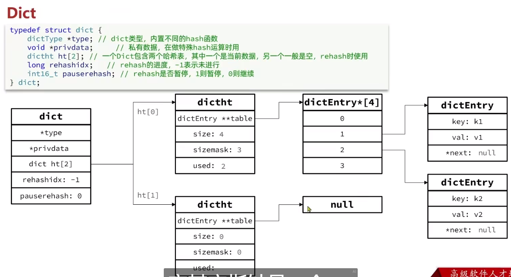
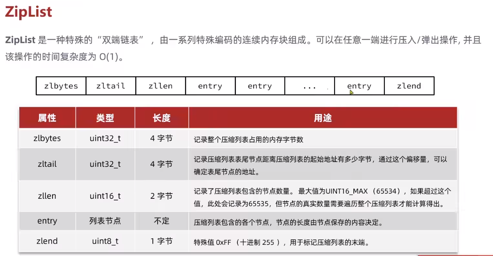
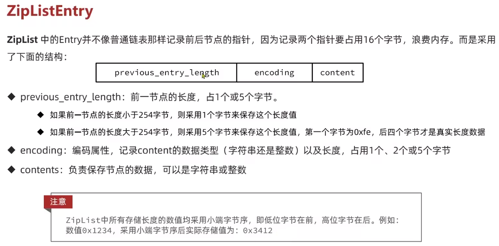

## 数据结构

 

### 动态字符串

Redis 构建了一种新的字符串结构，称为简单动态字符串（Simple Dynamic String），简称 SDS。

SDS 之所以叫做动态字符串，是因为它具备动态扩容的能力  
如果新字符串小于 1M，则新空间为扩展后字符串长度的两倍+1；  
如果新字符串大于 1M，则新空间为扩展后字符串长度+1M+1。称为内存预分配。

 

### Intset

IntSet 是 Redis 中 set 集合的一种实现方式，基于整数数组来实现，并且具备长度可变、有序等特征。

向该其中添加一个数字：50000，这个数字超出了 int16_t 的范围，intset 会自动升级编码方式到合适的大小。以当前案例来说流程如下：

- 升级编码为 INTSET_ENC_INT32, 每个整数占 4 字节，并按照新的编码方式及元素个数扩容数组
- 倒序依次将数组中的元素拷贝到扩容后的正确位置
- 将待添加的元素放入数组末尾
- 最后，将 inset 的 encoding 属性改为 INTSET_ENC_INT32，将 length 属性改为 4

 

### Dict

Dict 由三部分组成，分别是：哈希表（DictHashTable）、哈希节点（DictEntry）、字典（Dict）

当我们向 Dict 添加键值对时，Redis 首先根据 key 计算出 hash 值（h），然后利用 `h & sizemask` 来计算元素应该存储到数组中的哪个索引位置。我们存储 k1=v1，假设 k1 的哈希值 h =1，则 1&3 =1，因此 k1=v1 要存储到数组角标 1 位置。

 

#### hash 扩容

Dict 在每次新增键值对时都会检查负载因子（LoadFactor = used/size） ，满足以下两种情况时会触发哈希表扩容：

哈希表的 `LoadFactor >= 1`，并且服务器没有执行 BGSAVE 或者 BGREWRITEAOF 等后台进程；  
哈希表的 `LoadFactor > 5` ；

Dict 每次删除键值对时，也会对负载因子进行检查，当 `LoadFactor<0.1` 时，哈希表收缩

 

#### rehash

dict 扩容和收缩都会导致重新创建一个 dict ，而 key 的查询与 sizemask 有关。因此必须对哈希表中的每一个 key 重新计算索引，插入新的哈希表，这个过程称为 rehash。过程是这样的：

- 计算新 hash 表的 realeSize，值取决于当前要做的是扩容还是收缩：
- 如果是扩容，则新 size 为第一个大于等于 dict.ht[0].used + 1 的 2^n
- 如果是收缩，则新 size 为第一个大于等于 dict.ht[0].used 的 2^n （不得小于 4）

 

### ZipList

ZipList 是一种特殊的“双端链表” ，由一系列特殊编码的连续内存块组成。可以在任意一端进行压入/弹出操作, 并且该操作的时间复杂度为 O(1)。

 

#### ZipListEntry

ZipList 中的 `Entry` 并不像普通链表那样记录前后节点的指针，而是采用了上文所示的结构

`ZipList` 中所有存储长度的数值均采用小端字节序，即低位字节在前，高位字节在后。例如：数值 0x1234，采用小端字节序后实际存储值为：0x3412

 

#### Encoding 编码

ZipListEntry 中的 encoding 编码分为字符串和整数两种：

字符串：如果 encoding 是以“00”、“01”或者“10”开头，则证明 content 是字符串

整数：如果 encoding 是以“11”开始，则证明 content 是整数，且 encoding 固定只占用 1 个字节

 

#### ZipList 连锁更新问题

场景：比如现在又 N 个连续且长度在 253 的 entry；只要有一个长度大于 254 了，那必然会令 previous_entry_length 扩增为 5 字节，而因为连续存储，挤压后方 entry，导致后方 entry 又不得不更新 previous_entry_length，从而发生一连串的反应

ZipList 这种特殊情况下产生的连续多次空间扩展操作称之为连锁更新（Cascade Update）。新增、删除都可能导致连锁更新的发生。

 

### QuickList

Redis 在 3.2 版本引入了新的数据结构 QuickList，它是一个双端链表，只不过链表中的每个节点都是一个 ZipList。

为了避免 QuickList 中的每个 ZipList 中 entry 过多，Redis 提供了一个配置项：`list-max-ziplist-size` 来限制。
如果值为正，则代表 ZipList 的允许的 entry 个数的最大值  
如果值为负，则代表 ZipList 的最大内存大小，分 5 种情况：

- -1：每个 ZipList 的内存占用不能超过 4kb
- -2：每个 ZipList 的内存占用不能超过 8kb
- -3：每个 ZipList 的内存占用不能超过 16kb
- -4：每个 ZipList 的内存占用不能超过 32kb
- -5：每个 ZipList 的内存占用不能超过 64kb

 

### SkipList

SkipList 的特点：

- 跳跃表是一个双向链表，每个节点都包含 score 和 ele 值
- 节点按照 score 值排序，score 值一样则按照 ele 字典排序
- 每个节点都可以包含多层指针，层数是 1 到 32 之间的随机数
- 不同层指针到下一个节点的跨度不同，层级越高，跨度越大
- 增删改查效率与红黑树基本一致，实现却更简单

 

### RedisObject

从 Redis 内部实现的⾓度来看，database 内的这个映射关系是用⼀个 dict 来维护的；

- dict 的 key 固定用⼀种数据结构来表达就够了，这就是动态字符串 sds
- value 则比较复杂，需要⼀个通⽤的数据结构，就是 redisObject

Redis 中会根据存储的数据类型不同，选择不同的编码方式，共包含 11 种不同类型

 

### String

 

## 网络模型

 

## RESP 结构
