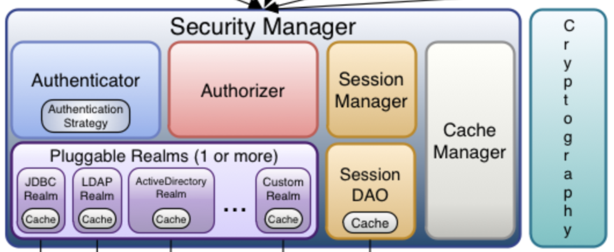
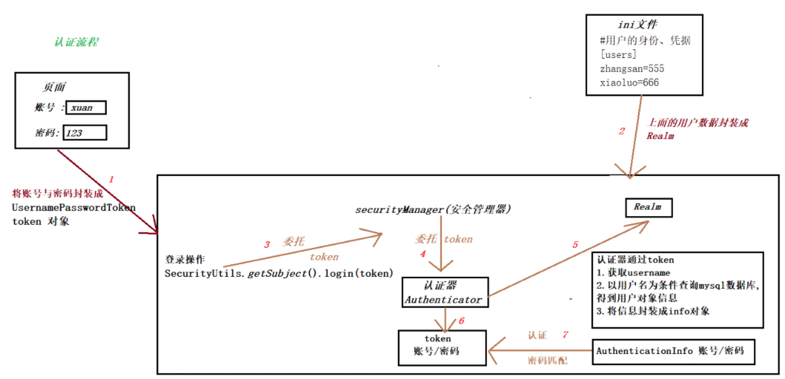

### 登陆验证原理

#### 核心

`Subject` 即主体，subject 记录了当前的操作用户，外部程序通过 subject 进行认证授权

`SecurityManager` 即安全管理器，对全部的 subject 进行安全管理

`Authenticator` 即认证器，对用户身份进行认证

`Authorizer` 即授权器，用户通过认证器认证通过，在访问功能时需要通过授权器判断用户是否有此功能的操作权限

`Realm` 即领域，相当于 datasource 数据源，securityManager 进行安全认证需要通过 Realm 获取用户权限数据

`SessionManager` 即会话管理

`Cryptography` 即密码管理，shiro 提供了一套加密/解密的组件

 

#### 认证信息

Subject 访问系统的用户，主体可以是用户、程序

Principal 身份信息，是主体（subject）进行身份认证的标识，标识必须具有唯一性，如用户名

Credential 凭证信息，是只有主体自己知道的安全信息，如密码、证书

 

#### 完整登陆流程

