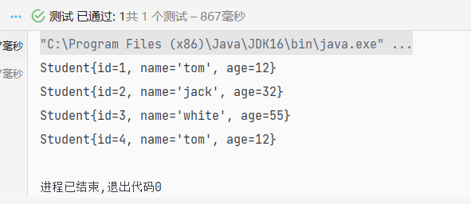

### 快速上手

> 鉴于目前诸多 mybatis 配置博客都讲的模棱两可，这里将就我们可能出现的错误进行细致入微的配置教学！

<br>

#### 完整项目结构

很多博客上来就堆砌代码，连在哪创建文件都只字不提，实在是高明！

此为本快速上手项目的完整目录架构，你最终创建的文件也应该是这样的！


<br>

#### 主体搭建

第一步：配置数据库

建议使用 navicat，可视化操作事务，光速建表方便快捷

我们新建数据库 springboot，其下构建一表 student，其中包含 id，name，age

<br>

第二步：配置实体类 `Student` （位置：com.zhiyiyi.mybatis.pojo）

很简单，直接编写对应数据表内的三个属性即可，别忘了 setter，getter，tostring，construction

```java
package com.zhiyiyi.mybatis.pojo;

public class Student {
    private int id;
    private String name;
    private int age;

    public Student() {
    }

    public Student(int id, String name, int age) {
        this.id = id;
        this.name = name;
        this.age = age;
    }

    @Override
    public String toString() {
        return "Student{" +
                "id=" + id +
                ", name='" + name + '\'' +
                ", age=" + age +
                '}';
    }

    public int getId() {
        return id;
    }

    public void setId(int id) {
        this.id = id;
    }

    public String getName() {
        return name;
    }

    public void setName(String name) {
        this.name = name;
    }

    public int getAge() {
        return age;
    }

    public void setAge(int age) {
        this.age = age;
    }
}

```

<br>

第三步：映射 StudentMapper （位置：com.zhiyiyi.mybatis.mapper）

非常简单，我们只需要查询出 student 表中的每一行的内容就好了

mybatis 的 mapper 类似于 DAO

```java
package com.zhiyiyi.mybatis.mapper;

import com.zhiyiyi.mybatis.pojo.Student;

import java.util.List;

public interface StudentMapper {
    List<Student> getStudents();
}

```

<br>

第四步：工具类 MybatisUtil（位置：com.zhiyiyi.mybatis.utils）

没啥可说的，复制黏贴就好了

```java
package com.zhiyiyi.mybatis.utils;

import org.apache.ibatis.io.Resources;
import org.apache.ibatis.session.SqlSession;
import org.apache.ibatis.session.SqlSessionFactory;
import org.apache.ibatis.session.SqlSessionFactoryBuilder;

import java.io.InputStream;

public class MybatisUtil {
    private static SqlSessionFactory factory;

    static {
        try {
            String source = "mybatis-config.xml";
            InputStream is = Resources.getResourceAsStream(source);
            factory = new SqlSessionFactoryBuilder().build(is);
        } catch (Exception e) {
            e.printStackTrace();
        }
    }

    public static SqlSession getSession() {
        return factory.openSession();
    }
}

```

<br>

#### mybatis 配置

> 到重点了，这里每一步都要仔细做，不然直接前功尽弃！！！

<br>

第一步：新建 mybatis-config.xml （位置：resource）

这是 mybatis 的主配置文件

除了下方注释标出的内容外，其他的你都可以照抄不管！

```xml
<?xml version="1.0" encoding="UTF-8" ?>
<!DOCTYPE configuration
        PUBLIC "-//mybatis.org//DTD Config 3.0//EN"
        "http://mybatis.org/dtd/mybatis-3-config.dtd">
<configuration>

    <environments default="development">
        <environment id="development">
            <transactionManager type="JDBC"/>
            <dataSource type="POOLED">

                <!-- 下面的四个参数请你自行设置，为了链接数据库 -->
                <property name="driver" value="com.mysql.jdbc.Driver"/>
                <property name="url" value="jdbc:mysql://localhost:3306/springboot?useSSL=false&amp;useUnicode=true&amp;characterEncoding=utf8"/>
                <property name="username" value="root"/>
                <property name="password" value="123456"/>

            </dataSource>
        </environment>
    </environments>

    <!-- 请把name中的值设置为你存放映射文件mapper的目录！路径千万仔细不能写错！！！ -->
    <mappers>
        <package name="com.zhiyiyi.mybatis.mapper"/>
    </mappers>
</configuration>
```

<br>

第二步：创建对应映射 xml 文件（位置：com.zhiyiyi.mybatis.mapper）

这里有坑！！！  
我们在创建 com.zhiyiyi.mybatis.mapper 这一连串的嵌套包时千万不要直接一次性创建，请分开来一个个创建  
因为 mapper 没法识别一次性创建的文件夹！

配置的注意事项写在注释里面了

```xml
<?xml version="1.0" encoding="UTF-8" ?>
<!DOCTYPE mapper
        PUBLIC "-//mybatis.org//DTD Mapper 3.0//EN"
        "http://mybatis.org/dtd/mybatis-3-mapper.dtd">

<!-- namespace写我们需要执行映射的mapper.java文件！ -->
<mapper namespace="com.zhiyiyi.mybatis.mapper.StudentMapper">
    <!-- id对应mapper中的方法名称 -->
    <!-- 因为我们查询结果是一堆Student类型的对象，所以resultType需要指定实体类Student -->
    <!-- 别告诉我下面的SQL你看不懂。。。我不解释了 -->
    <select id="getStudents" resultType="com.zhiyiyi.mybatis.pojo.Student">
        select *
        from student;
    </select>
</mapper>
```

<br>

#### 测试！完成！

非常好！我们已经完成了基础 mybatis 的全部配置，现在就是验证能否查询到数据的时刻了

随便创建一个测试类，填入如下代码

```java
import com.zhiyiyi.mybatis.mapper.StudentMapper;
import com.zhiyiyi.mybatis.pojo.Student;
import com.zhiyiyi.mybatis.utils.MybatisUtil;
import org.apache.ibatis.session.SqlSession;
import org.junit.Test;

import java.util.List;

public class MybatisTest {
    @Test
    public void firstMB() {
        SqlSession session = MybatisUtil.getSession();
        StudentMapper studentMapper = session.getMapper(StudentMapper.class);
        List<Student> students = studentMapper.getStudents();

        for (Student student : students) {
            System.out.println(student);
        }

        session.close();
    }
}

```

<br>

从输出内容上看，我们已经完美的取得了数据！



<br>

### MybatisUtil 类分析

```java
public class MybatisUtil {
    private static SqlSessionFactory factory;

    static {
        try {
            // 读取核心配置文件
            String source = "mybatis-config.xml";
            InputStream is = Resources.getResourceAsStream(source);

            // 通过工厂类直接构建sqlsession对象
            factory = new SqlSessionFactoryBuilder().build(is);
        } catch (Exception e) {
            e.printStackTrace();
        }
    }

    // 将openSession设置为true，表示自动提交事务，无需手动提交！
    // 手动提交的话，需要使用commit()方法
    public static SqlSession getSession() {
        return factory.openSession(true);
    }
}
```

<br>
