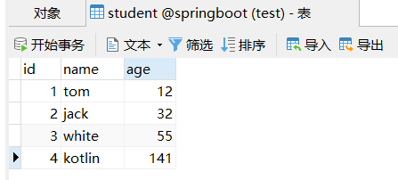

### 速成案例

> 顾名思义，mybatis-plus 就是 mybatis 的增强版，他可以最大化的减少 xml 文件的配置，同时还默认附带了丰富的 CRUD 方法，免得你闲得无聊造轮子叠屎山

<br>

#### 添加测试数据库

这里我们新建一个数据库 springboot

再新建一数据表 student（这里大小写均无所谓）  
特别注意，其中的 id 必须设置为：主键、非 null、自动递增



<br>

之后在新工程的 application.yaml 里面配置我们的数据库信息（看见了吧！不需要再写 mybatis-config.xml 了，很方便）

```yaml
spring:
  datasource:
    driver-class-name: com.mysql.cj.jdbc.Driver
    url: jdbc:mysql://localhost:3306/springboot
    username: root
    password: 123456
```

<br>

#### 依赖

创建 springboot 工程时我们可以自行选择添加依赖，但目前仅支持自动添加 mybatis 依赖而非 mybatis-plus，所以我们需要手动处理

> 工件 ID 必须写对！！！写错了代码出问题我可不管！！！

```xml
<!-- mybatis-plus -->
<dependency>
    <groupId>com.baomidou</groupId>
    <artifactId>mybatis-plus-boot-starter</artifactId>
    <version>3.4.2</version>
</dependency>

<!-- 别忘了mysql -->
<dependency>
    <groupId>com.mysql</groupId>
    <artifactId>mysql-connector-j</artifactId>
    <scope>runtime</scope>
</dependency>
```

为了减少 getter 和 setter 的冗余编写过程，请导入 lombok 依赖

```xml
<dependency>
    <groupId>org.projectlombok</groupId>
    <artifactId>lombok</artifactId>
    <optional>true</optional>
</dependency>
```

<br>

#### 配置 DAO 与实体类

> 假定我们的根目录文件夹为 com.zhiyiyi.mainbody

根目录下新建实体类 `entity/Student.java`

使用 lombok 的注解 @Data，迅速为实体类添加 getter、setter、tostring 方法

`@TableId(value = "id", type = IdType.AUTO)` 表示设定该属性为自增长类型的，意味着我们无需再实体类的构造方法中设置此属性，他会自己适配数据表！！！

```java
package com.zhiyiyi.mainbody.entity;

import com.baomidou.mybatisplus.annotation.IdType;
import com.baomidou.mybatisplus.annotation.TableId;
import lombok.Data;
@Data
public class Student {
    @TableId(value = "id", type = IdType.AUTO)
    private Integer id;
    private String name;
    private Integer age;

    public Student() {
    }

    public Student(String name, Integer age) {
        this.name = name;
        this.age = age;
    }
}
```

<br>

在根目录下新建文件 `dao/StudentMapper.java`

接口极其简单，甚至连方法都没有，我们仅需要让其继承 BaseMapper 即可

```java
package com.zhiyiyi.mainbody.dao;

import com.baomidou.mybatisplus.core.mapper.BaseMapper;
import com.zhiyiyi.mainbody.entity.Student;

public interface StudentMapper extends BaseMapper<Student> {

}

```

#### 扫描 mapper

我们需要在主入口添加注解 `MapperScan` 对 dao 文件夹下的所有 mapper 进行扫描

扫描的作用是为了避免给每一个 mapper 添加 `@Mapper` 注解！

```java
package com.zhiyiyi.mainbody;

import org.mybatis.spring.annotation.MapperScan;
import org.springframework.boot.SpringApplication;
import org.springframework.boot.autoconfigure.SpringBootApplication;

@SpringBootApplication

// 扫描dao文件夹下的所有mapper
@MapperScan(value = "com.zhiyiyi.mainbody.dao")

public class MainbodyApplication {

    public static void main(String[] args) {
        SpringApplication.run(MainbodyApplication.class, args);
    }

}
```

<br>

#### 开始测试！！！

我们让 StudentMapper 直接继承了 `BaseMapper` ，故该接口已经为我们提供了完好的 CRUD 方法，如下方代码所示，我们直接拿 insert 方法用就 OK 了！

用之前记得 `@Autowire`d 导入 mapper

```java
package com.zhiyiyi.mainbody;

import com.zhiyiyi.mainbody.dao.StudentMapper;
import com.zhiyiyi.mainbody.entity.Student;
import org.junit.jupiter.api.Test;
import org.springframework.beans.factory.annotation.Autowired;
import org.springframework.boot.test.context.SpringBootTest;

@SpringBootTest
class MainbodyApplicationTests {

    @Test
    void contextLoads() {
    }

    // 导入mapper
    @Autowired
    private StudentMapper dao;

    @Test
    public void mpt1() {
        Student student = new Student("kotlin", 141);
        int rows = dao.insert(student);
        System.out.println(rows);
    }

}
```
