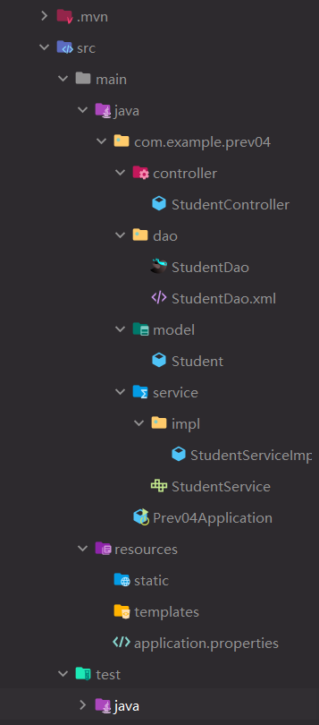

### 基础查询与业务结构

#### 整体业务结构



<br>

#### 代码分析

配置文件 `application.properties`

设置数据库链接四要素，这里不赘述

```
server.port=10086
server.servlet.context-path=/orm
spring.datasource.driver-class-name=com.mysql.cj.jdbc.Driver
spring.datasource.url=jdbc:mysql://localhost:3306/springboot
spring.datasource.username=root
spring.datasource.password=123456
```

<br>

构建 `model`，具体的 getter、setter、tostring 方法请自主生成

代码清单 model/student.java

```java
package com.example.prev04.model;

public class Student {
    private Integer id;
    private String name;
}
```

<br>

代码清单 studentdao.java

请注意要添加 `@Mapper` 头，否则无法识别 mapper

```java
package com.example.prev04.dao;

import com.example.prev04.model.Student;
import org.apache.ibatis.annotations.Mapper;
import org.apache.ibatis.annotations.Param;

@Mapper
public interface StudentDao {
    Student selectById(@Param("stuId") Integer id);
}

```

<br>

代码清单 studentdao.xml

```xml
<?xml version="1.0" encoding="UTF-8" ?>
<!DOCTYPE mapper
        PUBLIC "-//mybatis.org//DTD Mapper 3.0//EN"
        "http://mybatis.org/dtd/mybatis-3-mapper.dtd">
<mapper namespace="com.example.prev04.dao.StudentDao">
    <select id="selectById" resultType="com.example.prev04.model.Student">
        select id, name, age
        from student
        where id = #{stuId}
    </select>
</mapper>
```

<br>

代码清单 `StudentController.java`

```java
package com.example.prev04.controller;

import com.example.prev04.model.Student;
import com.example.prev04.service.StudentService;
import org.springframework.stereotype.Controller;
import org.springframework.web.bind.annotation.RequestMapping;
import org.springframework.web.bind.annotation.ResponseBody;

import javax.annotation.Resource;

@Controller
public class StudentController {
    @Resource
    private StudentService service;

    @RequestMapping("/student/query")
    @ResponseBody
    public String queryStudent(Integer id) {
        Student student = service.queryStudent(id);
        return student.toString();
    }
}
```

<br>

代码清单，构建服务接口 `StudentService.java`

```java
package com.example.prev04.service;

import com.example.prev04.model.Student;

public interface StudentService {
    Student queryStudent(Integer id);
}

```

<br>

代码清单，接口实现类 `StudentServiceImpl.java`

```java
package com.example.prev04.service.impl;

import com.example.prev04.dao.StudentDao;
import com.example.prev04.model.Student;
import com.example.prev04.service.StudentService;
import org.springframework.stereotype.Service;

import javax.annotation.Resource;

@Service
public class StudentServiceImpl implements StudentService {

    @Resource
    private StudentDao studentDao;

    @Override
    public Student queryStudent(Integer id) {
        Student student = studentDao.selectById(id);
        return student;
    }
}

```

<br>

> 主入口不需要动，直接输入即可

<br>

###
