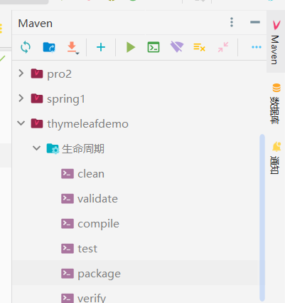

### 完整流程

第一步：打开 IDEA，进入我们欲编译的项目

 

第二步：点击右侧 MAVEN 管理器，找到我们的项目（这里我选择的项目是 thymeleafdemo）  
找到：生命周期->package  
此时双击 package 即可立即开始打包！

 

第三步：在项目文件夹的 `target` 文件夹下，找到我们打包好的 `jar` 包，取出来  
运行命令行 `java -jar xxx.jar` 即可将我们的服务器跑起来了！

 

### 避坑与注意事项

#### 端口被占用

管理员权限下，执行 `netstat -ano |findstr "被占用的端口名"` 找到该端口的 PID

然后杀掉他！ `taskkill -f -t -pid 端口的PID`

 

#### server.port 失效

可能是你打包成了 war 包而非 jar 包的缘故，war 包默认使用 tomcat 服务器执行，而 tomcat 默认端口 8080,会直接无视掉你自定义的端口

 
