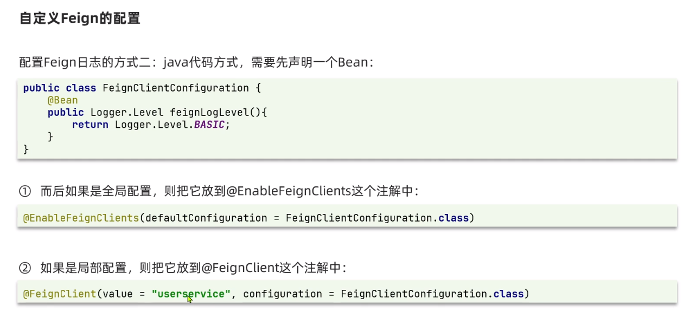

## 远程服务调用

<br>

### RestTemplate

`RestTemplate` 可以模拟客户端来向另外一个后端执行请求

黑马给出的微服务项目中，有两个 boot 项目，分别是 order 与 user

我们想要在 order 中的 service 阶段对 user 给出的接口执行请求，此时就需要 RestTemplate 来进行解决

<br>

首先需要在 OrderApplication，也就是项目入口点注册一个全局的 RestTemplate  
后续可以使用自动装配直接调用该对象

```java
@MapperScan("cn.itcast.order.mapper")
@SpringBootApplication
public class OrderApplication {

    public static void main(String[] args) {
        SpringApplication.run(OrderApplication.class, args);
    }

    @Bean
    public RestTemplate restTemplate() {
        return new RestTemplate();
    }
}
```

<br>

修改 `OrderService` 的代码，借助 `RestTemplate` 请求拿到 user 后，存储到对应的 orde 对象中去

```java
@Service
public class OrderService {

    @Autowired
    private OrderMapper orderMapper;

    // 自动装配引入resttemplate
    @Autowired
    private RestTemplate restTemplate;

    public Order queryOrderById(Long orderId) {
        // 1.查询订单
        Order order = orderMapper.findById(orderId);

        // 设置后端服务器请求的URL
        String url = "http://localhost:10087/user/" + order.getUserId();
        // 请求后端服务器
        User forObject = restTemplate.getForObject(url, User.class);
        // 将请求结果保存到现有的order对象中去
        order.setUser(forObject);

        // 4.返回
        return order;
    }
}
```

<br>

## Eureka

<br>

### 简要概念

服务调用关系

- 服务提供者：暴露接口给其他微服务调用
- 服务消费者：使用其他微服务提供的接口
- 提供者和消费者角色是相对的，一个对象可以同时兼具这两种状态

<br>


Eureka 完整工作流程图及其简要步骤

Eureka 由两部分组成：`Eureka-server` 与 `Eureka-client`
Eureka-client 又可划分为两个类别：服务消费者（consumer）与服务提供者（provider）

工作流程：

1. 服务提供者 URL 发送给注册中心进行注册
2. 注册中心来者不拒，一一把服务提供者的 URL 记录到表内
3. 服务消费者从注册中心获取对应提供者 URL，进行接口请求
4. 每隔 30s，服务提供者就会向注册中心发送心跳包来证明自己活着，否则隔一段时间不发的话就会被注册中心删除
5. 服务消费者具备负载均衡的能力，可以选择最适合的那一个后端服务执行请求

<br>

### 配置 Eureka 环境

> 注意，请确保所有项目的编译环境均为 JDK1.8，千万不要拉的太高，不然直接编译错误恶心死你，实测 17 及以上 JDK 直接崩溃

新建空的 maven 项目

pom 添加 eureka 依赖

```xml
<dependencies>
    <dependency>
        <groupId>org.springframework.cloud</groupId>
        <artifactId>spring-cloud-starter-netflix-eureka-server</artifactId>
    </dependency>
</dependencies>
```

配置入口文件

代码清单：`EurekaApplication.java`

```java
@EnableEurekaServer
@SpringBootApplication
public class EurekaApplication {
    public static void main(String[] args) {
        SpringApplication.run(EurekaApplication.class,args);
    }
}
```

编写配置文件（配置文件直接放到 resource 文件夹下面）

特别注意！！！配置项 `defaultZone` 必须是以小驼峰的形式书写，不能写成蛇形 `default-zone` 否则永远运行不了！！！

代码清单：`application.yaml`

```yaml
# eureka服务器执行的端口
server:
  port: 10001

# spring名称
spring:
  application:
    name: eurekaserver

# 设置eureka服务器的可视化管理平台的默认URL
eureka:
  client:
    service-url:
      defaultZone: http://localhost:10001/eureka
```

<br>

打开控制面板：`http://localhost:10001/`  
即可看到下方的效果


<br>

### 设置 Eureka Client

随意选择一个 springboot 项目（版本 2.7.15 及以下）

pom 内添加 `eureka-client` 依赖

```xml
<dependency>
    <groupId>org.springframework.cloud</groupId>
    <artifactId>spring-cloud-starter-netflix-eureka-client</artifactId>
</dependency>
```

和设置 `eureka-server` 不同的是，我们无需再为入口文件顶部添加注解 `@EnableEurekaClient`，因为目前对于高版本 springboot 来说，eureka 已经自动帮我们完成了这一步骤，我们仅需设置配置文件就可以了！

配置文件设置好 spring 的名称，以及 eureka 配置即可

```yaml
server:
  port: 10087

spring:
  application:
    name: userserver

eureka:
  client:
    # 同样的，这里指向的是我们eureka-server的地址！
    service-url:
      defaultZone: http://127.0.0.1:10001/eureka
```

<br>

此时先重新构建 `eureka-server`，然后再构建当前项目，打开控制面板，即可看见目前存在了两个 `eureka-client`

<br>

### Eureka 服务发现

之前设置的远程服务调用 RestTemplate，是直接使用了硬编码，把 URL 写死了，现在我们配置好了 Eureka 服务器，那就可以使用负载均衡的原理，直接调用对应的后端服务器

打开 `OrderApplication.java` ，为对应的 RestTemplate 添加负载均衡注解

```java
@Bean
@LoadBalanced
public RestTemplate restTemplate() {
    return new RestTemplate();
}
```

然后修改之前的硬编码为我们设置的`服务提供者 user-server`对应的 URL 即可

```java
String url = "http://user-server/user/" + order.getUserId();
```

> 与此同时，这就完成了一个完整的 Eureka 工作流程
>
> 1. user-server 发送服务到注册中心 eureka-server
> 2. order-server 从注册中心发现服务，并取回使用

<br>

## Ribbon

<br>

### 工作流程


在配置完毕 eureka 后，我们发现，虽然可以在代码中使用诸如 `http://user-server/user/xxx` 的形式来访问到对应的后端服务器，但是当我们直接把这段 URL 填入浏览器时，发现无法访问

而 Ribbon 的作用，简单来说，就是帮助我们把浏览器 URL 转义为对应的地址，让我们顺利访问到后端服务器（有点 DNS 那味了）

上图展示了 Ribbon 工作的基本流程

1. 获取原始 URL，从中提取出 eureka-client 的 id
2. 以此 id 请求 eureka-server，拿到所有相关的服务器原地址
3. 借助 ribbon 负载均衡措施，选择一个地址并使用
4. 转译该地址，返回

<br>

### 配置与使用 Ribbon


上图给出了可供选择的 Ribbon 负载均衡策略

<br>

Ribbon 自身通过接口 IRule 来自定义对应的负载均衡策略

在 `OrderApplication.java` 随便注入一个规则

```java
@Bean
public IRule randomRule() {
    return new RandomRule();
}
```

> 定义负载均衡的方式也可以直接写在配置文件里面，这里不做演示，还是建议写在入口类，更加直观

> 入口类定义 IRule：全局作用；配置文件定义 IRule：局部作用

<br>

### 饥饿加载

ribbon 默认使用懒加载，所以当首次启用负载均衡时，会浪费很多时间实例化对象

在配置文件里面设置 ribbon 为饥饿式加载方法

```yaml
ribbon:
  eager-load:
    # 当需要对多个eureka-client实现同类型加载方式的话，使用数组的写法
    clients:
      - user-server
      - order-server
    enabled: true
```

<br>

## Nacos

<br>

### 下载 Nacos 并运行

首先下载对应的 release 包，主要要选择已经打包编译好的 nacos-server 文件！
https://github.com/alibaba/nacos/releases/tag/1.4.1

将其解压到任意一个不包含中文路径的文件夹下  
进入 bin，在此文件夹下打开命令行，输入 `startup.cmd -m standalone` 即可开启 nacos 服务器

默认服务器端口 8848，上述指令的`standalone`表示为单体，非集群模式

<br>

等待命令行运行一段时间后，进入 nacos 给出的 URL：`http://192.168.113.1:8848/nacos/index.html`

可见这是一个管理界面，用户名和密码默认都是 `nacos` 登录进去即可

<br>

### 配置 Nacos

由于我们目前的项目设置是父子类型，首先需要在父项目 pom 导入 alibaba 工具库

```xml
<dependency>
    <groupId>com.alibaba.cloud</groupId>
    <artifactId>spring-cloud-alibaba-dependencies</artifactId>
    <version>2.2.5.RELEASE</version>
    <type>pom</type>
    <scope>import</scope>
</dependency>
```

再在各自的 server 内导入 nacos-discovery 依赖

```xml
<dependency>
    <groupId>com.alibaba.cloud</groupId>
    <artifactId>spring-cloud-starter-alibaba-nacos-discovery</artifactId>
</dependency>
```

<br>

非常简单吧？

最后仅需在配置文件内设置好 nacos 服务器的地址即可  
和 eureka 不一样的是，这里的注册中心实际上就是我们刚刚运行的 nacos 服务器，所以无需额外创建项目来跑服务器了

配置文件书写 `application.yaml` ：

```yaml
spring:
  cloud:
    nacos:
      server-addr: localhost:8848
```

<br>

重新构建对应模块

回到 nacos 控制面板，就可以看见我们生成的服务器啦！


### Nacos 集群


单个实例集中在一起构成一个集群

集群通常用于容灾机制

同一集群内的实例会先行访问当前集群内的其他本地实例，如果实在没办法才去找其他集群中的实例

<br>

为实例设置集群的方式很简单，只需要在配置文件添加下面的代码即可将其划入一个集群内

```yaml
spring:
  cloud:
    nacos:
      server-addr: localhost:8848

      # 设置集群名称，将这个实例归为集群SH管理
      discovery:
        cluster-name: SH
```

<br>

### Nacos 负载均衡

假设现在有这样的状况：

1. 服务提供方拥有 3 个实例，两个集群（BJ、NJ）
2. 服务消费方只有 1 个实例，一个集群（BJ）

可见消费方的集群和提供方中的一个集群是一致的，所以按照常理来说我们希望消费方直接从同一集群下的提供方拿取数据

<br>

但由于 nacos 默认采用轮询的方式实现负载均衡，此时必须修改默认配置才可以实现最终效果

方案一：在 applcation.yaml 配置 ribbon，指定负载均衡采用的方法

```yaml
service-consumer:
  ribbon:
    NFLoadBalancerRuleClassName: com.alibaba.cloud.nacos.ribbon.NacosRule
```

方案二：在入口类中使用注入的方式来配置

```java
@Bean
NacosRule nacosRule() {
    return new NacosRule();
}
```

<br>

负载均衡权重值设定

1. 实例权重为 0 时，他将永远不会被访问
2. 权重值范围 0-1
3. 同集群内的多个实例，权重高的被访问频率变高

<br>

### Nacos 环境隔离

nacos 提供了环境隔离选项  
从外到内，环境由大变小依次为：`命名空间->分组->服务->实例`

我们先去 nacos 控制面板的“命名空间”模块随意添加一个名叫`dev`的命名空间，并复制一下自动生成的 ID

找到任意一个服务器的配置文件，使用 namespace 字段来将这个服务器归为某个命名空间

```yaml
spring:
  cloud:
    nacos:
      server-addr: localhost:8848
      discovery:
        cluster-name: BJ

        # 设置改服务器所处的命名空间
        # 这里需要填入我们之前记下来的命名空间ID
        namespace: 1688ddc5-4f48-4bdc-bb5b-8c5363edf242
```

<br>

配置完毕，重启服务器

进入 nacos 控制台的 `服务管理->服务列表`  
然后可以点击上方的导航条来切换命名空间

下图我们切换到了新建的 dev 命名空间，可见我们配置的 user-server 已经归为此命名空间管辖


<br>

### Nacos 注册细节


服务器提供者可以向注册中心注册时选择两种状态

1. 临时实例状态
2. 非临时实例状态

临时实例需要主动向注册中心发送定时的心跳包来证明自己活着，否则超时了就会被注册中心剔除

非临时实例无需主动发包，而是由注册中心确认其是否活着，他会一直留着而不会因为超时等情况自己删除

> nacos 集群默认使用 AP 模式，当存在非临时实例时转用 CP 模式

<br>

配置文件内使用 `ephemeral` 字段来标记该服务器是否为临时实例

```yaml
spring:
  cloud:
    nacos:
      server-addr: localhost:8848
      discovery:
        cluster-name: BJ
        namespace: 1688ddc5-4f48-4bdc-bb5b-8c5363edf242

        # 设置是否为临时实例
        ephemeral: false
```

<br>

### Nacos 更多配置项

#### 快速上手

> nacos 提供了云端设置配置文件，我们只需要在 nacos 中新建配置文件并写入需要执行热更新的配置项，然后再 springboot 应用的 bootstrap.yaml 内调用该配置即可，

新建配置文件，配置文件 ID 书写格式为：`<服务器名>-<类型>.yaml`  
目前配置文件支持 yaml 和 properties 格式

这里的“服务器名”一定要和 springboot 中的 application 定义的 name 完全一致，才可以启用该配置项


<br>

为 user-server 添加 nacos-config 依赖，以便开启依赖项

```xml
<dependency>
    <groupId>com.alibaba.cloud</groupId>
    <artifactId>spring-cloud-starter-alibaba-nacos-config</artifactId>
</dependency>
```

添加 nacos-config 后，在 resource 文件夹下新建配置文件 `bootstrap.yaml` ，此时当 springboot 启动时，首先读取该配置文件，之后才读取 `application.yaml`

```yaml
spring:
  # 服务器名称
  application:
    name: userservice
  # 服务器类型（我们之前定义为dev，这里必须写dev）
  profiles:
    active: dev

  # 其他关键性配置
  cloud:
    nacos:
      server-addr: localhost:8848
      config:
        # 设置bootstrap配置文件的后缀名
        file-extension: yaml
      discovery:
        cluster-name: BJ
        namespace: 1688ddc5-4f48-4bdc-bb5b-8c5363edf242
        ephemeral: false
```

<br>

之后来到 `UserController.java` 拉取配置文件信息

```java
@Slf4j
@RestController
@RequestMapping("/user")
public class UserController {

    @Value("${pattern.dataformat}")
    private String dataFormat;

    @GetMapping("/now")
    public String now() {
        // 由于我们之前在nacos中设置的配置项配置了pattern属性，这里就可以直接调用对应的属性完成时间格式化了
        return LocalDateTime.now().format(DateTimeFormatter.ofPattern(dataFormat));
    }
}
```

<br>

#### 自动更新

直接在 nacos 中使用配置文件的好处是可以实时实现热更新，而不像是在项目中设置 `application.yaml` 后还要在重启一次

我们仅需在使用了 nacos 配置文件的 bean 内添加注解 `@RefreshScope` 即可

```java
@Slf4j
@RestController
@RequestMapping("/user")
@RefreshScope // 添加检测配置文件更新的注解
public class UserController {}
```

<br>

或者你可以创建一个自定义的配置类还动态获取指定配置

```java
@Component
@Data
@ConfigurationProperties(prefix = "pattern")
public class PatternProperties {
    private String dataFormat;
}
```

<br>

我们可以专门配置指定运行环境（比如 dev）的配置文件：`userservice-dev.yaml`  
或者定义服务器全局（所有环境通用）的配置文件：`userservice.yaml`

配置文件之间的优先级：带环境参数的配置文件>全局配置文件>application.yaml

<br>

## Feign

<br>

### 取代 RestTemplate

相比于 resttemplate 低效的字符串拼接，feign 提供了接口操作的形式，让我们更加直观的连接到对应的服务器提供者

首先引入依赖

```xml
<dependency>
    <groupId>org.springframework.cloud</groupId>
    <artifactId>spring-cloud-starter-openfeign</artifactId>
</dependency>
```

务必记住在入口类中开启 feign 客户端

```java
@MapperScan("cn.itcast.order.mapper")
@SpringBootApplication
@EnableFeignClients // 开启feign客户端
public class OrderApplication {}
```

<br>

创建一个接口类，用于获取服务器提供者的接口

代码清单：`clients/UserClient.java`

```java
// 注解内填入需要链接到的服务器名称
@FeignClient("userservice")
public interface UserClient {
    // 表示使用GET请求获取数据
    @GetMapping("/user/{id}")
    // 同理PathVariable用来填补上方路径中的id占位符
    User findById(@PathVariable("id") Long id);
}
```

最终在 service 重写查询逻辑

```java
@Service
public class OrderService {

    @Autowired
    private OrderMapper orderMapper;

    @Autowired
    private UserClient userClient;

    public Order queryOrderById(Long orderId) {
        // 查询订单
        Order order = orderMapper.findById(orderId);
        // feign客户端请求user数据库中内容
        User user = userClient.findById(order.getUserId());
        order.setUser(user);
        return order;
    }
}
```

> 运行 orderservice 之后，浏览器输入 `http://localhost:10087/order/101` 即可获取对应的数据了！实际上你看出来的效果和 resttemplate 差不多

<br>

### Feign 自定义配置

配置日志输出级别

全局配置

```yaml
feign:
  client:
    config:
      default:
        loggerLevel: FULL
```

局部配置（明确指出服务器名称）

```yaml
feign:
  client:
    config:
      userservice:
        loggerLevel: FULL
```

<br>

或者你可以使用代码的方式来书写



<br>

### 性能优化

借助 URLConnection 连接池来取代原本的单链接，可以提升 feign 客户端的效率

导入 feign-httpclient 坐标

```xml
<dependency>
    <groupId>io.github.openfeign</groupId>
    <artifactId>feign-httpclient</artifactId>
</dependency>
```

之后配置文件配置好属性即可

```yaml
feign:
  client:
    config:
      default:
        # 日志级别最好使用BASIC或者NONE，其他的级别比较耗费性能而且基本用不上
        loggerLevel: BASIC
  httpclient:
    enabled: true
    max-connections: 200
    max-connections-per-route: 50
```

<br>

## Gateway

<br>

### WebFlux

> gateway 基于 webflux 构建

WebFlux 是基于反应式流概念的响应式编程框架，用于构建异步非阻塞的 Web 应用程序。它支持响应式编程范式，并提供了一种响应式的方式来处理 Web 请求。

与传统的 Servlet API 相比，WebFlux 采用了基于事件驱动的编程模型，不依赖于传统的线程池模型。它使用少量的线程来处理大量的请求，通过异步非阻塞的方式实现高吞吐量和低延迟。

<br>

WebFlux 提供了两种编程模型：

1. 响应式 Web 客户端：用于发送 HTTP 请求并处理响应。它基于 Reactor 提供了一组操作符和方法，可以以声明式的方式组装和处理 HTTP 请求，支持异步和流式处理。
2. 响应式 Web 服务器：提供了一个响应式的 Web 服务器，用于处理传入的 HTTP 请求并生成响应。它基于 Reactor 提供了一组用于处理请求和生成响应的 API，支持异步非阻塞的处理方式。可以使用注解或函数式编程的方式定义请求处理器，处理器可以返回一个单独的响应，也可以返回一个表示响应流的 Publisher 对象。

<br>

### 网关基本配置

> Gateway 是一个在系统架构中充当入口点的服务器，它接收来自客户端的请求并将其转发到后端的服务。网关的作用是在客户端和后端服务之间建立一个中间层，用于路由请求等

新建 maven 项目 gateway

pom 添加 gateway 坐标以及负载均衡坐标

```xml
<!--gateway网关依赖-->
<dependency>
    <groupId>org.springframework.cloud</groupId>
    <artifactId>spring-cloud-starter-gateway</artifactId>
</dependency>

<!--loadbalancer负载均衡，对于高版本springboot需要额外添加此以来-->
<dependency>
    <groupId>org.springframework.cloud</groupId>
    <artifactId>spring-cloud-starter-loadbalancer</artifactId>
</dependency>
```

编写入口文件 `GatewayApplication.java`

```java
@SpringBootApplication
public class GatewayApplication {
    public static void main(String[] args) {
        SpringApplication.run(GatewayApplication.class, args);
    }
}
```

进行网关配置

routes 用于设置转发路由，他是一个数组，表示你可以设置多个转发规则，但是各个转发规则的 id 不可以重复

```yaml
server:
  port: 2333

spring:
  application:
    name: gateway
  cloud:
    nacos:
      server-addr: localhost:8848

    # 配置gateway
    gateway:
      # 数组方式配置路由转发
      routes:
        # 转发id，名字随便取，但是不可以重复
        - id: user-service
          # 被转发的URI，格式：lb://<被转发的服务器名>
          uri: lb://userservice
          # 断言规则
          predicates:
            # 当请求路径是 /user/** 格式的，自动转发到指定服务器
            - Path=/user/**
        # 这是另一组被转发的服务器
        - id: order-service
          uri: lb://orderservice
          predicates:
            - Path=/order/**
```

<br>

### 过滤器与断言工厂

predicates 断言配置属性可以使用以下 11 种


<br>

使用 filters 添加过滤器

下面为每个 user 请求都添加了一个名为“Truth”的请求头

```yaml
gateway:
  routes:
    - id: user-service
      uri: lb://userservice
      predicates:
        - Path=/user/**

      # 设置过滤器
      filters:
        # 添加请求头，格式：[请求头名称],[请求头内容]
        - AddRequestHeader=Truth,shit oh my gods!
```

如果你想一劳永逸的话，可以使用 defaultFilters 为全部路由设置请求头

```yaml
gateway:
  routes:
    - id: user-service
      uri: lb://userservice
      predicates:
        - Path=/user/**
    - id: order-service
      uri: lb://orderservice
      predicates:
        - Path=/order/**

  # 默认所有路由都有此路由器
  default-filters:
    - AddRequestHeader=Truth,shit oh my gods!
```

<br>

### 全局过滤器

全局过滤器对所有路由转发同时生效

实现该过滤器需要两步：

1. 实现 `GlobalFilter`
2. 借助注解 `@Order` 设置过滤器优先级

```java
// order设置-1表示最高优先级
@Order(-1)
@Component
public class AuthFilter implements GlobalFilter {
    @Override
    public Mono<Void> filter(ServerWebExchange exchange, GatewayFilterChain chain) {
        // 取出参数并对参数进行校验
        ServerHttpRequest request = exchange.getRequest();
        MultiValueMap<String, String> params = request.getQueryParams();
        String auth = params.getFirst("authorization");

        // 检查授权参数是否为 "admin"
        if ("admin".equals(auth)) {
            // 授权通过，继续传递请求到下一个过滤器或后端服务
            return chain.filter(exchange);
        }

        // 授权失败，设置响应状态为 401 未授权
        exchange.getResponse().setStatusCode(HttpStatus.UNAUTHORIZED);

        // 设置响应为完成状态，结束请求-响应的处理
        return exchange.getResponse().setComplete();
    }
}
```

<br>

三大过滤器：路由过滤器、defaultFilter、GlobalFilter 执行优先级以及顺序


<br>

### 跨域处理 CORS


<br>

## RabbitMQ

<br>

### 安装 rabbitmq

首先确保自己已经安装好了 docker

是 docker 拉取镜像文件：`docker pull rabbitmq:3-management`

拉取完毕，打开容器

```sh
docker run \
 -e RABBITMQ_DEFAULT_USER=itcast \
 -e RABBITMQ_DEFAULT_PASS=123321 \
 --name mq \
 --hostname mq1 \
 -p 15672:15672 \
 -p 5672:5672 \
 -d \
 rabbitmq:3-management
```

<br>

浏览器访问虚拟机的 15672 端口，即可看见 rabbitmq 管理界面


我们可以在 admin 选项卡内添加新的用户

其中的`can access virtual hosts`表示当前用户对应的虚拟主机  
建议不同用户对应不同的虚拟主机，可以实现隔离效果

虚拟主机可以点击上图右侧的 `virtual hosts` 按钮新建

<br>

### SpringAMQP 基础队列

由于使用官方原生操作 rabbitmq 的方式太过生草，代码巨多，不适合日常开发，推荐改用 SpringAMQP 来简化操作

导入坐标

```xml
<dependency>
    <groupId>org.projectlombok</groupId>
    <artifactId>lombok</artifactId>
</dependency>
<!--AMQP依赖，包含RabbitMQ-->
<dependency>
    <groupId>org.springframework.boot</groupId>
    <artifactId>spring-boot-starter-amqp</artifactId>
</dependency>
<!--单元测试-->
<dependency>
    <groupId>org.springframework.boot</groupId>
    <artifactId>spring-boot-starter-test</artifactId>
</dependency>
<dependency>
    <groupId>com.fasterxml.jackson.core</groupId>
    <artifactId>jackson-databind</artifactId>
</dependency>
```

配置 rabbitmq 链接

```yaml
logging:
  pattern:
    dateformat: MM-dd HH:mm:ss:SSS
spring:
  rabbitmq:
    host: 192.168.113.146 # rabbitMQ的ip地址
    port: 5672 # 端口
    username: itcast
    password: 123321
    virtual-host: /
```

<br>

publisher 编写测试类测试 AMQP

由于我们的 rabbitmq 默认没有创建队列 `simple.queue` 所以你直接发送是接收不到任何信息的，必须要先进行判断，如果队列不存在那就先创建对应队列后在发送，才可以接受得到！

```java
@Test
public void testSendMessage2SimpleQueue() {
  RabbitAdmin admin = new RabbitAdmin(rabbitTemplate);
  String queueName = "simple.queue";
  String message = "hello, spring amqp!";

  // 队列是否存在的判断
  if (Objects.isNull(admin.getQueueProperties(queueName))) {
      Queue queue = new Queue(queueName);
      admin.declareQueue(queue);
  }

  // 发送消息到消息队列
  rabbitTemplate.convertAndSend(queueName, message);
}
```

> 不出意外的话，你在 rabbitmq 控制台的 queue 选项内，就可以看见新创建的 simple.queue 队列，里面包含着我们发送的第一条信息

<br>

consumer 消费对应队列中的消息

监听之前也要和 publisher 配置相同的 application.yaml，这样才可以连接到 rabbitmq

新建监听消费类 `SpringRabbitListener` ，传入如下代码执行监听

```java
@Component
public class SpringRabbitListener {
  // 设置消费者需要监听的队列
  @RabbitListener(queues = "simple.queue")
  public void listenWorkQueue1(String msg) throws InterruptedException {
    // 获取队列中信息
      System.out.println("消费者1接收到消息：【" + msg + "】" + LocalTime.now());
      Thread.sleep(20);
  }
}
```

<br>

### WorkQueue


上图展示了工作队列的流程图，实际上就是增加了一个消费者来消费队列中的消息

由于我们上一节已经创建了 simple.queue，这里就不用判断了，直接往里面每隔 20ms 插入一条信息

```java
@Test
public void testSendMessage2WorkQueue() throws InterruptedException {
  String queueName = "simple.queue";
  String message = "hello, message__";
  for (int i = 1; i <= 50; i++) {
      rabbitTemplate.convertAndSend(queueName, message + i);
      Thread.sleep(20);
  }
}
```

同理，按照流程图指示，为设置两个消费者监听器  
注意！第一个消费者每隔 20ms 接受一次消息，而第二个消费者则是每隔 200ms 接收一次

```java
@RabbitListener(queues = "simple.queue")
public void listenWorkQueue1(String msg) throws InterruptedException {
    System.out.println("消费者1接收到消息：【" + msg + "】" + LocalTime.now());
    Thread.sleep(20);
}

@RabbitListener(queues = "simple.queue")
public void listenWorkQueue2(String msg) throws InterruptedException {
    System.err.println("消费者2........接收到消息：【" + msg + "】" + LocalTime.now());
    Thread.sleep(200);
}
```

先运行消费者，然后使用 publisher 插入 50 条消息

从日志输出我们发现，1、2 消费者处理了同样多的数据（各自 25 条），但很显然第二个消费者慢很多，因为它每隔 200ms 才处理一个消息

出现这一情况的原因是`消息预取`，也就是说所有消费者获取同样多的消息，而不在乎自己每个多久处理一次消息

<br>

**解决消息分配不均问题**

配置文件添加 prefetch 配置项，他表示必须先处理完 1 个消息后，才可以取出下一消息进行处理，有效规避了一瞬间预取全部消息堆积到一个消费者上的场面

```yaml
spring:
  rabbitmq:
    host: 192.168.113.146 # rabbitMQ的ip地址
    port: 5672 # 端口
    username: itcast
    password: 123321
    virtual-host: /
    listener:
      simple:
        prefetch: 1
```

此时重复上方操作，发现实现了“能者多劳”的效果，消费者 1 由于处理速度快，故其消费了绝大多数消息，而消费者 2 处理消息极少

这样做将整体处理时长压缩到 1s 及以下

<br>

### 路由发布订阅 FanoutExchange


设置路由发布订阅需要分为三步，设置路由 Exchange、设置队列 Queue、将队列绑定到路由上

创建 fanout 配置文件 FanoutConfig，我们按照以下的代码简单创建 1 个路由以及 2 个队列，并实行绑定操作

```java
@Configuration
public class FanoutConfig {
  // 配置路由：itcast.fanout
  @Bean
  public FanoutExchange fanoutExchange(){
      return new FanoutExchange("itcast.fanout");
  }

  // 配置队列：fanout.queue1
  @Bean
  public Queue fanoutQueue1(){
      return new Queue("fanout.queue1");
  }

  // 绑定队列1到交换机
  @Bean
  public Binding fanoutBinding1(Queue fanoutQueue1, FanoutExchange fanoutExchange){
      return BindingBuilder
              .bind(fanoutQueue1)
              .to(fanoutExchange);
  }

  // fanout.queue2
  @Bean
  public Queue fanoutQueue2(){
      return new Queue("fanout.queue2");
  }

  // 绑定队列2到交换机
  @Bean
  public Binding fanoutBinding2(Queue fanoutQueue2, FanoutExchange fanoutExchange){
      return BindingBuilder
              .bind(fanoutQueue2)
              .to(fanoutExchange);
  }
}
```

由于他们都添加了 bean 注解，故直接运行 consumer 项目，他们会自动装配

此时打开 rabbitmq 控制面板，进入 exchange 选项，就可以找到我们新创建的路由以及对应的队列绑定关系了


<br>

> 至于后续的发布者发布信息以及消费者消费信息的代码，大家可以参照上一小节来自己补全，这里就不过多赘述了

<br>

### DirectExchange


可以将其理解为带规则的路由转发机制，通过 bindingkey 和 routingkey 相一致配对来实现转发操作

<br>

配置消费者监听

```java
// value 监听队列
// exchange 监听路由
// key bindingkey
@RabbitListener(bindings = @QueueBinding(
        value = @Queue(name = "direct.queue1"),
        exchange = @Exchange(name = "itcast.direct", type = ExchangeTypes.DIRECT),
        key = {"red", "blue"}
))

@RabbitListener(bindings = @QueueBinding(
        value = @Queue(name = "direct.queue2"),
        exchange = @Exchange(name = "itcast.direct", type = ExchangeTypes.DIRECT),
        key = {"red", "yellow"}
))
```

然后发布者再向对应的路由发送带 routingkey 的消息

```java
@Test
public void testSendDirectExchange() {
    // 交换机名称
    String exchangeName = "itcast.direct";
    // 消息
    String message = "hello, red!";
    // 发送消息
    rabbitTemplate.convertAndSend(exchangeName, "red", message);
}
```

<br>

### TopicExchange


和 directexchange 类似，但是 routingkey 为多个单词的列表，具体格式参照上图

至于发布者与消费者的书写方式和 directexchange 基本一致，需要注意的就是 routingkey 和 bindingkey 的书写方式而已

<br>

## ElasticSearch

<br>

### 倒排索引


倒排索引建立：对文章标题进行分词，将每个词存入 term，这些词也对应一个 id 也就是文档

倒排索引检索：假设我们搜索华为手机

1. 分词：“华为”“手机”
2. 从数据库中找到对应的两个 key，及其文档 id
3. 由于文档 id 分别是 2,3 以及 1,2；可见文档 id=2 重合度最高，最符合搜索条件，则搜索结果他会排在最前面
4. 搜索结果存入结果集

<br>

### 环境配置

首先你需要下载下面三个东西（这边选择 7.8 版本是为了兼容低版本 JAVA，高版本的 ES 必须要高版本 JDK，十分不方便）

1. [ElasticSearch7.8.0](https://www.elastic.co/cn/downloads/past-releases/elasticsearch-7-8-0)
2. [kibana](https://www.elastic.co/cn/downloads/past-releases/kibana-7-8-0)
3. [ik 分词器](https://github.com/medcl/elasticsearch-analysis-ik/releases/tag/v7.8.0)

注意！由于我们是在 windows 下搭建的环境，所以下载 ik 分词器时务必下载 `elasticsearch-analysis-ik-7.8.0.zip` 这个编译好的包，别下载源码包了！！！

三件套全部版本都必须一致！不存在什么向下或者向上兼容！

<br>

windows 下安装非常简单，把三个压缩包全部解压到一个非中文路径的目录下

先把 `ik 分词器` 压缩包的所有内容丢到 es7.8 根目录下的 plugins 文件夹

打开 es7.8 的 JVM 配置文件：`es7.8/config/jvm.options`  
调节一下运行内存，否则一运行必定爆内存然后闪退

```
-Xms1g
-Xmx1g
```

<br>

大功告成，双击运行下面这两个 bat 文件即可（注意先后顺序）

1. `es根目录/bin/elasticsearch.bat`
2. `kibana根目录/bin/kibana.bat`

> es 默认运行 9200 端口，kibana 默认运行 5601 端口

<br>

### 测试 ik 分词器

打开 kibana 控制台`localhost:5601`

点击左上角菜单，拉到最下面选择 `dev tools`  
在这里可以随意测试我们的 es 代码，比如说插入索引和查询啥的

按照下图格式，我们使用 ik 智能分词器对一行包含汉语和英语的文字执行了分词操作


```json
POST _analyze
{
  "text": "我再也不想学JAVA语言了",
  "analyzer": "ik_smart"
}
```

<br>

**添加扩展词典**

网络热词不可能总是被 ik 分词器所收录，更何况是中文，所以特殊情况下我们需要添加扩展字典来帮助 ik 分词器正确识别网络新词

首先打开 ik 分词器扩展设置文件：`es根目录/plugins/analysis-ik/config/IKAnalyzer.cfg.xml`  
把他改成下面的样子

```xml
<?xml version="1.0" encoding="UTF-8"?>
<!DOCTYPE properties SYSTEM "http://java.sun.com/dtd/properties.dtd">
<properties>
	<comment>IK Analyzer 扩展配置</comment>
	<!--用户可以在这里配置自己的扩展字典 -->
	<entry key="ext_dict">ext.dic</entry>
	 <!--用户可以在这里配置自己的扩展停止词字典-->
	<entry key="ext_stopwords">stopword.dic</entry>

	<!--用户可以在这里配置远程扩展字典 -->
	<!-- <entry key="remote_ext_dict">words_location</entry> -->
	<!--用户可以在这里配置远程扩展停止词字典-->
	<!-- <entry key="remote_ext_stopwords">words_location</entry> -->
</properties>
```

同目录下新建文件 `ext.dic` 用于存放扩展词，扩展词每写一个换一次行  
我们可以添加以下两个扩展词

```
小黑子
煤油树枝
香精煎鱼
香菜凤仁鸡
梅素汁
```

重启 es7.8，然后再次回到我们的 kibana 界面

可见，ik 分词器成功的识别出了网络热词并执行分词操作！


<br>

### 操作索引

创建一个简单的索引只需要按照以下的代码进行简要修改即可

```json
PUT /heima
{
  "mappings": {
    "properties": {
      "info":{                            // 设置字段名为"info"的映射
        "type": "text",                   // 设置字段类型为"text"
        "analyzer": "ik_smart"            // 使用中文分词器"ik_smart"进行分词
      },
      "email":{                           // 设置字段名为"email"的映射
        "type": "keyword",                 // 设置字段类型为"keyword"，表示不会进行分词
        "index": false                     // 设置不对该字段进行索引，即无法通过该字段进行搜索
      },
      "name":{                            // 设置字段名为"name"的映射
        "type": "object",                  // 设置字段类型为"object"，表示是一个嵌套对象
        "properties": {                    // 定义嵌套对象的属性
          "firstname":{                    // 设置嵌套对象的属性名为"firstname"的映射
            "type":"keyword"                // 设置属性类型为"keyword"，表示不会进行分词
          },
          "lastname":{                     // 设置嵌套对象的属性名为"lastname"的映射
            "type":"keyword"                // 设置属性类型为"keyword"，表示不会进行分词
          }
        }
      }
    }
  }
}
```

在 dev tools 中执行完毕后的结果是

```json
{
	"acknowledged": true,
	"shards_acknowledged": true,
	"index": "heima"
}
```

<br>

### 索引与文档操作

> es 中索引库和 mapping 一旦创建后就无法修改，但是可以向其中添加新的字段

如下指令，向索引 heima 添加了一个新的字段叫做 age

```json
PUT /heima/_mapping
{
  "properties":{
    "age":{
      "type":"keyword"
    }
  }
}
```

获取索引库：`GET /索引库名称`  
删除索引库：`DELETE /索引库名称`

<br>

## RestClient

<br>

### 定义索引

引入对应 sql 后，需要添加 sql 对应的 es 索引

下面是根据 sql 结构来构建的索引树，我们需要插入到 es 里面，在这里先不要在 devtools 中实现，下一节我们将会使用 restclient 来插入这个索引

```json
PUT /hotel
{
  "mappings": {
    "properties": {
      "id":{
        "type": "keyword"
      },
      "name":{
        "type": "text",
        "analyzer": "ik_max_word",
        "copy_to": "all"
      },
      "address":{
        "type": "keyword",
        "index": false
      },
      "price":{
        "type": "integer"
      },
      "score":{
        "type": "integer"
      },
      "brand":{
        "type": "keyword",
        "copy_to": "all"
      },
      "city":{
        "type": "keyword"
      },
      "starName":{
        "type": "keyword"
      },
      "business":{
        "type": "keyword",
        "copy_to": "all"
      },
      "location":{
        "type": "geo_point"
      },
      "pic":{
        "type": "keyword",
        "index": false
      },
      "all":{
        "type": "text",
        "analyzer": "ik_max_word"
      }
    }
  }
}
```

`copy_to` 字段的作用是将当前字段附加到另外一个字段内，当搜索时就会联合被附加的字段一起搜索

比如上面将 business、brand 和 name 均附加到了 all 字段上，而被附加的 all 并不会额外添加内容，只是被搜索时他们三个会同时被检索，提高效率，仅此而已

<br>

### 安装与配置测试类

pom 内添加 es 依赖项，这里先略去版本

```xml
<dependency>
    <groupId>org.elasticsearch.client</groupId>
    <artifactId>elasticsearch-rest-high-level-client</artifactId>
</dependency>
```

然后到 properties 标签内添加 es 的版本，注意这里的版号一定要和你使用的 es 版本严格相等！  
比如我这边用的是 es7.8.0，就必须是这个版本！

```xml
<properties>
    <java.version>1.8</java.version>
    <elasticsearch.version>7.8.0</elasticsearch.version>
</properties>
```

<br>

新建一个测试类，使用注解 `@BeforeEach` 和 `@AfterEach` 来实现 `restclient` 链接与关闭的两大事务

```java
@SpringBootTest
public class HotelIndexTest {
    private RestHighLevelClient client;

    @BeforeEach
    void setup() {
        this.client = new RestHighLevelClient(RestClient.builder(
                HttpHost.create("http://localhost:9200")
        ));
    }

    @AfterEach
    void destory() throws IOException {
        client.close();
    }
}
```

<br>

### 插入索引

首先新建一个常量类，把插入索引的 json 保存到里面去

这段文本就是上上一节定义的插入索引 json

```java
package cn.itcast.hotel.constant;

public class HotelConst {
    public static final String HOTEL_INDEX = "{\n" +
            "  \"mappings\": {\n" +
            "    \"properties\": {\n" +
            "      \"id\":{\n" +
            "        \"type\": \"keyword\"\n" +
            "      },\n" +
            "      \"name\":{\n" +
            "        \"type\": \"text\",\n" +
            "        \"analyzer\": \"ik_max_word\",\n" +
            "        \"copy_to\": \"all\"\n" +
            "      },\n" +
            "      \"address\":{\n" +
            "        \"type\": \"keyword\",\n" +
            "        \"index\": false\n" +
            "      },\n" +
            "      \"price\":{\n" +
            "        \"type\": \"integer\"\n" +
            "      },\n" +
            "      \"score\":{\n" +
            "        \"type\": \"integer\"\n" +
            "      },\n" +
            "      \"brand\":{\n" +
            "        \"type\": \"keyword\",\n" +
            "        \"copy_to\": \"all\"\n" +
            "      },\n" +
            "      \"city\":{\n" +
            "        \"type\": \"keyword\"\n" +
            "      },\n" +
            "      \"starName\":{\n" +
            "        \"type\": \"keyword\"\n" +
            "      },\n" +
            "      \"business\":{\n" +
            "        \"type\": \"keyword\",\n" +
            "        \"copy_to\": \"all\"\n" +
            "      },\n" +
            "      \"location\":{\n" +
            "        \"type\": \"geo_point\"\n" +
            "      },\n" +
            "      \"pic\":{\n" +
            "        \"type\": \"keyword\",\n" +
            "        \"index\": false\n" +
            "      },\n" +
            "      \"all\":{\n" +
            "        \"type\": \"text\",\n" +
            "        \"analyzer\": \"ik_max_word\"\n" +
            "      }\n" +
            "    }\n" +
            "  }\n" +
            "}";
}
```

紧接着在测试类中编写插入 index 的方法即可

```java
@Test
void testCreateIndex() throws IOException {
    // 创建索引请求
    CreateIndexRequest request = new CreateIndexRequest("hotel");
    // 设置索引的源数据
    request.source(HotelConst.HOTEL_INDEX, XContentType.JSON);
    // 使用客户端执行创建索引请求
    client.indices().create(request, RequestOptions.DEFAULT);
}
```

<br>

你可以使用以下两个测试方法来实现删除索引以及判断对应索引存在与否

```java
// 删除索引
@Test
void testDeleteIndex() throws IOException {
    DeleteIndexRequest request = new DeleteIndexRequest("hotel");
    client.indices().delete(request, RequestOptions.DEFAULT);
}

// 通过get索引,判断get请求的返回值来看索引是否已经创建
@Test
void testExistIndex() throws IOException {
    GetIndexRequest request = new GetIndexRequest("hotel");
    boolean exists = client.indices().exists(request, RequestOptions.DEFAULT);
    System.out.println(exists);
}
```

<br>

### 索引的 CRUD

创建索引

首先引入 `IHotelService` 用来通过 id 查询 mysql 对应记录  
然后通过 `JSON.toJSONString` 把对应的实体类转换为 JSON 字符串的格式用来创建索引

```java
@SpringBootTest
public class ElasticSearchCRUDTest {
  @Autowired
  private IHotelService hotelService;
  private RestHighLevelClient client;

  @Test
  void testIndexDoc() throws IOException {
    Hotel hotelServiceById = hotelService.getById(61083L);
    HotelDoc hotelDoc = new HotelDoc(hotelServiceById);

    IndexRequest request = new IndexRequest("hotel").id(hotelServiceById.getId().toString());
    request.source(JSON.toJSONString(hotelDoc), XContentType.JSON);
    client.index(request, RequestOptions.DEFAULT);
  }
}
```

<br>

根据指定 id 获取索引存储 JSON，并将其转换为实体类后输出

```java
@Test
void testGetDoc() throws IOException{
    GetRequest request= new GetRequest("hotel","61083");
    GetResponse response = client.get(request, RequestOptions.DEFAULT);
    String source = response.getSourceAsString();
    HotelDoc hotelDoc = JSON.parseObject(source, HotelDoc.class);
    System.out.println(hotelDoc);
}
```

<br>

更新字段

字段更新有两种方式

- 全量更新：删掉旧的，新建一个新的插进去
- 局部更新：在原来的基础上更新需要的内容

下面展示了局部更新的方法

```java
@Test
void testUpdateDoc() throws IOException {
    UpdateRequest request = new UpdateRequest("hotel", "61083");
    request.doc(
            "price", "2103",
            "starName", "星钻"
    );
    client.update(request, RequestOptions.DEFAULT);
}
```

<br>

删除文档就更简单了，直接提供索引以及对应的 id 就好了

```java
@Test
void testDeleteDoc() throws IOException{
    DeleteRequest request = new DeleteRequest("hotel", "61083");
    client.delete(request, RequestOptions.DEFAULT);
}
```

<br>

### 批量导入文档

使用 bulk 请求来实现批量索引查询

```java
@Test
void testBulkImport() throws IOException {
    BulkRequest request = new BulkRequest();
    request.add(new IndexRequest("hotel").id("61083").source("json", XContentType.JSON));
    request.add(new IndexRequest("hotel").id("61083").source("json", XContentType.JSON));
    request.add(new IndexRequest("hotel").id("61083").source("json", XContentType.JSON));
    client.bulk(request, RequestOptions.DEFAULT);
}
```

<br>

查询所有酒店后使用 bulk 将他们依次插入索引

```java
@Test
void testBulkIndex() throws IOException {
    List<Hotel> list = hotelService.list();

    BulkRequest request = new BulkRequest();
    for (Hotel hotel : list) {
        HotelDoc hotelDoc = new HotelDoc(hotel);
        request.add(
                new IndexRequest("hotel")
                        .id(hotelDoc.getId().toString())
                        .source(JSON.toJSONString(hotelDoc), XContentType.JSON)
        );
    }
    client.bulk(request, RequestOptions.DEFAULT);
}
```

## DSL

<br>

### 全文查询

查询索引 hotel 下的所有内容

`match_all` 查询全部内容

```json
GET /hotel/_search
{
  "query": {
    "match_all": {}
  }
}
```

`multi_match` 查询方式：在指定的 fields 查询 query 的内容

```json
GET /hotel/_search
{
  "query": {
    "multi_match": {
      "query": "酒店",
      "fields": ["brand","name"]
    }
  }
}
```

<br>

### 精确查询

term 匹配（精确匹配）：根据字段名称来精确查找指定内容，只要 value 的值有一丝不符合就查询不到

```json
GET /hotel/_search
{
  "query": {
    "term": {
      // 字段名称
      "brand": {
        // 字段内容
        "value": "华美达"
      }
    }
  }
}
```

range 查询（范围模糊查询）

```json
GET /hotel/_search
{
  "query": {
    "range": {
      // 字段名称
      "price": {
        "gte": 100, // gte大于且等于
        "lte": 300  // lte小于且等于
      }
    }
  }
}
```

<br>

### 其余查询方法

`FunctionScoreQuery` 方法分数加权查询  
可以将其看成一个带权重的查询方式

下方查询使用了 function_score 查询，它包含两个组成部分：

1. query：这里使用了标准的匹配查询，查询字段 name 下内容为“外滩”的项目
2. functions：加权方法，下方加了一个过滤器 filter，表示当精准匹配到字段 brand 下的“如家”时，为此平分乘以权重值 weight

被加权的字段会在查询结果中排列靠前，故此方法可以灵活调整查询结果

```json
GET /hotel/_search
{
  "query": {
    "function_score": {
      "query": {
        "match": {
          "name": "外滩"
        }
      },
      "functions": [
        {
          "filter": {
            "term": {
              "brand": "如家"
            }
          },
          "weight": 10
        }
      ]
    }
  }
}
```

<br>

`BooleanQuery` 布尔查询

布尔查询包含四个组合：

- must 必须匹配的查询
- should 选择性匹配的查询
- must_not 必须不匹配
- filter 必须匹配，但是不参与几计分

案例示范：查询字段 name 必须为为如家且价格必须不大于 400 元的记录

```json
GET /hotel/_search
{
  "query": {
    "bool": {
      "must": [
        {
          "match": {
            "name": "如家"
          }
        }
      ],
      "must_not": [
        {
          "range": {
            "price": {
              "gt": 400
            }
          }
        }
      ]
    }
  }
}
```

<br>

### 搜索结果

sort 排序

```json
GET /hotel/_search
{
  "query": {
    "match_all": {}
  },
  "sort": [
    {
      "score": {
        "order": "desc"
      },
      "price": {
        "order": "asc"
      }
    }
  ]
}
```

<br>

es 默认最多展示搜索结果前十位数据，展示更多数据需要使用分页功能

分页查询存在两种方式：

1. from+size：可随机翻页，检索数量最大 10000，会出现深度查询问题
2. after+size：不可随机翻页，无检索上限，只能逐页查询

```json
GET /hotel/_search
{
  "query": {
    "match_all": {}
  },
  "from": 10, // 查询起始位，从第几个文档开始
  "size": 20, // 期望获取多少个文档
  "sort": [
    {
      "price": {
        "order": "desc"
      }
    }
  ]
}
```

<br>

高亮

```json
GET /hotel/_search
{
  "query": {
    "match": {
      "name": "如家"
    }
  },
  "highlight": {
    "fields": {
      "name": {
        "require_field_match": "false"
      }
    }
  }
}
```

<br>

### 用 RestClient 实现 DSL

matchAll

`SearchRequest` 执行搜索匹配请求，使用 source 规定搜索方法

`SearchHits` 获取所有命中的文档  
`SearchHit[]` 将每个文档化为单个 hit 后存储到该数组内部  
`SearchHit` 最后对数组 foreach，得到单个 hit 对象，使用字符串转换方法显示 json 给客户

```java
@Test
void testAll() throws IOException {
    SearchRequest request = new SearchRequest("hotel");
    request.source().query(QueryBuilders.matchAllQuery());
    SearchResponse response = client.search(request, RequestOptions.DEFAULT);

    SearchHits hits = response.getHits();
    long total = hits.getTotalHits().value;

    SearchHit[] searchHits = hits.getHits();
    for (SearchHit hit : searchHits) {
        String sourceAsString = hit.getSourceAsString();
        System.out.println(sourceAsString);
    }
}
```

全文检索

指定单个或者多个字段进行查询，使用 `QueryBuilders.matchQuery`

```java
SearchRequest request = new SearchRequest("hotel");
request.source().query(QueryBuilders.matchQuery("all","如家"));
```

布尔查询

通过构建一个 `BoolQueryBuilder` ，将其作为查询参数放到 request 里面，然后执行查询

```java
@Test
void testBooleanMatch() throws IOException {
    SearchRequest request = new SearchRequest("hotel");
    BoolQueryBuilder builder = QueryBuilders.boolQuery();
    builder.must(QueryBuilders.termQuery("city", "杭州"));
    builder.filter(QueryBuilders.rangeQuery("price").lte(250));
    request.source().query(builder);
    SearchResponse response = client.search(request, RequestOptions.DEFAULT);

    for (SearchHit hit : response.getHits().getHits()) System.out.println(hit.getSourceAsString());
}
```

分页查询

```java
@Test
void testPage() throws IOException {
    SearchRequest request = new SearchRequest("hotel");
    request.source().query(QueryBuilders.matchAllQuery());
    request.source().from(0).size(10);  // 指定从第几个文档开始查询，以及查询文档的数量
    request.source().sort("price", SortOrder.ASC); // 根据price字段的升序排列

    SearchResponse response = client.search(request, RequestOptions.DEFAULT);
    for (SearchHit hit : response.getHits().getHits()) System.out.println(hit.getSourceAsString());
}
```

<br>

高亮显示

```java
@Test
void testHighLight() throws IOException {
    SearchRequest request = new SearchRequest("hotel");
    request.source().query(QueryBuilders.matchQuery("all", "如家"));
    request.source().highlighter(new HighlightBuilder().field("name").requireFieldMatch(false));

    SearchResponse response = client.search(request, RequestOptions.DEFAULT);
    for (SearchHit hit : response.getHits().getHits()) System.out.println(hit.getSourceAsString());
}
```

<br>

## 黑马旅游案例

<br>

### 分页查询

前端页面以及对应请求接口已经设置完备，我们仅需据此添加对应的后端内容即可

首先设置请求接收的实体类

```java
@Data
public class RequestParams {
    private String key;
    private Integer page;
    private Integer size;
    private String sortBy;
}
```

紧接着是返回给前端的响应类（字段名必须要和前端一致，否则你传递给前端的内容他不认）

```java
@Data
public class PageResult {
    private Long total;
    private List<HotelDoc> hotels;

    public PageResult() {
    }

    public PageResult(Long total, List<HotelDoc> hotels) {
        this.total = total;
        this.hotels = hotels;
    }
}
```

<br>

新增查询的 controller

```java
@RestController
@RequestMapping("/hotel")
public class HotelController {
    @Autowired
    private IHotelService hotelService;

    @PostMapping("/list")
    PageResult search(@RequestBody RequestParams params) {
        return hotelService.search(params);
    }
}
```

在对应的 service 中实现具体操作

```java
@Service
public class HotelService extends ServiceImpl<HotelMapper, Hotel> implements IHotelService {
    @Autowired
    private RestHighLevelClient client;

    @Override
    public PageResult search(RequestParams params) {
        try {
            SearchRequest request = new SearchRequest("hotel");

            // 判断请求是否包含指定params，以此来选择查询方式
            String key = params.getKey();
            if (key == null || "".equals(key)) {
                request.source().query(QueryBuilders.matchAllQuery());
            } else {
                request.source().query(QueryBuilders.matchQuery("all", key));
            }

            // 分页
            Integer page = params.getPage(), size = params.getSize();
            request.source().from((page - 1) * size).size(size);

            SearchResponse response = client.search(request, RequestOptions.DEFAULT);

            return logResp(response);
        } catch (IOException e) {
            throw new RuntimeException();
        }
    }

    // 此方法将包装从es中查询到的所有文档到对象PageResult内，然后作为响应返回前端
    private PageResult logResp(SearchResponse response) {
        SearchHits searchHits = response.getHits();
        SearchHit[] hits = searchHits.getHits();
        System.out.println(searchHits.getTotalHits().value + "条数据");

        List<HotelDoc> hotelDocs = new ArrayList<>();
        for (SearchHit hit : hits) {
            String source = hit.getSourceAsString();
            HotelDoc hotelDoc = JSON.parseObject(source, HotelDoc.class);
            hotelDocs.add(hotelDoc);
        }

        return new PageResult(searchHits.getTotalHits().value, hotelDocs);
    }
}
```

<br>

### 自动补全

> 我们在搜索东西的时候经常会看见每输入一个词就会联想出很多相关内容，我们使用 pinyin 分词器进行分词操作来实现这个功能

#### 安装依赖

es 的分词器包括三个部分：

- `character filters` 对文本简单处理，如删除替换字符
- `tokenizer` 将文本按照一定规则切割为词条
- `tokenizer filter` 将 tokenizer 的结果进一步细化处理，如大小写转换和同义词处理

<br>

其中，ik 分词器处理 `tokenizer` ，而 pinyin 分词器处理 `tokenizer filter`

下载 pinyin 分词器，安装步骤略：[下载地址](https://github.com/medcl/elasticsearch-analysis-pinyin/releases/tag/v7.8.0)

<br>

#### 自定义分词器

配置自定义的分词器，分词器的名称叫做 my_analyzer

```json
PUT /test
{
  "settings": {
    "analysis": {
      "analyzer": {
        "my_analyzer": {
          "tokenizer": "ik_max_word",
          "filter": "py"
        }
      },
      "filter": {
        "py": {
          "type": "pinyin",
          "keep_full_pinyin": false,
          "keep_joined_full_pinyin": true,
          "keep_original": true,
          "limit_first_letter_length": 16,
          "remove_duplicated_term": true,
          "none_chinese_pinyin_tokenize": false
        }
      }
    }
  },
  "mappings": {
    "properties": {
      "name":{
        "type": "text",
        "analyzer": "my_analyzer"
      }
    }
  }
}
```

然后执行测试，看看我们的分词器运作效果如何

```json
POST /test/_analyze
{
  "text": ["如家酒店真不戳"],
  "analyzer": "my_analyzer"
}
```

<br>

#### Completion Suggester

在创建倒排索引时：使用自定义分词器，同时对汉语分词并分出拼音  
用户搜索时：直接使用 ik_smart 分词器

Completion Suggester 特性：

1. Completion Suggester 是一种用于自动补全和建议功能的高级功能。它可以根据用户输入的部分词项提供匹配的建议结果。
2. Completion Suggester 字段类型使用特定的数据结构来存储建议的文本。它使用了倒排索引和有限状态自动机（FSA）来提供高效的建议查询。
3. Completion Suggester 查询的结果将包含一个 suggest 部分，其中包含与查询匹配的建议结果。每个建议结果都包含一个 options 数组，其中包含建议的文本和其他相关信息。

<br>

这里提供一个示例，示例内容是：创建索引`myindex`，并向其中插入三个随机数据，并使用 Completion Suggester 对字段`title`进行查询。

1. 创建索引`myindex`并定义字段映射：  
   `title`的字段，其类型为`completion`是为了进行 suggester 查询所用的！

```json
PUT /myindex
{
  "mappings": {
    "properties": {
      "title": {
        "type": "completion"
      }
    }
  }
}
```

2. 向索引`myindex`插入三个随机数据：

```json
POST /myindex/_doc/1
{
  "title": {
    "input": ["Apple", "iPhone"]
  }
}

POST /myindex/_doc/2
{
  "title": {
    "input": ["Samsung", "Galaxy"]
  }
}

POST /myindex/_doc/3
{
  "title": {
    "input": ["Google", "Pixel"]
  }
}
```

上述操作将三个文档插入到索引`myindex`中，每个文档包含一个`title`字段，其中`input`数组定义了建议的文本。

3. 使用 Completion Suggester 进行查询：

```json
GET /myindex/_search
{
  "suggest": {
    "suggestion": {  // Completion Suggester的名称，可以自定义
      "prefix": "i",  // 指定以字母"i"开头的前缀
      "completion": {
        "field": "title",  // 指定要执行建议查询的字段为"title"
        "size": 10  // 指定返回的建议结果数量，这里设置为10
      }
    }
  }
}
```

上述查询使用 Completion Suggester 在字段`title`中搜索以字母"i"开头的建议文本

执行查询后，你将获得与查询匹配的建议结果，类似于以下示例响应：

```json
{
	"suggest": {
		"suggestion": [
			{
				"text": "i",
				"offset": 0,
				"length": 1,
				"options": [
					{
						"text": "iPhone",
						"score": 1.0
					}
				]
			}
		]
	}
}
```

<br>

## 聚合数据

<br>

### 聚合的分类

聚合可以划分为三类


<br>

### Bucket 聚合

使用 aggs 字段进行聚合查询，聚合查询的桶里面默认存在一个字段`“_count”`，用于表示寻找到的相同的数据量

```json
// GET请求示例，执行聚合查询
GET /hotel/_search
{
	"size": 0, // 设置搜索结果的大小为0，只返回聚合结果
	"aggs": {
		"brandAgg": {
			// 聚合名称为brandAgg
			"terms": {
				"field": "brand", // 根据brand字段进行分组
				"order": {
					"_count": "asc" // 按照聚合桶中文档数量的升序排序
				},
				"size": 20 // 返回前20个分组
			}
		}
	}
}
```

同样的，额外添加一个 query 字段，让我们将待查询的索引限定到一定范围内  
这样可以避免查询全部索引的内存占用问题

```json
GET /hotel/_search
{
  // 只对价格200及以下的酒店进行统计
  "query": {
    "range": {
      "price": {
        "lte": 200
      }
    }
  },
  "size": 0,
  "aggs": {
    "brandAgg": {
      "terms": {
        "field": "brand",
        "order": {
          "_count": "asc"
        },
        "size": 20
      }
    }
  }
}
```

<br>

### Metrix 聚合

聚合里面再写一个聚合，相当于子聚合，子聚合的定义方式和普通聚合一致

stats 用于统计指定字段的 `min、max、avg` 等基本数据

```json
GET /hotel/_search
{
  "size": 0,
  "aggs": {
    "brandAgg": {
      "terms": {
        "field": "brand",
        "size": 20
      },
      "aggs": {
        "scoreAgg": {
          "stats": {
            "field": "score"
          }
        }
      }
    }
  }
}
```

<br>

### RestClient 实现聚合

```java
@Test
void testAgg() throws IOException {
    // 这一块执行聚合查询
    SearchRequest request = new SearchRequest("hotel");
    request.source().size(0);
    request.source().aggregation(AggregationBuilders
            .terms("brandAgg")
            .field("brand")
            .size(10)
    );

    // 这一段取出聚合查询的结果
    SearchResponse response = client.search(request, RequestOptions.DEFAULT);
    Aggregations aggregations = response.getAggregations();
    Terms brandAgg = aggregations.get("brandAgg");
    List<? extends Terms.Bucket> buckets = brandAgg.getBuckets();
    for (Terms.Bucket bucket : buckets) {
        String keyAsString = bucket.getKeyAsString();
        System.out.println(keyAsString);
    }
}
```

<br>

### suggest 查询结果

编写查询方法 suggestion，下图对应了查询方法及其 java 写法


查询完了自然要解析返回的 json


<br>

前端实现自动补全的效果流程：

1. 检测用户在搜索框输入内容变化，使用 get 请求发送，params 为当前输入框内容
2. 后端接收 get 请求，解析 requestparams，获取输入框内容
3. 将内容使用 suggestion 发给 es，es 解析返回结果后再由后端解析
4. 查询得到的 list 返回前端，完成！

<br>

## 数据同步

<br>

### 同步策略

> 当修改 mysql 后，es 内容仍未变化，需使用对应同步策略使 es 同步更新数据

同步调用策略：酒店管理服务先修改 mysql，再调用接口来让酒店搜索服务修改 es（简单粗暴，耦合度较高）

异步通知策略：酒店管理服务修改 mysql 后，把修改 es 的请求发送到 mq，酒店搜索服务依次处理 mq 中的更改请求（低耦合，易实现，依赖 mq）

监听 binlog 策略：略去了酒店管理服务发送请求的过程，而是由 mq 直接监听 mysql 改变从而对应通知酒店搜索服务做出改变（完全解耦，但开启 binlog 会增加数据库负担）


<br>

### mq 同步 es


<br>

### es 搭设集群


ES 主从结构通常会发生所谓的脑裂问题：指由于网络分区或其他故障导致集群中的节点无法相互通信，从而导致集群中形成多个独立的子集群。这可能会导致数据不一致和操作冲突（说人话就是会产生多个 master）

配置文件解决法：在 Elasticsearch 的配置文件中，可以设置 `discovery.zen.minimum_master_nodes` 参数来指定在集群中需要的最小主节点数目。这可以帮助防止脑裂情况下的自动选举多个主节点。建议将此参数设置为集群中主节点数目的一半加一  
（es7 及以上版本已经自动设置了此属性，故一般无脑裂问题发生）

<br>


es 分片原理

es 会通过 hash 算法决定当前的文档应该存储到哪一个分片上去  
由于 hash 算法和 es 分片数量有关，所以一旦索引库创建，分片数量就不可变

`shard = hash(_routing) & number_of_shards`

<br>

es 分片查询流程

1. scatter phase 分散阶段：hash 算法算出每一个文档应该去往的分片，由 coordinating node 执行分发
2. gather phase 聚集阶段：coordinating node 汇集每一个分片返回的结果，返回给用户

<br>

es 故障转移

集群的 master 节点侦测到某个节点宕机，就会立即将其分片数据复制到其他节点，这就是故障转移技术

<br>
