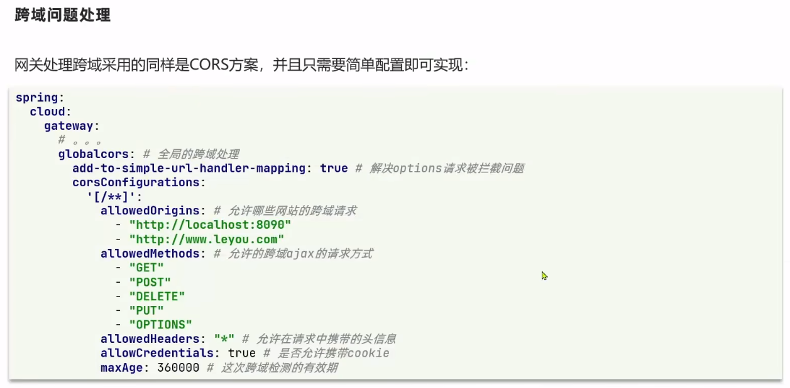

## 远程服务调用

### RestTemplate

RestTemplate 可以模拟客户端来向另外一个后端执行请求

黑马给出的微服务项目中，有两个 boot 项目，分别是 order 与 user

我们想要在 order 中的 service 阶段对 user 给出的接口执行请求，此时就需要 RestTemplate 来进行解决

<br>

首先需要在 OrderApplication，也就是项目入口点注册一个全局的 RestTemplate  
后续可以使用自动装配直接调用该对象

```java
@MapperScan("cn.itcast.order.mapper")
@SpringBootApplication
public class OrderApplication {

    public static void main(String[] args) {
        SpringApplication.run(OrderApplication.class, args);
    }

    @Bean
    public RestTemplate restTemplate() {
        return new RestTemplate();
    }
}
```

<br>

修改 `OrderService` 的代码，借助 `RestTemplate` 请求拿到 user 后，存储到对应的 orde 对象中去

```java
@Service
public class OrderService {

    @Autowired
    private OrderMapper orderMapper;

    // 自动装配引入resttemplate
    @Autowired
    private RestTemplate restTemplate;

    public Order queryOrderById(Long orderId) {
        // 1.查询订单
        Order order = orderMapper.findById(orderId);

        // 设置后端服务器请求的URL
        String url = "http://localhost:10087/user/" + order.getUserId();
        // 请求后端服务器
        User forObject = restTemplate.getForObject(url, User.class);
        // 将请求结果保存到现有的order对象中去
        order.setUser(forObject);

        // 4.返回
        return order;
    }
}
```

<br>

## Eureka

### 简要概念

服务调用关系

- 服务提供者：暴露接口给其他微服务调用
- 服务消费者：使用其他微服务提供的接口
- 提供者和消费者角色是相对的，一个对象可以同时兼具这两种状态

<br>


Eureka 完整工作流程图及其简要步骤

Eureka 由两部分组成：`Eureka-server` 与 `Eureka-client`
Eureka-client 又可划分为两个类别：服务消费者（consumer）与服务提供者（provider）

工作流程：

1. 服务提供者 URL 发送给注册中心进行注册
2. 注册中心来者不拒，一一把服务提供者的 URL 记录到表内
3. 服务消费者从注册中心获取对应提供者 URL，进行接口请求
4. 每隔 30s，服务提供者就会向注册中心发送心跳包来证明自己活着，否则隔一段时间不发的话就会被注册中心删除
5. 服务消费者具备负载均衡的能力，可以选择最适合的那一个后端服务执行请求

<br>

### 配置 Eureka 环境

> 注意，请确保所有项目的编译环境均为 JDK1.8，千万不要拉的太高，不然直接编译错误恶心死你，实测 17 及以上 JDK 直接崩溃

新建空的 maven 项目

pom 添加 eureka 依赖

```xml
<dependencies>
    <dependency>
        <groupId>org.springframework.cloud</groupId>
        <artifactId>spring-cloud-starter-netflix-eureka-server</artifactId>
    </dependency>
</dependencies>
```

配置入口文件

代码清单：`EurekaApplication.java`

```java
@EnableEurekaServer
@SpringBootApplication
public class EurekaApplication {
    public static void main(String[] args) {
        SpringApplication.run(EurekaApplication.class,args);
    }
}
```

编写配置文件（配置文件直接放到 resource 文件夹下面）

特别注意！！！配置项 `defaultZone` 必须是以小驼峰的形式书写，不能写成蛇形 `default-zone` 否则永远运行不了！！！

代码清单：`application.yaml`

```yaml
# eureka服务器执行的端口
server:
  port: 10001

# spring名称
spring:
  application:
    name: eurekaserver

# 设置eureka服务器的可视化管理平台的默认URL
eureka:
  client:
    service-url:
      defaultZone: http://localhost:10001/eureka
```

<br>

打开控制面板：`http://localhost:10001/`  
即可看到下方的效果


<br>

### 设置 Eureka Client

随意选择一个 springboot 项目（版本 2.7.15 及以下）

pom 内添加 `eureka-client` 依赖

```xml
<dependency>
    <groupId>org.springframework.cloud</groupId>
    <artifactId>spring-cloud-starter-netflix-eureka-client</artifactId>
</dependency>
```

和设置 `eureka-server` 不同的是，我们无需再为入口文件顶部添加注解 `@EnableEurekaClient`，因为目前对于高版本 springboot 来说，eureka 已经自动帮我们完成了这一步骤，我们仅需设置配置文件就可以了！

配置文件设置好 spring 的名称，以及 eureka 配置即可

```yaml
server:
  port: 10087

spring:
  application:
    name: userserver

eureka:
  client:
    # 同样的，这里指向的是我们eureka-server的地址！
    service-url:
      defaultZone: http://127.0.0.1:10001/eureka
```

<br>

此时先重新构建 `eureka-server`，然后再构建当前项目，打开控制面板，即可看见目前存在了两个 `eureka-client`

<br>

### Eureka 服务发现

之前设置的远程服务调用 RestTemplate，是直接使用了硬编码，把 URL 写死了，现在我们配置好了 Eureka 服务器，那就可以使用负载均衡的原理，直接调用对应的后端服务器

打开 `OrderApplication.java` ，为对应的 RestTemplate 添加负载均衡注解

```java
@Bean
@LoadBalanced
public RestTemplate restTemplate() {
    return new RestTemplate();
}
```

然后修改之前的硬编码为我们设置的`服务提供者 user-server`对应的 URL 即可

```java
String url = "http://user-server/user/" + order.getUserId();
```

> 与此同时，这就完成了一个完整的 Eureka 工作流程
>
> 1. user-server 发送服务到注册中心 eureka-server
> 2. order-server 从注册中心发现服务，并取回使用

<br>

## Ribbon

### 工作流程


在配置完毕 eureka 后，我们发现，虽然可以在代码中使用诸如 `http://user-server/user/xxx` 的形式来访问到对应的后端服务器，但是当我们直接把这段 URL 填入浏览器时，发现无法访问

而 Ribbon 的作用，简单来说，就是帮助我们把浏览器 URL 转义为对应的地址，让我们顺利访问到后端服务器（有点 DNS 那味了）

上图展示了 Ribbon 工作的基本流程

1. 获取原始 URL，从中提取出 eureka-client 的 id
2. 以此 id 请求 eureka-server，拿到所有相关的服务器原地址
3. 借助 ribbon 负载均衡措施，选择一个地址并使用
4. 转译该地址，返回

<br>

### 配置与使用 Ribbon


上图给出了可供选择的 Ribbon 负载均衡策略

<br>

Ribbon 自身通过接口 IRule 来自定义对应的负载均衡策略

在 `OrderApplication.java` 随便注入一个规则

```java
@Bean
public IRule randomRule() {
    return new RandomRule();
}
```

> 定义负载均衡的方式也可以直接写在配置文件里面，这里不做演示，还是建议写在入口类，更加直观

> 入口类定义 IRule：全局作用；配置文件定义 IRule：局部作用

<br>

### 饥饿加载

ribbon 默认使用懒加载，所以当首次启用负载均衡时，会浪费很多时间实例化对象

在配置文件里面设置 ribbon 为饥饿式加载方法

```yaml
ribbon:
  eager-load:
    # 当需要对多个eureka-client实现同类型加载方式的话，使用数组的写法
    clients:
      - user-server
      - order-server
    enabled: true
```

<br>

###

## Nacos

### 下载 Nacos 并运行

首先下载对应的 release 包，主要要选择已经打包编译好的 nacos-server 文件！
https://github.com/alibaba/nacos/releases/tag/1.4.1

将其解压到任意一个不包含中文路径的文件夹下  
进入 bin，在此文件夹下打开命令行，输入 `startup.cmd -m standalone` 即可开启 nacos 服务器

默认服务器端口 8848，上述指令的`standalone`表示为单体，非集群模式

<br>

等待命令行运行一段时间后，进入 nacos 给出的 URL：`http://192.168.113.1:8848/nacos/index.html`

可见这是一个管理界面，用户名和密码默认都是 `nacos` 登录进去即可

<br>

### 配置 Nacos

由于我们目前的项目设置是父子类型，首先需要在父项目 pom 导入 alibaba 工具库

```xml
<dependency>
    <groupId>com.alibaba.cloud</groupId>
    <artifactId>spring-cloud-alibaba-dependencies</artifactId>
    <version>2.2.5.RELEASE</version>
    <type>pom</type>
    <scope>import</scope>
</dependency>
```

再在各自的 server 内导入 nacos-discovery 依赖

```xml
<dependency>
    <groupId>com.alibaba.cloud</groupId>
    <artifactId>spring-cloud-starter-alibaba-nacos-discovery</artifactId>
</dependency>
```

<br>

非常简单吧？

最后仅需在配置文件内设置好 nacos 服务器的地址即可  
和 eureka 不一样的是，这里的注册中心实际上就是我们刚刚运行的 nacos 服务器，所以无需额外创建项目来跑服务器了

配置文件书写 `application.yaml` ：

```yaml
spring:
  cloud:
    nacos:
      server-addr: localhost:8848
```

<br>

重新构建对应模块

回到 nacos 控制面板，就可以看见我们生成的服务器啦！


### Nacos 集群


单个实例集中在一起构成一个集群

集群通常用于容灾机制

同一集群内的实例会先行访问当前集群内的其他本地实例，如果实在没办法才去找其他集群中的实例

<br>

为实例设置集群的方式很简单，只需要在配置文件添加下面的代码即可将其划入一个集群内

```yaml
spring:
  cloud:
    nacos:
      server-addr: localhost:8848

      # 设置集群名称，将这个实例归为集群SH管理
      discovery:
        cluster-name: SH
```

<br>

### Nacos 负载均衡

假设现在有这样的状况：

1. 服务提供方拥有 3 个实例，两个集群（BJ、NJ）
2. 服务消费方只有 1 个实例，一个集群（BJ）

可见消费方的集群和提供方中的一个集群是一致的，所以按照常理来说我们希望消费方直接从同一集群下的提供方拿取数据

<br>

但由于 nacos 默认采用轮询的方式实现负载均衡，此时必须修改默认配置才可以实现最终效果

方案一：在 applcation.yaml 配置 ribbon，指定负载均衡采用的方法

```yaml
service-consumer:
  ribbon:
    NFLoadBalancerRuleClassName: com.alibaba.cloud.nacos.ribbon.NacosRule
```

方案二：在入口类中使用注入的方式来配置

```java
@Bean
NacosRule nacosRule() {
    return new NacosRule();
}
```

<br>

负载均衡权重值设定

1. 实例权重为 0 时，他将永远不会被访问
2. 权重值范围 0-1
3. 同集群内的多个实例，权重高的被访问频率变高

<br>

### Nacos 环境隔离

nacos 提供了环境隔离选项  
从外到内，环境由大变小依次为：`命名空间->分组->服务->实例`

我们先去 nacos 控制面板的“命名空间”模块随意添加一个名叫`dev`的命名空间，并复制一下自动生成的 ID

找到任意一个服务器的配置文件，使用 namespace 字段来将这个服务器归为某个命名空间

```yaml
spring:
  cloud:
    nacos:
      server-addr: localhost:8848
      discovery:
        cluster-name: BJ

        # 设置改服务器所处的命名空间
        # 这里需要填入我们之前记下来的命名空间ID
        namespace: 1688ddc5-4f48-4bdc-bb5b-8c5363edf242
```

<br>

配置完毕，重启服务器

进入 nacos 控制台的 `服务管理->服务列表`  
然后可以点击上方的导航条来切换命名空间

下图我们切换到了新建的 dev 命名空间，可见我们配置的 user-server 已经归为此命名空间管辖


<br>

### Nacos 注册细节


服务器提供者可以向注册中心注册时选择两种状态

1. 临时实例状态
2. 非临时实例状态

临时实例需要主动向注册中心发送定时的心跳包来证明自己活着，否则超时了就会被注册中心剔除

非临时实例无需主动发包，而是由注册中心确认其是否活着，他会一直留着而不会因为超时等情况自己删除

> nacos 集群默认使用 AP 模式，当存在非临时实例时转用 CP 模式

<br>

配置文件内使用 `ephemeral` 字段来标记该服务器是否为临时实例

```yaml
spring:
  cloud:
    nacos:
      server-addr: localhost:8848
      discovery:
        cluster-name: BJ
        namespace: 1688ddc5-4f48-4bdc-bb5b-8c5363edf242

        # 设置是否为临时实例
        ephemeral: false
```

<br>

### Nacos 更多配置项

#### 快速上手

> nacos 提供了云端设置配置文件，我们只需要在 nacos 中新建配置文件并写入需要执行热更新的配置项，然后再 springboot 应用的 bootstrap.yaml 内调用该配置即可，

新建配置文件，配置文件 ID 书写格式为：`<服务器名>-<类型>.yaml`  
目前配置文件支持 yaml 和 properties 格式

这里的“服务器名”一定要和 springboot 中的 application 定义的 name 完全一致，才可以启用该配置项


<br>

为 user-server 添加 nacos-config 依赖，以便开启依赖项

```xml
<dependency>
    <groupId>com.alibaba.cloud</groupId>
    <artifactId>spring-cloud-starter-alibaba-nacos-config</artifactId>
</dependency>
```

添加 nacos-config 后，在 resource 文件夹下新建配置文件 `bootstrap.yaml` ，此时当 springboot 启动时，首先读取该配置文件，之后才读取 `application.yaml`

```yaml
spring:
  # 服务器名称
  application:
    name: userservice
  # 服务器类型（我们之前定义为dev，这里必须写dev）
  profiles:
    active: dev

  # 其他关键性配置
  cloud:
    nacos:
      server-addr: localhost:8848
      config:
        # 设置bootstrap配置文件的后缀名
        file-extension: yaml
      discovery:
        cluster-name: BJ
        namespace: 1688ddc5-4f48-4bdc-bb5b-8c5363edf242
        ephemeral: false
```

<br>

之后来到 `UserController.java` 拉取配置文件信息

```java
@Slf4j
@RestController
@RequestMapping("/user")
public class UserController {

    @Value("${pattern.dataformat}")
    private String dataFormat;

    @GetMapping("/now")
    public String now() {
        // 由于我们之前在nacos中设置的配置项配置了pattern属性，这里就可以直接调用对应的属性完成时间格式化了
        return LocalDateTime.now().format(DateTimeFormatter.ofPattern(dataFormat));
    }
}
```

<br>

#### 自动更新

直接在 nacos 中使用配置文件的好处是可以实时实现热更新，而不像是在项目中设置 `application.yaml` 后还要在重启一次

我们仅需在使用了 nacos 配置文件的 bean 内添加注解 `@RefreshScope` 即可

```java
@Slf4j
@RestController
@RequestMapping("/user")
@RefreshScope // 添加检测配置文件更新的注解
public class UserController {}
```

<br>

或者你可以创建一个自定义的配置类还动态获取指定配置

```java
@Component
@Data
@ConfigurationProperties(prefix = "pattern")
public class PatternProperties {
    private String dataFormat;
}
```

<br>

我们可以专门配置指定运行环境（比如 dev）的配置文件：`userservice-dev.yaml`  
或者定义服务器全局（所有环境通用）的配置文件：`userservice.yaml`

配置文件之间的优先级：带环境参数的配置文件>全局配置文件>application.yaml

<br>

## Feign

### 取代 RestTemplate

相比于 resttemplate 低效的字符串拼接，feign 提供了接口操作的形式，让我们更加直观的连接到对应的服务器提供者

首先引入依赖

```xml
<dependency>
    <groupId>org.springframework.cloud</groupId>
    <artifactId>spring-cloud-starter-openfeign</artifactId>
</dependency>
```

务必记住在入口类中开启 feign 客户端

```java
@MapperScan("cn.itcast.order.mapper")
@SpringBootApplication
@EnableFeignClients // 开启feign客户端
public class OrderApplication {}
```

<br>

创建一个接口类，用于获取服务器提供者的接口

代码清单：`clients/UserClient.java`

```java
// 注解内填入需要链接到的服务器名称
@FeignClient("userservice")
public interface UserClient {
    // 表示使用GET请求获取数据
    @GetMapping("/user/{id}")
    // 同理PathVariable用来填补上方路径中的id占位符
    User findById(@PathVariable("id") Long id);
}
```

最终在 service 重写查询逻辑

```java
@Service
public class OrderService {

    @Autowired
    private OrderMapper orderMapper;

    @Autowired
    private UserClient userClient;

    public Order queryOrderById(Long orderId) {
        // 查询订单
        Order order = orderMapper.findById(orderId);
        // feign客户端请求user数据库中内容
        User user = userClient.findById(order.getUserId());
        order.setUser(user);
        return order;
    }
}
```

> 运行 orderservice 之后，浏览器输入 `http://localhost:10087/order/101` 即可获取对应的数据了！实际上你看出来的效果和 resttemplate 差不多

<br>

### Feign 自定义配置

配置日志输出级别

全局配置

```yaml
feign:
  client:
    config:
      default:
        loggerLevel: FULL
```

局部配置（明确指出服务器名称）

```yaml
feign:
  client:
    config:
      userservice:
        loggerLevel: FULL
```

<br>

或者你可以使用代码的方式来书写


<br>

### 性能优化

借助 URLConnection 连接池来取代原本的单链接，可以提升 feign 客户端的效率

导入 feign-httpclient 坐标

```xml
<dependency>
    <groupId>io.github.openfeign</groupId>
    <artifactId>feign-httpclient</artifactId>
</dependency>
```

之后配置文件配置好属性即可

```yaml
feign:
  client:
    config:
      default:
        # 日志级别最好使用BASIC或者NONE，其他的级别比较耗费性能而且基本用不上
        loggerLevel: BASIC
  httpclient:
    enabled: true
    max-connections: 200
    max-connections-per-route: 50
```

<br>

## Gateway

### WebFlux

> gateway 基于 webflux 构建

WebFlux 是基于反应式流概念的响应式编程框架，用于构建异步非阻塞的 Web 应用程序。它支持响应式编程范式，并提供了一种响应式的方式来处理 Web 请求。

与传统的 Servlet API 相比，WebFlux 采用了基于事件驱动的编程模型，不依赖于传统的线程池模型。它使用少量的线程来处理大量的请求，通过异步非阻塞的方式实现高吞吐量和低延迟。

<br>

WebFlux 提供了两种编程模型：

1. 响应式 Web 客户端：用于发送 HTTP 请求并处理响应。它基于 Reactor 提供了一组操作符和方法，可以以声明式的方式组装和处理 HTTP 请求，支持异步和流式处理。
2. 响应式 Web 服务器：提供了一个响应式的 Web 服务器，用于处理传入的 HTTP 请求并生成响应。它基于 Reactor 提供了一组用于处理请求和生成响应的 API，支持异步非阻塞的处理方式。可以使用注解或函数式编程的方式定义请求处理器，处理器可以返回一个单独的响应，也可以返回一个表示响应流的 Publisher 对象。

<br>

### 网关基本配置

> Gateway 是一个在系统架构中充当入口点的服务器，它接收来自客户端的请求并将其转发到后端的服务。网关的作用是在客户端和后端服务之间建立一个中间层，用于路由请求等

新建 maven 项目 gateway

pom 添加 gateway 坐标以及负载均衡坐标

```xml
<!--gateway网关依赖-->
<dependency>
    <groupId>org.springframework.cloud</groupId>
    <artifactId>spring-cloud-starter-gateway</artifactId>
</dependency>

<!--loadbalancer负载均衡，对于高版本springboot需要额外添加此以来-->
<dependency>
    <groupId>org.springframework.cloud</groupId>
    <artifactId>spring-cloud-starter-loadbalancer</artifactId>
</dependency>
```

编写入口文件 `GatewayApplication.java`

```java
@SpringBootApplication
public class GatewayApplication {
    public static void main(String[] args) {
        SpringApplication.run(GatewayApplication.class, args);
    }
}
```

进行网关配置

routes 用于设置转发路由，他是一个数组，表示你可以设置多个转发规则，但是各个转发规则的 id 不可以重复

```yaml
server:
  port: 2333

spring:
  application:
    name: gateway
  cloud:
    nacos:
      server-addr: localhost:8848

    # 配置gateway
    gateway:
      # 数组方式配置路由转发
      routes:
        # 转发id，名字随便取，但是不可以重复
        - id: user-service
          # 被转发的URI，格式：lb://<被转发的服务器名>
          uri: lb://userservice
          # 断言规则
          predicates:
            # 当请求路径是 /user/** 格式的，自动转发到指定服务器
            - Path=/user/**
        # 这是另一组被转发的服务器
        - id: order-service
          uri: lb://orderservice
          predicates:
            - Path=/order/**
```

<br>

### 过滤器与断言工厂

predicates 断言配置属性可以使用以下 11 种


<br>

使用 filters 添加过滤器

下面为每个 user 请求都添加了一个名为“Truth”的请求头

```yaml
gateway:
  routes:
    - id: user-service
      uri: lb://userservice
      predicates:
        - Path=/user/**

      # 设置过滤器
      filters:
        # 添加请求头，格式：[请求头名称],[请求头内容]
        - AddRequestHeader=Truth,shit oh my gods!
```

如果你想一劳永逸的话，可以使用 defaultFilters 为全部路由设置请求头

```yaml
gateway:
  routes:
    - id: user-service
      uri: lb://userservice
      predicates:
        - Path=/user/**
    - id: order-service
      uri: lb://orderservice
      predicates:
        - Path=/order/**

  # 默认所有路由都有此路由器
  default-filters:
    - AddRequestHeader=Truth,shit oh my gods!
```

<br>

### 全局过滤器

全局过滤器对所有路由转发同时生效

实现该过滤器需要两步：

1. 实现 `GlobalFilter`
2. 借助注解 `@Order` 设置过滤器优先级

```java
// order设置-1表示最高优先级
@Order(-1)
@Component
public class AuthFilter implements GlobalFilter {
    @Override
    public Mono<Void> filter(ServerWebExchange exchange, GatewayFilterChain chain) {
        // 取出参数并对参数进行校验
        ServerHttpRequest request = exchange.getRequest();
        MultiValueMap<String, String> params = request.getQueryParams();
        String auth = params.getFirst("authorization");

        // 检查授权参数是否为 "admin"
        if ("admin".equals(auth)) {
            // 授权通过，继续传递请求到下一个过滤器或后端服务
            return chain.filter(exchange);
        }

        // 授权失败，设置响应状态为 401 未授权
        exchange.getResponse().setStatusCode(HttpStatus.UNAUTHORIZED);

        // 设置响应为完成状态，结束请求-响应的处理
        return exchange.getResponse().setComplete();
    }
}
```

<br>

三大过滤器：路由过滤器、defaultFilter、GlobalFilter 执行优先级以及顺序


<br>

### 跨域处理 CORS



<br>

## RabbitMQ

### 安装 rabbitmq

首先确保自己已经安装好了 docker

是 docker 拉取镜像文件：`docker pull rabbitmq:3-management`

拉取完毕，打开容器

```sh
docker run \
 -e RABBITMQ_DEFAULT_USER=itcast \
 -e RABBITMQ_DEFAULT_PASS=123321 \
 --name mq \
 --hostname mq1 \
 -p 15672:15672 \
 -p 5672:5672 \
 -d \
 rabbitmq:3-management
```

<br>

浏览器访问虚拟机的 15672 端口，即可看见 rabbitmq 管理界面


我们可以在 admin 选项卡内添加新的用户

其中的`can access virtual hosts`表示当前用户对应的虚拟主机  
建议不同用户对应不同的虚拟主机，可以实现隔离效果

虚拟主机可以点击上图右侧的 `virtual hosts` 按钮新建

<br>

### SpringAMQP 基础队列

由于使用官方原生操作 rabbitmq 的方式太过生草，代码巨多，不适合日常开发，推荐改用 SpringAMQP 来简化操作


