## Sentinel

<br>

### 介绍

Sentinel 是一个开源的分布式系统，用于监控和管理其他系统的可用性和状态。

Sentinel 主要用于监控 Redis 实例的健康状况，并在主从复制架构中自动进行故障检测和故障转移。当主节点发生故障或不可用时，Sentinel 会自动选举新的主节点，并将客户端的请求重定向到新的主节点，以确保系统的可用性。

<br>

雪崩：微服务集群中的任意一个服务器挂了，导致依赖它的服务器全部挂掉（链式反应，一条链路上的所有服务器统统挂掉）

解决雪崩问题：

1. 超时处理：设定超时时间，一旦超时无响应就返回错误信息，不会阻塞等待
2. 仓壁模式（线程隔离模式）：限定每个业务可调用线程数，避免耗尽 tomcat
3. 熔断降级：断路器统计业务中的异常比例，超出阈值直接断开，拦截一切请求
4. 流量控制：限制服务器访问的 QPS

<br>

### 限流准则

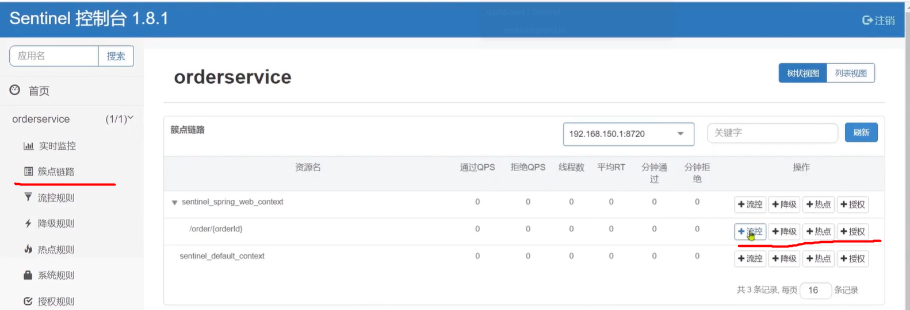

簇点链路：链路监控对应的接口，而这些接口就称为一个资源；可以对这些接口执行限流，比如限制 QPS

<br>

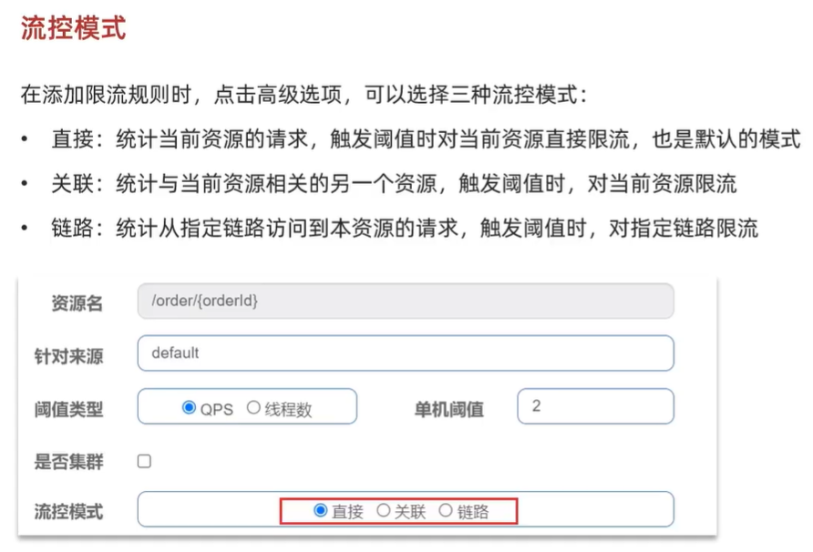

流控模式及其使用场景

关联模式：用户支付会触发修改和查询行为，二者同时竞争数据库锁，容易发生竞态条件，所以触发修改业务时需要关联的对查询业务进行限流  
关联模式使用场景：两个竞争关系的资源；一个高优先级，一个低优先级；

链路模式：查询订单和创建订单均需要 URL 跳转到查询商品业务，很显然我们需要优先保证创建订单任务，故对查询订单跳转执行限流

<brs>

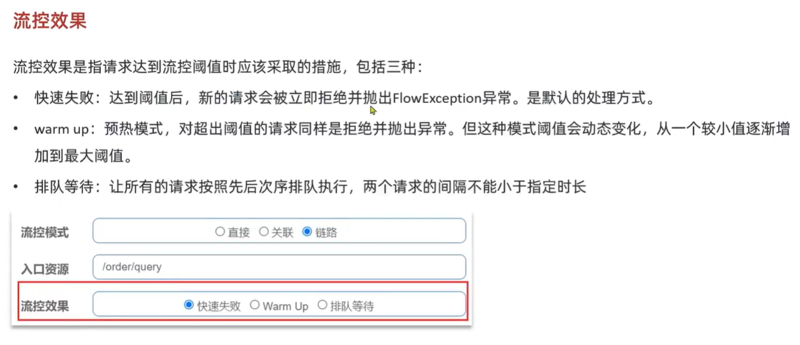

流控效果

warm-up 启动方式可以缓解冷启动效果  
初始 QPS 阈值会逐渐在指定时间内增加到最大 QPS 阈值，然后超出此 QPS 的请求均被丢弃

<br>

热点参数限流：针对统一参数的请求数量进行统计，以便执行限流

<br>

### FeignClient 限流处理

springcloud 使用 feign 进行限流和降级操作，故客户端需要配置 feign 依赖  
在配置文件内使用下方代码来开启 sentinel

```yaml
feign:
  sentinel:
    enable: true
```

FeignClient 失败后存在以下两种可选处理模式：

1. Fallbackclass：无法处理远程调用异常
2. FallbackFactory：可处理远程调用异常

<br>

下面是使用 FallbackFactory 的一般步骤：

1. 创建一个实现 FallbackFactory 接口的类，该类将负责创建回退逻辑。例如：

```java
import feign.hystrix.FallbackFactory;

public class MyFallbackFactory implements FallbackFactory<MyServiceClient> {

    @Override
    public MyServiceClient create(Throwable cause) {
        return new MyServiceClientFallback(cause);
    }
}
```

2. 创建一个实现远程服务接口的回退类，该类将实现在发生错误或超时时执行的回退逻辑。例如：

```java
public class MyServiceClientFallback implements MyServiceClient {

    private final Throwable cause;

    public MyServiceClientFallback(Throwable cause) {
        this.cause = cause;
    }

    @Override
    public String remoteServiceMethod() {
        // 执行回退逻辑，返回默认值或进行其他处理
        return "Fallback value";
    }
}
```

3. 在使用 Feign 客户端的地方，将 FallbackFactory 与 Feign 客户端接口关联起来。例如：

```java
@FeignClient(name = "my-service", fallbackFactory = MyFallbackFactory.class)
public interface MyServiceClient {

    @GetMapping("/remote-service-method")
    String remoteServiceMethod();
}
```

在上述示例中，当远程服务调用发生错误或超时时，将使用 MyFallbackFactory 创建的回退逻辑执行。

<br>

### 线程隔离

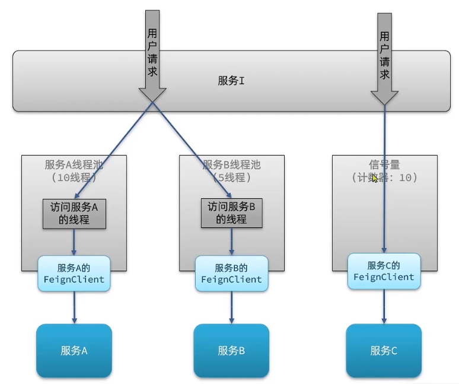

线程隔离分为两种，分别对应上图左侧和右侧模式

1. 线程池：不同请求分配到不同的 feignclient
2. 信号量模式：每次处理一次请求就消耗一个信号量，消耗完毕就阻塞拦截，直到新的信号量被补充进去

信号量模式虽然为轻量级，且支持高频与高扇出，但不支持异步

执行流控时选择了“线程数”，实际上时开启了舱壁隔离的方式

<br>

### 熔断器

熔断器熔断触发由以下三种情况

1. 慢调用：业务响应时长超过阈值的被称为慢调用请求；若一定时间慢调用占比过高超出阈值，即可触发熔断
2. 异常比率与异常数：统计单位时间内调用数，若调用数超过指定数，且异常比例高于阈值，则触发熔断

<br>

### 授权规则

授权规则用来控制调用方来源，分为白名单和黑名单两个

我们可以把网关（gateway）地址放到白名单，只有从网关访问的来源才可被放行，此功能可以这样实现：

- 编写方法实现 RequestOriginParser 接口，并实现方法 parserOrigin 来设置请求头
- gateway 配置文件内设置 default-filters 中请求头为 origin

<br>

`BlockExceptionHandler` 是 Spring Cloud Gateway 提供的一个接口，用于处理由于限流或熔断而阻塞的请求。

该接口下有以下几个重要的场景，我们可以先实现 BlockExceptionHandler 接口，然后一次借助 instanceof 来判断这些场景，从而能对应的处理发送自定义异常

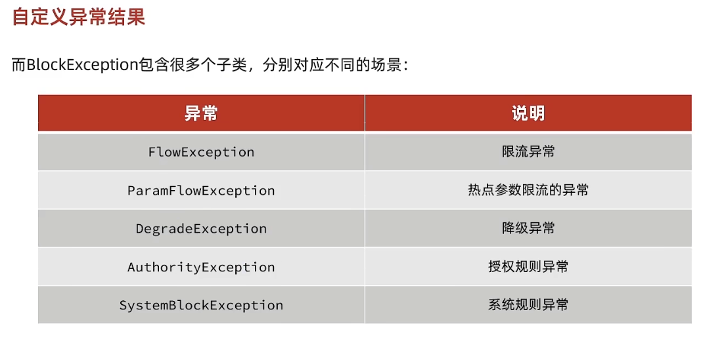

<br>

### 规则持久化

> `Sentinel` 规则持久化是指将 Sentinel 的流控规则、降级规则、系统保护规则等配置信息保存到持久化存储中，以便在应用重启或动态更新规则时能够加载和使用这些规则。

sentinel 三种主要配置管理模式为

1. `原始模式`：直接存到内存

2. `pull 管理模式`：sentinel dashboard 更新规则后将其发送给 sentinel 客户端，客户端将规则存储到本地，每次按照此流程定时查询或者更新本地规则文件

3. `push 管理模式`：
   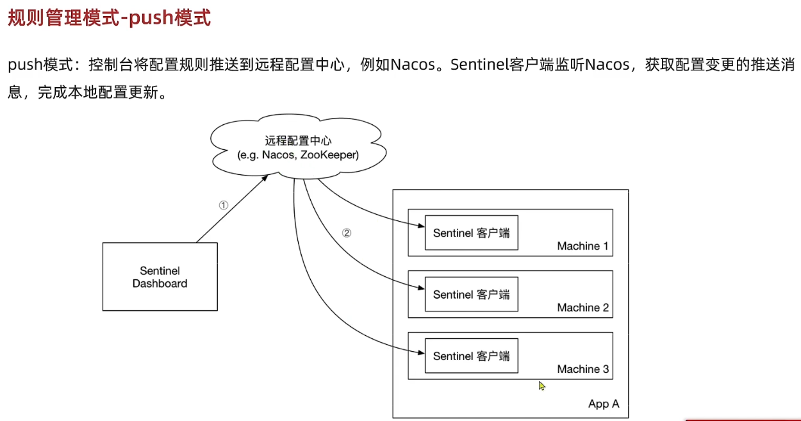

<br>

## 分布式事务

<br>

### 关键定理

**经典 ACID 原则**

ACID 是数据库事务的四个基本特性，它代表了一组重要的属性，确保事务的可靠性和一致性。下面是 ACID 原则的解释：

`原子性（Atomicity）`：事务是一个原子操作单元，要么全部执行成功，要么全部失败回滚。如果事务中的任何一个操作失败，整个事务将被回滚到初始状态，保证数据的一致性。

`一致性（Consistency）`：事务在执行前和执行后都必须保持数据库的一致性状态。这意味着事务的执行不会破坏数据库的完整性约束，如主键、外键、唯一性等。

`隔离性（Isolation）`：多个并发的事务在执行过程中彼此隔离，互不干扰。每个事务都应该感觉到它是在独立执行的，即使有其他事务在同时运行。隔离性防止了事务间的相互干扰，确保每个事务独立执行，避免数据的不一致性。

`持久性（Durability）`：一旦事务提交成功，对数据库的修改将永久保存，即使出现系统故障或断电等情况。持久性确保数据的持久性，并防止数据丢失。

<br>

**CAP 定理**

CAP 定理是一个关于分布式系统的理论定理，它指出在一个分布式系统中，不可能同时满足以下三个特性：

`一致性（Consistency）`：所有节点在同一时间具有相同的数据副本。在分布式系统中，一致性要求所有节点在任何给定时间点都具有相同的数据视图，即数据的更新操作需要在整个系统中立即生效。

`可用性（Availability）`：每个非故障节点在合理的时间范围内都能对请求做出响应。可用性要求系统能够在用户发起请求时始终保持响应，即系统对外部请求具有高可用性。

`分区容错性（Partition tolerance）`：系统在面对网络分区（节点之间的通信故障）时仍然能够继续运行。分区容错性是指系统能够处理节点之间的通信失败或网络分区的情况，保证系统的正常运行。

<br>

**BASE 定理**

BASE 是指以下三个特性：

`基本可用（Basically Available）`：系统保证在面对异常情况下仍然保持基本的可用性，即系统仍能够对外提供服务并响应请求，尽管可能会发生部分功能的降级。

`软状态（Soft State）`：系统中的状态可能随时发生变化，这种状态的变化并不是瞬间完成的，而是经过一段时间的过渡阶段。在分布式系统中，由于网络延迟、异步复制等因素，不同节点之间的数据可能存在稍微的不一致。

`最终一致性（Eventual Consistency）`：系统在一段时间后，最终会达到一致的状态。即系统保证最终所有副本或节点的数据是一致的，但在一段时间内可能存在部分不一致的情况。

<br>

**两种模式**

AP 模式：各事务各自为政，分别提交，结果不一致后逐渐弥补，最终实现一致  
CP 模式：各事务相互等待，同时提交，同时回滚，达成强一致（但等待过程事务属于弱可用状态）

<br>

### Seata

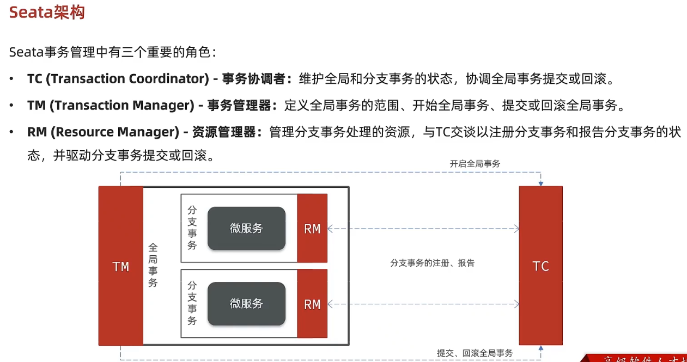

`Seata（全称为 Simple Extensible Autonomous Transaction Architecture）`是一个开源的分布式事务解决方案。它旨在简化分布式事务的开发和管理，提供一致性、隔离性、持久性和可靠性，以确保分布式系统中的数据一致性。

Seata 提供了一个分布式事务框架，可以与各种数据库和 RPC 框架集成。它采用了两阶段提交（Two-Phase Commit，2PC）协议来实现分布式事务的提交和回滚。

<br>

#### XA

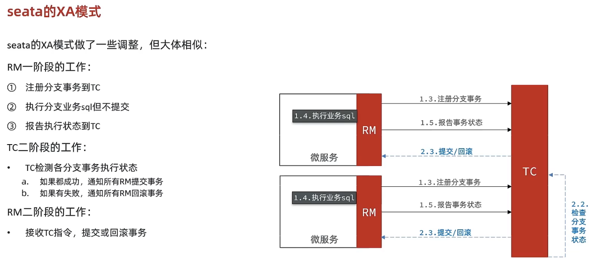

> 缺点：RM 第一阶段执行过程中会锁定，如果一直处理那就一直锁定，严重影响后续进程执行

XA 用于管理跨多个数据库或消息队列的分布式事务。它提供了一种可靠的方式来确保事务的一致性和原子性

XA 模式通过在每个参与者上记录事务的状态和执行日志，以及在协调器上进行全局事务状态的管理，从而实现了分布式事务的一致性和原子性

`@GlobalTransactional` 用于标记一个方法或类需要参与全局事务，添加注解后，Seata 将会拦截该方法或类中的事务操作，并将其纳入全局事务的管理范围。

<br>

#### AT

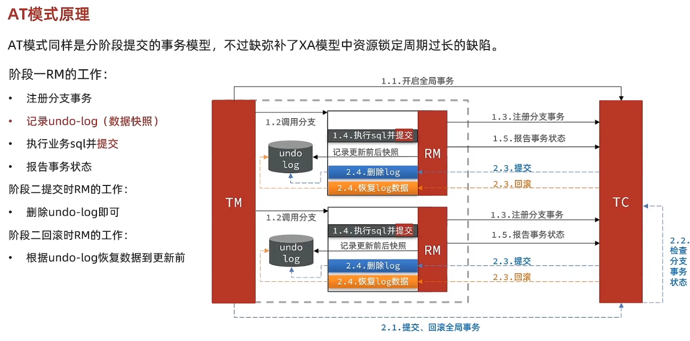

AT 的高效率会带来脏写问题：事务 A 处理完第一阶段后释放锁，此时有一个事务 B 立即获取锁并进入第一阶段；而事务 A 第二阶段需要等待锁，但此时锁由事务 B 持有，故只能阻塞无法执行

AT 的写隔离采用全局锁来处理，由 TC 记录当前执行的事务，规定其一直持有全局锁

<br>

#### TCC

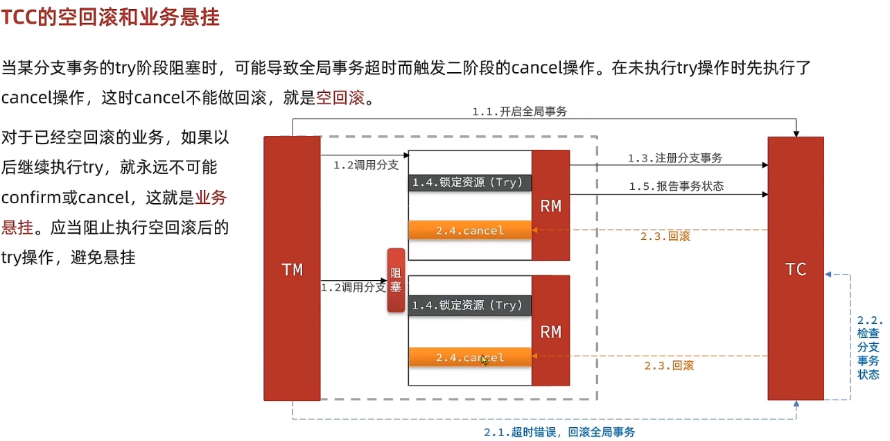

如上图所示，当调用某 try 分支时被阻塞了，而阻塞超时又会触发 TC 回滚，可是实际上 TM 因为被阻塞所以资源压根就没有更改，此时的回滚即造成空回滚

<br>

#### Saga 模式

`Saga 模式` 用于解决分布式系统中的长事务问题，它通过将长事务拆分成一系列的本地事务，并通过补偿机制来实现事务的最终一致性。

saga 模式可以分为两个阶段：

1. 阶段一：直接提交本地事务
2. 阶段二：提交成功就什么都不做，否则编写补偿业务回滚

> saga 无锁提交事务的方式虽然高效快速但是也带来了隐患，相比于 TCC 来说

<br>

### 高效 MQ

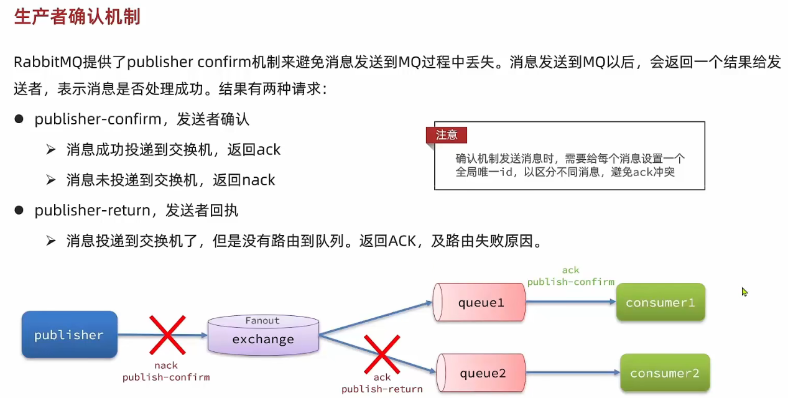

<br>

#### 死信交换机

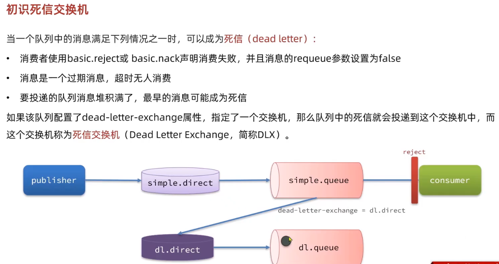

TTL：如果一个队列中的 TTL 没消费，就会变成死信（TTL 超时主要发生于：他自身设置了超时时间、队列本身有超时时间）

消息超时的两种方式

- 给队列设置 ttl，进入队列后超过 ttl 就变成死信
- 给消息设置 ttl，队列收到消息超过 ttl 后变成死信

<br>

TTL+死信交换机，可以实现延迟队列模式

SpringAMQP 中提供了一个交换机 DelayExchange，它实现了延迟队列

<br>

#### 惰性队列

为什么产生消息堆积问题？  
生产者发送消息的速度太慢，导致队列中消息堆积，部分消息因为 TTL 超时的原因还会变成死信

惰性队列可以解决这个问题（Lazy Queueus）  
接收消息后直接存到磁盘，而不是放到内存；等需要读取的时候从磁盘拉取，这样子就可以介绍成百万的消息而不会让他们变成死信了

惰性队列的优势：

- 直接存到磁盘，存储上限很高
- 无频繁的 page-out，性能稳定

> 但很显然，惰性队列从磁盘进行读写，肯定比内存慢了很多！

<br>

#### MQ 集群

MQ 集群分为两大类：

1. 普通集群：分布式集群，队列分散到集群的各个节点
2. 镜像集群：主从集群，在普通集群的基础上添加了主从备份，提高安全性（主节点负责创建队列，镜像节点负责复制节点）
3. 仲裁队列：在 redis3.8 推出，用于替换镜像集群

当所有主节点创建队列完成后，才开始启用镜像节点开始复制  
主节点宕机，镜像节点会取而代之

<br>

## 面试

<br>

### Nacos

#### protobuf

> Protocol Buffers 是一种轻便高效的结构化数据存储格式，可以用于结构化数据序列化，很适合做数据存储或 RPC 数据交换格式。它可用于通讯协议、数据存储等领域的语言无关、平台无关、可扩展的序列化结构数据格式

`Nacos` 底层的数据通信会基于 `protobuf` 对数据做序列化和反序列化。并将对应的 proto 文件定义在了 `consistency` 这个子模块中

<br>

#### 服务注册

> 下面将针对性的讲解 Nacos 源码的服务注册相关细节

`ServiceManager` 下有一成员属性 `serviceMap` ，它是一个本地注册表

对于服务注册表，它的数据结构与实际结构相互对应来看，呈现下图所示结果：

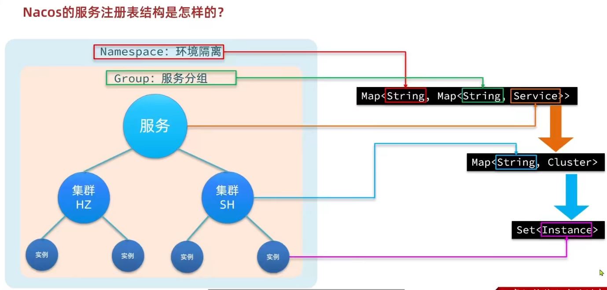

<br>

Nacos 服务注册表结构如何？

- Nacos 采用数据分级存储模型，最外层的 namespace 用于隔离环境，之后的 group 用于服务分组，最后的 service 包含多个实例，与此同时下属多个集群，而集群内部又有多个实例
- 在这里介绍 serviceMap 的结构

<br>

#### Nacos 抵抗注册压力

Nacos 接收注册请求，先将该服务放入阻塞队列之后马上响应给客户端  
用线程池读取阻塞队列任务，实现异步更新实例

`NacosServiceRegistry`是 Spring 的`ServiceRegistry`接口的实现类，而 ServiceRegistry 接口是服务注册、发现的规约接口，定义了 register、deregister 等方法的声明。  
方法中最终是调用 NamingService 的 registerInstance 方法实现注册的

NacosNamingService 提供了服务注册、订阅等功能。其中 registerInstance 就是注册服务实例

Nacos 注册接口必备 详细信息解释

- namespace_id：环境
- service_name：服务名称
- group_name：组名称
- cluster_name：集群名称
- ip: 当前实例的 ip 地址
- port: 当前实例的端口

<br>

#### Nacos 避免读写冲突

Nacos 更新实例列表时，使用 copyonwrite 技术  
先将就实例列表拷贝一份，然后更新这个拷贝列表，最后把该列表覆盖旧的实例列表

这样做就可以避免所谓的脏读问题了

<br>

#### Nacos 和 Eureka 的区别

`naocs` 具备特性：

- 采用了一个统一的核心模块，包括注册中心、配置中心和命名空间管理，通过插件机制扩展了不同的功能
- 核心模块使用了基于 Raft 算法的分布式一致性协议，实现了数据的高可用和一致性
- Nacos 支持多种数据库，如 MySQL、Oracle 等，并提供了可插拔的数据源扩展机制。
- Nacos 支持多种通信协议，如 HTTP、gRPC、DNS 等，用于服务注册和发现的交互，并且使用了基于 Netty 的异步通信框架，通过定义不同的协议和编解码器来实现与客户端的通信。
- Nacos 具备临时实例和永久实例，其中对临时实例采用心跳检测，永久实例采用主动请求检测
- Nacos 支持定时拉取与订阅推送两种方式

`eureka` 具备特性：

- Eureka 采用了基于 CAP 理论的 AP 模型，通过主节点和从节点的架构实现高可用性
- 采用内存存储方式来管理服务注册信息。它使用了基于 ConcurrentHashMap 的数据结构来存储和管理注册信息，没有涉及数据库的读写操作。
- Eureka 使用了 Jersey 作为 HTTP 客户端和服务端的框架，通过 RESTful 风格的 API 进行通信
- Eureka 仅有心跳检测
- Eureka 只支持定时拉取模式

<br>

### Sentinel API

<br>

### Sentinel 核心

<br>

#### Sentinel 限流方法

计数器方法：包括窗口计数器方法、滑动窗口计数器方法

固定窗口计数器方法：即划定一个时间片 interval，每个时间片维护一个计数器，每次来一个请求就+1，当超过计数器阈值，所有超出阈值的请求均丢弃  
滑动窗口计数器方法：把一个时间片拆分成两个子时间片，滑动窗口覆盖两个子时间片，每次向前进一个子时间片，当检测到这两个子时间片计数器之和超过阈值，就丢弃

<br>

令牌桶算法
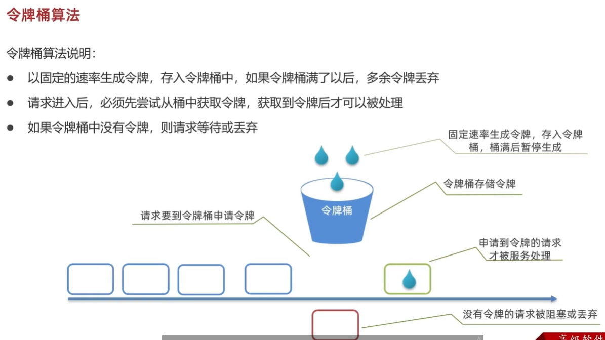

漏桶算法：请求进入漏桶，漏桶按照一定速率向外放出请求进行处理，如果漏桶满了，多出来的请求就被丢弃

> sentinel 默认限流方式为滑动窗口算法、排队等待模式为漏桶算法、热点参数限流模式为令牌桶算法

<br>
