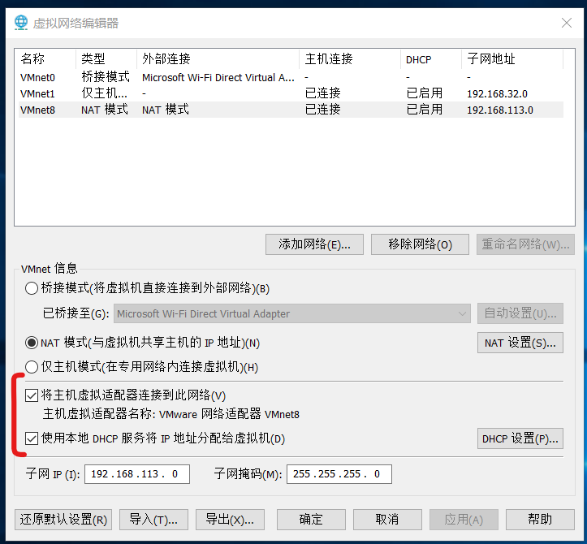

### 下载镜像

请前往 MSDN 官网下载纯净的 WindowsServer2019 镜像 ISO

产品密钥：WMDGN-G9PQG-XVVXX-R3X43-63DFG

 

### 虚拟机安装

特别注意，这里要选择“自定义安装”

配置网络模式为 NAT，内存推荐 60GB，实际上 30GB 就足够，实测使用此方法后还剩余 19GB，完全够用！

创建完虚拟机后点击设置，配置 CD/DVD 使用的镜像为 windowsserver2019 官方镜像

一路安装完毕即可

 

### 网络配置

win+r 运行，输入 `services.msc` 打开服务管理器

依次将下方三个服务修改为手动模式并直接开启  
UPnP Device Host  
SSDP Discovery  
Function Discovery Resource Publication

 

之后重新启动虚拟机或者关闭虚拟机并重开 vmware，等待一段时间后即可看见网络以及成功链接

 

### NAT 配置常见错误

#### 物理机无法 ping 通虚拟机，但是反过来却可以

对于物理机，其与虚拟机 NAT 的网络适配器应该为 VMnet8  
打开其属性，比对其 IP 网段是否和虚拟机目前 IP 对于网段一致，如果不一致请调节到一致！

VMware 点击左上角的 `编辑->虚拟网络编辑器`  
点选 VMnet8 这个桥接模式，取消勾选后再重新勾选以下两个选项：

1. 将主机虚拟适配器连接到此网络
2. 使用本地 DHCP 服务将 IP 地址分配给虚拟机

之后点击应用，再确认即可

> 以上这一步相当于重启，这一部很关键，若不重启可能永远都无法 ping 通！！！

 
