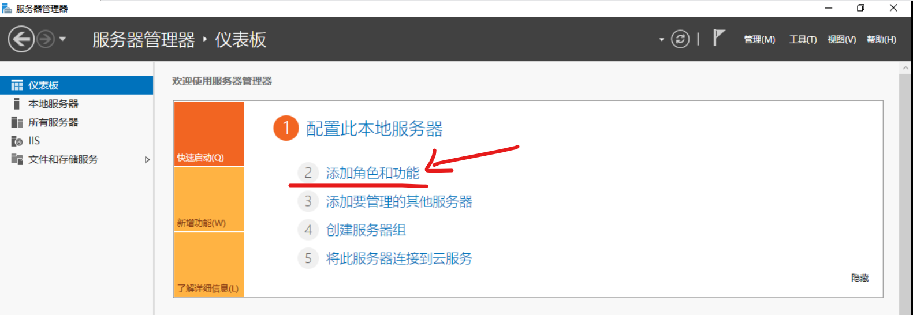
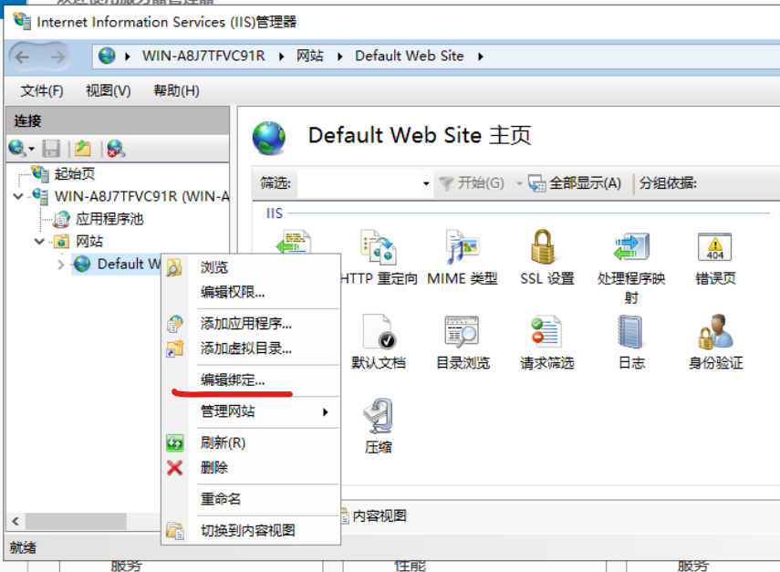
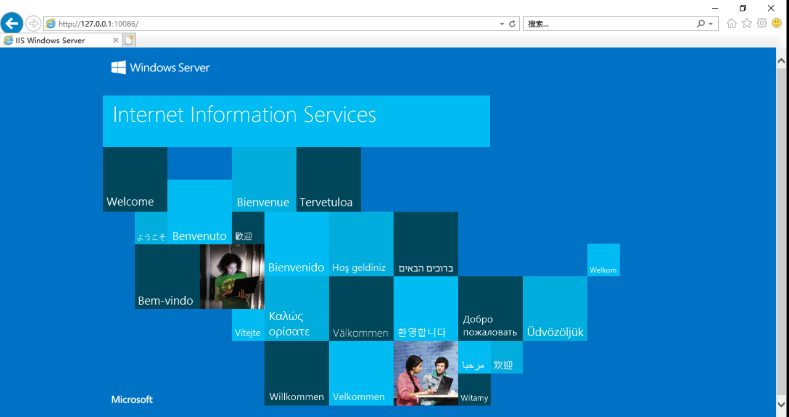

### 安装

仪表板点击添加角色功能

之后按照以下步骤依次进行：

1. 安装类型：基于角色或功能的安装
2. 服务器选择：直接选默认的那一个
3. 服务器角色：勾选 Web 服务器
4. 完成

> 在我们勾选了 Web 服务器后，会多出来一个 IIS 的配置，大家按照个人所需依次添加想要的扩展即可！

 

点击仪表板右上角的 `工具->IIS 管理器`

目前我们默认仅有一个网页，为 IIS 初始提供的  
展开右侧树状图即可找到

右键点击默认网址，选择“编辑绑定”即可指定网址的 IP 以及端口

 

我在这里设置了默认端口为 10086，那么我们直接在虚拟机内访问本地地址即可看到初始网页

> 访问地址：127.0.0.1:10086 （如果你没有修改端口，直接输入 127.0.0.1 即可！！！）

 
