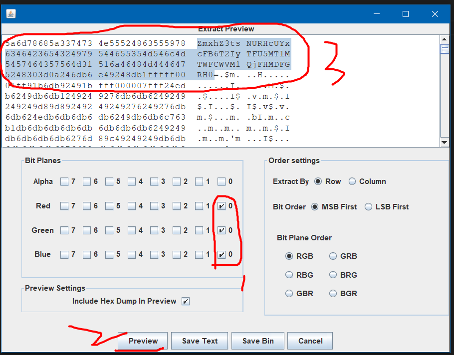

### StegSolve

#### RGB 低位分析

提示：如果遇见了 bmg 图片，可以尝试 binwalk、foremost 等分析隐藏文件，或者使用 stegsolve 进行隐藏数据分析

首先把图片导入 stegsolve，点击菜单栏的“data extract”

在数据分析窗口，按照以下步骤执行：

1. 勾选 RGB 三个低位
2. 点击 preview，查看二进制数据
3. 在解析结果可见头部有一串可以的 base64 编码，将其解码后得到 flag

 
