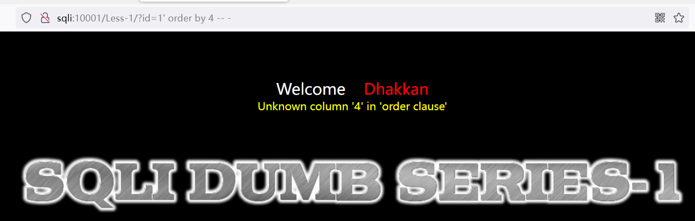

### #与--+

#### 1' or 1=1

这是最基础的一个 sql 注入语句

常见于前端直接将用户输入的内容拼接到 SQL 查询语句内，造成攻击者可以利用此特性进行注入操作

假设有这么一个以 php 编写的查询语句： `select username,password from users where id='$id'`  
可见其中的变量$id 就是我们编辑框内输入的内容；

如果我们输入的内容为 `1' or 1=1` 的话，那么最终的查询语句就变成了：  
`select username,password from users where id='1' or 1=1'`  
通过在 1 后面添加单引号，把原本的单引号拆分出来，而 1=1 又必定为真，此时就可以完美的查询出所有结果了！

 

#### 注释符号

事实上以上的代码是无法直接运行的，SQL 语句执行完毕后会直接报错，因为最后多出来的一个单引号我们没有闭合！

此时我们通过在语句末尾加上#或者--+就可以把后面的所有内容全部注释，从而遏止对 SQL 查询语句的影响  
如：

1. `select * from users where id='1' or 1=1 #'` 直接注释掉末尾单引号
2. `select * from users where id='1' or 1=1 --+'` +会被直接解析为空格，此时`--`同样可以注释掉末尾单引号

 

说白了，我们只要保证 `--` 后面的东西可以被全部注释就完事了，所以我们在 `--后面加个空格` ，再写入任意字符都是可以完成注释的！！！  
下面是一个注入语句：  
`id=1 and 1=1 -- asdjqiwudoqbahdaosdhosa`

 

### union

> 以 sqli-webs 靶场作为介绍

 

#### 单一使用 union

union：取并集，自动剔除重复内容  
union all：取并集，保留所有内容  
因为表中重复内容出现概率很低，大多数均使用 union

观察以下代码：
`http://sqli:10001/Less-1/?id=0' union select 1,2,database() --+`

进行分析可得：

1. 前后数据表的列数均为 3 列
2. --+前面讲过，即注释掉后面所有的代码
3. id=0 使得前一个数据表查询不到东西，故仅显示后面查询到的内容！

 

#### concat_ws

concat_ws(spet,str1,str2)，spet 为分隔符，使用 16 进制表示，str1 和 str2 就是相互连接的两个字符串

常配合 group_concat 使用！

 

### 判断技巧

#### union 撞列

使用 `1' order by 4 --+` 来判断数据表的列数

 

#### 判断字符注入

字符型注入：使用 `1 and 1=1` 成功，且 `1 and 1=2` 没有报错信息；  
解析：因为字符型注入结果为：`select * from xxx where id='1 and 1=1'`会自动把非字符内容全部忽略掉，故结果为`id='1'`，所以怎么改都可以正常查询

整数型注入：使用 `1 and 1=1` 成功，且 `1 and 1=2` 报错；  
解析：因为没有单引号包裹，故 1 后面的语句会被判定为错误的`select * from xxx where id=1 and 1=2`

 

####
