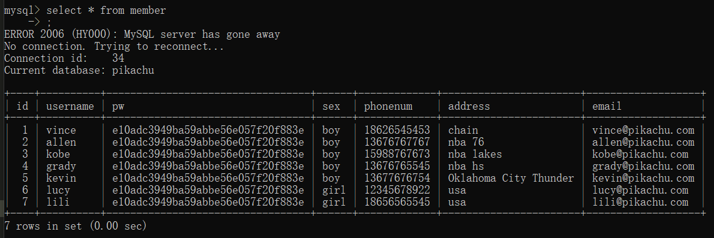
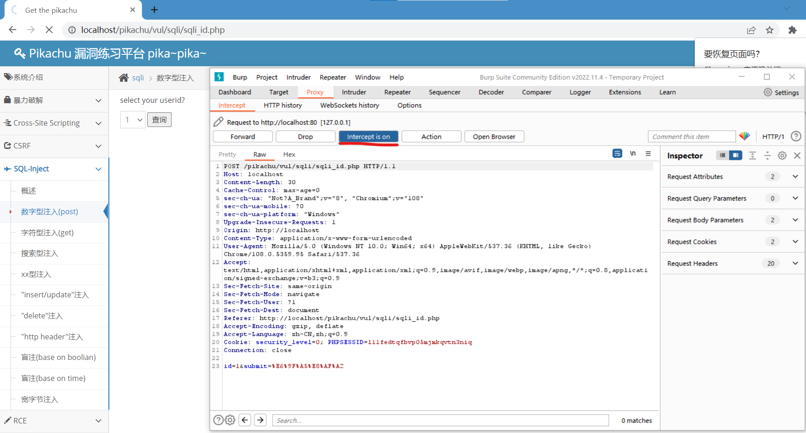
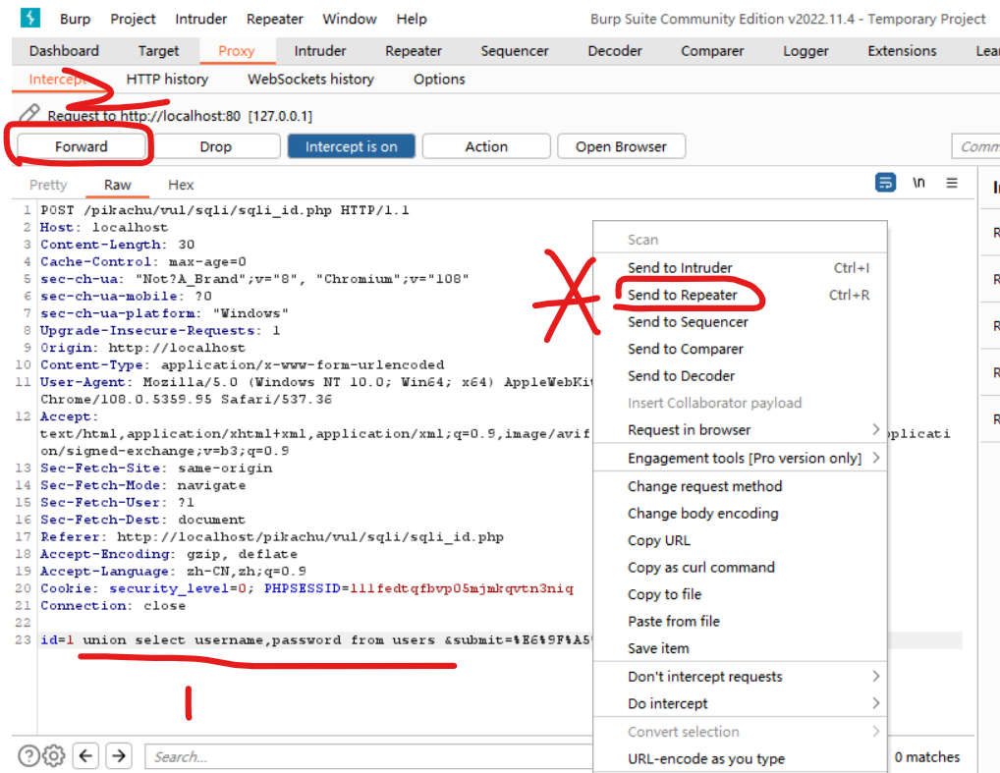
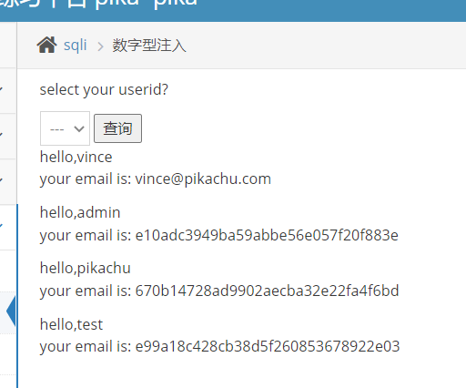

### 数据库查询

**使用到的环境：**

1. pikachu 靶场
2. phpstudy 搭设的服务器

<br>

管理员模式下运行命令提示符，依次输入以下代码，查询 pikachu 数据库内的指定表信息

```sh
# 链接数据库
mysql -u root -p

# 输入密码
root

# 切换数据库为pikachu
use pikachu

# 查询其中表member的所有内容
select * from member;
```

查询结果：



<br>

### burp 抓包

新建一个 burp 项目

开启拦截浏览器：`proxy->intercept->open browser`

输入 URL，转到 pikachu 对应的 sql 注入测试面板：`http://localhost/pikachu/vul/sqli/sqli_id.php`

回到 burp，点击 intercept off，把拦截模式设置为开启状态！

回到靶场，随意选择一个 userid，点击查询

> 此时网页 POST 请求被 burp 拦截，直到我们点击 forward（通过，允许请求），或者 drop（丢弃，放弃请求），才会执行下一步操作！！！



<br>

回到 burp，找到最后一行，在 id=1 后面直接添加一条联合查询语句来获取 users 表中的所有内容：  
`union select * from users `

此时我们可以点击图中数字标注 2 的 forward 来发送请求；

或者点击星号处的 send repeater 来进行模拟请求  
在 repeater 中的模拟请求不会干扰 intercept，它会一直保持拦截的状态！！！



<br>

bingo!

返回浏览器，发现我们已经通过简单的 SQL 注入拿取了对应表的信息了！



<br>
