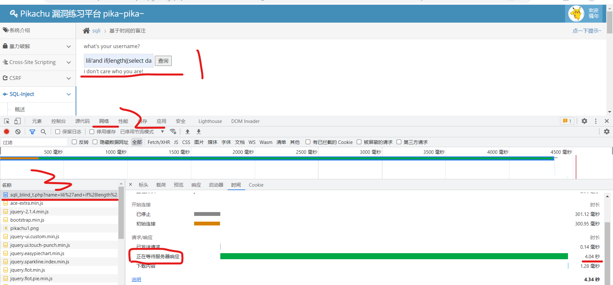

### 布尔盲注

> 盲注即网页不会返回任何报错信息，我们只能根据极为有限的信息（譬如仅有的正误两个响应信息），来判断我们猜的（或者暴力破解）的数据库名是否正确等等

 

### 时间盲注

> 问题：这个更绝，无论你输入啥，网页上只返回同一个信息  
> 使用 pikachu 靶场演示

和布尔盲注不同的是，这里需要使用 if 搭配 sleep 函数猜测数据库名称长度；  
下面的代码表示如果数据库名称长度为 7，则延迟 4s，否则不延迟  
`lili'and if(length((select database()))=7,sleep(4),0) -- -`

点击查询按钮，同时打开开发者工具，进入网络选项，找到我们发送的 GET 请求；  
可见在最下方的“正在等待服务器响应”这一条的持续时长为 4s  
证明数据库长度确为 7

 

后面就好办多了，使用 left 配合字符串判断即可一步步推出数据库全称了！  
为了加快检测进度，这里延迟时长改为 1s

`lili'and if(left((select database()),1)='p',sleep(1),0) -- -`

 

