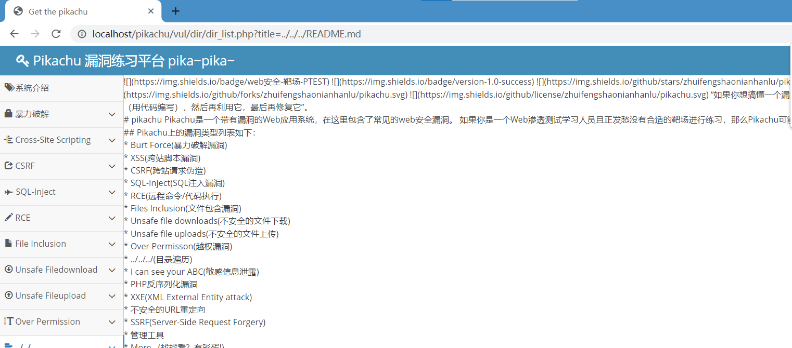

### 速览原理

> 平台依然使用 pikachu

可见图中 URL 的 query 中有一个参数 title，它能读取网站文件夹下的任意一个文件，我们就可以凭借这一特点来直接获取网站目录下的私密性文件（譬如说网站配置文件，里面有数据库的账户密码等）

至于如何获取网站的详细目录？7kbscan 可以完成扫描操作，你可以试试

下面我们就通过目录遍历漏洞成功读到了 `README.md` 文件

 
