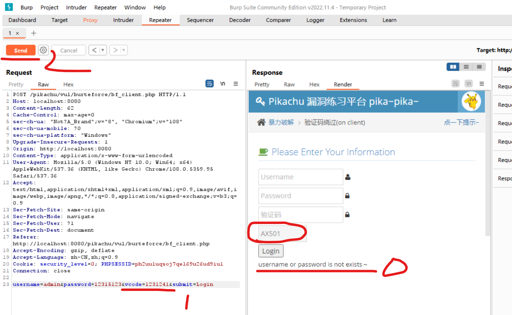
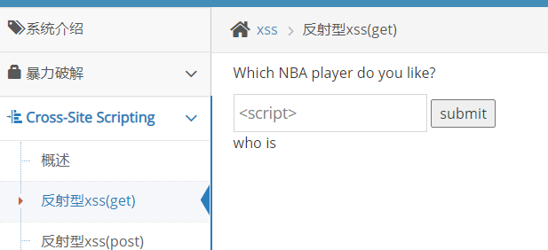
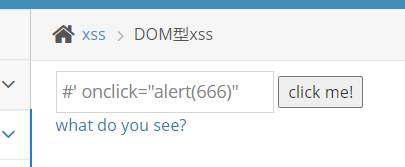
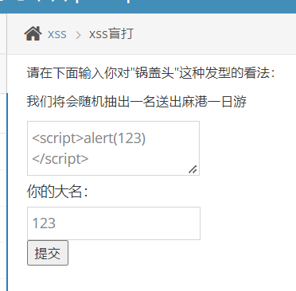
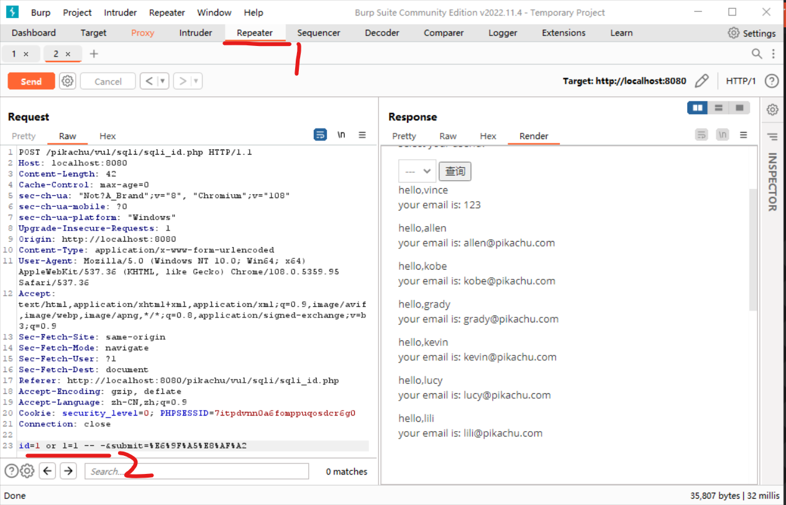
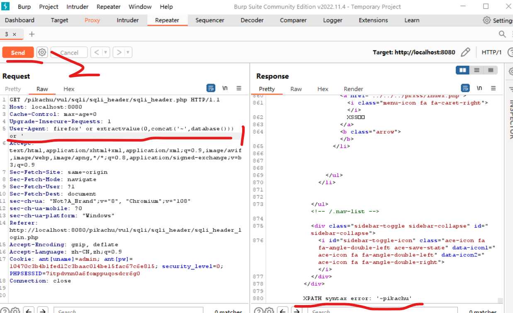

## 安装

### 文件准备

小皮面板（建议使用 V8 最新版，更加方便）：https://www.xp.cn/download.html

pikachu 靶场源文件：https://github.com/zhuifengshaonianhanlu/pikachu

<br>

> 靶场文件可以使用 ssh 快速 clone

### 安装配置

安装小皮面板；

打开面板，直接启动 apache 以及 mysql


> 如果 mysql 无法启动，请查看是不是另一个数据库占用了 3306 端口，如果是，请在管理员模式下运行命令提示符，输入：  
> netstat -ano 找到占用 3306 端口的程序，获取其 PID  
> taskkill -f -pid xxx 根据 PID 强行杀死指定程序（没啥危害，直接杀死即可！）

<br>

此时在浏览器内输入 localhost 如果正确的显示了提示文本，那么表示服务器配置成功！

<br>

### 靶场设置

首先进入 pikachu 靶场根目录下的 inc 文件夹，找到 `config.inc.php` 配置文件  
修改 `DBPW` 字段为默认的数据库密码 root

```php
<?php
//全局session_start
session_start();
//全局居设置时区
date_default_timezone_set('Asia/Shanghai');
//全局设置默认字符
header('Content-type:text/html;charset=utf-8');
//定义数据库连接参数
define('DBHOST', '127.0.0.1');//将localhost或者127.0.0.1修改为数据库服务器的地址
define('DBUSER', 'root');//将root修改为连接mysql的用户名

// 在这里修改为默认的数据库密码root
define('DBPW', 'root');

define('DBNAME', 'pikachu');//自定义，建议不修改
define('DBPORT', '3306');//将3306修改为mysql的连接端口，默认tcp3306

?>
```

打开小皮面板根目录，找到其下 WWW 文件夹，把我们 clone 的 pikachu 靶场直接扔到这里面来！

然后重启 apache 服务器即可

网址输入 localhost/pikachu 访问我们的靶场，之后点击首页内的红字来进行靶场初始化，初始化完毕后即可正常使用我们的靶场啦！

<br>

## 流程全解

### 暴力破解

**基于表单的破解**

burp 拦截请求，修改$，发送到 intruder 里面，网 payloads 添加密码字典；

直接把账户名或者密码撞出来就行；

<br>

**客户端验证码绕过**

查看源码，发现是 js 算法随机生成验证码，然后前端验证输入的码是否匹配，如果匹配才允许发送请求给后端

先乱输一个用户名及密码，填入正确的验证码，使用 burp 拦截登陆请求；  
拦截到后，发送到 repeater

修改请求中的 vcode 字段，这是我们填写的验证码；  
发现无论我们把 vcode 瞎改成多少并请求多少次，都只会返回“用户名或者密码错误”，而没有验证码错误；

可见，后端没有做任何验证；

使用 intrude 进行爆破即可

> 下图可见，每次请求后验证码都会变，但是即便我们请求的验证码不匹配也无验证码报错！



<br>

**服务端验证码绕过**

后端升级了，他会检测验证码是否为空或填写错误了，并且返回提示！

但是经过多次测试发现同一验证码可以使用多次（即后台保存的验证码有一定生命周期）

记下正确的验证码，在该生命周期内进行爆破

<br>

### XSS 跨站脚本

> 判断 XSS 注入？  
> 首先先输入一些奇怪的标签，比如 script，或者可能便于注入的符号，譬如""''<>?!这些，通过响应来判断前后端对于这些玩意的过滤程度

<br>

**反射型 XSS(GET)**

> GET 表单使用 URL 进行参数传递，不安全

输入一个 script 标签并提交后，发现返回值为空，表示可以使用 XSS（即前端没有对标签进行过滤）



<br>

但表单控制了输入长度，F12 打开开发者工具，选中编辑框，修改 maxlength 的值为无限大，就可以填写任意长度的字符了！

下图表示修改长度限制后输入 `<script>alert('xss')</script>` 进行 XSS 注入；


<br>

**反射型 XSS(POST)**

> POST 表单提交，参数均存储于请求体内，较为安全

<br>

**存储型 XSS**

和反射性 XSS 基本一致，只不过该数据会被存储到后台，而反射性不会；

直接 script 标签注入即可

<br>

**DOM 型 XSS**

> XSS-X 是使用 JS 拼接 DOM 的方式构造元素的，注入方式和这里相一致

类似 SQL 注入，改造闭合关系来构造一个完整的可执行 DOM

源码中是直接把编辑框内容填入 herf 内部；  
使用以下代码，把 herf 闭合，再添加新的属性 onclick 实现 XSS  
`#' onclick="alert(666)"`

所以最终构造的 DOM 是？可见 a 标签自闭合了  
`<a href='#' onclick="alert(666)">what do you see?</a>`



<br>

**XSS 盲打**

前天不反馈执行结果，但是后台会被影响到；

譬如直接 XSS 注入，点击留言后前台没有任何事情发送；  
登陆后台管理系统，网页 URL 修改为：`http://localhost:8080/pikachu/vul/xss/xssblind/admin_login.php`

有趣的事发送了，后台一登陆直接弹窗；

可以使用此方法在管理员一登陆就窃取 cookie，直接获取权限



<br>

**XSS 过滤**

前后端会过滤掉一些高危标签，譬如`<script>`来禁止不正当行为

这是几种绕过行为

1. 大小写，如果后端仅过滤了小写标签，那么我们可以使用大小写混淆： `<scRIPT>`
2. 插入型，后端过滤掉标签，过滤完毕的内容再次结合成完整的标签：`<scr<script>ipt>`
3. 直接注入 img 标签

<br>

直接注入一个 img，因为 src=x 必定是错误的，所以直接执行 onerror 内部的代码  
``

<br>

**xss 之 htmlspecialchars**

HTML 会对符号进行编码；  
譬如空格会编码为&nbsp  
这个执行编码的函数就叫做：htmlspecialchars

但有效符号会原样保留而不编码，这就便于我们使用闭合的方法来进行注入；

和 DOM 型 XSS 差不多，前面的 asd' 为了和 herf 参数闭合，后面的 onclick 就自行发挥了  
`asd' onclick='alert(123)'`

<br>

**xss 之 href 输出**

把值插入到 herf 里面

现在注入就需要使用 Javascript:xxx 的形式了

注入后的标签是：  
`<a herf="Javascript:alert(123)">123</a>`

<br>

**xss 之 js 输出**

安装 pikachu 给我们提示，输入 tmac，直接看网站源码；  
这段代码位于 HTML 文件内

```html
<script>
	$ms = "tmac";
	if ($ms.length != 0) {
		if ($ms == "tmac") {
			$("#fromjs").text("tmac确实厉害,看那小眼神..");
		} else {
			//            alert($ms);
			$("#fromjs").text("无论如何不要放弃心中所爱..");
		}
	}
</script>
```

<br>

我们可以使该 script 代码块先行闭合，再构造我们自己的一个代码块来写入恶意代码就完事了！！！

不难得出以下注入代码：`123' </script><script>alert('xss')</script>`  
前半段直接闭合了 HTML 中的 script 标签，后半段右构造了自己的一个 script 标签并执行

<br>

### CSRF 跨站请求伪造

> XSS 直接拿到管理员权限然后乱来  
> CSRF 借用管理员身份（伪装，实际并没有取得权限），去拿到信息

<br>

**CSRF (GET/POST)**

原理简析：譬如有一个修改用户信息的提交按钮（提交方法使用 GET），使用 burp 拦截，得到提交信息；我修改其中的提交值，复制 URL；  
把该恶意 URL 发给受害者，因受害者目前有修改自身信息的权利，故点击此 URL 后立即修改了其个人信息；  
攻击者使用了隔墙打牛的方法，让受害者无意间修改了自己的信息而全然不知，攻击者直接拿取密码进入访问；

> 此方法仅限于网站没有给信息加密的情况下，且如果提交方法使用 POST，会更复杂一些，有些网站还会引进 token 进行数据加密！

<br>

> 红线处即为暴露出来的个人信息，我们需要修改的就是这里！至于怎么让受害者点击，请咨询社工。。。


<br>

**CSRF TOKEN**

> 待补

<br>

**防范措施**

1. 修改个人信息前验证密码
2. 添加随机 token
3. 使用会话过期机制
4. 别用 GET，改用 POST
5. 跨域检测

<br>

### SQL 注入

**数字型注入**

> 字符型注入以此类推，只不过注入时需要注意单引号的放置位置

首先测试一下，发现该注入使用 POST 方法，没法直接修改 URL 进行注入；

burp 拦截，获取内容发到 repeater

可见末行有一个属性 id，假设其为查询语句中的判定条件，这里就存在 SQL 注入条件；  
将原数字修改为喜闻乐见的万能钥匙：`1 or 1=1 -- -`

bingo!成功取得所有数据



<br>

**搜索型注入**

假设可能的 SQL 查询语句为：  
`select xx from xx where xx like '%n%'`

这里需要使用百分号%构造闭合；  
不难得出以下注入代码：`123%' or 1=1 -- -`

<br>

**xx 型注入**

不多说，直接构造闭合：`123') or 1=1 -- -`

<br>

**CRUD 报错信息注入**

点击注册，我们使用老套路试出用户名和密码这俩栏存在 SQL 字符型注入漏洞

一般常见的插入语句格式为：`insert('123','123','123')`

故我们注入的语句应该这样写：`cxk' or updatexml(1,concat('~',database()),0) or '`  
合成的语句是这样的：`insert('cxk' or updatexml(1,concat('~',database()),0) or '','xxx','xxx')`

<br>

**httpheader 注入**

为了图省事，后端可能会根据前端传过来的 header 进行 SQL 查询；

譬如我抓取到了 header，对其中的 user-agent 使用 SQL 注入；

这次玩点新花样，使用 `extractvalue(0,concat('~',database()))` 来构造 XML 异常；

在 repeater 里面直接 send，response 翻到最底部就可以看见报错了！



<br>

**布尔盲注与时间盲注**

不做介绍，请移步上级目录下的 SQL 注入模块内查询专题文章

> 真不是懒，是真的懒

<br>

### 文件上传

**MIME-TYPE**

文件上传会限制类型，类型一般规定在 MIME 里面，为此我们仅需按照以下几步走即可：

1. 选择一个非图片文件，开启 burp 拦截后点击上传文件
2. 拦截到的内容发送到 repeater 里面
3. 修改 content-type 的值为 image/png，将恶意文件伪装成图片类型的
4. 直接 send 发送，即可上传恶意文件！！！

<br>

### 越权漏洞

**水平越权**

按照提示内容，输入账户密码并查看详细信息；

修改 URL 中的 username 字段，回车运行，发现查找到了另外的（平级）用户，则存在水平越权  
`http://localhost:8080/pikachu/vul/overpermission/op1/op1_mem.php?username=lili&submit=%E7%82%B9%E5%87%BB%E6%9F%A5%E7%9C%8B%E4%B8%AA%E4%BA%BA%E4%BF%A1%E6%81%AF#`

<br>

**垂直越权**

即低级别用户使用高级别用户的权限乱搞

首先进入超管 admin 账户，点击添加用户，burp 抓包，获得添加用户的请求，把他发送到 repeater 里面去；  
之后 drop 掉该添加用户的请求！！

此时退出超管账户；

进入普通用户账户，burp 抓到该用户的 PHPSESSION  
回到 repeater，修改添加用户请求的 PHPSESSION 为普通用户的，此时表示以普通用户的身份去执行超管的添加用户的操作！  
填写完毕后直接 send；

此时再刷新一下，发现用户添加成功，表示存在垂直越权！


<br>

### 反序列化
