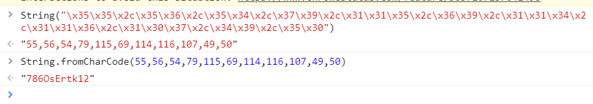

### simple_js

默认弹出窗口，先 f12，查看源代码，发现 js 代码如下

```html
<html>
  <head>
    <title>JS</title>
    <script type="text/javascript">
      function dechiffre(pass_enc) {
        var pass = "70,65,85,88,32,80,65,83,83,87,79,82,68,32,72,65,72,65";
        var tab = pass_enc.split(",");
        var tab2 = pass.split(",");
        var i,
          j,
          k,
          l = 0,
          m,
          n,
          o,
          p = "";
        i = 0;
        j = tab.length;
        k = j + l + (n = 0);
        n = tab2.length;
        for (i = o = 0; i < (k = j = n); i++) {
          o = tab[i - l];
          p += String.fromCharCode((o = tab2[i]));
          if (i == 5) break;
        }
        for (i = o = 0; i < (k = j = n); i++) {
          o = tab[i - l];
          if (i > 5 && i < k - 1) p += String.fromCharCode((o = tab2[i]));
        }
        p += String.fromCharCode(tab2[17]);
        pass = p;
        return pass;
      }
      String["fromCharCode"](
        dechiffre(
          "\x35\x35\x2c\x35\x36\x2c\x35\x34\x2c\x37\x39\x2c\x31\x31\x35\x2c\x36\x39\x2c\x31\x31\x34\x2c\x31\x31\x36\x2c\x31\x30\x37\x2c\x34\x39\x2c\x35\x30"
        )
      );

      h = window.prompt("Enter password");
      alert(dechiffre(h));
    </script>
  </head>
</html>
```

分析得出，无论弹出的对话框输入密码正确与否都只会返回同一个字符串；

真正的密码就是这以下代码中的 16 进制加密数据

```js
String["fromCharCode"](
  dechiffre(
    "\x35\x35\x2c\x35\x36\x2c\x35\x34\x2c\x37\x39\x2c\x31\x31\x35\x2c\x36\x39\x2c\x31\x31\x34\x2c\x31\x31\x36\x2c\x31\x30\x37\x2c\x34\x39\x2c\x35\x30"
  )
);
```

<br>

同样的，直接在开发者工具的控制台内使用 String 函数对这段编码进行解码

之后编码转换，直接获取 flag

flag 为 `786OsErtk12`

> 注意提交是的格式！！！所以正确答案应该为 cyberspace{786OsErtk12}



<br>

### PHP2

> php 是给开发者看的源代码，phps 是为了直接在网页中查看 php 源码而设计的文件

通过 index.phps 获取网页 php 源代码

```php
<?php
if("admin"===$_GET[id]) {
  echo("<p>not allowed!</p>");
  exit();
}

$_GET[id] = urldecode($_GET[id]);
if($_GET[id] == "admin")
{
  echo "<p>Access granted!</p>";
  echo "<p>Key: xxxxxxx </p>";
}
?>
```
