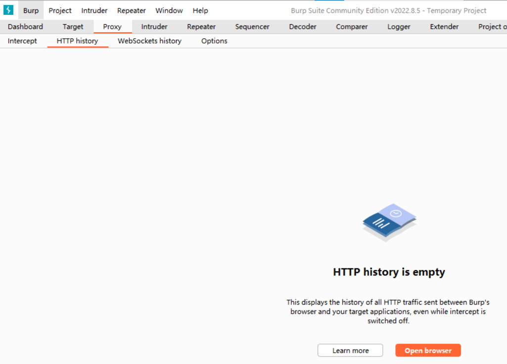
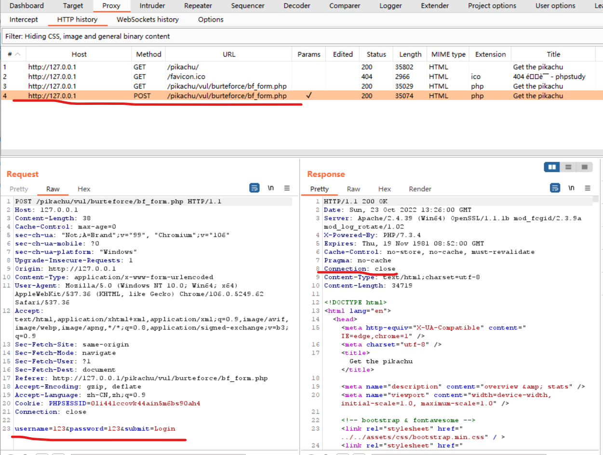
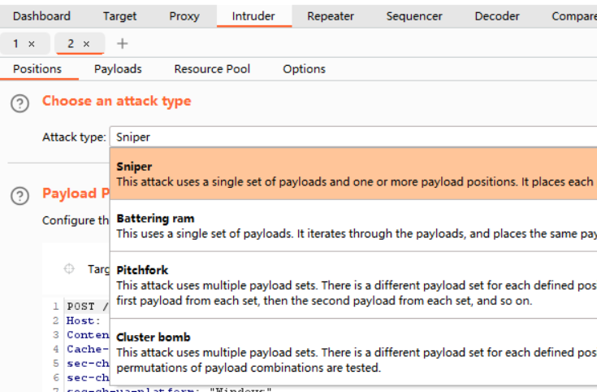
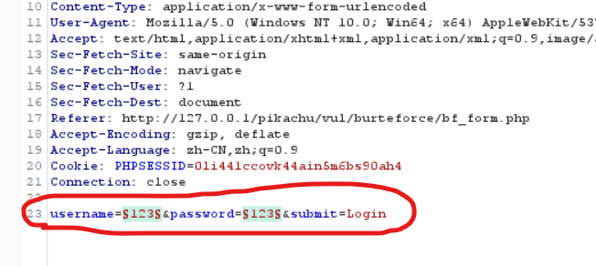
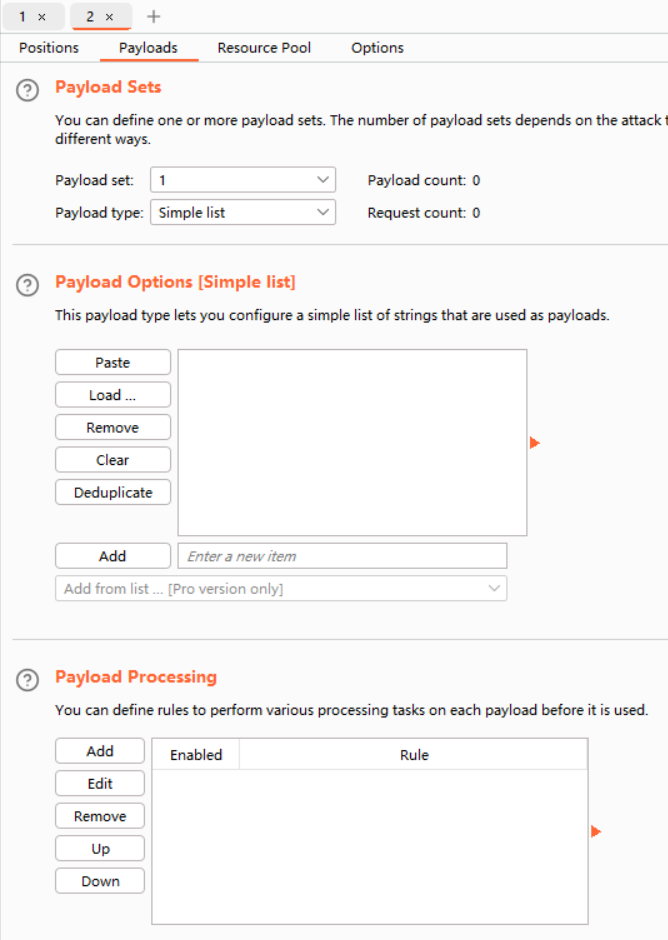
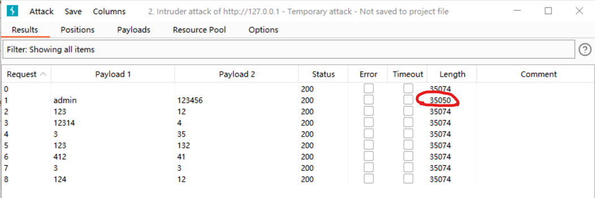

### pikachu|基于表单的暴力破解

> 由于该软件用法过于庞杂，没法系统解析，只能以案例带动内容讲解，还请各位谅解！！！

首先开启 phpstudy，把我们的 pikachu 靶场跑起来（靶场配置请看我的另一篇文章）

 

#### 开始监听

开启 burpsuite，社区版专业版无所谓，功能都差不多

依次选择 burp->proxy->http history，进入下图所示面板，并点击 `open browser`，打开内置浏览器

我们在内置浏览器开启 pikachu 对应页面，此时所有的网络活动都被 burp 监听

 

#### 获取请求

我们先随便在靶场中填入错误的用户名和密码并提交

此刻在 burp 面板就出现了我们刚刚执行的 submit 操作，他的请求方式为 POST，即表单提交；

右键点击该 POST 请求，选择 `“send intruder”`

 

#### intruder

> intruder，入侵者，顾名思义，该面板的作用即通过修改请求体或者请求头等信息，伪造大量数据发送给服务器  
> 我们可以利用这一点，将准备好的密码字典按照一定规则请求服务器，直到找到能成功登陆页面的用户名和密码！

`attacktype`，主要用到的攻击类型就两种：

1. sniper：即你设置的所有变量都同时使用一个字典
2. pitch fork：你可以设置 N 多个变量，并为这些变量分别制定各自独立的字典

 

我们需要让用户名和密码分别使用不同的字典，故采用 `pitch fork` 方式

先点击最右侧的 `clear $` 删除当前页面的所有变量

再选中请求体最下面的 username 和 password 后面的值，点击 `add $` ，把它们都变成变量！

 

#### payloads

> payloads，负载设置，在这里指定我们的字典以及对于字典的编码格式

进入 payload 面板，简要介绍一下三个主要分类：

1. payload set 负载配置，即我们要针对哪一个变量进行负载设置
2. payload options 为负载添加字典
3. payload processing 为字典添加特定编码

 

请注意！因为我们设置了两个变量，所以在添加字典时请务必保证二者字典项数目一致，否则 burp 只会根据最少字典数目进行对应次数的请求！

我们随意的为这两个变量在 options 中添加字典，靶场已经指明了登陆的用户和密码分别为 `admin 以及 123456`，我们随机的把它们插入进去

 

#### 开始攻击

一切准备完毕，点击顶部菜单栏的 `intruder -> start intruder`，让 burp 自动根据字典进行攻击

攻击结果如下，可见，当我们使用正确的用户名以及密码进行配对后，返回的长度（length）和其他请求失败的 request 是不一样的！我们即可根据此特性找到对应的用户名以及密码

 
