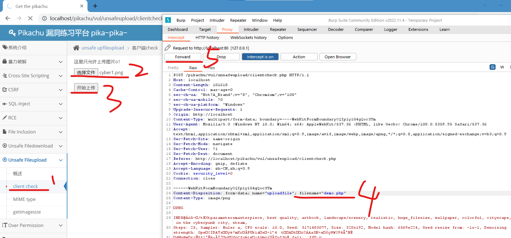

### 原理与快速实践

> 原理：通过拦截上传请求，修改上传文件后缀（或路径），从而绕过文件类型检测

依然是我们熟悉的 pikachu

选择 `unsafe fileupload->client check`  
随意选择一张图片；

使用 burp 开启拦截，此时点击“开始上传”  
拦截到的信息中，按照下图修改指定位置的文件名称，即可挂载一个 php 文件上去了！

你可以使用此方法上传一句话木马，然后运行

 
