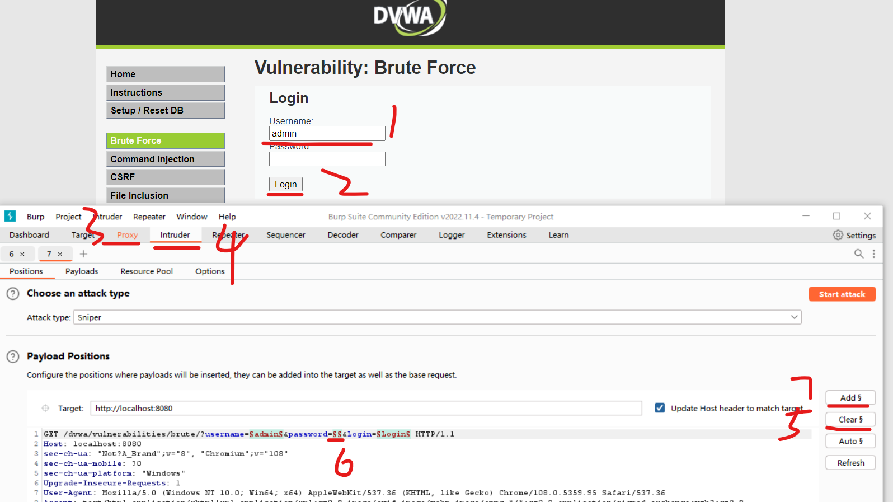
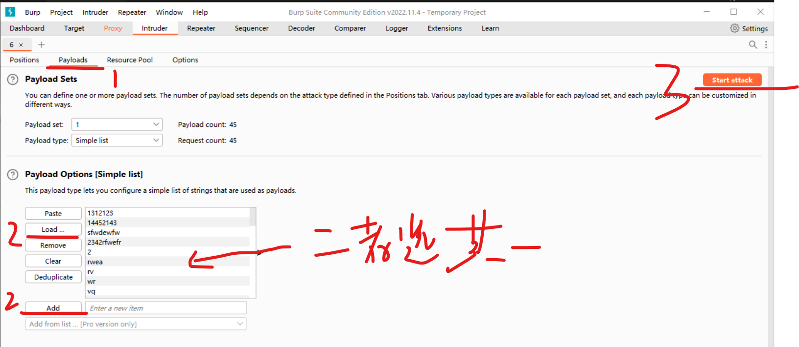
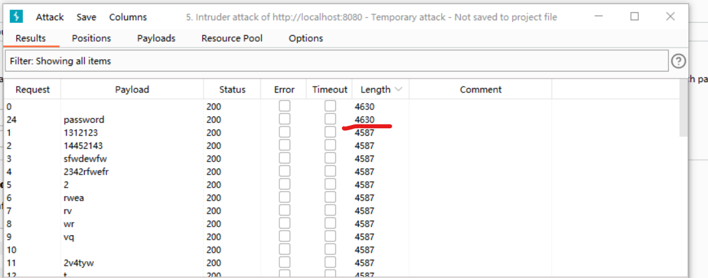
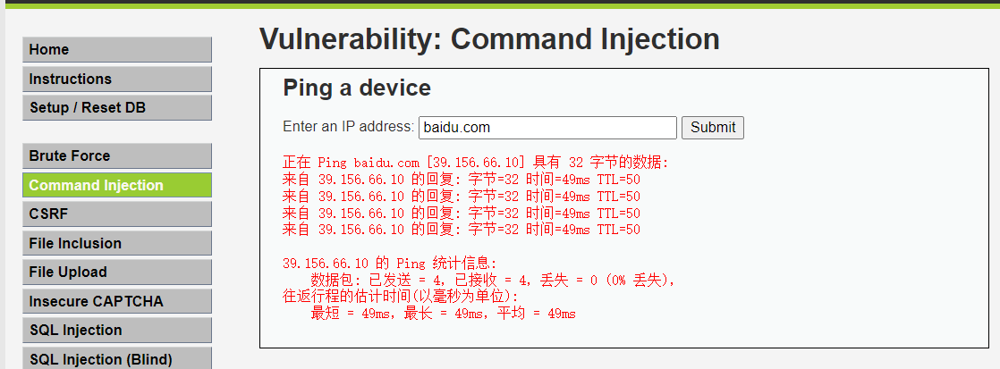
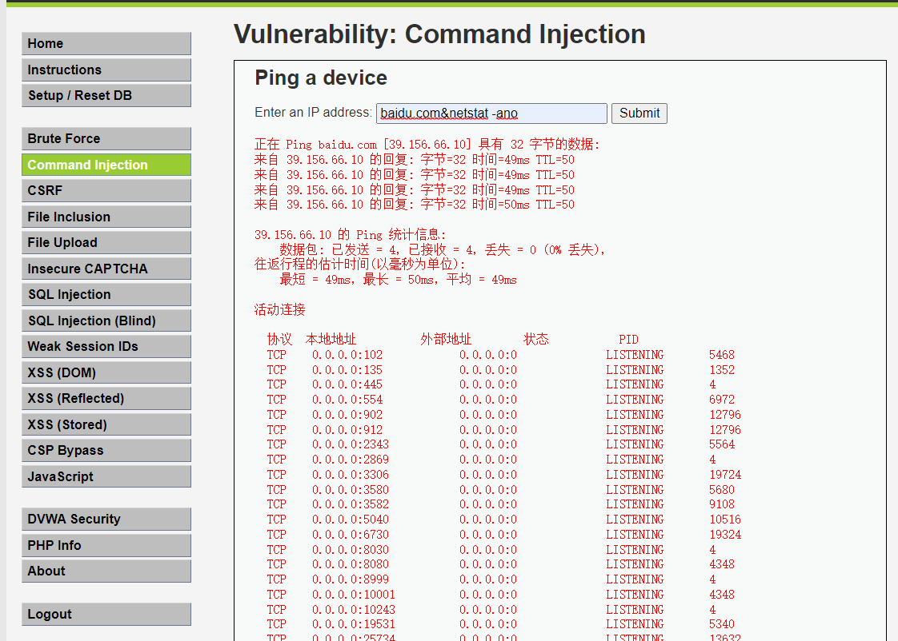
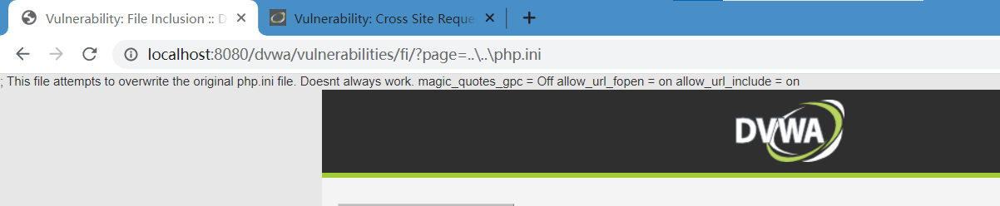
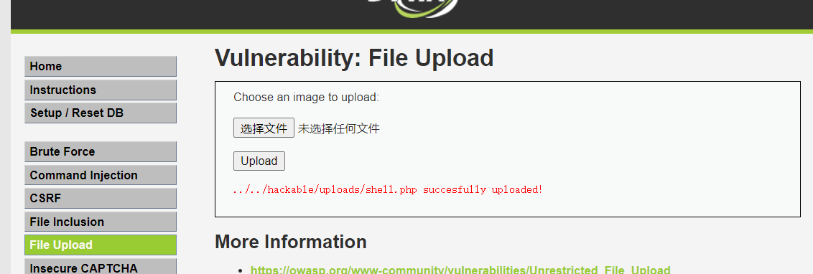

### LOW 等级

#### brute force 爆破

> 正确答案：账户 admin，密码 password

假设我们已经得到了账户名为 admin

使用 burp 进行 intercept 拦截登陆 GET 请求，并将拦截结果发送到 intruder 内以便后续爆破；

在 intruder 内，首先`清除所有$`，然后在 password 后面`添加$`

 

转到载荷 `payloads` 标签页；

在 `payload options` 内导入外部字典，这里我为了方便，直接手动添加了一些，其中就包含了正确的密码 `passowrd`

点击 start attack 来让 burp 自动爆破

 

直接根据 length 从大到小的排序查看爆破结果，当且仅当密码正确对应后，length 才会不一致；  
如图，正确密码对应的响应长度为 4630，而其他错误密码响应长度均为 4587

 

#### command injection 命令注入

> 为避免编码错误，请先前往 dvwa 网站根目录下，找到文件 `dvwa/includes/dvwaPage.inc.php` 并将其中所有的 `utf-8` 替换为 `gb2312` 即可！

如下图，我们可以输入一个 baidu.com，得到了 ping 后的结果；

 

这就提供了一个漏洞，我们可以在原网址后面使用一个&加上要执行的代码，即可借助命令行获取网站的私密信息！

譬如请求值为：`baidu.com&netstat -ano`

不仅得到了 ping 的请求结果，同时直接获取了主机所有开放的端口

 

#### CSRF 跨站请求伪造

首先随意输入一个密码，并用 burp 拦截，点击提交后在 intercept 页面查看其为 GET 请求

复制请求后的网址，发现是这样的：  
`http://localhost:8080/dvwa/vulnerabilities/csrf/?password_new=root&password_conf=root&Change=Change#`

注意其中的两个参数 password_new 和 password_conf，分别表示新密码以及确认密码；  
在前端没有做 reference 防护的情况下，直接复制该 url，修改这两个参数的值，然后丢到浏览器执行即可修改密码！

 

#### file inclusion 文件包含

> 如果报错，进入 dvwa 根目录，找到 php.ini，设置 allow_url_include 为 on  
> 然后在 phpstudy 内打开 php 的“远程包含”以及“错误提示”功能

很简单，修改参数并使用相对路径的方式直接查看网站根目录下的任意文件

 

#### file upload 文件上传

low 级别下没有任何检测，什么文件都可以上传，直接上传一句话木马；

使用中国蚁剑链接即可

一句话木马上传成功：

 

#### XSS

low 模式下前端不设防，后端也无任何过滤处理，直接在 URL 的参数 default 注入 js 代码：

`http://localhost:8080/dvwa/vulnerabilities/xss_d/?default=`

 
