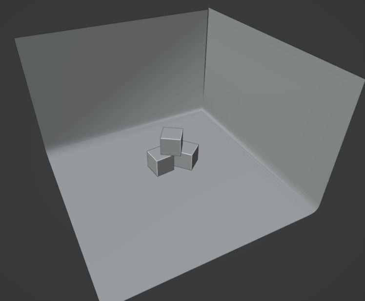
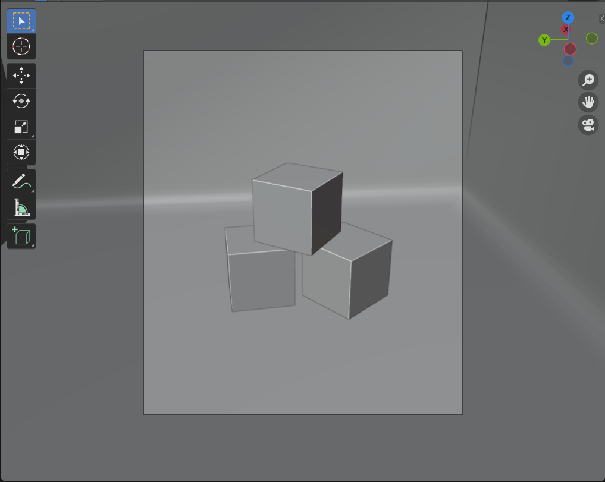
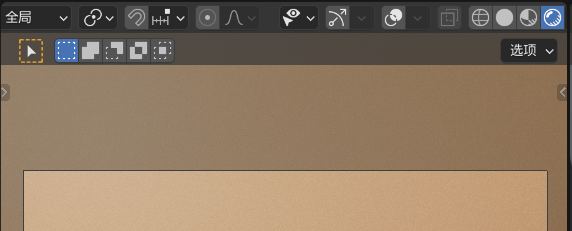
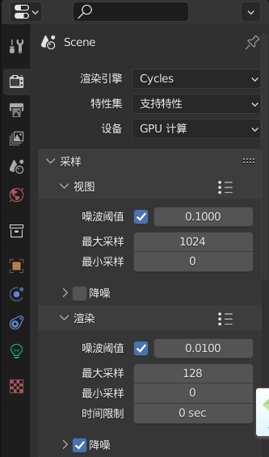
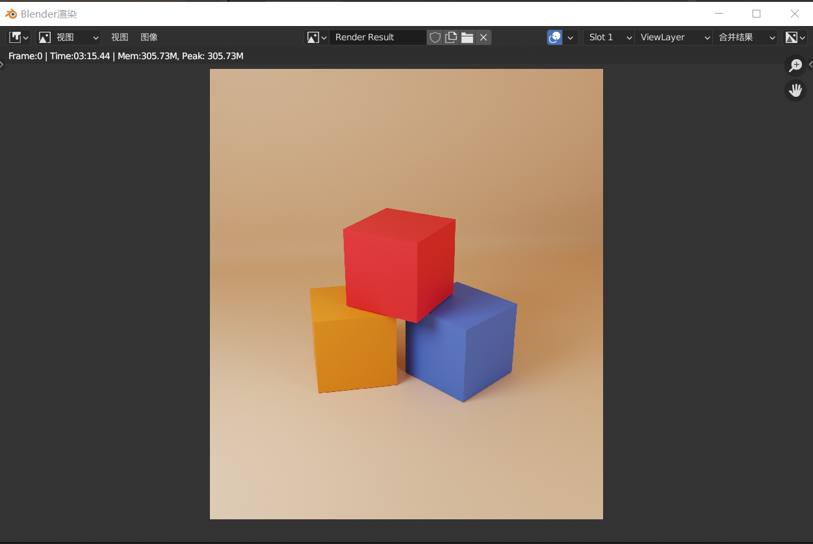

## Blender 快速入门-场景搭设

> 本篇主要介绍 blender 中常见的场景环境搭设步骤，能协助您快速认知（避免死记硬背相关知识点）与理解完整流程

 

### 基本渲染场景

第一步需要搭设相应的场景：三个立方体、一个背景墙（在此步骤之前把原场景默认的灯光摄像机都删除）

shift a 创建一台摄像机；

点击场景右上角三色轴下方的`摄像机图标`（从上到下数第三个），进入摄像机视角；

按 n 打开检查面板，选择`视图`选项卡，选择 `”锁定摄像机到视图方位”`；

此时进行移动，让渲染窗口（中间未加灰的方框）指向三个立方体，确定好角度后关闭`锁定摄像机到视图方位`，并退出摄像机视角

> 锁定摄像机到视图方位：可以让当前视角与摄像机视角重合，便于选点渲染

鼠标移动到场景和设置面板交汇的分割线处，当光标变成一个左右箭头时，右键点击，弹出菜单选择 `垂直分割`

然后在视图的左侧分割出一个专门用来渲染的区域；

如下图所示，选择右上角的四个渲染球的最后一个： `视图着色方式` ，让视图实时进行渲染

> 视图分割：一左一右的两个视图为设计时常用布局，左侧渲染结果，右侧建模

shift a 创建两个点光源，分别放在三个立方体的左右后方；

主光源强度 1800w+，辅助光强度大约 800w+（根据个人喜好调配）

> 此时整个场景就设置完毕了，由于我们渲染的是白模，故无需对材质做出设置，这里为减少篇幅，选择省略

 

#### 渲染器与渲染设置

> 无需选中任何物体，直接在设置面板点击第二个选项卡即可打开渲染设置

1. 渲染引擎：eevee，默认渲染器，高速实时渲染但质量低；cycle，质量高速度慢，也支持实时渲染；
2. 设备：可以选择 CPU 或者 GPU 进行渲染（如果发现 GPU 选择后是灰色，打开编辑->偏好设置->系统->OptiX，选择你要使用的设备即可；
3. 视图最大采样：即实时渲染时的采样率，如果卡顿可以换成 128
4. 渲染最大采样：推荐使用 128，默认的 4096 太多了，显卡不好带不起来会巨慢

往下拉到底有一个分页叫做”色彩管理”，我们可以任意选择其中的胶片效果，达到类似于 ps 的高对比度效果！

点击菜单栏处的 `渲染->渲染图像` ，完事后慢慢等渲染出图就好了

这边为了层次感更加明显，自作主张为立方体添加了简单的三色材质，如上图就是渲染完成后的结果

> cycle 渲染方式是逐渐消除渲染图中的噪点，最终得到精细化的渲染成图

 

