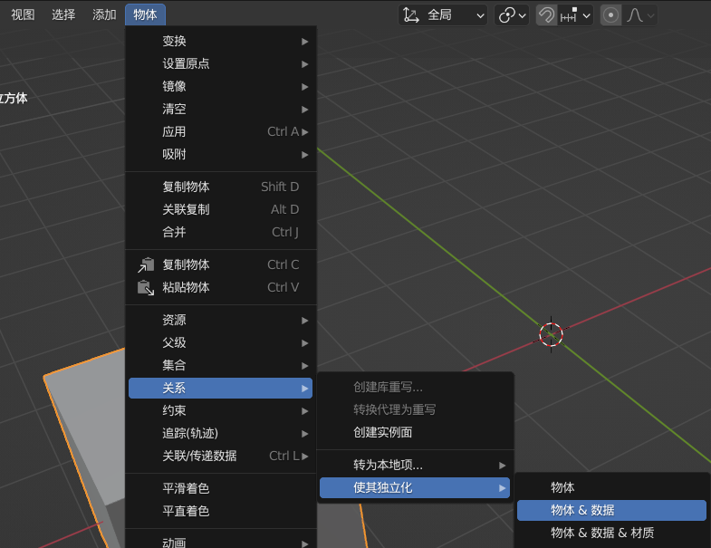

## Blender 入门指南

 

### 基本操作与控制

> ps:文中的 ”饼” 指 blender 中使用快捷键在光标位置处跳出的面板的别称，因为它特别像一张饼；
> 如果快捷键熟练的话，就可以执行高效的 ”甩饼” 操作了！

 

#### 视角操作

鼠标中键旋转视角

Shift + 中键平移视角

Ctrl alt q 切换到四视图

按住 “~” 键不动，弹出的轮盘菜单鼠标滑动到指定的视角，选中后松开“~”即可

把鼠标移动的视图窗口的左下角，光标变成十字时向右拖拽即可生成一个全新的窗口

 

#### 其余操作

G 移动 S 缩放 R 旋转
（在进行上述操作时，分别按住 XYZ 键即可依据各自的轴进行旋转）
（进行上述操作时按住 shift 即可缓慢变换）

按 N 打开或者隐藏变换面板

如果你需要在 XY 构成的平面上移动，则在变换面板中用鼠标按住 X 轴后往下滑顺势选中 Y 轴再松手，即可输入数值完成在该平面上的移动

alt + 相应的变换快捷键，即可对该变换进行重置；
如 alt + g 就是对物体的移动位置进行重置，充值会原始位置；

shift + a 打开新建模型面板

 

#### 编辑模式

按住 tab 跳出切换编辑模式和物体模式的饼

选中一个面（或者点、线）：
按住 alt 点击这个面左右两边的竖线，则会选择与左右竖线依次向接壤的所有面
按住 ctrl 再选择另一个面就会自动计算两面间最短距离并选中最短距离上的所有面

A 全选，双击 A 取消选择

Shift+alt+A 实现多重选择

 

#### 吸附工具

shift tab 开关吸附工具

按 g 后移动物体的途中可以按住 ctrl 来使吸附功能临时打开或者临时关闭

选中增量模式并且选中“绝对栅格对齐”的话，在移动物体的时候刘一直会与栅格对齐；
顶点就是物体的角；
质心就是物体中间的橙色小点

移动时按住 shift 可以使其吸附的栅格更小，也就是移动的越慢

如何将游标吸附到某个物体上？

1. 选择吸附左边的“变换轴心点”切换为 3D 游标
2. 吸附选择顶点、中心
3. 之后我们任意选择立体并进入编辑模式
4. 按 shift s 选择 游标->选中项
5. 这个时候就可以把游标放在该物体该面中心

 

合并两个点：选中两个及以上的点，按下 M，弹出窗口选择合并规则即可

 

#### 增效操作

Shift S 打开游标和选中项位置关系菜单栏

所谓活动项就是我们在选择多个物体时，最后一个选中的物体（该物体边框是黄色的，而其余是橙色的）

物体合并：
选择俩物体，按下 ctrl J，此刻俩物体合并成一个物体，且质心在活动项那个物体上；
进入编辑模式，选择一个面按 L 以选择相邻的所有面，后按 P，按选中项分离即可；

> 分离后的物体原点可能错误，此时右键点击该物体，选择原点->几何中心即可纠正错误

 

#### 重复操作

Shift d 直接复制选中物体；
若此刻我们按 y 键就会约束复制体在 y 轴上移动，此刻再输入一个数并按回车就会按照制定距离复制

复制完物体后 shift R 连续重复前一次复制操作

 

#### 第一视角摄像机操作

Shift ~ 进入第一人称视角，shift 加速，alt 减速

对准某物体按空格可以飞到那个物体上面

右键即可退出该模式

 

#### 物体显示隐藏

在属性顶部选择过滤器，然后选择第一行的小电视图标，就会在场景视图列表显示禁用图标

点击物体右边的眼睛表示在视图中显示与隐藏；
而点击小电视表示禁用与否；
最一个就是渲染与否

H 隐藏选定物体，alt h 显示所有被隐藏的物体

按住 shift 后点击即可反选

 

#### 父子层级

选择多个物体，按 ctrl p 然后选择第一项“物体”，这样就可以把非活动项全部变成活动项的子级实体

选中子级中的某个物体，按 alt p 并选择清除父级，就可以解除父子级别关系

 

#### 交互镜像

选中物体 shift d 后按右键原位复制

先点 ctrl m 进入交互镜像，之后我们再点击键盘的 xyz 表示分别对应 xyz 轴的镜像；

按了 ctrl m 后直接按住鼠标中键，然后把射线移动到对应的轴线上也是可以完成镜像的

 

### 进阶操作

 

#### 网格编辑模式

选中物体 tab 进入网格编辑模式

小键盘 123 选择对应的点线面模式，按住 shift 后则可以实现增选和减选

 

#### 常用修改操作

挤出：E（如果点击挤出后想返回，应该先点左键确认后再使用 ctrl z 撤销！因为点击右键或者 E 会导致重叠点产生）；
选定一个面，alt E 即可选择挤出方式；

滑移：G（滑动时按下 E，可以均匀滑动）

反选：Ctrl I

倒角：Ctrl B
（倒角时按一下 S 后拖动鼠标即可更改倒角段数，更改完后按 A 确认，此刻又恢复到切边深度的更改）

内插面：选中一个面，按 i 即可进行内插面，同时再按住 ctrl 即可让内插面有深度变化

法相缩放：alt s 可以避免物体拉伸过程材质变形

> 倒角后修正贴图错误以及平滑材质的方法：
> 右键点击物体选择平滑着色，之后选择属性栏绿色小三角->法向->自动光滑
> 在倒角面板里面勾选硬化法向也可以实现渲染材质的光滑

 

#### 避免倒角不均匀情况

> 如果我们初始模型是一个正方体，但是我们是用缩放来把他变形了，此时使用倒角就会出现倒角不均匀。

解决办法：缩放完物体后（倒角前），选中该物体，ctrl A，弹出面板选择全部变换，此刻我们在对器倒角处理就会均匀了

 

#### 环切

选中两条及以上相邻的线条后，点击 ctrl r 就会开始执行环切操作

环切即以所有相邻的线条为基准，垂直这些线条创建一条新的线，该线未放置前会以黄色作为预览；

 

#### 多边形建形

新建一个平面，并选择多边形建形工具（该工具类似于拓补工具）
按住 ctrl 后鼠标接近点或者边，等到其变成蓝色后鼠标点击，就会在所点处生成端点并连接
(shift+ctrl 连接有奇效)

 

#### 切变

可以方便的创建一个圆柱体的切面
选择圆柱上面所有点，进入切变工具，按照对应控制轴拉动即可做出完美切面

 

#### 网格编辑时顶点组操作

`ctrl v` 打开顶点处理菜单（编辑模式下）

`Alt v` 让顶点滑移并且滑移后保留原点

可以选择指定的顶点，然后将他们归类到一个顶点组里面，因此添加修改器的时候就可以仅添加到顶点组上，而无需整个物体应用修改器

F 键链接两个顶点（还有填充整个面的特效哦！）
F 仅相连两个顶点，他不会对线段经过区域做出任何改动
J 键相连的同时还会把线段经过的面进行分割，可以说生成的线段真正的建立在这个面上

 

#### 网格编辑室边线操作

Ctrl E 打开边线操作面板

链接两个相互很靠近的边线，使用：先选择上下两排边线，ctrl e 选择桥接循环边

对两个大小一致且方向相同的内插面，可以同时选择正反内插面，并用桥接循环边功能打造

 

#### 网格面的室内操作

Ctrl T 进行面三角化操作

Alt J 把三角面变成四边面

Ctrl F 打开网格面操作面板

 

### 提效小技巧

#### 制作低多边形海面

进入编辑模式，右键点击物体执行细分操作
选择右侧工具栏中的光滑下拉列表中的”随机”
选中所有面，拖动拉杆即可细分

 

#### 断离边线

快捷键 alt D
选中一个端点后，点一下就挤出一个新的端点，此时我们可以按 G 键（滑移）来沿着某条边进行精确操作，确定好位置后左键点击即可结束

 

#### N 多种平滑/黑边修正方法

1. 物体模式，右键点击->平滑着色
2. 给物体添加修改器：表面细分
3. 物体数据修改器->法向->自动平滑（针对解决平滑着色后出现的黑边问题）
4. 倒角后平滑出现黑边：倒角修改器->着色方式->取消勾选硬化法向

 

#### 修改器/材质快速多物体同时赋予

ctrl L 打开关联复制面板；
shift 选择多个物体，在关联面板中选择 `”关联材质”`，会把最后选中的（黄色边线）物体材质赋予给剩余的所有物体（橙色边线）
如下图所示，蓝色方块最后被选，如果关联材质，剩下的两个白色方块也将变成蓝色！

不仅对于材质，而对于动画、物体复制都可以执行关联操作；
可以按照下图的方式去除选中物体之间的关联关系

 

#### 借边

常用于在原位上创建一个同轴物体；
如下图，我们通过借边的操作得出了一个与圆柱顶面原重合的线段；

1. 进入编辑模式，选择你需要分离的边；
2. shift d 复制这些边（最佳办法：shift d 后按 esc，即可原位复制）
3. 按 P，选择分离方式，把这些边都分离开
4. 退出编辑模式；
5. 选择新分离出来的一条线，将其转换成曲线，然后更改深度即可！

> 对面也可是使用此方法，被称作”借面”

 

#### 卡边

即使用环切工具，限制住倒角的区域；
如下图，立方体顶部下方已经卡了一条边，所以在倒角的时候就无法影响该边以下的面，保证模型的完整性；

> 对物体应用细分操作时，可能会导致材质偏移量过大影响整体，此时可以使用卡边的操作，让材质限制在原来的位置

 

#### 衰减编辑

场景窗口顶部栏中，找到倒数第二个按钮（图中蓝色按钮部分，表示目前衰减编辑以及激活）；
此时我们对物体进行移动、旋转、缩放时，鼠标外侧会有一个灰色环，这表示目前操作影响的范围；
通过滚轮控制灰色环大小；

 
