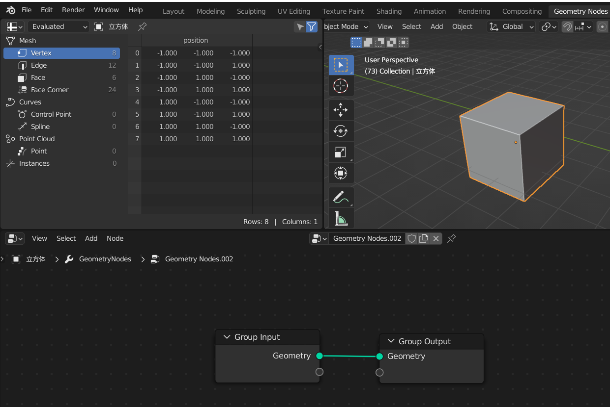
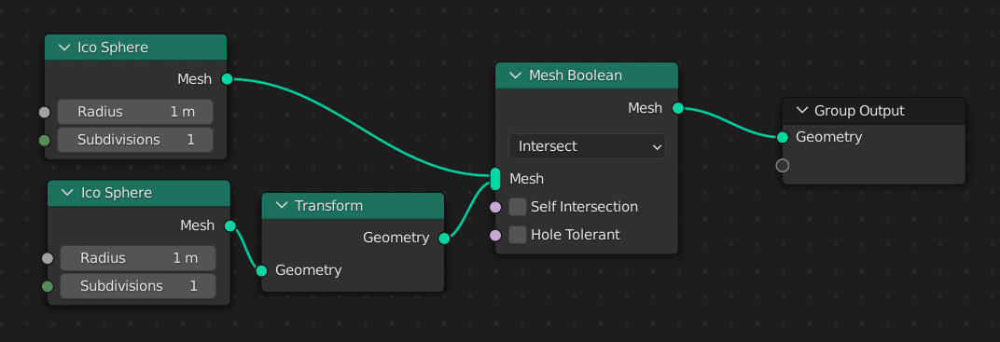
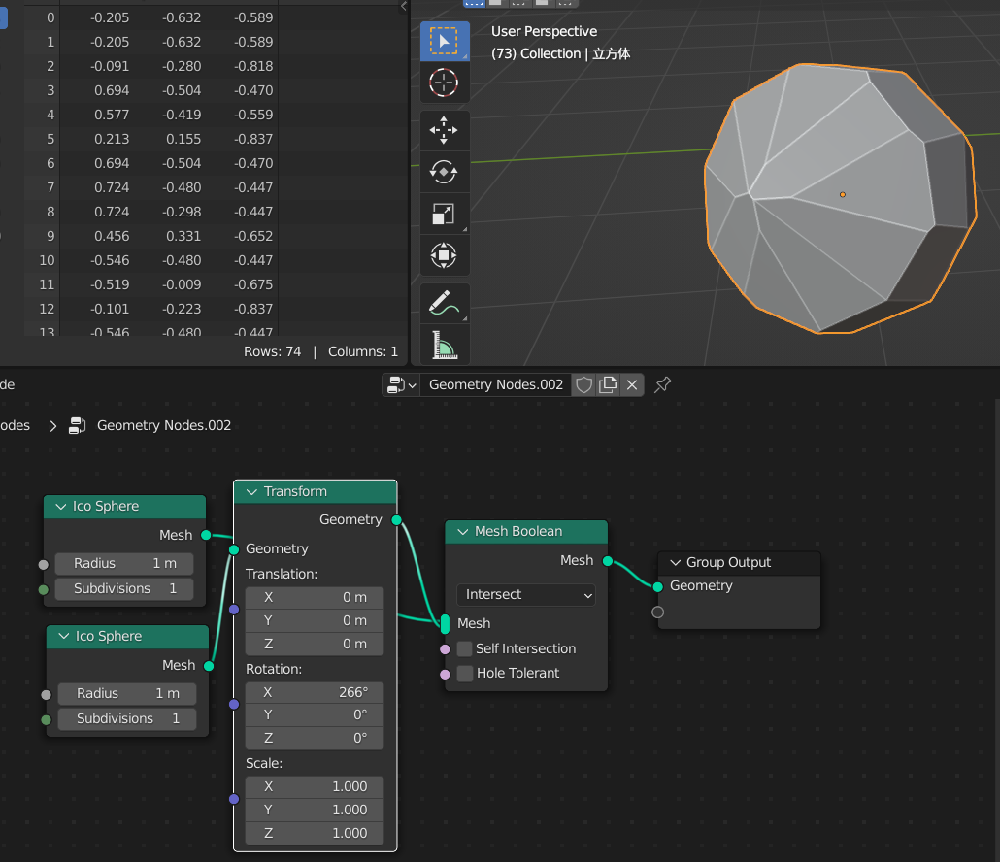

### 准备工作

切换到 blender 的预设布局 `geometry nodes` ，便于处理几何节点操作

所谓几何节点，即通过节点的方式构造几何体，实现诸如变换、生成等多方面操作，甚至能将其单独抽离出来作为一个小功能插件使用，譬如我们接下来要做的岩石生成器

随意创建一个立方体，并点击 new 创建一个默认的几何节点，可以看到下图，只有两个节点，即输入输出  
（不是不想用中文哈，几何节点还是需要使用英文的语义化更加清晰）

 

### 更改默认几何体输入+网格结合

删去原本左侧的 `groupinput`，此时发现场景中的物体消失了，因为我们删除了唯一的输入量

添加下图所示节点并按照指定参数填写，下面将逐一介绍各自含义

 

ico sphere  
即棱角球，这是一个几何体，可直接将其作为输入量渲染出来

 

mesh boolean

1. 对多个几何体进行一定操作
2. 选择 interset 表示将传入的所有几何体变换融合，可见图中我们融合了俩棱角球的变换

 

transform（变换）  
我们为下方的棱角球添加了一个变换节点，通过该节点可以修改结合体的位置、旋转、缩放三大基本量

> 注意：图中的 transform 我是为了截图方便就使用 ctrl+h 隐藏了没使用的节点！

 

当我们手动调节 transform 中的旋转量时，立刻发现图中的几何体由于融合作用发生了形态改变（我们最后也是通过该类似的形态转换生成岩石的！）

