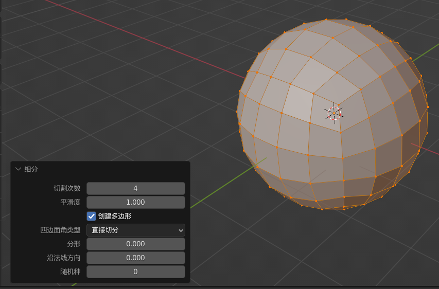
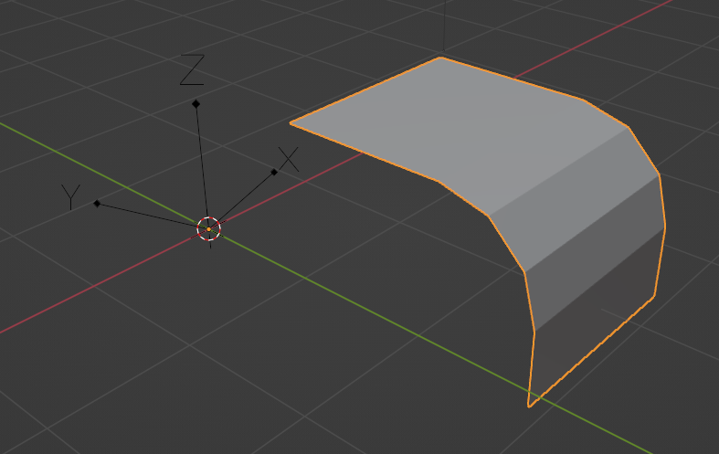
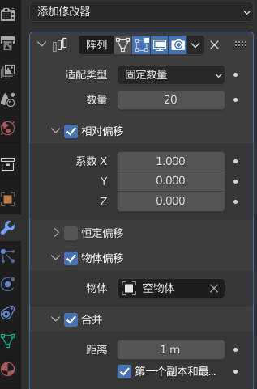

### 多边形建形

#### 解决球体极点问题

极点指的是球体上下端点，一般的在这个极点周围的端点聚集十分密切，会在雕刻时造成较大干扰；

现使用正方体构建解决极点问题：  
创建一个立方体，进入编辑模式并全选；  
右键点击，使用细分；  
切割次数任意，平滑度拉满；

> 完成，此时立方体变成完美的球体，且极点问题已经消失！

> 🥰 我们当然也可以进入雕刻布局，使用重构网格（该操作自带修复极点）后效果是一样的！

 

### 空物体妙用

#### 空物体旋转阵列

新建一个立方体，经过调节增删后变成如下图所示的面片；

之后 shift a 新建 `空物体->箭头` 然后让其沿着 z 轴旋转一定角度（这里旋转了 20 度）

> 因为旋转的轴心点是空物体，所以把物体的原点移动到空物体上！不然阵列的时候会出现旋转错误！ 📢

给面片添加阵列修改器

数量为 20；  
勾选相对偏移；  
勾选物体偏移，并且指定偏移对象为空物体；  
勾选合并（如果必要的话），把无法闭合的边线全部连接，保证质量

 
