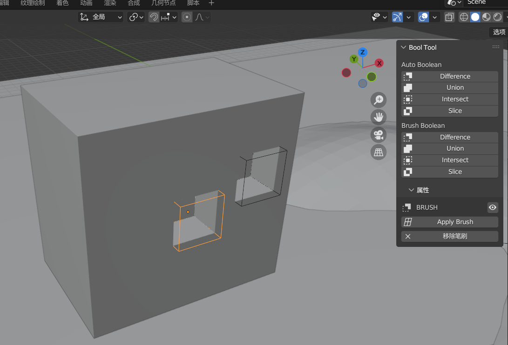
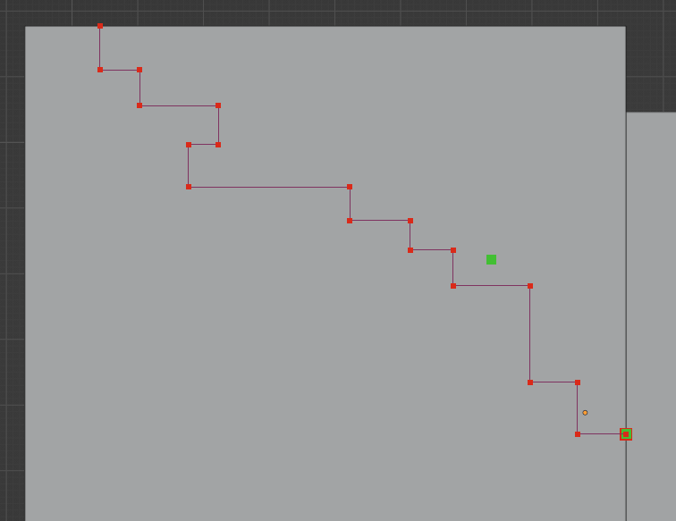

### 多边形建形

#### 解决球体极点问题

极点指的是球体上下端点，一般的在这个极点周围的端点聚集十分密切，会在雕刻时造成较大干扰；

现使用正方体构建解决极点问题：  
创建一个立方体，进入编辑模式并全选；  
右键点击，使用细分；  
切割次数任意，平滑度拉满；

> 完成，此时立方体变成完美的球体，且极点问题已经消失！

> 🥰 我们当然也可以进入雕刻布局，使用重构网格（该操作自带修复极点）后效果是一样的！

 

#### 衰减编辑模式

新建一个平面，进入面编辑模式，选中唯一的一个面

右键点击->细分，重复执行 N 次，直到你满意

此时平面被细分为许多小方块，切换到点编辑模式，随便选择一个点

按 O 键开启衰减编辑模式，按 G 移动，此时会发现界面出现一个灰色小环，滚动鼠标控制环大小来决定衰减影响范围

此方法可以用于快速构建凹凸不平的表面（类似沼泽），按住 shift 键可微调

 

#### 快速布尔

进入偏好设置打开 BoolTool 插件

按 N 开启右侧菜单栏，找到 编辑->BoolTool

选择两个相交物体，点击 difference 即可取差集

使用 alt+d 关联复制的物体不会复制布尔，需要你重新点击一次布尔才可以！

 

### 特殊建形手法

#### 残垣断壁建形

新建一个立方体，进入面编辑，随意选择一个面，shift+d 复制出来，p 断离该面

退出编辑模式，选择断离出来的面，进入边编辑模式

确保视图正视该面，按 K 打开切刀工具，按 A 锁定角度，然后左键依次点击即可进行线段切分

结束切分按鼠标右键，确认并保存切分结果按回车；  
丢弃目前所有切分按 esc

之后直接按面挤出，就可以得到一面残垣断壁了（好吧我也不知道怎么叫更合适）

 

### 空物体妙用

#### 空物体旋转阵列

新建一个立方体，经过调节增删后变成如下图所示的面片；

之后 shift a 新建 `空物体->箭头` 然后让其沿着 z 轴旋转一定角度（这里旋转了 20 度）

> 因为旋转的轴心点是空物体，所以把物体的原点移动到空物体上！不然阵列的时候会出现旋转错误！ 📢

给面片添加阵列修改器

数量为 20；  
勾选相对偏移；  
勾选物体偏移，并且指定偏移对象为空物体；  
勾选合并（如果必要的话），把无法闭合的边线全部连接，保证质量

 
