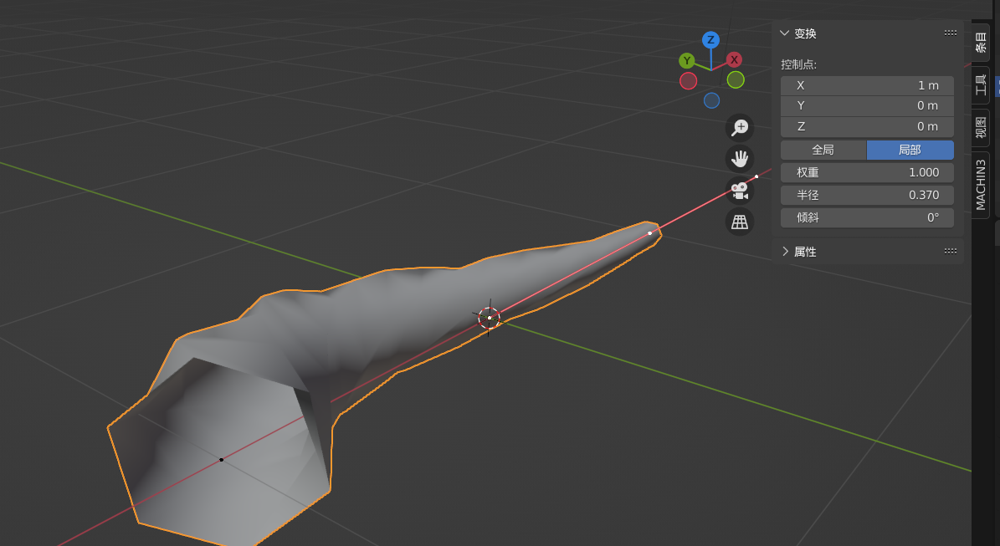
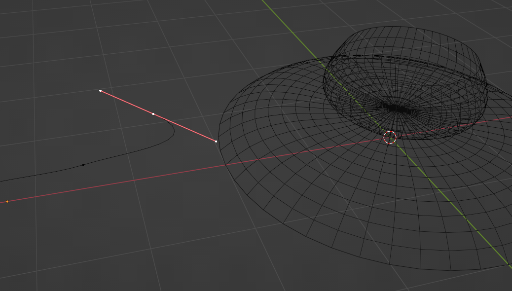

### 倒角造管子

新建贝赛尔曲线；

进入曲线设置面板 -> 几何数据 -> 倒角

修改深度来决定管子的半径大小，分辨率就是管子表面分段数量的疏密

> 进入曲线编辑模式后，选中任意点，按 N 打开变换面板，然后就可以调整对应点的半径和倾斜了，如下图所示

 

### 圆环倒角

新建一个圆环以及一个贝赛尔曲线；

通过对贝赛尔曲线的挤出以及点的旋转挤压，随意的搭建曲线结构；

选中圆环，同样的进入倒角界面，只不过这里需要选择“物体”模式，并且指定物体为贝赛尔曲线，之后圆环就会呈现出车削一样的效果，且我们修改贝塞尔曲线的同时，圆环的倒角性质也在同步发送改变

 
