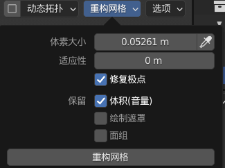

### 实用快捷键

> 请切换到 sculpting 布局后在使用本快捷键！

 

`任意场景按 shift` 平滑工具

`shift space` 全雕刻工具选择列表

`ctrl` 翻转笔刷效果（比如笔刷原本是挤出的，你按住 ctrl 他就会变成凹陷效果！）

`f` 调整画笔粗细（半径）

`shift f` 调整画笔强度

`shift r` 调整重构网格密度

`alt q` 雕刻中切换物体（按住 alt q 后鼠标移动到你要切换的物体上面，然后松开键盘，物体发出橙色闪光就表示选中了!）

 

### 小技巧

#### 免修改器表面细分

使用雕刻页面右上角的 ”重构网格” 工具；

设置好体素大小（即细分程度）后，直接点击重构网格即可细分！

> 如果细分程度过高可能导致卡死，记得保存！

 

#### 膨胀或挤出后布线交叉错误

如果在此过程中出现了布线交集导致贴图或者图形显示错误；

再次重构网格即可！

 
