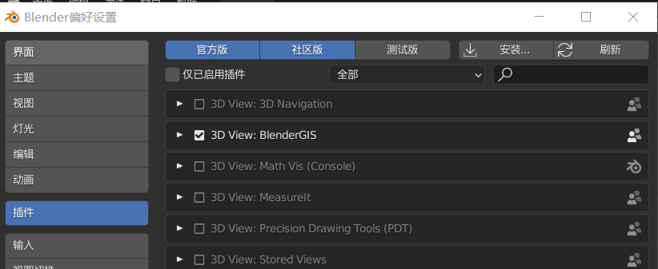
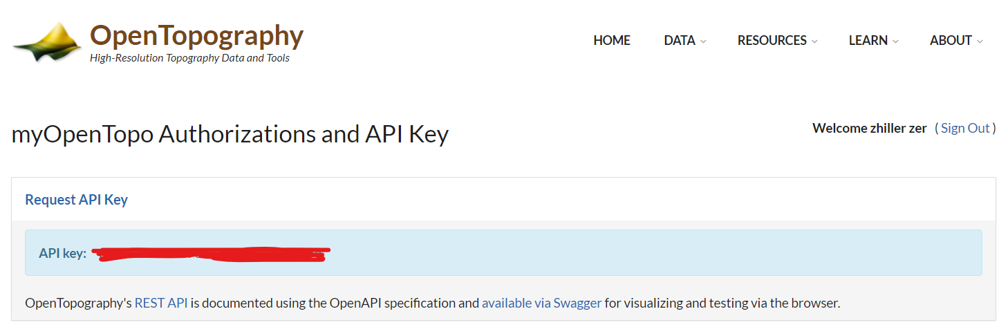
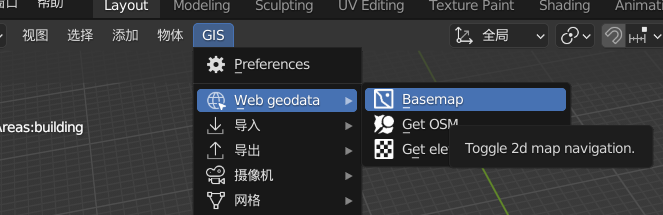
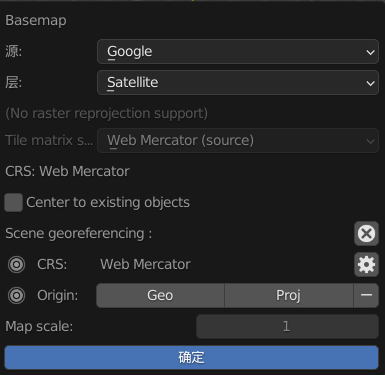
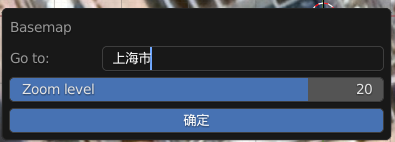
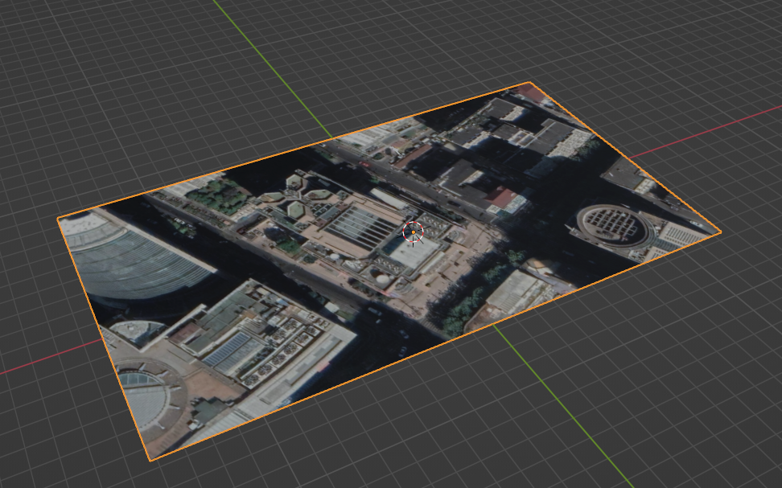
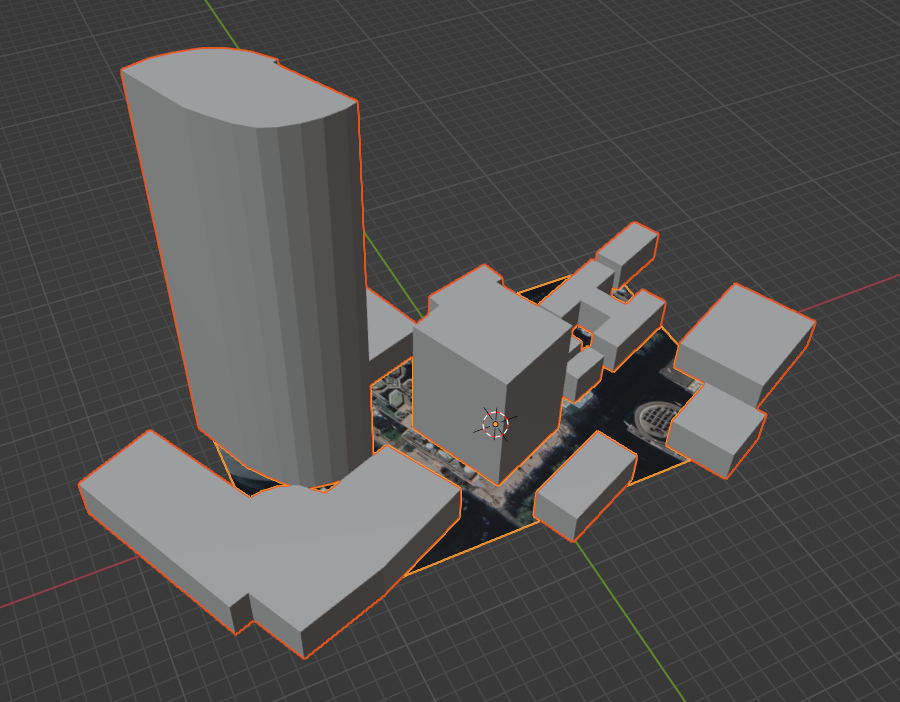

### 简介

Blender+BlenderGIS+OpenTopography 可以实现地图选点并获取对应三维白模

 

### 安装

安装 blender（版本不要太新，我用的是 3.0）：https://www.blender.org/download/

获取 blender-gis（直接把整个代码下载下来，得到的 zip 压缩包就是插件）：https://www.blender.org/download/

之后打开 blender，新建一个场景，把场景默认的所有东西都删掉！  
然后打开 `编辑->偏好设置`，进入插件管理页面

把我们刚刚下载好的 blender-gis 压缩包作为插件添加进去，然后勾选它以启用！

 

2022 更新，OpenTopography 目前需要 requestAPI

所以我们前往对应网站注册一个账户：https://portal.opentopography.org/

注册完毕，直接点击 request api，这是免费的，我们把他复制下来

 

### 配置处理

进入 blender 偏好设置的插件页面，找到 blender-gis，点击其左侧的小三角，在下拉列表中我们找到两个需要修改的地方：

- cache folder 缓存文件夹，默认为 C 盘
- api key 在这里填入我们刚刚赋值的 api key

 

还有一个设置需要修改，否则会发生错误，该错误已被解决，请移步至该 issue：https://github.com/domlysz/BlenderGIS/issues/742

同样的，在 blender-gis 配置界面，找到 `overpass` 这一行，选中 `overpass-api.de` 这一项，然后点击 edit 对其进行编辑

弹出窗口中，将 uri template 修改为：https://overpass-api.de/api/interpreter  
然后点击 OK

此时确保我们依然选择 `overpass-api.de` 这一项！！！

保存并重开 blender  
错误解决

 

### 选点建模

> 个人能力有限，如有需要请直接查看 github 官方 quick start：https://github.com/domlysz/BlenderGIS/wiki/Quick-start

> 在开始前，确认场景中无任何物体

点击场景顶部的 `GIS->web geodata->basemap`

来源我们直接选谷歌（请自行科学上网，这里不做介绍），剩余的都不管，直接点击确定

 

此时你会发现特别卡，是因为还没有选点，插件默认直接加载世界地图；

点击键盘 G 键，打开选点菜单，直接输入你要前往的地点（支持中文，且建议直接使用中文查询），之后点 Go，即可自定位到指定地点

 

等待一段时间，图片渲染完毕后，可以使用鼠标滚轮扩大\缩小地图范围，或者平移功能选择其余地点  
（执行此操作后依然需要等待地图下载）

选到满意的地点了？  
按下 E 键生成底图，一张平面地图就自动生成到了我们的场景

 

此时看到场景顶部，依次选择 `GIS->web geodata->get orm`

选择你想要渲染的物体类型，下图中我选择了 building

选完后点击确定，即可开始生产建筑！！！

这一段会比较卡，请注意保存，免得 blender 直接崩掉

 

生成完毕

 

### 后记

请全程保证代理处于开启状态，google 地图访问以及后续的模型生成都需要科学上网！
