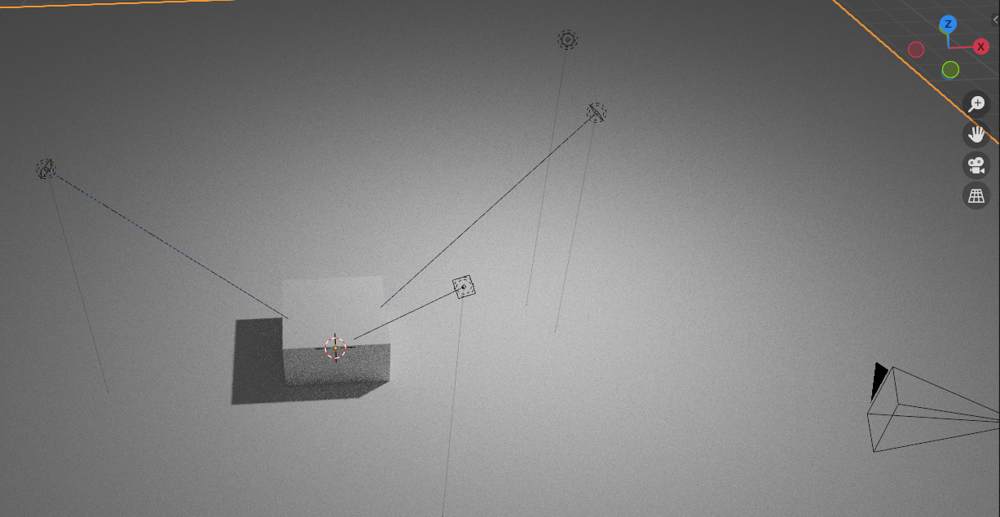

### 三点布光插件

这是一款 blender 自带的插件

进入 编辑->偏好设置->插件->选择光照类别

即可找到该插件，点击启用即可

 

### 快速上手

选中一个物体，快捷键 `shift a` 打开新建物体面板，在灯光列表里面找到三点布光选项并使用它

此时就会在当前视角建立一个摄像机，并以该摄像机作为参照点，依据规定布置主光、轮廓光、布光（blender3.0+版本会多出来一个点光源，所以合计四个灯光）

 

所有灯光都设定聚焦约束于你选中的物体上，所以无论你如何移动这些光源都会保持照射点不变！

 
