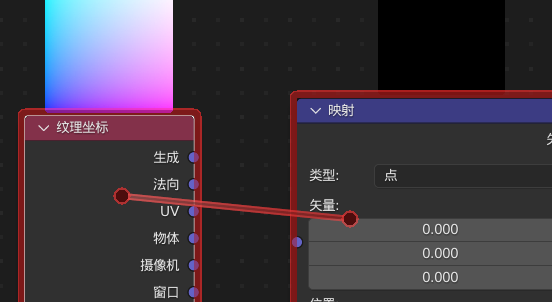
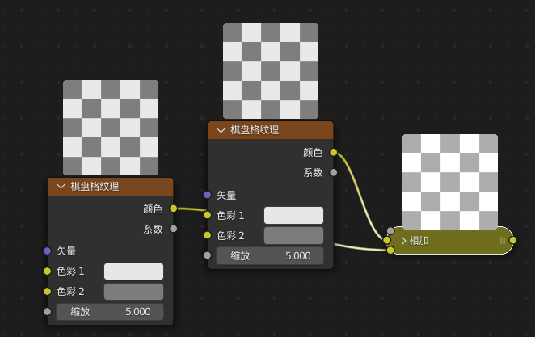
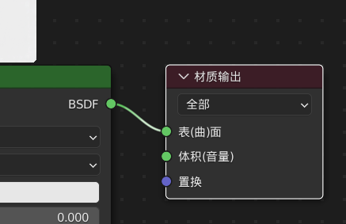
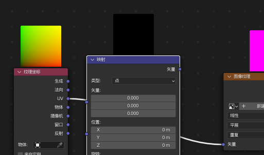

### 着色器面板快捷键

#### 快速连接

按照先后顺序选择两个节点，按 K 或者 F，即可将二者快速链接；

选中一个节点，按 ctrl+shift+左键点击，执行智能链接；

选中一个节点，按住 alt+右键拖动，将光标处原点拖动到另一结点后即可快速链接；  
同理，按住 alt+shift+右键拖动，则可以选择性链接另一节点上的任意一个端口；

> 请注意输入端与输出端的关系！否则无法执行快速连接；

 

#### 快速加减乘除

选择你需要执行加减乘除的节点；

按住 `ctrl+加/减/乘/除（这里把汉字替换为对应的按键）` 即可使得节点按照你要的结果输出

 

选择一个节点，按住 `ctrl+shift+右键拖动`，将原点落到另一个节点上，也可以执行相加操作；

但只有使用 `ctrl+对应按键` 的方法，才可以正确的将不同类型的加减法一一对应上！！！

 

#### 快速切换连接点

选中一个节点，按 alt+s，即可让节点进行快速切换，切换顺序按自上而下执行；

 

#### 单独抽出

选中一个节点，按住 alt+左键拖动，即可把该节点单独抽出，以便调换；

 

#### 加组&加框

ctrl+g 直接成组，所有节点都合并成一个节点，双击该节点即可进入细分编辑；

shift+p 把所有节点框起来

 
