### 光源

> 请全程使用 cycles 渲染器

 

#### 关键光位置

场景中一般会布置一个关键光（key light）起主导作用；

我们将光照方向与摄像机方向一致的光称为正面光，而与之相对的则为反面光；

下图展示了一个反面关键光，可见阴影是朝向屏幕偏外侧的

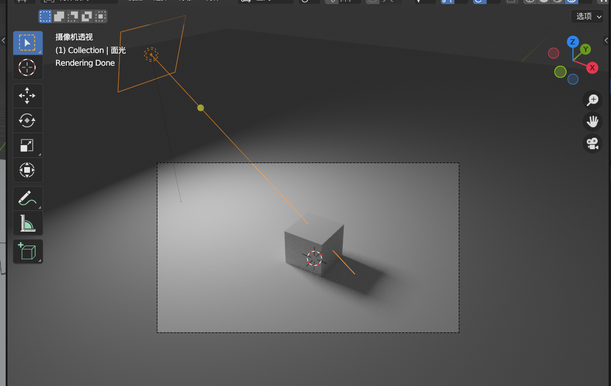

 

主流电影主要分为三个光源：

1. key 关键光，即主光源
2. edge 边缘光，激发背光补光以及高光部分，让阴影过渡更加柔和
3. fill 补光，前二者光照经过反射后照射到物体上的光

> 下图展示了三种光，边缘光面积小且光强不大

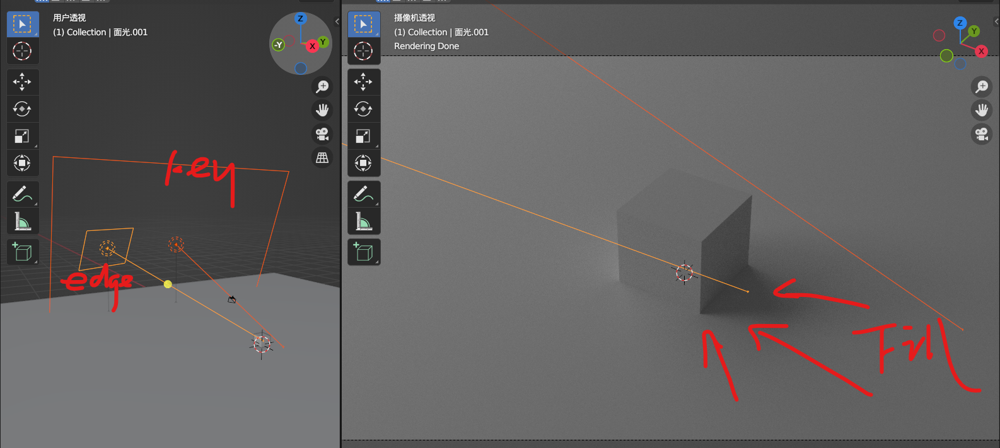

 

#### 曝光度

在色彩管理面板中可以找到曝光度；

你可以吧曝光度大致可以和相机的 ISO 相比

模式有两种：

1. 标准，不推荐，在极端曝光情况下导致色彩失真与显示错误
2. filmic，推荐，能有效解决标准模式下的问题（该模式模拟了电影级别的压缩度）

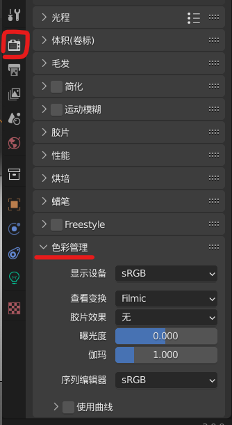

 

#### 补光灯 fill light

补光灯可以消除阴影，从而导致“高调”图像

如下对比图，左侧为低调无补光，右侧为高调有补光；

一般的，我们取中间值，即补光量不得过大亦不得过小

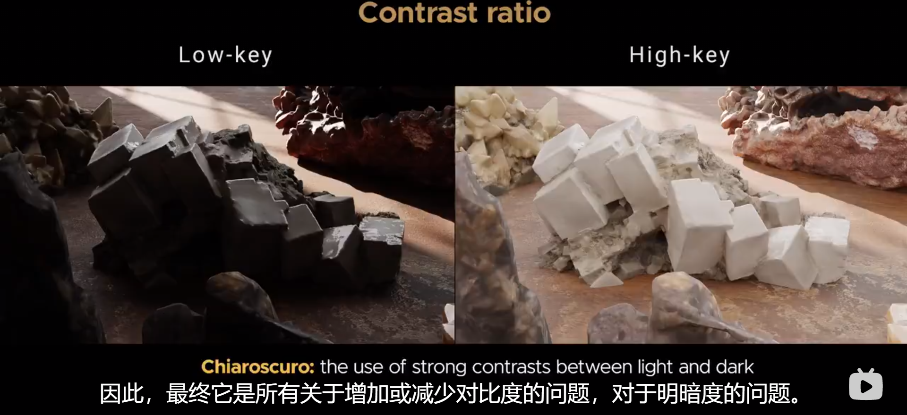

 

### 布光课程

> 课程视频：https://www.bilibili.com/video/BV1qh411y7x9/?p=25&spm_id_from=pageDriver&vd_source=d8c2ade5b3e393d3bd5f70bf10f366bf

 

#### 九宫格布局

若为对称图像，把关键点（如人物眼部）对准九宫格内四个交点的上面任意一个交点

若为不对称图像，关键点对准上部俩交点垂直平分线上

 

#### 三点布光

主光 key，正面偏转 45 度角，高度任意，亮度 2000w

边缘光 edge，人物正后方，在关闭其他所有光源后该边缘光能使人物边缘发光为最佳，1000w

补光 fill，较远处，光照半径调大，瓦数降低，200w

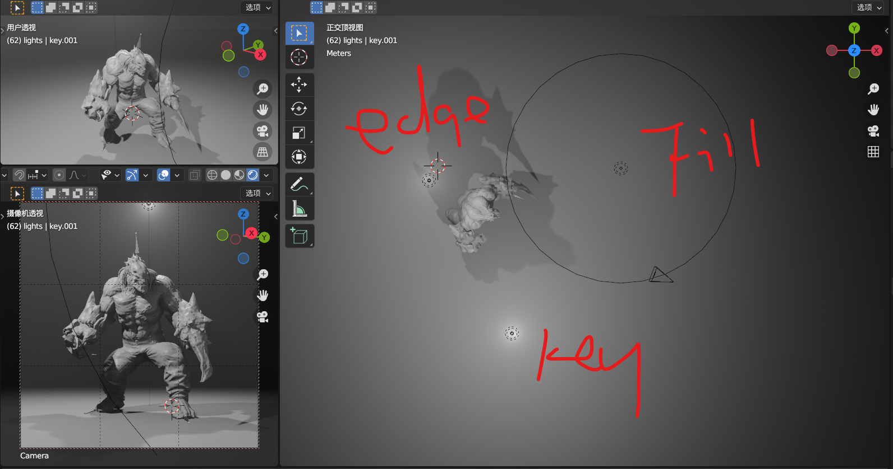

 

#### 剪影

布置一个点光源到人物后方 45 度角，一定高度，亮度不要太大

进入 shading 界面，节点编辑器切换为世界环境，添加一个“体积散射”，密度推荐 0.01

> 此时呈现薄雾的效果

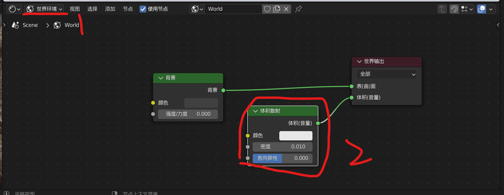

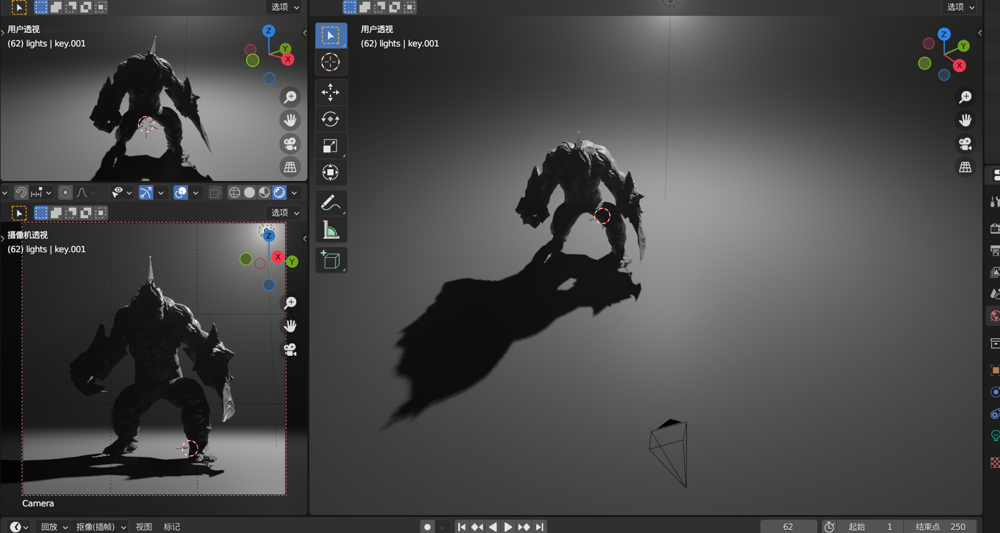

 

#### 遮光片

使用遮光片来制作诸如百叶窗的效果

遮光片本身材质不可以影响场景中的其他物体，  
如下图所示遮光片与渲染结果（左下角）

此时使用三点照明

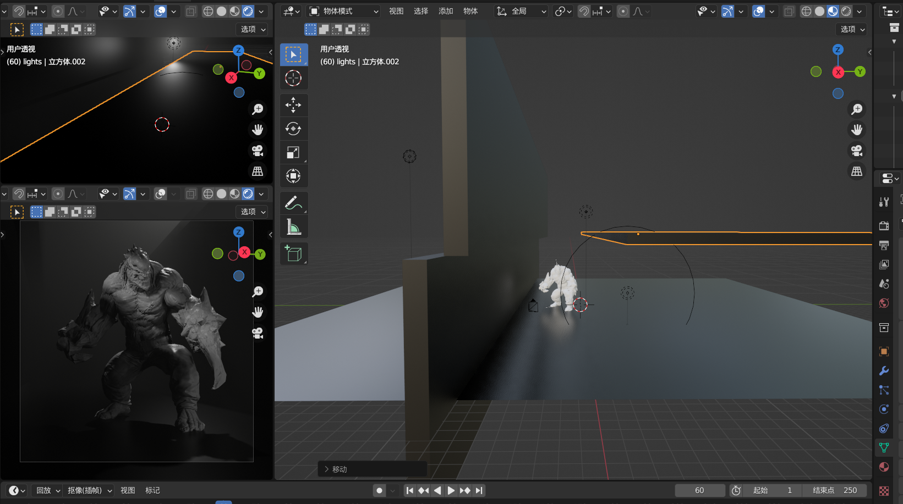

 

#### 焦距及其对应类型

15mm-35mm 大型、史诗、恐怖的  
50mm 标准自画像  
70mm 优美的引人注意力的景色

 

### 斑斓中国灯光

> https://www.bilibili.com/video/BV1r34y1X7Nt/?spm_id_from=333.788.recommend_more_video.0&vd_source=d8c2ade5b3e393d3bd5f70bf10f366bf

 

#### 天空盒

进入世界属性，调节光照强度为非零

点击 “颜色” 属性左边的黄色小点，选择天空纹理即可使用内置天空盒

> 最好使用 cycle 测试而不是 eevee

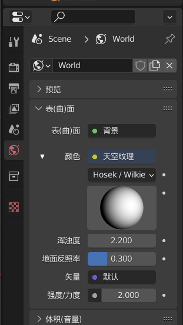

 

#### 光程

渲染属性面板，找到光程->最多反弹次数

1. 总数：为 0 则不反弹任何光，渲染结果和 eevee 类似
2. 漫射：即漫反射，一般默认 4 就可适配大多数场景了，最多最好不要超过 10
3. 光泽：

 

#### 曝光度

如果你认为某盏灯亮度不够，最好不要直接调节灯的强度

进入 `渲染属性->色彩管理`  
找到曝光度，把它调高即可让全局的灯光均变亮（除非你仅需修改一盏灯的亮度而不愿意影响全局的话，就不要用此方法）

 

若把 “查看变换” 属性更改为 `false color`  
就会以颜色值的不同来表示过曝以及欠曝

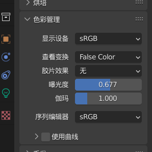

按照白红橙黄绿蓝靛紫，从大到小依次表示过曝与欠曝

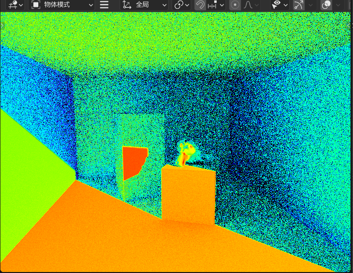

 

#### 门户光

原理解释：背景光（即世界环境光）在从一个小口射入密闭空间时会产生很多噪点，而门户光可以看做是一个过滤器，能极大地优化密闭空间的背景光采样，降低噪点指数

注意：一旦面光源被设置为门户光（或叫进口光）就会失去光照能力

如下图，在密闭空间的小开口上放置一个刚好盖住整个开口的面光源，并勾选 `“进口光”` 选项

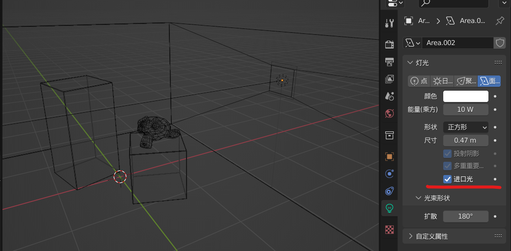

 

此面光源失去光照能力，实际渲染图为背景光照做的贡献

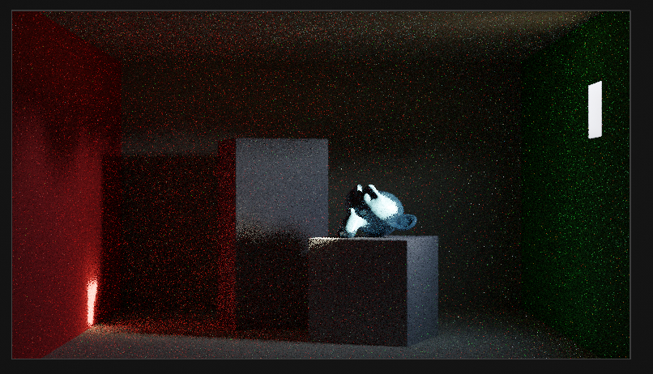

如果删去门户光，直接让背景光射入密闭空间，可见噪点极多且渲染黑区严重

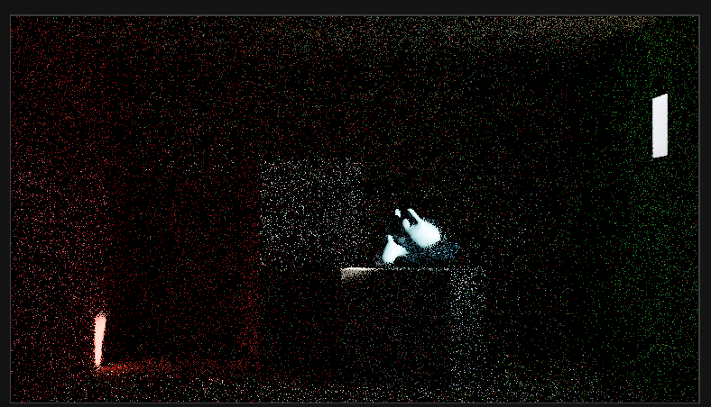

 

#### IES 纹理

定义：可以模拟光源从某种环境下发出后的散射形状（譬如灯罩下的光源形状）

必须是 cycle 渲染器才可以！

新建一个点光源，在光照属性面板内点击添加新的节点

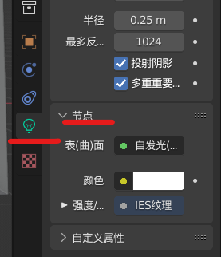

选中点光源，打开着色器编辑器，添加新的节点 `IES 纹理`  
选择外部文件，添加我们准备好的 ies 文件  
按下图链接即可

> 最后可见上侧渲染结果右边的灯光发射结果出现了变化

 

####
