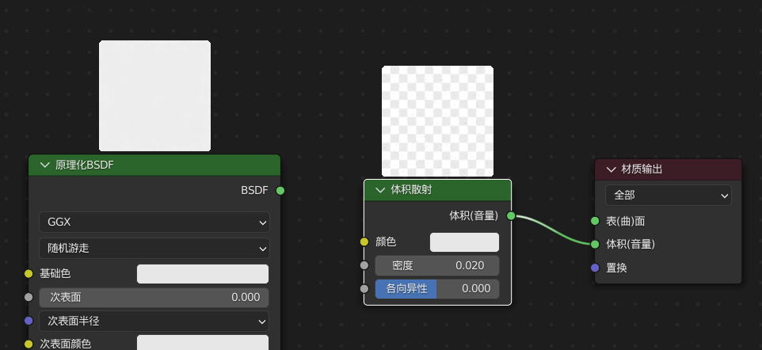
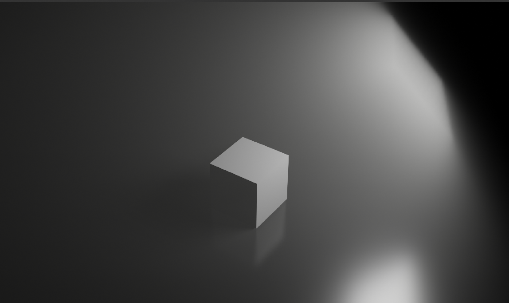
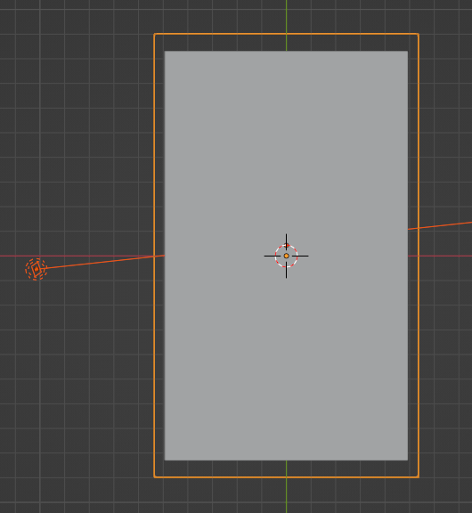
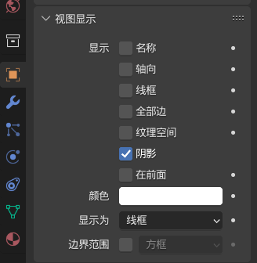
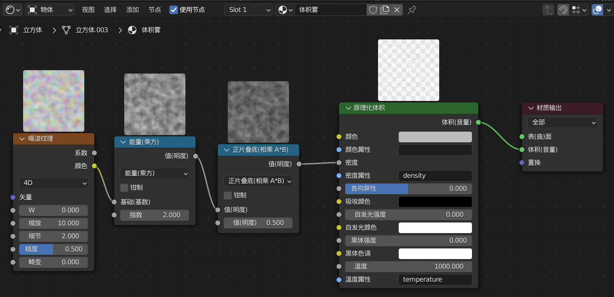
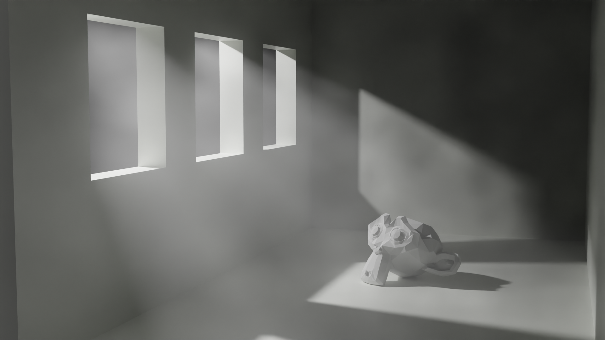

### 体积散射版

新建一盏面光源，一个立方体以及平面；

平面材质：灰黑色，高光拉满，糙度 0.25  
立方体材质：任意  
灯光：强度 1000w

 

新建一个大立方体包裹住场景，该立方体内部范围就是体积雾生成的范围！

为该大立方体新建材质，添加“体积散射”节点，按下图链接输出节点  
请注意一定要断开“原理化 BSDF”这个节点，不然会导致材质显示错误而呈现品红色

> 体积散射的密度太高会什么都看不见，推荐 0.03 左右最好

 

调节摄像机位置，下图为体积雾的渲染结果

 

### 材质节点着色器

#### 插件安装

blender 默认的着色编辑器上方是不现实材质缩略图的，所以我们需要安装以下插件：

[node preview 官方插件](https://pan.baidu.com/s/1rejY3urth8kdi4wguYBYTQ?pwd=chhq)

插件适配 2.9-3.1 版本；

首先把下载好的压缩包中的插件文件夹拖动到 blender 根目录的 `版本号/scripts/addons/` 下；  
然后在 blender 中点击，编辑->偏好设置->插件，搜索该插件并安装即可！

#### 搭建场景

> 完整场景顶视图

立方体内插+超级布尔，构造简易房屋；

面光，shift t 移动照射点，选取最佳角度以便形成丁达尔效应；

调节摄像机对准场景；

**重点**：新建一个立方体，并使其刚好包裹场景（上图中的橙色线宽就是该立方体）；  
进入其物体属性面板，修改为： 视图显示->显示为->线宽

 

#### 添加材质

> 体积雾的完整着色图

节点解释：

- 原理化体积 构建体积雾的主节点；
- 材质输出 可以选择 eevee、cycle 或者二者兼有的输出方式；
- 噪波纹理 有了噪波，输出图形才能更像现实环境！
- 乘法+正片叠底 为了对噪波纹理进行加深去色等优化

 

> 能力和正片叠底两个节点是由“相加”节点变过来的，而相加节点需要 `shift a -> 转换器 -> 运算` 来添加

> 注意噪波纹理默认为 3d，这里改为 4d

 

#### 渲染成图展示

 
