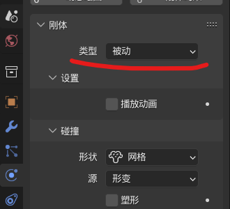
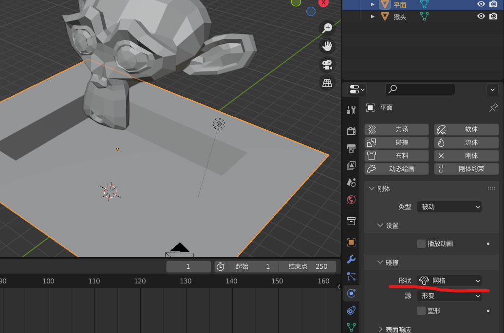

### 基本碰撞

#### 物体与地面

同时为两个物体（一个作为碰撞物，一个作为地面）给予“刚体”修改器

我们需要把作为地面的物体中的“刚体类型”修改为“被动”

这样子才能实现地面不受重力影响但是仍然具有碰撞箱

 

当地面外形在赋予“刚体”修改器后又进行了修改（比如下图，我们给地面打了个洞）

就需要把碰撞形状更改为 “网格”

否则猴头仍然会按照原来地面的平面碰撞箱进行碰撞而忽略掉洞

 

勾选“播放动画” ，那么该刚体于播放动画时刻做出的任何形变或者其他位置变化都会影响到其他刚体的物理运算

说人话就是：我为地面勾选播放动画，并为地面添加一个 30 帧的倾斜动画，那么猴头再动画开播后会顺着地面滚下去；  
倘若不勾选，那么就默认地面仍然是静止的，猴头依然与静止的地面碰撞而发生穿模现象

 
