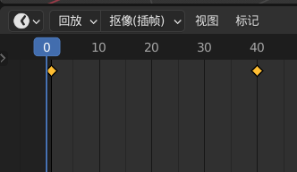

## Blender 动画系统

> 动画系统

 

### 快速上手

#### 第一个动画

按照以下步骤创建立方体沿 X 轴运动的简单动画

1. 新建立方体，打开”物体属性”，点击变换->位置 X 输入框最右侧的菱形按钮
2. 此时动画时间帧出现黄色实心菱形，表示动画开始点；
3. 拖动时间轴到 40，在 X 轴上移动立方体
4. 再次点击属性面板中的菱形按钮，此时输入框变成红色，表示这一段动画制作完成！
5. 点击播放按钮即可观看动画

